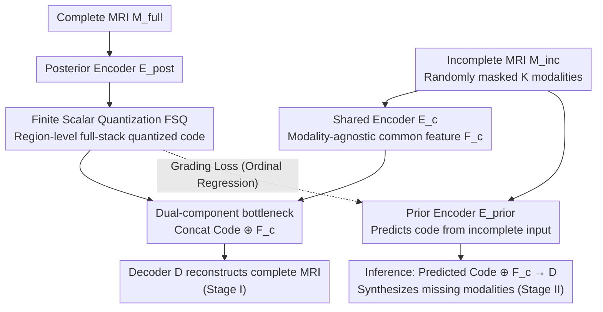

# Virtual Full-stack Scanning of Brain MRI via Imputing Any Quantized Code

**Conference**: CVPR 2026  
**arXiv**: [2501.18328](https://arxiv.org/abs/2501.18328)  
**Code**: [Available](https://github.com/ycwu1997/CodeBrain)  
**Area**: Medical Imaging  
**Keywords**: MRI modality completion, Finite Scalar Quantization, Brain MRI, Cross-modality synthesis, Any-to-any  

## TL;DR

This paper proposes CodeBrain, which reformulates the any-to-any brain MRI modality completion problem as a region-level full-stack quantized code prediction task. Through a two-stage pipeline (scalar quantization reconstruction + grading loss code prediction), it achieves unified synthesis of missing modalities, surpassing five SOTA methods.

## Background & Motivation

### 1. Clinical Need
Brain MRI examinations involve multiple acquisition protocols (T1, T2, PD, FLAIR, T1Gd, etc.), where different modalities emphasize different anatomical/pathological features. However, in clinical practice, it is difficult to acquire a complete set of modalities due to constraints such as scanning time, cost, and contrast agent risks. Virtual full-stack scanning aims to complete missing modalities from incomplete acquisitions to improve data integrity and clinical utility.

### 2. Limitations of Prior Work
Existing unified completion methods rely on two types of global conditions to specify available/missing modalities:
- **Global Binary Vectors**: For example, M2DN uses $[1,1,0]$ to indicate modality availability but fails to capture region-level and cross-modality variations.
- **Learnable Modality Queries**: For example, MMT uses modality-specific decoders, where parameter counts grow with the number of modalities, leading to poor generalization.

Both approaches essentially perform pixel-level modality translation and lack compact modeling of cross-modality spatial relationships.

### 3. Key Insight
Theoretically, different MRI modalities of the same subject share underlying spin characteristics at the pixel level (transferable). In practice, SynthSeg has demonstrated that different modalities share structural priors (shared). Therefore, the complex any-to-any completion problem can be transformed into a simpler **region-level code prediction** problem—predicting a compact full-stack representation rather than performing synthesis modality by modality.

## Method

### Overall Architecture

CodeBrain aims to solve "any-to-any" MRI modality completion: the available and missing modalities are not fixed, and the goal is to synthesize missing modalities from the existing ones. Instead of following the traditional path of modality-by-modality translation, it compresses the entire complete MRI into a compact "full-stack representation" and trains the model to predict this representation.

The entire process is divided into two stages. The first stage learns this compact representation on a complete modality set: encoding the full modalities into region-level scalar quantized codes, paired with a modality-agnostic common feature. Concatenating both allows decoding back to the complete MRI. The second stage trains a prior encoder to predict that full-stack quantized code using only the available incomplete modalities. During inference, the incomplete input passes through the prior encoder to obtain the predicted code, which is concatenated with common features extracted from the same input and fed into the decoder to synthesize the missing modalities.

### Key Designs

**1. Finite Scalar Quantization (FSQ): Removing learnable codebooks to avoid codebook collapse**

Traditional VQ requires maintaining an explicit learnable codebook, which is prone to codebook collapse during training and necessitates auxiliary regularization losses, making it unstable and cumbersome. CodeBrain uses Finite Scalar Quantization to bypass this. The posterior encoder $E_{\text{posterior}}$ encodes the complete MRI $M_{\text{full}}$ into a feature map $F_{\text{full}}$, followed by element-wise quantization: first by mapping each channel to a fixed range via $Z_{\text{full},i} = \lfloor L_i/2 \rfloor \times \tanh(F_{\text{full},i})$, then taking the integer part $\hat{Z}_{\text{full}} = \text{round}(Z_{\text{full}})$.

Each channel $i$ has $L_i$ integer levels, with values falling in $[-\lfloor L_i/2\rfloor, \lfloor L_i/2\rfloor]$. Since rounding is non-differentiable, a straight-through estimator is used for backpropagation. In experiments, $L=[8,8,8,5,5,5]$ and $d=6$ channels are used, equivalent to a codebook size of $\prod L_i = 64,000$. Because levels are defined by the channel structure and do not need to be learned, codebook collapse and related regularization terms are eliminated, making training fast and stable.

**2. Dual-Component Bottleneck Representation: Separating modality-specificity and modality-agnostic information**

Quantized codes alone are insufficient—the challenge of completion lies in restoring modality-specific details while preserving the anatomical structure shared across all modalities. The design of the first stage explicitly decomposes the complete MRI into two complementary parts: the full-stack quantized code $\hat{Z}_{\text{full}}$, extracted by $E_{\text{posterior}}$ from $M_{\text{full}}$ to carry modality-specific region-level features, and the common feature $F_c$, extracted by the shared encoder $E_c$ from the incomplete input $M_{\text{inc}}$ to carry modality-agnostic anatomical information. Reconstruction is achieved by concatenating both: $\tilde{M}_{\text{full}} = D(\text{Concat}[\hat{Z}_{\text{full}}, F_c])$.

Critically, $F_c$ is extracted from the "incomplete" input. During training, $K$ modalities in $M_{\text{inc}}$ are randomly masked to zero, forcing $F_c$ to learn shared structures without relying on any specific modality. Thus, the second stage only needs to predict the quantized codes, as common features can always be retrieved from the available modalities, narrowing the completion task to "predicting only the modality-specific parts."

**3. Grading Loss: Treating code prediction as ordinal regression instead of independent classification**

The second stage task for the prior encoder $E_{\text{prior}}$ is to predict the full-stack code $\tilde{Z}_{\text{full}}$ from $M_{\text{inc}}$. A direct approach would be classification using cross-entropy. However, cross-entropy assumes all quantized codes are independent and equidistant, which ignores the clustering structure where adjacent codes in the quantization space correspond to semantically similar patches. This means predicting an adjacent code is penalized as heavily as a distant one, preventing the model from learning the ordinal nature of the codes.

CodeBrain rephrases this as ordinal regression. For a ground-truth label $y_i$ of the $i$-th channel, it is expanded into an ordered grading array:

$$o^i_j = \begin{cases} 1 & \text{if } j < y_i \\ 0 & \text{else} \end{cases}$$

Thus, $y_i$ is the sum of the bits in $o^i$, and the prediction objective becomes determining if a threshold is exceeded at each level. Binary cross-entropy is then used to supervise the predicted grading array:

$$\mathcal{L}_{\text{grad}} = \mathcal{L}_{\text{bce}}(\tilde{O}_{\text{full}}, \hat{O}_{\text{full}})$$

Since adjacent levels differ by only one bit and distant levels differ by many, the loss naturally encodes the clustering structure of the quantization space, leading to smoother transitions between codes and more accurate predictions.

**4. Comparison of Condition Designs: Quantized codes as the sweet spot for expressiveness and tractability**

The paper systematically compares four types of conditions along a complexity axis: fixed binary conditions → learnable global conditions → region-level quantized codes (CodeBrain) → infinite continuous variables. The first two are global and fail to capture regional variations. The last one, continuous variables, offers the highest expressiveness but is so complex that the model fails to predict it accurately, leading to degraded completion. Region-level quantized codes sit in the middle—preserving regional expressiveness while remaining tractable due to their discrete and finite nature.

### Loss & Training

**Stage I Loss**:
$$\mathcal{L}_{\text{rec}} = \sum_{i=0}^{N-1} \lambda_{[m,a]} \times \mathcal{L}_{\text{psnr}}(\tilde{M}_i, M_i) + \mathcal{L}_{\text{gan}}(\tilde{M}, M)$$

- $\mathcal{L}_{\text{psnr}}$: Differentiable PSNR approximation loss.
- $\mathcal{L}_{\text{gan}}$: LSGAN $\ell_2$ adversarial loss.
- $\lambda_m=20$ (weight for missing modalities), $\lambda_a=5$ (weight for available modalities).

**Stage II Loss**: $\mathcal{L}_{\text{grad}}$ (Grading Binary Cross-Entropy).

**Training Configuration**:
- Backbone: NAFNet.
- Optimizer: AdamW, lr=1e-4.
- Batch size: 48.
- 300 epochs per stage, 8×4090 GPUs, total training time of 2.38 days.

## Key Experimental Results

### Main Results

**Table 1: Completion results for different scenarios on the IXI dataset (PSNR dB)**

| Scenario | Missing T1 | Missing T2 | Missing PD |
| :--- | :--- | :--- | :--- |
| One-to-One Range | 23.61-28.51 | 28.08-30.08 | 27.10-33.42 |
| Two-to-One | 28.95 | 31.08 | 34.65 |
| Average Completion | 28.51 | 28.26 | 31.72 |

PD is easiest to synthesize from other modalities, while T2 is hardest to synthesize from T1 (reflecting clinical differences). Many-to-one settings outperform one-to-one settings.

**Table 2: Comparison across methods (IXI + BraTS 2023)**

| Method | IXI PSNR | IXI SSIM(%) | BraTS PSNR | BraTS SSIM(%) |
| :--- | :--- | :--- | :--- | :--- |
| MMGAN | 27.64 | 90.84 | 24.28 | 89.11 |
| MMT | 28.06 | 91.42 | 24.58 | 89.47 |
| M2DN | 28.14 | 91.80 | 24.34 | 89.65 |
| Zhang et al. | 29.00 | 92.63 | 25.01 | 89.98 |
| MMHVAE | 28.11 | 91.20 | 24.29 | 88.83 |
| **CodeBrain (Ours)** | **29.50** | **93.05** | **25.31** | **90.49** |

CodeBrain leads across both datasets, with a +0.50 dB gain in PSNR and +0.42% in SSIM on IXI (without structural loss supervision).

### Ablation Study

**Table 3: Ablation study (Mean on IXI)**

| Configuration | Reconstruction PSNR | Completion PSNR |
| :--- | :--- | :--- |
| Without common features $F_c$ | 30.15 | — |
| With $F_c$ | **34.32** (+4.17) | — |
| Classification loss prediction | — | Baseline |
| Grading loss prediction | — | **Better** |

Common features contribute a +4.17 dB Gain in PSNR, and grading loss outperforms classification loss.

**Downstream Task Verification (BraTS Brain Tumor Segmentation, 3D Dice)**:
- Zero-filling missing modalities: Performance drops severely (failure when FLAIR is missing).
- CodeBrain completion > Other completion methods.
- CodeBrain completion $\approx$ Full ground-truth modality upper bound.

### Key Findings

1. **Spontaneous Clustering of Code Distribution**: Without explicit regularization, the code distribution exhibits clustering characteristics that roughly reflect brain anatomy.
2. **Region-level Conditions Outperform Global Conditions**: Quantized codes strike the best balance between expressiveness and tractability.
3. **Sensitivity to $\lambda_m/\lambda_a$ Ratio**: A ratio of 20/5 is optimal; values too high or too low degrade performance.
4. **Stage II Accurately Predicts Most Codes**: Visualization confirms high consistency between predicted codes and GT codes.

## Highlights & Insights

1. **Paradigm Innovation**: Reformulating any-to-any modality translation as region-level code prediction avoids modality-specific designs, resulting in an elegant and unified framework.
2. **Successful Application of FSQ in Medical Imaging**: Demonstrates the effectiveness of codebook-free scalar quantization in cross-modality MRI modeling, reducing VQ training complexity.
3. **Ingenious Introduction of Grading Loss**: Ordinal regression naturally fits the continuous semantic structure of the quantization space, outperforming independent classification.
4. **Direct Improvement for Downstream Tasks**: Beyond visual quality, BraTS segmentation performance approaches that of using all real modalities, demonstrating practical clinical value.

## Limitations & Future Work

1. **2D Slice Processing**: Currently operates at the 2D level without utilizing 3D volumetric information, potentially losing inter-slice continuity.
2. **Hallucination Issues**: Although superior to competitors, synthesized images may still exhibit artifacts (particularly in T1Gd contrast-enhanced regions).
3. **Brain-only Validation**: Generalization to other organs like the heart or abdomen has not yet been verified.
4. **Fixed Quantization Levels**: $L=[8,8,8,5,5,5]$ is manually set; adaptive selection might further improve performance.
5. **Absence of MRI Physics**: Incorporating physical priors, such as T1Gd contrast enhancement mechanisms, could improve specialized modality synthesis.

## Related Work & Insights

- **FSQ → Medical Imaging**: Originally used by Google for image generation, CodeBrain proves FSQ is equally effective for cross-modality medical imaging modeling.
- **Extension of VQGAN Paradigm**: Stage I resembles the encode-quantize-decode flow of VQGAN, but Stage II replaces autoregressive generation with code prediction.
- **Complement to SynthSeg**: While SynthSeg uses cross-modality shared structures for robust segmentation, CodeBrain utilizes the same prior for modality synthesis.

## Rating

- Novelty: ⭐⭐⭐⭐ Paradigm innovation by reframing any-to-any completion as a code prediction problem; grading loss is cleverly designed.
- Experimental Thoroughness: ⭐⭐⭐⭐ Comprehensive across two datasets, nine scenarios, five comparisons, plus ablation and downstream validation.
- Writing Quality: ⭐⭐⭐⭐ Clear diagrams with a logical flow from motivation to method and experiments.
- Value: ⭐⭐⭐⭐ Provides a practical framework for unified MRI modality completion with direct benefits for downstream clinical tasks.

<!-- RELATED:START -->

## Related Papers

- [\[CVPR 2026\] Virtual Nodes Guided Dynamic Graph Neural Network for Brain Tumor Segmentation with Missing Modalities](virtual_nodes_guided_dynamic_graph_neural_network_for_brain_tumor_segmentation_w.md)
- [\[CVPR 2026\] PGR-Net: Prior-Guided ROI Reasoning Network for Brain Tumor MRI Segmentation](pgr-net_prior-guided_roi_reasoning_network_for_brain_tumor_mri_segmentation.md)
- [\[CVPR 2026\] Depth Any Endoscopy: Towards Self-Supervised Generalizable Depth Estimation in Monocular Endoscopy](depth_any_endoscopy_towards_self-supervised_generalizable_depth_estimation_in_mo.md)
- [\[CVPR 2026\] Virtual Immunohistochemistry Staining with Dual-Aligned Multi-Task Feature Guidance](virtual_immunohistochemistry_staining_with_dual-aligned_multi-task_feature_guida.md)
- [\[CVPR 2026\] MDCS-MoAME: Multi-directional Composite Scanning with Mixture of Attention and Mamba Experts for Cancer Survival Prediction](mdcs-moame_multi-directional_composite_scanning_with_mixture_of_attention_and_ma.md)

<!-- RELATED:END -->
