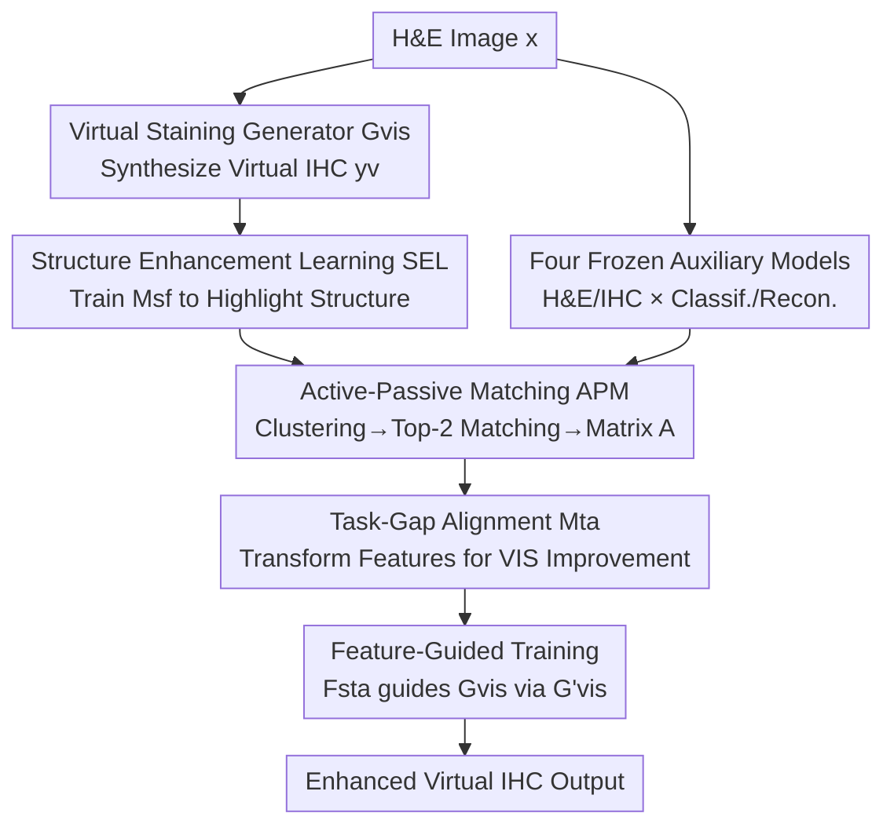

# Virtual Immunohistochemistry Staining with Dual-Aligned Multi-Task Feature Guidance

**Conference**: CVPR 2026  
**Paper**: [CVF Open Access](https://openaccess.thecvf.com/content/CVPR2026/html/Xie_Virtual_Immunohistochemistry_Staining_with_Dual-Aligned_Multi-Task_Feature_Guidance_CVPR_2026_paper.html)  
**Code**: https://github.com/U-RBook/VSMT  

**Area**: Medical Imaging / Virtual Staining / Image Generation  
**Keywords**: Virtual Immunohistochemistry Staining, Multi-Task Feature Guidance, Spatial Alignment, Task-Gap Alignment, Contrastive Learning

## TL;DR
When translating H&E pathology images to virtual immunohistochemistry (IHC), paired images naturally suffer from spatial misalignment, and supervision from single auxiliary tasks is often too weak. This paper extracts multi-task features using a set of auxiliary task models, performing spatial alignment followed by task-gap alignment (dual alignment). These semantic features provide feature-level guidance to the virtual staining generator, consistently outperforms 7 SOTA methods on FID/KID/LPIPS across BCI and MIST datasets.

## Background & Motivation
**Background**: Immunohistochemistry (IHC) staining specifically labels biomarkers like HER2, ER, PR, and Ki67, which are critical for cancer diagnosis. However, IHC is expensive and slow. Consequently, "Virtual IHC Staining (VIS)" has emerged, using affordable H&E images as input to synthesize IHC-style images via generative models. Training VIS typically requires paired H&E–IHC images.

**Limitations of Prior Work**: Paired images are not created by restaining the same slice (which is impractical) but by staining two adjacent slices from consecutive depths. Thus, tissue deformation and interlaminar morphological differences lead to pixel-level **misalignment** between H&E and IHC. This spatial offset weakens pixel-level supervision, making it difficult for models to preserve tissue morphology while accurately restoring staining distribution. Recent methods (e.g., TDKStain, PSPStain) address this by attaching an **auxiliary task** (e.g., cell density estimation, Pos/Neg classification) to the virtual IHC results to enforce consistency between real and virtual images.

**Key Challenge**: Supervision from a single auxiliary task is too narrow; for instance, cell density only constrains tissue structure and provides little guidance for staining distribution. Furthermore, these methods only **attach auxiliary tasks after the generation results**, failing to utilize the rich pathological semantic features learned inside the auxiliary models. Directly using multi-task **features** to guide the generator faces two hurdles: (1) **spatial misalignment** between paired H&E and IHC features; and (2) the **task gap** between auxiliary task features and virtual staining features (different training objectives lead to mismatched semantics).

**Goal / Key Insight**: Rather than applying consistency constraints at the output level, it is better to provide guidance at the **feature level** by introducing a set of auxiliary models (Classification + Reconstruction for both H&E/IHC) and injecting their aligned multi-layer semantic features into the generator. To achieve this, a "two-stage alignment" is designed: first correcting spatial offsets, then bridging the task gap.

**Core Idea**: Use "dual-aligned multi-task features" for feature-level guidance. Spatial alignment uses structure enhancement learning and Active-Passive Matching to generate an alignment matrix that moves real IHC features to the corresponding virtual IHC positions. Task alignment uses a model trained with the criterion of "whether it improves VIS performance" to transform multi-task features into guidance signals usable by the generator.

## Method

### Overall Architecture
The framework uses four **frozen** auxiliary task models to extract features: H&E classification $M_{hc}$, H&E reconstruction $M_{hr}$, IHC classification $M_{ic}$, and IHC reconstruction $M_{ir}$ (classification captures global semantics, while reconstruction captures fine-grained structure and texture). The process consists of three stages:

1. **Spatial Alignment**: Structure Enhancement Learning (SEL) first trains a structure-stain feature modulator $M_{sf}$ to suppress staining noise and highlight structure. Subsequently, clustering is performed on the enhanced features of real/virtual IHC. Active-Passive Matching (APM) establishes a bijection between classes, and regional similarity is calculated within the same semantic class to obtain the spatial alignment matrix $A$, "rearranging" real IHC multi-task features to virtual IHC coordinates.
2. **Task-Gap Alignment**: The spatially aligned IHC multi-task features are concatenated with H&E multi-task features and fed into the task-gap alignment model $M_{ta}$. $M_{ta}$ is trained using "reduction in virtual staining loss after integration into the generator" as an indirect proxy.
3. **Dual-Aligned Feature-Guided Training**: The dual-aligned features $F_{sta}$ produced by $M_{ta}$ are added to a generator replica $G'_{vis}$, which then serves as a stable guidance signal to optimize the actual generator $G_{vis}$. During inference, only $G_{vis}$ is executed, ensuring **zero extra overhead**.

The first and second steps are updated alternately: the alignment modules are trained to obtain $F_{sta}$, which then guides $G_{vis}$.

### Key Designs

**1. Structure Enhancement Learning (SEL): Separating "Structure" from "Stain" via Contrastive Learning**

Directly using real/virtual IHC features for clustering is biased by staining noise, as virtual staining is inaccurate in early training stages. The authors observe that **structural information is more reliable than staining** in virtual IHC—morphology exists in the H&E input and is constrained by losses like PatchNCE, whereas staining is synthesized from scratch. $M_{sf}$ is designed to strengthen structure while suppressing staining. Specifically, for virtual IHC $y_v=G_{vis}(x)$, two types of samples are constructed: **structure-preserving transformations** $T_{str}(\cdot)$ (jittering HED/RGB mean/variance, channel swapping, slight elastic deformation) yield positive samples $p_v$; **stain-preserving transformations** $T_{stn}(\cdot)$ (pixel shuffling within patches, low-pass filtering, strong elastic deformation) yield negative samples $n_v$. After feature extraction by $M_{ir}$ and $M_{sf}$, the triplet is trained using InfoNCE loss with a margin:

$$L_{mcl}(F_{yv},F_{pv},F_{nv}) = \frac{-1}{N}\sum_{j=1}^{N}\log\frac{e^{h(F_{yv}^j,F_{pv}^j)/\tau}}{e^{h(F_{yv}^j,F_{pv}^j)/\tau}+\sum_{k=1}^{N}e^{(h(F_{yv}^j,F_{nv}^k)-m)/\tau}}$$

Where $h(\cdot)$ denotes cosine similarity after MLP mapping, $\tau$ is temperature, and $m$ is the margin. The margin is critical: it prevents $M_{sf}$ from **completely discarding** staining information, which becomes increasingly accurate and useful for matching in later stages.

**2. Active-Passive Matching (APM): Correspondence within "Trustworthy Classes"**

Structure-enhanced features $F_{yr}=M_{sf}(M_{ir}(y_r))$ and $F_{yv}=M_{sf}(M_{ir}(y_v))$ are clustered into $K=3$ categories (Background / Negative / Positive). The difficulty lies in the positive regions, which undergo drastic appearance changes due to biomarker expression. APM addresses this by **trusting only the most stable matches**: fixing the virtual class order $O_v=(c_v^1,c_v^2,c_v^3)$, it iterates through real class permutations to **actively** select top-2 similar class pairs, with the remaining pair **passively** matched by elimination:

$$O_r=\arg\max_{O_r\in \mathrm{Perm}(\{c_r^1,c_r^2,c_r^3\})}\sum \mathrm{top2}(s_1,s_2,s_3),\quad s_i=\mathrm{mean}(\{\mathrm{sim}(F_{yv}^j,F_{yr}^k)\})$$

After establishing the bijection $f:O_v\to O_r$, cosine similarity is calculated within each matched class to obtain a sparse alignment matrix $A$. IHC multi-task features $F_{ym}$ are then subjected to **patch-level weighted summation** $F_{ya}=A\,\mathring{*}\,F_{ym}$ to rearrange real IHC regions. This differs from global Optimal Transport (OT) by avoiding unreliable similarity assumptions in positive regions.

**3. Task-Gap Alignment ($M_{ta}$): Indirect Supervision via VIS Improvement**

Auxiliary task features and virtual staining features have different training objectives, creating a task gap that cannot be modeled explicitly. The authors use virtual staining performance as an indirect proxy: $F_{sta}=M_{ta}(F_{ya}\oplus F_{xm})$ is added to $G'_{vis}$. **Only when the task gap is bridged will $F_{sta}$ reduce the virtual staining loss.** $M_{ta}$ is then trained via this feedback:

$$\theta_{M_{ta}}=\theta_{M_{ta}}-\alpha\nabla L_{tvis}(x,y,y_v;\theta_{G'_{vis}})$$

During this step, the original generator $G_{vis}$ is **frozen**. $L_{tvis}$ includes standard GAN losses, PatchNCE, and a semantic preservation loss $L_{sp}$ using rearranged real IHC features $A\,\mathring{*}\,F_{yr}$ as supervision to prevent $M_{ta}$ from degenerating. Finally, $G'_{vis}$ serves as a **stable** guidance source for $G_{vis}$ via guidance loss $L_g$ (L2) and a standard deviation alignment loss $L_{std}$.

### Loss & Training
The two steps alternate: Step 1 trains $M_{sf}$ via $L_{sf}=L_{rc}+\lambda_{se}L_{mcl}$ and $M_{ta}$ via $L_{tvis}$; Step 2 guides $G_{vis}$ using $L_{vis}=L_{adv}+L_{patchNCE}+\lambda_{gp}L_{gp}+\lambda_g\sum L_g(F_s^i,F_t^i)+\lambda_{std}L_{std}$.

## Key Experimental Results

### Main Results
Evaluated on BCI (HER2) and MIST (HER2/ER/PR/Ki67) datasets using FID/KID/LPIPS (lower is better) and SSIM across 7 SOTAs.

| Dataset | Metric | Ours | Prev. SOTA | Note |
|--------|------|------|----------|------|
| MIST-HER2 | FID↓ | **40.34** | 44.83 (SIM-GAN) | Closer to real IHC distribution |
| MIST-PR | FID↓ | **35.40** | 38.72 (PSPStain) | - |
| MIST-Ki67 | FID↓ / KID↓ | **28.51 / 4.03** | 31.03 / 4.09 (SIM-GAN) | Best across dual metrics |
| BCI-HER2 | FID↓ / KID↓ | **45.57 / 12.57** | 47.86 / 13.46 (PSPStain) | Leading in cross-dataset eval |

Ours leads in FID/KID/LPIPS for three out of four markers. While some methods show higher SSIM, the authors note SSIM is sensitive to pixel-level alignment, which is inherently flawed in paired H&E–IHC; hence, it is not a reliable VIS metric.

### Ablation Study

| Configuration (MIST-HER2) | FID↓ | KID↓ | Note |
|------|------|------|------|
| Baseline (No Feature Guidance FG) | 46.23 | 10.67 | Coarse paired supervision only |
| FG, No Alignment | 74.50 | 41.91 | Unaligned features introduce noise |
| FG + Spatial Alignment (SA) only | 50.99 | 14.25 | Task bias misleads the model |
| FG + Task Alignment (TA) only | 44.60 | 7.59 | $M_{ta}$ objectives implicitly suppress misalignment |
| Complete (FG+SA+TA) | **40.34** | **6.56** | Both alignments are essential |
| w/o SEL | 44.59 | 8.01 | Blurred matching |
| w/o SA + Use OT | 43.72 | 8.88 | OT is disturbed by semantic ambiguity |

### Key Findings
- **Direct Multi-Task Features are Detrimental**: FG without alignment (FID 74.50) is significantly worse than the baseline, proving alignment is the prerequisite for feature-level guidance.
- **Spatial Alignment Alone is Insufficient**: SA only (FID 50.99) also underperforms the baseline due to task bias.
- **APM Outperforms OT**: Matching within semantically consistent classes is more stable than global Optimal Transport (FID 40.34 vs 43.72).
- **Multi-Task Complementarity**: Removing H&E semantic guidance or reconstruction tasks (fine-grained structural cues) results in performance drops.

## Highlights & Insights
- **Proxy Performance for Task Gaps**: Since task gaps cannot be measured explicitly, using "downstream performance gain" as a training signal for $M_{ta}$—while freezing the generator—is a clever strategy for feature alignment.
- **Leveraging Reliability Differences**: The design explicitly assumes structures are more stable than staining in the synthesis process, using structural contrastive learning to "extract" foundational features for matching.
- **Zero Inference Overhead**: The entire alignment pipeline is discarded after training, making it highly suitable for deployment.

## Limitations & Future Work
- **Dependency on Histology Priors ($K=3$)**: The fixed number of clusters (Background/Negative/Positive) may be insufficient for complex tissues; adaptive class numbers could be an improvement.
- **Heavy Training Pipeline**: The system involves four frozen models + SEL + APM + $M_{ta}$ + generator replica, leading to high training complexity.
- **SSIM Limitations**: Objective evidence for structural fidelity remains primarily qualitative; clinical utility requires validation by pathologists.

## Related Work & Insights
- **vs TDKStain / PSPStain**: These apply auxiliary tasks *after* generation for consistency; Ours provides *feature-level* guidance and explicitly addresses both spatial and task misalignments.
- **vs OT-based Methods (e.g., SIM-GAN)**: OT assumes L2 cost can characterize semantic similarity across regions, which fails in high-staining areas. APM performs local matching within consistent classes.

## Rating
- Novelty: ⭐⭐⭐⭐ 
- Experimental Thoroughness: ⭐⭐⭐⭐ 
- Writing Quality: ⭐⭐⭐⭐ 
- Value: ⭐⭐⭐⭐ 

<!-- RELATED:START -->

## Related Papers

- [\[CVPR 2026\] Dual-Level Hypergraph Generation for Addressing Feature Scarcity in Whole-Slide Image Classification](dual-level_hypergraph_generation_for_addressing_feature_scarcity_in_whole-slide_.md)
- [\[CVPR 2025\] UNIStainNet: Foundation-Model-Guided Virtual Staining of H&E to IHC](../../CVPR2025/medical_imaging/unistainnet_foundation-model-guided_virtual_staining_of_he_to_ihc.md)
- [\[CVPR 2026\] MedGRPO: Multi-Task Reinforcement Learning for Heterogeneous Medical Video Understanding](medgrpo_multi-task_reinforcement_learning_for_heterogeneous_medical_video_unders.md)
- [\[CVPR 2026\] Cross-domain Dual-stream Feature Disentanglement for Brain Disorder Prediction with Sparsely Labeled PET](cross-domain_dual-stream_feature_disentanglement_for_brain_disorder_prediction_w.md)
- [\[CVPR 2026\] CURE: Curriculum-guided Multi-task Training for Reliable Anatomy Grounded Report Generation](cure_curriculum-guided_multi-task_training_for_reliable_anatomy_grounded_report_.md)

<!-- RELATED:END -->
