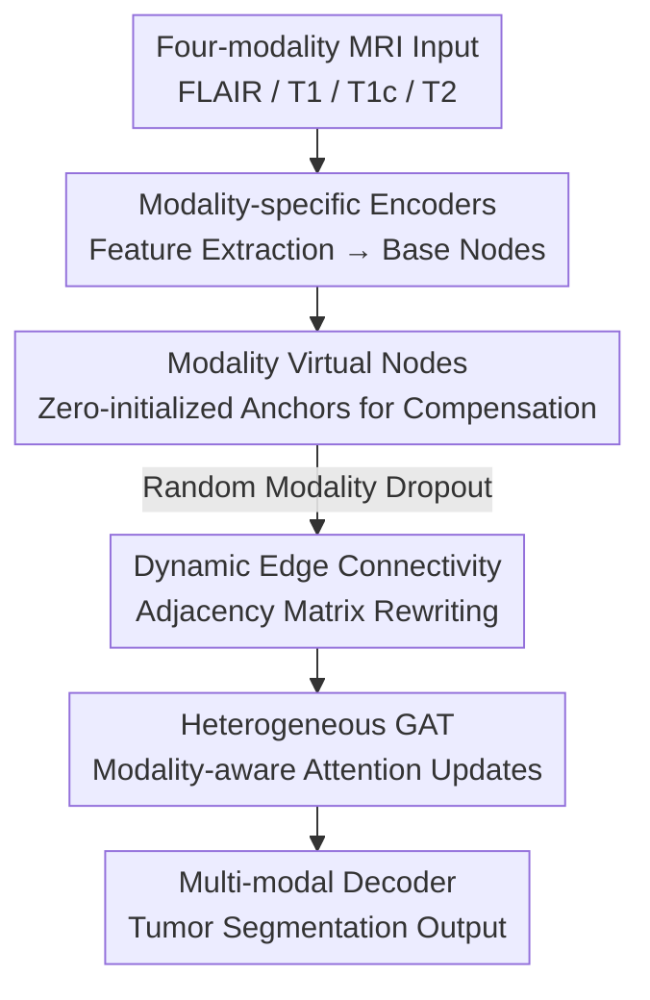

# Virtual Nodes Guided Dynamic Graph Neural Network for Brain Tumor Segmentation with Missing Modalities

**Conference**: CVPR 2026  
**Paper**: [CVF Open Access](https://openaccess.thecvf.com/content/CVPR2026/html/Tao_Virtual_Nodes_Guided_Dynamic_Graph_Neural_Network_for_Brain_Tumor_CVPR_2026_paper.html)  
**Area**: Medical Imaging  
**Keywords**: Brain Tumor Segmentation, Missing Modalities, Graph Neural Networks, Virtual Nodes, Dynamic Graphs

## TL;DR
This work treats each MRI modality as a graph node and assigns a set of zero-initialized learnable "virtual nodes" to each. A graph attention network with an adjacency matrix that dynamically rewrites based on available modalities is used for fusion. This **single-stage training** framework robustly handles brain tumor segmentation under arbitrary modality omissions, outperforming SOTA on almost all missing subsets of BraTS-2018/2020.

## Background & Motivation

**Background**: Clinical brain tumor segmentation relies on four MRI modalities—FLAIR, T1, contrast-enhanced T1 (T1c), and T2. These modalities characterize different tumor sub-regions. Their complementary use is essential for accurately segmenting the Enhancing Tumor (ET), Tumor Core (TC), and Whole Tumor (WT). Most mainstream segmentation networks (CNNs/Transformers) are designed and trained under the "all four modalities available" assumption.

**Limitations of Prior Work**: In practice, all four modalities are often not available due to imaging corruption, varied acquisition protocols, or patient conditions. Even during training, some modalities may be missing. Once a modality is absent, the performance of models optimized for full modalities drops significantly. To address this, existing solutions either train a customized model for every possible modality subset (leading to exponential deployment costs) or train a unified model—though most of the latter require **two-stage** processes: using knowledge distillation where a full-modality teacher guides a missing-modality student, or first using generative models to reconstruct missing modalities.

**Key Challenge**: The root cause of two-stage schemes is that the **connections in structured architectures like CNNs/Transformers are predefined**. The computation paths are hardcoded for a fixed set of modalities, creating a strong dependency on complete cross-modal correspondences. When a modality is missing, the intended feature interactions become "ill-defined," necessitating remedial stages.

**Key Insight**: The authors observe that graph structures inherently operate on the "actually observed set of modalities." Each modality acts as a node; missing a modality simply means missing nodes or edges, and message passing occurs only among available nodes. This adaptive connectivity perfectly aligns with the nature of missing modalities.

**Core Idea**: The fusion stage is replaced with a graph: **virtual nodes** compensate for information from missing modalities, **dynamic edge connections** allow the adjacency matrix to rewrite in real-time based on availability, and a **heterogeneous weight matrix** enables graph attention to distinguish between different modalities. This implicitly encodes $N$ modality combinations within a single-stage, plug-and-play framework.

## Method

### Overall Architecture
The input consists of four-modality MRI volumes, and the output is a tumor segmentation map. Fixed cross-modal fusion via Transformers/CNNs is discarded. Instead: first, modality-specific encoders extract features and map them to "base nodes"; next, a set of zero-initialized "virtual nodes" is attached to each modality to form an extended graph. During training, random modality dropout simulates missing data, and the adjacency matrix is dynamically rewritten so that the Heterogeneous Graph Attention Network (GAT) only passes messages between valid nodes. Finally, the updated nodes are sent to a decoder for segmentation. The entire pipeline is trained only once (one-stage), and at inference, it covers all $2^N-1$ combinations by bypassing the corresponding encoders and graph connections.

### Key Designs

**1. Modality Virtual Nodes: Creating "Proxy Seats" for Missing Modalities**

The direct problem with missing modalities is the total absence of corresponding features. Structured networks usually fill this with zeros or rely on generative models, where the former loses information and the latter introduces reconstruction noise and requires extra training. The authors assign each modality $m$ a set of **learnable, zero-initialized** virtual nodes $p^m \in \mathbb{R}^{C_p \times F}$, which are concatenated with the base nodes $v^m$ from the encoder to form extended nodes:

$$v^m_p = [v^m; p^m], \quad v^m_p \in \mathbb{R}^{P \times F}, \quad P = C + C_p$$

The four modalities result in $4 \times P$ nodes. Virtual nodes act as **modality-agnostic anchors**: they participate in message passing with available modality nodes. Thus, even if a modality is completely absent, the model can provide a stable, coherent representation using features from other modalities and the invariant features of the missing modality itself. Zero-initialization and self-learning (see Loss section) allow these anchors to evolve from "blank" states to learning modality-invariant information without being artificially constrained to shared features—the latter would sacrifice representation richness. Ablations show virtual nodes are the most critical component; removing them leads to a sharp drop in ET (66.0 → 62.3).

**2. Dynamic Edge Connectivity: Real-time Adjacency Rewriting and Unidirectional Flow**

Fixed connectivity generates invalid/noisy edges when modalities are missing. The authors use 0/1 edges $e_{ij}$ to describe the graph topology and define baseline rules: nodes within the same modality are bi-directionally connected; corresponding nodes across modalities are also bi-directionally connected; virtual nodes are **updated only by their own modality's nodes, but they participate in updating all other nodes**. During training, 0 to $N-1$ modalities are randomly dropped. The key is the rewriting rule when modality $m$ is dropped: for any base node $i$ in $m$, the edges flowing from it to all other nodes $j$ are cut ($e_{ji}=0$), but edges flowing into it ($e_{ij}$) remain. In this way, information flows **unidirectionally from existing nodes to the nodes representing missing modalities**. This allows the reconstruction of missing representations using existing features and modality-invariant traits while preventing reconstruction noise from polluting the existing modalities.

To prevent missing edges ($e_{ij}=0$) from breaking gradient propagation, they are not physically removed from the computation graph. Instead, a very small value is assigned to the corresponding attention weights—a "soft masking" that suppresses interference from missing modalities while maintaining differentiability. Essentially, this **implicitly encodes $N$ customized model configurations within a unified graph**, matching the goal of ensemble models but achieving it through structural flexibility in a single stage.

**3. Heterogeneous Graph Attention: Making GAT Modality-Aware**

Original GATs are designed for single-modality data, where the weight matrix $W$ is shared across all nodes, failing to characterize cross-modal differences. The authors **heterogenize** $W$—each modality uses its own $W_m$, and the attention scoring becomes:

$$\beta_{ij} = a(W_m v^m_i, W_n v^n_j)$$

where $m, n \in \{\text{FLAIR, T1c, T1, T2}\}$. Even the weight vector $a$ is heterogenized into $a_m$, resulting in coefficient:

$$\alpha_{ij} = \frac{\exp\!\big(\text{LeakyReLU}(a_m[W_m v^m_i \,\|\, W_n v^n_j])\big)}{\sum_{k \in \mathcal{N}_i} \exp\!\big(\text{LeakyReLU}(a_m[W_m v^m_i \,\|\, W_{m_k} v^{m_k}_k])\big)}$$

This ensures attention is aware of both the node content and the modality identity, making fusion more suitable for multi-modal scenarios. Removing the heterogeneous matrices caused ET to drop from 66.0 to 62.9 in ablations.

### Loss & Training
The backbone is a 3D U-Net, where the encoder is reused as the feature extractor for each modality, and the decoder is reused as either a specific or multi-modal decoder. In addition to the segmentation map $y^m$ from the multi-modal decoder, each modality feature is connected to a "specific decoder" output $y^s$ as an additional constraint. The total loss supervises both output types:

$$L_{total} = \sum_{i \in M} L(y^s_i, y) + L(y^m, y)$$

where $L$ is the Dice loss and $M=\{\text{FLAIR, T1c, T1, T2}\}$. Virtual nodes are self-learned without explicit cross-modal alignment. Specific decoders are used only during training. Training uses Adam (initial lr 0.0002 + cosine decay), batch size 1, 1000 epochs, 4×4090 GPUs, and random $128^3$ crops.

## Key Experimental Results

### Main Results
Evaluated on BraTS-2018 / 2020 using the Dice Similarity Coefficient (DSC) for ET / TC / WT across all 15 missing modality combinations. The table shows average DSC (%) across all combinations:

| Dataset | Sub-region | U-HVED | mmFormer | M3AE | Best Baseline | Ours |
|--------|--------|--------|----------|------|---------------|------|
| BraTS-2018 | ET | 46.8 | 59.9 | 59.9 | 64.7 (MMCFormer) | **66.0** |
| BraTS-2018 | TC | 64.8 | 73.0 | 77.4 | 79.3 (MMCFormer) | **81.4** |
| BraTS-2018 | WT | 79.2 | 82.9 | 85.8 | 85.8 (MMCFormer) | **86.7** |
| BraTS-2020 | ET | 30.6 | 58.0 | 61.3 | 63.6 (LS3M) | **65.8** |
| BraTS-2020 | TC | 43.5 | 74.9 | 77.6 | 79.8 (LS3M) | **80.8** |
| BraTS-2020 | WT | 62.8 | 82.9 | 86.3 | 88.2 (LS3M) | **88.4** |

Compared to the strongest customized method on 2018 (MMCFormer), the proposed method improves ET/TC/WT by +1.3 / +2.1 / +0.9 and achieves the best performance in 12 out of 15 combinations. Most notable is the performance when **T1c (the most critical modality) is missing**, where ET and TC improve by an average of +3.65 and +4.3, demonstrating strong compensation capabilities.

### Ablation Study (BraTS-2018, Mean DSC % across all combinations)

| Configuration | ET | TC | WT | Description |
|------|----|----|----|------|
| Full Model | 66.0 | 81.4 | 86.7 | — |
| w/o Virtual Nodes | 62.3 | 79.4 | 86.2 | Largest drop, especially in ET |
| w/o Dynamic Connectivity | 64.6 | 80.5 | 86.3 | Replaced with static fully-connected graph |
| w/o Heterogeneous Matrix | 62.9 | 80.9 | 86.3 | Degraded to standard GAT |

Sensitivity to virtual node length (BraTS-2018, mean across combinations):

| Length | ET | TC | WT | Avg |
|--------------|----|----|----|-----|
| 0 | 62.3 | 79.4 | 86.2 | 75.9 |
| 16 | 65.4 | 80.9 | 86.6 | 77.6 |
| **32** | **66.0** | **81.4** | **86.7** | **78.0** |
| 64 | 63.3 | 79.6 | 86.6 | 76.5 |
| 128 | 63.1 | 78.4 | 86.5 | 76.0 |

### Key Findings
- **Virtual nodes provide the highest contribution**: Their removal causes the steepest performance decline, particularly in ET, which relies heavily on T1c. Virtual nodes play a central role in compensating for missing critical modalities.
- **Virtual node length has an upper bound**: A length of 32 is optimal. Increasing length further leads to a decline. This suggests there is an inherent limit to the modality-invariant information that can be inferred from missing inputs; excess length introduces redundancy and noise.
- **Graph vs. Transformer**: The primary difference from mmFormer is the switch to GNN for fusion. The performance gain is attributed directly to the graph's superior modeling of modality relationships.

## Highlights & Insights
- **Perspective of "Missing Modalities = Missing Nodes/Edges"**: This elegantly re-frames missing data from an "anomaly requiring a fix" to a "natural state supported by graphs," bypassing the need for two-stage remedies.
- **Clever Unidirectional Edge Design**: Cutting outgoing edges while keeping incoming edges for missing modalities allows information to populate the "proxy seat" without polluting preserved modalities.
- **Soft Masking for Missing Edges**: Using ultra-low attention weights instead of deleting edges maintains differentiability, a trick applicable to any dropout-enabled graph structure.
- **Plug-and-play**: The graph interface resides between encoders and decoders, allowing it to be integrated into existing segmentation systems.

## Limitations & Future Work
- **Evaluated only on BraTS**: While $N=4$ creates a manageable graph, it is unclear how the overhead scales with larger $N$.
- **"Black box" nature of Virtual Nodes**: Although self-learning avoids rigid alignment, what exactly these anchors encode and why the optimal length is 32 remains under-explored.
- **Certain combinations are not yet optimal**: In some subsets, the method is slightly behind SOTA, though the authors claim the gap is "clinically negligible."
- **Simulation dependency**: Training still involves all modalities (simulated by zeroing out). Whether this generalizes to scenarios where some modalities are truly absent during training is yet to be verified.

## Related Work & Insights
- **vs. Customized Methods (e.g., MMCFormer)**: Customized methods require $2^N-1$ models. This method reaches the same goal with a single graph that implicitly handles all configurations.
- **vs. Reconstruction Methods (GAN/Feature Alignment)**: Explicit reconstruction is noisy and requires extra networks. This method uses implicit compensation via virtual nodes.
- **vs. Existing Graph Methods**: Prior works often used graph operators within structured backbones or relied on superpixel representations. This work is the first to define missing modality interaction through a plug-and-play graph interface with dynamic rewriting.

## Rating
- Novelty: ⭐⭐⭐⭐ The "Missing Modality = Missing Node" perspective combined with virtual nodes and unidirectional dynamic edges is a natural and novel synthesis.
- Experimental Thoroughness: ⭐⭐⭐⭐ Covers all 15 combinations across two datasets with comprehensive ablations, though limited to the BraTS domain.
- Writing Quality: ⭐⭐⭐⭐ Clear motivation, well-structured diagrams, and logical flow.
- Value: ⭐⭐⭐⭐ The single-stage, plug-and-play nature with reduced parameter overhead is highly practical for clinical deployment.

<!-- RELATED:START -->

## Related Papers

- [\[CVPR 2026\] Uni-Encoder Meets Multi-Encoders: Representation Before Fusion for Brain Tumor Segmentation with Missing Modalities](uni-encoder_meets_multi-encoders_representation_before_fusion_for_brain_tumor_se.md)
- [\[CVPR 2026\] PGR-Net: Prior-Guided ROI Reasoning Network for Brain Tumor MRI Segmentation](pgr-net_prior-guided_roi_reasoning_network_for_brain_tumor_mri_segmentation.md)
- [\[CVPR 2026\] Virtual Full-stack Scanning of Brain MRI via Imputing Any Quantized Code](virtual_full-stack_scanning_of_brain_mri_via_imputing_any_quantised_code.md)
- [\[CVPR 2026\] Dynamic Stream Network for Combinatorial Explosion Problem in Deformable Medical Image Registration](dynamic_stream_network_for_combinatorial_explosion_problem_in_deformable_medical.md)
- [\[AAAI 2026\] MAPI-GNN: Multi-Activation Plane Interaction Graph Neural Network for Multimodal Medical Diagnosis](../../AAAI2026/medical_imaging/mapi-gnn_multi-activation_plane_interaction_graph_neural_network_for_multimodal_.md)

<!-- RELATED:END -->
