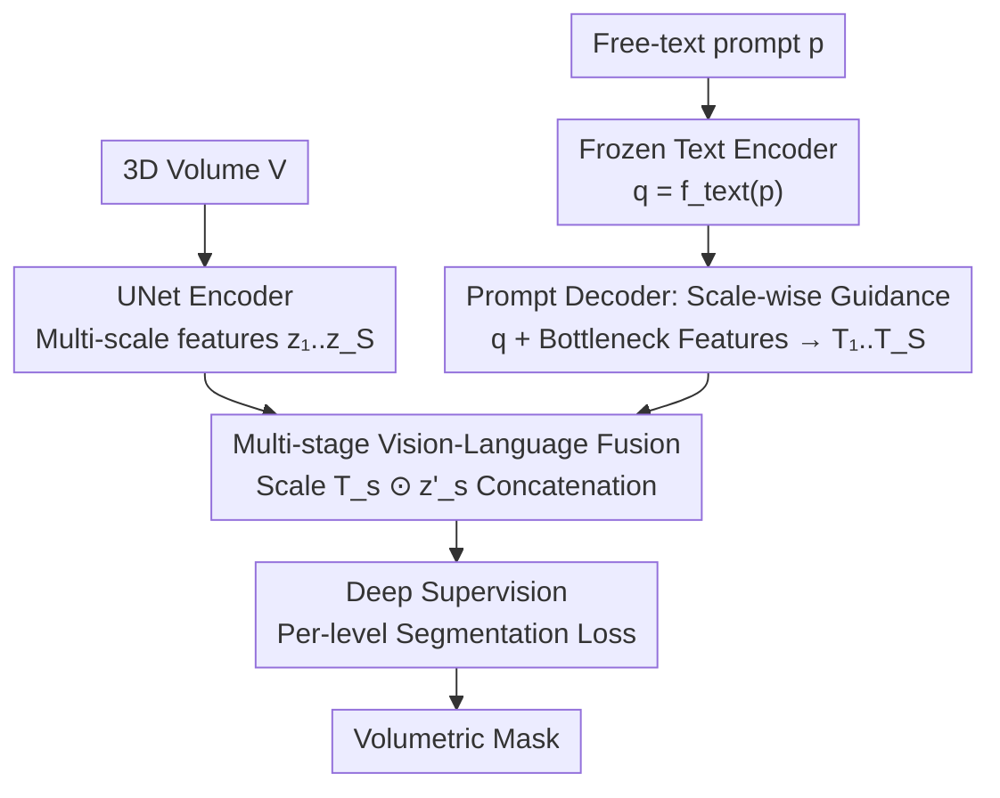

# VoxTell: Free-Text Promptable Universal 3D Medical Image Segmentation

**Conference**: CVPR 2026  
**Paper**: [CVF Open Access](https://openaccess.thecvf.com/content/CVPR2026/html/Rokuss_VoxTell_Free-Text_Promptable_Universal_3D_Medical_Image_Segmentation_CVPR_2026_paper.html)  
**Code**: https://github.com/MIC-DKFZ/VoxTell  
**Area**: Medical Imaging  
**Keywords**: 3D Medical Image Segmentation, Text-Prompted Segmentation, Vision-Language Fusion, Open-set Generalization, UNet

## TL;DR
VoxTell is a 3D vision-language segmentation model that generates volumetric masks directly from a single sentence (ranging from single words to full clinical reports). By repeatedly injecting text guidance at every level of the UNet decoder (multi-stage fusion) combined with deep supervision, it achieves a zero-shot average Dice of 70.85 across 11 unseen datasets, significantly outperforming the previous state-of-the-art text-promptable method, SAT (51.23).

## Background & Motivation

**Background**: 3D medical image segmentation has long been dominated by "specialized models"—where one model segments a single organ or modality. The SAM paradigm popularized "universal segmentation," which MedSAM and SegVol extended to the medical domain; however, these rely on **manual spatial prompts** such as points, boxes, or scribbles to specify targets. Text prompts represent a more natural clinical interface: clinicians can describe structures in natural language, reuse existing radiology reports, and leverage anatomical semantic knowledge encoded in modern language models.

**Limitations of Prior Work**: Existing text-guided medical segmentation models (SAT, BioMedParse, SegVol, etc.) have made progress but essentially function as "closed-set multi-task networks" that use text to select predefined masks. They: ① are tied to fixed label sets; ② are highly sensitive to minor variations in phrasing, synonyms, or spelling; and ③ are rarely evaluated on unseen concepts or modalities. Consequently, performance drops sharply when switching from simple word labels ("liver") to descriptive clinical sentences ("calcified nodule within the right lung parenchyma")—the exact scenario where language understanding should provide value.

**Key Challenge**: MaskFormer-style methods (SAT, Mask2Former, etc.) perform vision-language fusion only at the **last layer** of the decoder (late fusion). This forces the image backbone to learn a "prompt-agnostic" universal representation, only encountering the query at the final step. A shared segmentation head sliding over the entire volume cannot effectively adapt to **spatially localized** queries like "lesion in the right lung."

**Goal**: To enable a model to truly parse arbitrary free text rather than just retrieving a predefined mask, moving toward open-set capabilities that extrapolate structured language knowledge to related but unseen structures and modalities.

**Key Insight**: The authors argue that robust 3D free-text segmentation **requires repeated cross-modal interactions throughout the entire decoder hierarchy**, rather than a single instance of late fusion. By injecting text embeddings at multiple decoder depths into multi-scale features, linguistic and spatial information can remain aligned throughout the decoding process.

**Core Idea**: Extend the "single late fusion" of MaskFormer into **multi-stage vision-language fusion + deep supervision** across all decoder scales, supported by a large-scale 3D multi-modal training set with an extensively expanded vocabulary.

## Method

### Overall Architecture

The input consists of a 3D volume $V \in \mathbb{R}^{H \times W \times D}$ and a free-text prompt $p$ (word, phrase, or full clinical description), and the output is the volumetric segmentation mask for that prompt. The pipeline consists of three steps: ① a UNet-style encoder compresses the volume into multi-scale image features $\mathcal{Z}=\{z_1,\dots,z_S\}$; ② a frozen pre-trained text encoder encodes the prompt into a vector $q$, which is then translated by a transformer prompt decoder into **scale-wise** text guidance tensors $\mathcal{T}=\{T_1,\dots,T_S\}$; ③ the UNet decoder reconstructs the mask from coarse to fine, where at **each resolution**, the corresponding $T_s$ modulates the image features, with deep supervision applied to each level's output. Unlike SAT/Mask2Former which use a single dot product at the end, VoxTell replicates this "text-modulated image" operation across every decoder layer.

Notably, the authors intentionally retain a UNet-style convolutional backbone rather than a full transformer, as UNet remains SOTA on large-scale 3D medical benchmarks. Injecting text conditions directly into its multi-scale feature maps allows prompts to influence intermediate representations rather than just the output layer.

### Key Designs

**1. Multi-stage Cross-scale Fusion: Distributing Late Fusion Across Layers**

To address the limitation where late fusion prevents the backbone from learning prompt-relevant representations, VoxTell generalizes the MaskFormer text-image dot product to **all scales**. The prompt decoder $f_\text{prompt}$ uses the text vector $q$ as the query and the bottleneck feature $z_S$ as key-value pairs to output multi-scale guidance tensors $\mathcal{T}=f_\text{prompt}(q,z_S)=\{T_1,\dots,T_S\}$. Each $T_s \in \mathbb{R}^{G \times C_s}$ aligns with the channel dimension of the corresponding decoder scale, with a guidance embedding dimension of $G=32$. At the $s$-th level of the decoder, the upsampled output of the previous level $y_{s-1}^\uparrow$ is concatenated with the encoder skip connection $z_s$ and passed through a convolutional block:

$$z'_s = \text{ConvBlock}(\text{concat}(y_{s-1}^\uparrow, z_s))$$

Then, a channel-wise dot product is performed between $z'_s$ and $T_s$ along the channel dimension, and the resulting $G$ new channels are concatenated back to the original features:

$$y_s = \text{concat}\big(z'_s,\; T_s \odot z'_s\big), \quad y_s \in \mathbb{R}^{(C_s+G) \times H_s \times W_s \times D_s}$$

This ensures that text "probes" the image features at every resolution, resulting in continuous, multi-scale cross-modal interaction. Ablations show this step is the primary factor for performance gains: improving from ~55 Dice with single late fusion to 60.2 with 3 stages and 61.5 with 5 stages.

**2. Deep Supervision: Forcing Early Integration of Text Prompts**

Late fusion alone runs the risk that text guidance arrives "too late," leaving the initial decoder stages to learn unconditional representations. VoxTell attaches a segmentation head to **every** intermediate decoder output $y_s$ to generate a prediction $\hat{Y}_s$, computing a weighted loss across all scales:

$$\mathcal{L} = \sum_{s=1}^{S} \lambda_s \, \mathcal{L}_\text{seg}(\hat{Y}_s, Y_s)$$

where $Y_s$ is the ground truth downsampled to the $s$-th scale, $\mathcal{L}_\text{seg}$ is a combination of Dice and Cross-Entropy loss, and $\lambda_s$ is the scale weight. This constraint forces the integration of the text query during initial decoding stages, resulting in masks that better align with the input prompt. Deep supervision further improved the 5-stage result from 61.5 to 62.6.

**3. Vocabulary Harmonization and Expansion: Robustness to Synonyms, Typos, and Long Sentences**

One reason text-promptable models are sensitive to phrasing is that training labels are often too rigid. VoxTell was trained on 158 public datasets with over 62K volumes and 1,087 anatomical/pathological concepts, utilizing dedicated vocabulary engineering: first, harmonizing label semantics, unifying synonyms, and resolving cross-dataset ambiguities (e.g., whether "liver" includes lesions); then, using Large Language Models (LLMs) to expand the label space with anatomically precise variants (e.g., "right kidney" → "dexter kidney") and hierarchical aggregations (e.g., combining individual ribs into "rib cage"). The final vocabulary contains 1,087 unified concepts with 9,682 paraphrased labels. This harmonization, combined with a strong frozen text encoder (Qwen3-Embedding-4B), allows diverse natural language expressions to be mapped to consistent embeddings. This is why VoxTell’s performance remains stable under synonyms or typos while baselines fluctuate significantly. Both positive prompts and negative prompts ("not present in image") were sampled during training.

### Loss & Training
The segmentation loss is a weighted sum of Dice and Cross-Entropy across multiple scales for deep supervision (see Design 2). The backbone uses ResEncL (6-stage encoder), the text encoder is the frozen Qwen3-Embedding-4B, and the prompt decoder is a 6-layer transformer with a 2048-dimensional query space. The final model was trained on 64 A100 GPUs with a batch size of 128 for approximately 6 days, using SGD with polynomial decay and an initial learning rate of $1\times10^{-4}$. Ablations were conducted on a single A100 with a batch size of 2.

## Key Experimental Results

Evaluation focused on the rigorous setting of **zero-shot evaluation on unseen datasets (OOD images)** only, covering CT/MRI/PET and including both common structures and rare pathologies.

### Main Results: Zero-shot Dice on 11 Unseen Datasets (Excerpt from Tab. 1)

| Method | Abdominal Organs (CT) | Lung & Airway (CT) | Lung Tumor (PET) | Multiple Sclerosis (MRI) | Liver Lesion (CT) | Mean Dice |
|------|------|------|------|------|------|------|
| BioMedParse | 9.12 | 0.00 | 2.73* | 9.57 | 41.25 | 12.91 |
| SegVol | 52.50 | 88.67 | 0.00* | 0.00* | 58.35 | 30.35 |
| BioMedParseV2 | 51.78 | 62.59 | 0.47 | 2.03 | 70.37 | 30.59 |
| SAT (Second Best) | 68.79 | 87.98 | 77.13 | 13.68 | 62.28 | 51.23 |
| **VoxTell** | **72.94** | **89.65** | **83.24** | **72.71** | **73.24** | **70.85** |

VoxTell leads in almost all 11 categories, with a mean Dice of 70.85, nearly 20 points higher than the runner-up SAT. Its advantage is particularly striking in rare pathologies like Multiple Sclerosis (72.7 vs 13.7) and adrenal tumors, where many baselines fail completely on untrained modalities or pathologies.

### Ablation Study (Tab. 2, Validation set, fixed training data and text encoder)

| Configuration | Fusion Stages | Deep Supervision | Dice |
|------|------|------|------|
| Mask2Former (Single Late) | 1 | ✗ | 51.68 |
| MaskFormer / SAT Paradigm | 1 | ✗ | 55.11 |
| Ours (3 Stages) | 3 | ✗ | 60.16 |
| Ours (5 Stages) | 5 | ✗ | 61.54 |
| Ours (+Deep Supervision) | 5 | ✓ | 62.55 |
| Ours (+Batch size 128) | 5 | ✓ | 69.43 |

### Other Key Results

| Scenario | Metric | Prev. SOTA | VoxTell |
|------|------|------|------|
| Cross-modality - Breast Cancer (PET) | Dice | SAT 58.26 | 72.27 |
| Unseen Concept - Esophageal Tumor (CT) | Dice | SAT 0.00 | 69.07 |
| ReXGroundingCT Instance-level | Dice | SAT 13.1 | 28.2 |
| ReXGroundingCT Instance-level | HIT5% | SAT 49.8 | 67.8 |
| Radiotherapy Report Long Sentence (203 cases) | Dice | SAT 0.0 | 50.2 |

### Key Findings
- **Multi-stage fusion is the primary performance driver**: Moving from single late fusion (≤55.1) to 3/5 stages improved Dice by 5–6 points (60.2/61.5), proving that repeated text alignment at every decoder scale is far more effective than a single terminal dot product.
- **Deep supervision provides a final boost**: Adding deep supervision to the 5-stage model added another +1.0 (61.5 → 62.6), confirming that forcing early decoder layers to process text improves alignment. Scaling the batch size from 2 to 128 provided another significant jump (→ 69.4), highlighting the synergy between architecture and training scale.
- **Significant advantage in clinical long sentences**: On sentence-level prompts from real radiology reports, VoxTell achieved 50.2 Dice, while SAT/BioMedParseV2/SegVol were largely ineffective (0.0/1.2/8.1)—even though all models had encountered lung tumors. This suggests the bottleneck is not "seeing the category" but parsing descriptive language involving spatial relationships.
- **Prompt Robustness**: Facing synonyms, paraphrasing, or typos, baselines fluctuated wildly or failed, while VoxTell remained stable, benefiting from vocabulary expansion and the strong frozen text encoder.

## Highlights & Insights
- **"Spreading late fusion across all layers" is a simple yet powerful paradigm shift**: Without changing the UNet backbone, adding a channel-wise dot product ($T_s \odot z'_s$) at each decoder scale (increasing channels by only $G=32$) transforms text-image alignment from a one-off event into a continuous process throughout decoding.
- **Vocabulary engineering as a first-class citizen**: Using an LLM to expand 1,087 concepts into 9,682 paraphrased labels (including Latin synonyms and hierarchical aggregations) elevates "robustness to phrasing" from a training trick to a system design. This is the hidden driver behind its superior performance on clinical long sentences.
- **The evaluation protocol itself is a contribution**: By insisting on zero-shot testing on OOD datasets and building a 203-case radiotherapy cohort with real report sentences, the study is much more honest than traditional "in-distribution train/test split" benchmarking, revealing the true generalization power of text-promptable models.
- **Transferable logic**: The multi-scale cross-modal injection + deep supervision approach is applicable to any task where a "conditional signal must guide dense prediction" (e.g., text-guided natural image segmentation, audio-conditioned generation). The core lesson: don't let the conditioning signal arrive late.

## Limitations & Future Work
- **High variance on completely unseen concepts**: Esophageal cancer achieved 69.1, but bladder cancer reached only 25.8 (Tab. 3). Open-set generalization is only a "first step," and the model remains unreliable for structures that fall far outside its latent space; clinical deployment requires caution.
- **Heavy reliance on compute and data**: Training required 62K+ volumes, 64×A100 GPUs, and 6 days. The choice of the frozen text encoder (Qwen3-Embedding-4B) also significantly impacts performance, necessitating re-validation if migrating to other languages or encoders.
- **Weak instance-level grounding**: Performance on ReXGroundingCT (Dice 28.2, HIT5% 67.8) indicates that accurately pinpointing a single lesion from a report is still far from clinically ready and requires extra fine-tuning on that dataset to be competitive.
- **Future Directions**: Explore more explicit encoding of negative prompt sampling and hierarchical vocabulary structures into the loss, or introduce spatial grounding modules to improve the parsing of locational phrases like "upper right lobe" or "pleural contact."

## Related Work & Insights
- **vs SAT [238]**: Also follows the MaskFormer paradigm with a medical text encoder, but SAT performs fusion only once on high-resolution features; VoxTell extends fusion to all decoder scales with deep supervision, increasing mean Dice from 51.2 to 70.9 and maintaining performance on clinical sentences where SAT fails.
- **vs SegVol [53] / MedSAM**: These rely on spatial prompts (points/boxes). VoxTell uses pure free text, allowing it to reuse existing radiology reports and extrapolate to unseen structures via language embeddings—capabilities spatial prompts lack.
- **vs BioMedParse / BoltzFormer (V2) [236,237]**: These are 2D BioMedical Mask2Former routes with limited vocabularies (64 classes) and late fusion. VoxTell is natively 3D with 1,087 concepts and leads in cross-modal and unseen concept performance.
- **vs CLIP-driven Universal Model / CAT [126,74]**: These are closed-set "text-selects-segmentation-head" paradigms tied to training categories. VoxTell maps arbitrary descriptions directly to masks, advancing toward true open-set capabilities.

## Rating
- Novelty: ⭐⭐⭐⭐ Multi-stage cross-scale fusion is a solid, though not revolutionary, upgrade to MaskFormer late fusion, but is made complete by the vocabulary engineering.
- Experimental Thoroughness: ⭐⭐⭐⭐⭐ 11 OOD datasets + cross-modality/unseen concepts + real report cohorts + systematic ablation; the evaluation is rigorous and honest.
- Writing Quality: ⭐⭐⭐⭐ Motivations are clearly derived, formulas are complete, and charts are informative; some details are relegated to the appendix.
- Value: ⭐⭐⭐⭐⭐ Turning clinical reports directly into 3D segmentation prompts with significant performance gains and open-source availability provides high value for clinical medical imaging.

<!-- RELATED:START -->

## Related Papers

- [\[ICCV 2025\] SegAnyPET: Universal Promptable Segmentation from Positron Emission Tomography Images](../../ICCV2025/medical_imaging/seganypet_universal_promptable_segmentation_from_positron_emission_tomography_im.md)
- [\[CVPR 2026\] R2-Seg: Training-Free OOD Medical Tumor Segmentation via Anatomical Reasoning and Statistical Rejection](r2-seg_training-free_ood_medical_tumor_segmentation_via_anatomical_reasoning_and.md)
- [\[CVPR 2026\] Revisiting 2D Foundation Models for Scalable 3D Medical Image Classification](revisiting_2d_foundation_models_for_scalable_3d_medical_image_classification.md)
- [\[CVPR 2026\] CG-Reasoner: Centroid-Guided Positional Reasoning Segmentation for Medical Imaging with a Robust Visual-Text Consistency Metric](cg-reasoner_centroid-guided_positional_reasoning_segmentation_for_medical_imagin.md)
- [\[CVPR 2026\] From Infusion to Assimilation Distillation for Medical Image Segmentation](from_infusion_to_assimilation_distillation_for_medical_image_segmentation.md)

<!-- RELATED:END -->
