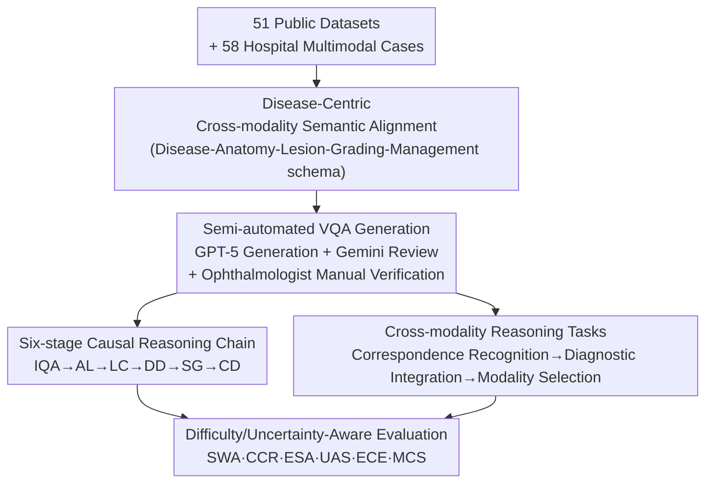

# X-PCR: A Benchmark for Cross-modality Progressive Clinical Reasoning in Ophthalmic Diagnosis

**Conference**: CVPR 2026  
**Paper**: [CVF Open Access](https://openaccess.thecvf.com/content/CVPR2026/html/Wang_X-PCR_A_Benchmark_for_Cross-modality_Progressive_Clinical_Reasoning_in_Ophthalmic_CVPR_2026_paper.html)  
**Code**: https://github.com/CVI-SZU/X-PCR  
**Area**: Medical Imaging / Multimodal VLM  
**Keywords**: Ophthalmic Diagnosis, Progressive Clinical Reasoning, Cross-modality Alignment, Medical VQA, MLLM Evaluation

## TL;DR
X-PCR decomposes ophthalmic diagnosis into six **causally dependent** reasoning stages: "Image Quality Assessment → Anatomical Localization → Lesion Characterization → Disease Diagnosis → Severity Grading → Clinical Decision-making." It performs semantic alignment across 6 ophthalmic imaging modalities, constructing a benchmark with 26,415 images and 177,868 expert-verified VQA pairs. Evaluation of 21 MLLMs shows they significantly lag behind specialists in chain-of-reasoning (the strongest, GPT-5, achieves a full-chain completion rate of only 24.47%) and cross-modality integration.

## Background & Motivation
**Background**: Multimodal Large Language Models (MLLMs) are now capable of reading medical images and generating diagnostic reports. General models like GPT-5 and Gemini-2.5-Pro, as well as specialized medical models like LLaVA-Med and MedGemma, have achieved competitive scores on various medical imaging tasks. Evaluation primarily relies on medical VQA benchmarks across domains such as pathology (PathVQA, WSI-VQA), endoscopy (EndoBench), chest X-rays (GEMeX), and general medical fields (SLAKE, PMC-VQA).

**Limitations of Prior Work**: Existing benchmarks consist almost entirely of **single-modality, single-turn** isolated tasks—answering a specific question based on a single image. Even as MedFrameQA and Rjua-Meddqa begin to introduce "progressive reasoning" via multi-image aggregation, they still lack a systematic evaluation of **multi-stage clinical reasoning** and **cross-modality integration**. Real-world clinical practice requires both: diagnosing Diabetic Macular Edema (DME), for instance, necessitates correlating microaneurysms on Color Fundus Photography (CFP), leakage on Fluorescein Angiography (FFA), and retinal structural changes on OCT.

**Key Challenge**: Current evaluations equate "diagnostic capability" with "single-point accuracy." However, the essence of clinical diagnosis is a **logically sequenced reasoning chain**—lesions must be localized before they can be characterized, and a diagnosis must be confirmed before it can be graded—combined with the ability to **synthesize cross-modality evidence**. Collapsing these dimensions into simple accuracy fails to measure whether reasoning is self-consistent or if the model "randomly patches modalities." Worse, most benchmarks focus on accuracy without considering confidence, masking the "confident hallucinations" that are fatal in high-risk scenarios.

**Goal**: To create an evaluation framework covering the **complete ophthalmic diagnostic workflow**, characterizing three aspects: the logical dependency of progressive reasoning, cross-modality clinical alignment, and reliability assessment through difficulty stratification and uncertainty awareness.

**Key Insight**: The authors replicate the actual diagnostic workflow of ophthalmologists, formalizing it into six stages with **mandatory inter-stage causal dependencies**. Downstream stages are conditioned on validated outputs from upstream stages, allowing for the measurement of "error propagation along the chain" and "narrative self-consistency."

**Core Idea**: Upgrade ophthalmic diagnosis from "isolated scoring" to "end-to-end reasoning integrity" evaluation using a "six-stage causal reasoning chain + six-modality semantic alignment + difficulty/uncertainty-weighted scoring."

## Method
As X-PCR is a benchmark paper, the "Method" refers to **data construction and evaluation protocol design**. It is built around a "disease-centric" data foundation, supporting two evaluation tracks (progressive reasoning chain and cross-modality reasoning) accompanied by a metric system sensitive to difficulty and uncertainty.

### Overall Architecture
The foundation comprises 26,415 images and 177,868 VQA pairs from 51 public datasets and 58 multimodal cases from partner hospitals, covering 52 diseases and 6 imaging modalities. Data is organized into a **disease-centric** unified representation, supporting two categories of evaluation: longitudinal "six-stage progressive reasoning chains" and horizontal "cross-modality clinical reasoning." Performance is scored using 6 metrics (SWA / CCR / ESA / UAS / ECE / MCS) covering both accuracy and reliability.

### Key Designs

**1. Six-stage Causal Reasoning Chain: From "Isolated Scoring" to "End-to-End Reasoning Integrity"**

Addressing the limitation that existing benchmarks cannot measure reasoning consistency, X-PCR formalizes ophthalmic diagnosis into six stages unfolding in a **strict causal sequence**: ① Image Quality Assessment (IQA), determining if the image meets diagnostic standards (focus, illumination, artifacts), acting as a **gatekeeper for the entire pipeline**; ② Anatomical Localization (AL), locating the optic disc, macula, vascular arches, and peripheral retina to establish spatial coordinates; ③ Lesion Characterization (LC), describing lesion morphology and distribution using standard clinical terms (e.g., "flame-shaped hemorrhage," "cotton wool spots"), which must be **anchored to the anatomical regions provided by AL**; ④ Disease Diagnosis (DD), synthesizing observations into a ranked differential diagnosis with evidence; ⑤ Severity Grading (SG), quantifying progression using disease-specific scales (e.g., ICDR for DR), which must be consistent with the pathological load implied by DD; ⑥ Clinical Decision-making (CD), translating the diagnosis into actionable treatment choices, referral urgency, and follow-up plans.

The key is the **mandatory logical dependency**: each stage is conditioned on the validated output of the previous stage (LC depends on AL, DD on LC, SG on DD, and CD is derived from DD+SG). This "dependency-aware" design allows for the measurement of three previously untestable attributes: **longitudinal consistency** (whether downstream conclusions follow upstream logic), **error propagation** (how much upstream errors degrade downstream performance), and **self-consistency** (the stability of the model's diagnostic narrative). The core metrics are Stage-Wise Accuracy (SWA) and **Complete Chain Rate (CCR)** (where a chain is complete only if all six stages are correct), with the latter directly quantifying end-to-end reasoning integrity.

**2. Cross-modality Semantic Alignment + Three-layer Cross-modality Reasoning: Testing "Modality Integration"**

To address the issue where ophthalmic modalities are analyzed in isolation without disease-level semantic alignment, X-PCR introduces a **disease-centric** alignment framework: first, a **standardized clinical representation** where each disease is defined by a unified "disease-anatomy-lesion-grading-management" schema, coupled with a `modality × evidence` matrix; second, **temporally aligned multimodal integration**, where images of the same eye collected during the same period are aligned structurally and semantically to ensure narrative coherence and grading consistency.

Cross-modality reasoning is broken into **three progressive tasks**: ① Correspondence Recognition, linking semantically equivalent findings across paired modalities (e.g., Macular Elevation on CFP ↔ Serous Retinal Detachment on OCT); ② Diagnostic Integration, synthesizing aligned multimodal clues for the most likely diagnosis; ③ Modality Selection, recommending the next most informative imaging modality when diagnosis is uncertain (e.g., using ICGA to differentiate CSC from VKH), reflecting the "Value of Information" in clinical practice.

**3. Difficulty and Uncertainty-Aware Scoring: Rewarding Calibration, Punishing "Confident Errors"**

To address the problem of models being overconfident while wrong, X-PCR employs two sets of metrics. On the difficulty side, questions are categorized into Resident (R), Attending (A), and Specialist (S) levels. Clinical importance scores are also assigned (e.g., the risk of missing a blinding disease), defining SWA, CCR, and Expert-level Stratified Accuracy (ESA). For uncertainty, models report a confidence score ($[0,1]$). Answers are categorized into "Correct & Confident (CC)," "Correct & Uncertain (CU)," "Incorrect & Uncertain (IU)," and "Incorrect & Confident (IC)." These are aggregated into the **Uncertainty-Aware Score (UAS)**, which rewards well-calibrated confidence and heavily penalizes overconfident errors in high-risk scenarios. **Expected Calibration Error (ECE)** is also reported to measure the gap between confidence and actual accuracy.

### Data Construction & Quality Control
VQA generation follows a semi-automated pipeline: 2–10 question templates per stage were designed with ophthalmologists, with distractors sampled from the same attribute nouns to ensure semantic relevance. The first five stages were generated by GPT-5 from dataset labels and lesion annotations, with Gemini-2.5-Pro reviewing for consistency. The final Clinical Decision-making stage was **manually written** by ophthalmologists due to the need for fine-grained reasoning. Specialists then assigned difficulty levels (R/A/S) and clinical importance. 20% of the questions were independently reviewed by a second ophthalmologist; questions with inter-rater agreement $\kappa < 0.8$ went to arbitration, and persistent disputes were discarded.

## Key Experimental Results

### Main Results for Progressive Reasoning Chain (Table 2 excerpt, Unit %)
Evaluation of 21 MLLMs (6 Commercial, 10 Open-source, 5 Medical-specific) compared against 23 Residents, 10 Attendings, and 8 Specialists.

| Model | IQA | CD | Avg Stage | CCR | UAS | ECE↓ |
|------|-----|-----|---------|-----|-----|------|
| GPT-5 (Strongest) | 98.90 | 54.71 | 76.24 | **24.47** | 74.32 | 0.062 |
| InternVL-32B (Strongest OS) | 94.35 | 43.22 | 70.14 | 0.92 | 64.46 | 0.086 |
| Qwen2.5-VL-72B | 93.13 | 47.06 | 69.15 | 13.77 | 66.37 | 0.075 |
| MedGemma-27B-IT (Medical) | 90.03 | 45.32 | 65.21 | 0.06 | 61.74 | 0.087 |
| LLaVA-Med-7B | 50.94 | 27.12 | 39.60 | 0.00 | 37.05 | 0.096 |
| Attending Physician | 95.46 | 67.06 | 79.91 | 41.24 | 77.16 | 0.091 |
| Specialist Physician | 97.80 | 70.97 | **82.85** | **62.48** | **90.63** | 0.063 |

### Key Findings
- **Commercial models lead, but full-chain completion crashes**: While GPT-5 has the highest average stage accuracy (76.24%), its CCR is only 24.47%—meaning it fails to complete the full six-stage reasoning correctly in over **75%** of cases. Most open-source/medical models have a CCR near 0. This indicates models "perform well at single steps but fail at the whole chain."
- **Monotonic error amplification along the chain**: Accuracy drops consistently from IQA to CD across all models, with the average dropping from 80.95% to 40.37%. The transition from DD to SG is the steepest drop (–15.32%), identifying it as a major bottleneck.
- **Huge gap compared to specialists in "Integration"**: No model outperformed an attending physician (79.91%), and all were below specialists (82.85%). The gap is most evident in CCR: GPT-5's 24.47% vs. Specialist's 62.48% (a 38.52% difference). On S-level (Specialist) problems, GPT-5 achieves only 62.92% vs. Specialist's 83.63%.
- **Performance degrades as modalities increase**: Moving from single-modality to multi-modality, GPT-5's performance drops by 13% and Qwen3-VL-30B's drops by 16%. Accuracy continues to decrease from 2 modalities to 4 modalities.
- **Cross-modality integration is "Pseudo-integration"**: The Modality Contribution Score (MCS, where >0 means a modality contributes) shows chaotic patterns—removing CFP/OCT from GPT-5 reduces accuracy, but removing OCT from Qwen3-VL-8B actually **increases** accuracy (MCS < 0). This inconsistency proves current MLLMs have not truly learned to synthesize multimodal evidence.

## Highlights & Insights
- **"Mandatory Causal Dependency" is the core innovation**: Previous benchmarks score stages independently, allowing models to "guess the right end-point despite a broken reasoning process." X-PCR conditions downstream stages on validated upstream outputs, identifying models that "appear to diagnose but cannot reason."
- **Institutionalizing "Uncertainty" into Scoring**: UAS utilizes the four-quadrant (CC/CU/IU/IC) system with difficulty weighting to penalize "confident errors." This is far more meaningful for high-risk medical deployment than simple accuracy.
- **Exposing "Pseudo-integration" via MCS**: Testing whether accuracy rises or falls after removing a modality is a sharper diagnostic tool than looking at multimodal accuracy alone—it directly exposes when a model treats additional modalities as noise.
- **Disease-Centric Alignment Schema is reusable**: The structured representation ("disease-anatomy-lesion-grading-management") is key to stitching fragmented public data into semantic-aligned cases. This approach can be ported to other multimodal medical fields like oncology MRI.

## Limitations & Future Work
- **Small human baseline sample**: The human cohort (23 residents, 10 attendings, 8 specialists) is relatively small, particularly the specialist group, which may introduce statistical noise.
- **LLM-based question generation**: Using GPT-5 to generate questions used to evaluate GPT-5 might introduce "generator bias," potentially favoring the GPT-5 family of models.
- **Limited multimodal hospital cases**: Some modality ablation groups in Table 4 have very small sample sizes (e.g., Group 4 has only 4 cases), making conclusions like "removing OCT improves performance" volatile.
- **Assessment without a solution**: The paper serves as a benchmark and identifies gaps but does not provide training methods to improve inter-modality integration or reasoning chains.
- **Domain specificity**: The six-stage chain is highly tailored to ophthalmology; its generalizability to pathology or radiology remains to be verified.

## Related Work & Insights
- **vs. PathVQA / EndoBench**: These are single-modality, single-turn tasks. X-PCR is the first to simultaneously integrate Progressive Reasoning Chain (PCR), Multimodal Integration Diagnosis (MID), Uncertainty Awareness (UA), and Expert-level Stratified Evaluation (EGE).
- **vs. MedFrameQA / Rjua-Meddqa**: While these introduce multi-step reasoning, X-PCR's distinction lies in **mandatory logical dependency** between stages, evaluating reasoning coherence rather than just multi-image QA.
- **vs. EyePCR**: EyePCR focuses on surgical cognition with single-modality data. X-PCR covers the full diagnostic workflow across 6 modalities with explicit cross-modality correspondence.

## Rating
- Novelty: ⭐⭐⭐⭐⭐ First benchmark formalizing ophthalmic diagnosis into a six-stage causal chain with uncertainty-weighted scoring.
- Experimental Thoroughness: ⭐⭐⭐⭐ Extensive evaluation of 21 MLLMs and 41 doctors, though the multimodal hospital sample size is small.
- Writing Quality: ⭐⭐⭐⭐ Clear logic behind design and metrics; however, the potential bias of LLM-generated questions is under-discussed.
- Value: ⭐⭐⭐⭐⭐ Clearly reveals the gap in end-to-end clinical reasoning and serves as a high-stakes benchmark for medical MLLM development.

<!-- RELATED:START -->

## Related Papers

- [\[AAAI 2026\] MedEyes: Learning Dynamic Visual Focus for Medical Progressive Diagnosis](../../AAAI2026/medical_imaging/medeyes_learning_dynamic_visual_focus_for_medical_progressive_diagnosis.md)
- [\[CVPR 2026\] Clinically-Grounded Counterfactual Reasoning for Medical Video Diagnosis](clinically-grounded_counterfactual_reasoning_for_medical_video_diagnosis.md)
- [\[CVPR 2026\] MedTVT-R1: A Multimodal LLM Empowering Medical Reasoning and Diagnosis](medtvt-r1_a_multimodal_llm_empowering_medical_reasoning_and_diagnosis.md)
- [\[CVPR 2026\] OmniBrainBench: A Comprehensive Multimodal Benchmark for Brain Imaging Analysis Across Multi-stage Clinical Tasks](omnibrainbench_a_comprehensive_multimodal_benchmark_for_brain_imaging_analysis_a.md)
- [\[CVPR 2026\] SurgCoT: Advancing Spatiotemporal Reasoning in Surgical Videos through a Chain-of-Thought Benchmark](surgcot_advancing_spatiotemporal_reasoning_in_surgical_videos_through_a_chain-of.md)

<!-- RELATED:END -->
