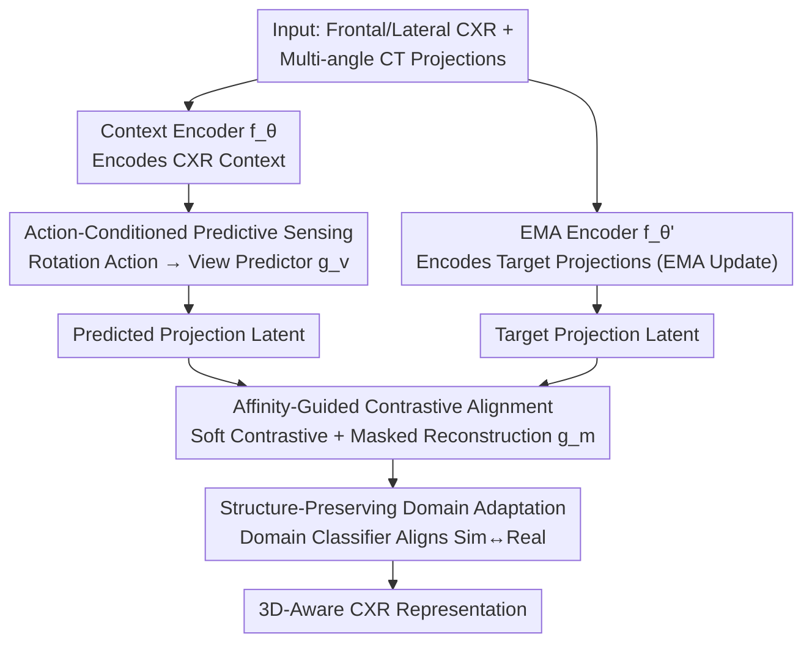

# X-WIN: Building Chest Radiograph World Model via Predictive Sensing

**Conference**: CVPR 2026  
**arXiv**: [2511.14918](https://arxiv.org/abs/2511.14918)  
**Code**: None  
**Area**: Medical Imaging  
**Keywords**: World Model, Chest Radiograph Representation Learning, CT Knowledge Distillation, Contrastive Learning, Domain Adaptation  

## TL;DR

The X-WIN chest radiograph world model is proposed, integrating 3D CT spatial knowledge into CXR representation learning for the first time. By learning to predict 2D projections of CT scans at various rotation angles, the model internalizes 3D anatomical structures. Combined with affinity-guided contrastive alignment and structure-preserving domain adaptation, it achieves SOTA results via linear probing across 6 CXR benchmarks.

## Background & Motivation

- **Inherent Limitations of CXR**: 2D projection images suffer from overlapping structures, making it difficult to capture 3D anatomical information directly and limiting diagnostic capabilities.
- **Trade-off between CT and CXR**: CT provides 3D structure but is costly, involves high radiation, and has lower accessibility; CXR is safe and inexpensive but information-limited.
- **Radiologist Inspiration**: Radiologists can mentally reconstruct 3D thoracic models when viewing frontal/lateral CXRs to assist in diagnosing occluded structures.
- **Limitations of Prior Work**: CheXWorld only learns 2D local structures and global geometry, lacking 3D spatial cognition.
- **Core Idea**: If a model can accurately predict X-ray projections of a CT at any rotation angle, it implies the model has internalized meaningful 3D anatomical structures.

## Method

### Overall Architecture

X-WIN aims to empower a model trained only on 2D chest radiographs with 3D spatial cognition, inspired by the capability of radiologists to reconstruct 3D thoracic structures from frontal/lateral views. It is a JEPA variant: the context encoder $f_\theta$ processes standard frontal/lateral CXR, the EMA encoder $f_{\theta'}$ processes multiple target projections (updated via exponential moving average), the view predictor $g_v$ predicts latent representations of new projections conditioned on rotation actions, and the mask predictor $g_m$ reconstructs occluded patch tokens. The core hypothesis is that accurate prediction of CT projections at arbitrary rotation angles requires the internalization of 3D anatomical structures.

### Key Designs

**1. Action-Conditioned Predictive Sensing: Forcing 3D Internalization via Rotation Prediction**

Instead of directly regressing 3D features, the model treats "rotating the X-ray source around the axis" as an action to predict corresponding projections. The action $a_i = k \cdot \Delta\phi$ defines the yaw rotation angle of the source relative to the input, constrained within $[-90°, 90°]$. In each step, $N=8$ projections are sampled with an optimal step $\Delta\phi = 3°$ (equivalent to 60 potential projections). The predicted representation is given by $z_i^{\text{patch}} = g_v(\text{Linear}(a_i) \oplus (f_\theta(u_{\text{context}}) + \text{PE}))$. To correctly predict projections from various angles, the model must establish a consistent 3D representation in the latent space.

**2. Affinity-Guided Contrastive Alignment: Soft Alignment for Multi-view Projections**

Standard InfoNCE uses one-hot labels to strictly distinguish positive and negative samples. However, different projections of the same CT share rich anatomical correspondences, and hard alignment might erase this structure. This work introduces an affinity matrix $A$ for soft regularization:

$$A_{ij} = \frac{\exp(\text{sim}(t_i, t_j)/\tilde{\tau})}{\sum_l \exp(\text{sim}(t_i, t_l)/\tilde{\tau})}$$

The alignment loss is defined as $\mathcal{L}_{\text{align}} = \mathcal{L}_{\text{InfoNCE}} + \lambda_{\text{affinity}} \mathcal{L}_{\text{affinity}}$. While maintaining discriminative power, it gently pulls related representations together based on the actual geometric similarity between projections.

**3. Structure-Preserving Domain Adaptation: Bridging the "Simulated vs. Real" Gap**

Simulated CXRs rendered from CT (via DiffDRR) differ statistically from real CXRs. Direct training biases representations toward the simulated domain. This method applies Masked Image Modeling (MIM) on both real and simulated CXRs to encode local/contextual features and employs a domain classifier $f_c$ to distinguish between domains. The domain adaptation loss:

$$\mathcal{L}_{\text{domain}} = \frac{1}{N} \sum_{i=1}^{N} \|z_i^{\text{patch}} - t_i^{\text{patch}}\|_2^2 - \frac{1}{N} \sum_{i=1}^{N} \log f_c(z_i^{\text{patch}})$$

ensures that projection predictions preserve structure (first term) while statistically approaching the real domain (second term via adversarial training). This increases cross-domain cosine similarity from 0.845 to 0.967, which is critical for real-world application.

### Loss & Training

The overall loss integrates four components: $\mathcal{L}_{\text{overall}} = \mathcal{L}_{\text{align}} + \lambda_{\text{MIM}} \mathcal{L}_{\text{MIM}} + \lambda_{\text{domain}} \mathcal{L}_{\text{domain}} + \lambda_{\text{cls}} \mathcal{L}_{\text{cls}}$, representing contrastive alignment, masked reconstruction, domain adaptation, and classification objectives, balanced by their respective $\lambda$ weights.

## Key Experimental Results

### Main Results (Linear Probing AUROC)

| Model | Pre-training Data | VinDr | CheXpert | NIH-CXR | RSNA | JSRT | Average |
|------|-----------|-------|----------|---------|------|------|------|
| DINOv2 | LVD-142M | 0.795 | 0.776 | 0.711 | 0.798 | 0.559 | 0.728 |
| CheXFound | 987K CXR | 0.869 | 0.876 | 0.829 | 0.872 | 0.846 | 0.858 |
| Ark+ | 704K CXR | 0.906 | 0.876 | 0.831 | 0.893 | 0.807 | 0.863 |
| CheXWorld | 448K CXR | 0.903 | 0.871 | 0.833 | 0.824 | 0.791 | 0.844 |
| **X-WIN (ViT-L)** | **372K CXR+32K CT** | **0.925** | **0.908** | **0.843** | **0.929** | **0.857** | **0.892** |

X-WIN achieves an average AUROC of 0.892, outperforming all existing CXR foundation models and vision-language models.

### Few-shot Fine-tuning (COVIDx, AUROC)

| Model | 4-shot | 8-shot | 16-shot | All |
|------|--------|--------|---------|-----|
| CheXFound | 0.823 | 0.883 | 0.897 | 0.977 |
| CheXWorld | 0.843 | 0.893 | 0.902 | 0.981 |
| **X-WIN** | **0.868** | **0.924** | **0.939** | **0.993** |

### 3D CT Reconstruction Capability

Using a VQ-GAN decoder and the FDK algorithm to reconstruct 3D CT volumes:
- 2D Projections: PSNR 30.23 dB, SSIM 0.888
- 3D Reconstruction: PSNR 27.87 dB, SSIM 0.789

### Ablation Study

- $\mathcal{L}_{\text{InfoNCE}}$ alone establishes a strong baseline.
- The combination of $\mathcal{L}_{\text{MIM}} + \mathcal{L}_{\text{InfoNCE}}$ provides a significant boost.
- Domain adaptation improves cosine similarity from 0.845 to 0.967.
- Direct rotation outperforms incremental rotation; yaw rotation is more effective than full 3D Euler angle rotation.

## Highlights & Insights

1. **Breakthrough in Medical World Models**: First to integrate 3D CT spatial knowledge into a 2D CXR world model, achieving a "leap from 2D to 3D."
2. **Elegant Predictive Sensing**: Internalizes 3D structures by predicting rotated projections rather than directly regressing 3D features.
3. **Affinity Guidance**: Leverages natural correlations between different projections of the same CT for soft contrastive learning, which is more anatomically sound than hard InfoNCE.
4. **Validation of 3D Reconstruction**: The ability to render projections from CXR and reconstruct CT volumes proves the model has successfully acquired 3D knowledge.

## Limitations & Future Work

- Reliance on DiffDRR for generating simulated projections; the sim-to-real domain gap remains a bottleneck.
- Only yaw rotation is utilized, neglecting potential information from pitch and roll dimensions.
- 3D reconstruction results exhibit blurriness, with significant loss of local details.
- High computational cost: Training requires 8×A100 40GB GPUs for 100 epochs.

## Rating

| Dimension | Rating |
|------|------|
| Novelty | ⭐⭐⭐⭐⭐ |
| Experimental Thoroughness | ⭐⭐⭐⭐⭐ |
| Writing Quality | ⭐⭐⭐⭐ |
| Value | ⭐⭐⭐⭐⭐ |

<!-- RELATED:START -->

## Related Papers

- [\[CVPR 2026\] MRI Contrast Enhancement Kinetics World Model](mri_contrast_enhancement_kinetics_world_model.md)
- [\[CVPR 2026\] Building Robust Vision Encoders for Cross-Dataset Evaluation in Immunofluorescent Microscopy](building_robust_vision_encoders_for_cross-dataset_evaluation_in_immunofluorescen.md)
- [\[AAAI 2026\] PulseMind: A Multi-Modal Medical Model for Real-World Clinical Diagnosis](../../AAAI2026/medical_imaging/pulsemind_a_multi-modal_medical_model_for_real-world_clinical_diagnosis.md)
- [\[CVPR 2026\] Beyond the Static-World: Lifelong Learning for All-in-One Medical Image Restoration](beyond_the_static-world_lifelong_learning_for_all-in-one_medical_image_restorati.md)
- [\[CVPR 2026\] Temporal Inversion for Learning Interval Change in Chest X-Rays](temporal_inversion_for_learning_interval_change_in_chest_x-rays.md)

<!-- RELATED:END -->
