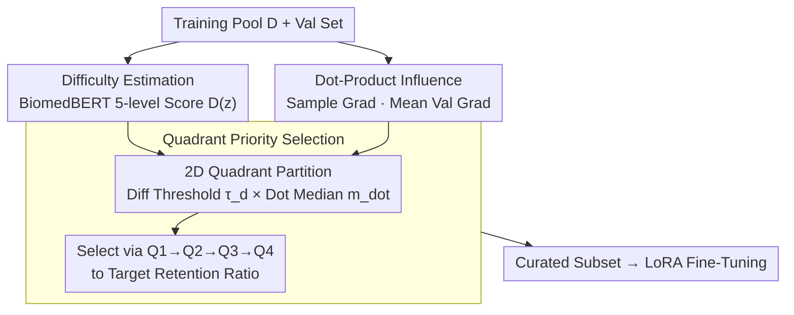

# Towards Efficient Medical Reasoning with Minimal Fine-Tuning Data

**Conference**: CVPR 2026  
**arXiv**: [2508.01450](https://arxiv.org/abs/2508.01450)  
**Code**: [GitHub](https://github.com/mihara-bot/DIQ)  
**Area**: Medical NLP  
**Keywords**: Data Selection, Medical Reasoning, Large Language Models, SFT, Gradient Influence

## TL;DR

This paper proposes the Difficulty-Influence Quadrant (DIQ) data selection strategy, which jointly considers sample difficulty and gradient influence. This approach allows a VLM's language backbone to match full SFT performance using only 1% of curated data and exceed full-dataset training with 10% of the data.

## Background & Motivation

Adapting LLMs to medical reasoning tasks typically involves Supervised Fine-Tuning (SFT), but current practices face several issues:

1.  **Data Redundancy**: Large-scale datasets contain numerous low-quality/redundant samples, leading to high computational costs with marginal performance gains.
2.  **Limitations of Prior Work in Single-dimension Selection**:
    *   Selection by **Difficulty** only: Picks samples with excessive noise or weak gradient signals, leading to unstable training.
    *   Selection by **Gradient Influence** only: Tends to favor simple samples that are easy to optimize but have shallow reasoning chains.
3.  There is a fundamental tension between these two dimensions; using either in isolation is suboptimal.

Through pilot experiments (training on four quadrants defined by difficulty and influence within the FineMed dataset), the authors discovered that $\mathcal{Q}_2$ data (high influence + low difficulty) yields better training results than $\mathcal{Q}_3$ data (low influence + high difficulty) but results in worse reasoning quality. This validates that achieving "the best of both worlds" requires samples that are simultaneously high-difficulty and high-influence.

## Method

### Overall Architecture

DIQ projects each training sample into a two-dimensional space: (1) **Difficulty Score** — model-agnostic, predicted by a BiomedBERT classifier on a 5-level Likert scale; (2) **Influence Score (Dot)** — model-dependent, calculated via the dot product of the training sample gradient and the mean validation set gradient. Samples are partitioned into four quadrants based on these dimensions and selected according to the priority $\mathcal{Q}_1 \to \mathcal{Q}_2 \to \mathcal{Q}_3 \to \mathcal{Q}_4$ until the target retention ratio is met. Finally, LoRA fine-tuning is performed on the curated subset.

### Key Designs

**1. Difficulty Estimation: Distinguishing samples by reasoning depth using a model-agnostic score.**

Selecting samples purely by influence favors simple problems that are easy to optimize but have shallow reasoning chains. Thus, an independent difficulty dimension is needed. This work utilizes a BiomedBERT classifier fine-tuned on multiple medical QA datasets to evaluate difficulty across three perspectives: Knowledge, Reasoning, and Overall. One perspective is taken as the scalar score $D(z) \triangleq D_\phi(z)$, and a percentile threshold $\tau_d$ groups samples into high/low difficulty. A key advantage is that this score is model-agnostic and can be reused across experiments without recomputation for different target models.

**2. Dot-Product Influence: Approximating "how much a sample reduces validation loss" via gradient dot products.**

Selecting purely by difficulty may include noisy samples with weak gradient signals. The influence dimension defines the value of a training sample $z$ as the dot product of its gradient and the mean validation gradient: $\text{Dot}(z) \triangleq g(z; \hat{\boldsymbol{\theta}})^\top \bar{g}_{\text{val}}(\hat{\boldsymbol{\theta}})$. Physically, this is a first-order approximation of the validation loss reduction from one step: $\Delta \bar{\ell}_{\text{val}} = -\eta \cdot \text{Dot}(z) + O(\eta^2)$. Implementation-wise, Johnson-Lindenstrauss random projection reduces the gradient to 4096 dimensions. The overall complexity is $O(|\mathcal{D}_{\text{val}}| + |\mathcal{D}|)$, which avoids Hessian computation and is much lighter than TracIn methods like LESS.

**3. Quadrant Priority Selection: Prioritizing the "Difficult and Useful" quadrant.**

Pilot experiments revealed that while $\mathcal{Q}_2$ (high influence + low difficulty) yields high benchmark scores, its reasoning quality is poor. Consequently, data is partitioned into four quadrants using the difficulty threshold $\tau_d$ and influence median $m_{\text{dot}}$. $\mathcal{Q}_1$ (high difficulty + high influence) is prioritized as it contains complex clinical reasoning paired with strong gradient signals. Within each quadrant, samples are ranked by Dot in descending order, with ties broken by descending difficulty. This joint 2D approach allows 1% of the data to approximate full SFT performance.

### Loss & Training

*   Fine-tuning with LoRA (rank=8, target modules QKV), learning rate $1 \times 10^{-4}$, cosine decay, 3 epochs.
*   Maximum context length of 8192 tokens.
*   The validation set defaults to 20 samples randomly drawn from each downstream task (180 total).
*   DIQ score computation is a one-time pre-processing cost that can be reused across experiments.

## Key Experimental Results

### Main Results

Fine-tuning Llama3.1-8B-Instruct on the Huatuo dataset, results averaged over 9 benchmarks:

| Data Vol. | Method | AvgS ↑ | AvgC ↑ | AvgA ↑ |
| :--- | :--- | :--- | :--- | :--- |
| Full (19k) | — | 54.77 | 37.77 | 43.44 |
| 1% | Random | 51.31 | 33.47 | 39.42 |
| 1% | LESS | 54.97 | 33.32 | 40.54 |
| 1% | **DIQ (Ours)** | **56.54** | **35.91** | **42.78** |
| 10% | Similarity | 54.13 | 35.53 | 41.73 |
| 10% | **DIQ (Ours)** | **58.11** | **37.00** | **44.04** |

**1% DIQ nearly matches full SFT (42.78 vs 43.44), while 10% DIQ exceeds full SFT (44.04 vs 43.44).**

### Ablation Study

| Selection Strategy | AvgA (1%) | AvgA (10%) | Note |
| :--- | :--- | :--- | :--- |
| Influence only | ~41.89 | ~42.45 | Favors simple samples |
| Reasoning only | ~41.89 | ~43.16 | Strongest single-dimension baseline |
| Knowledge only | ~41.05 | ~42.36 | High single-dimension bias |
| **DIQ (Ours)** | **42.78** | **44.04** | Dualndimension complementarity is optimal |

### Key Findings

*   **Improved Clinical Reasoning Quality**: LLM-as-judge evaluations show that DIQ-1% curated data scores higher than other data in differential diagnosis (DDx) by +0.80, safety checking (SC) by +0.35, and evidence citation (EC) by +0.46.
*   **Efficiency Analysis**: The computational cost of DIQ is only 1/1.85 of a single full SFT run for Llama3.1-8B, and the scores are reusable.
*   Cross-model generalization: Influence scores calculated on Llama remain effective when migrated to the Qwen3 series (gains in 6/9 scenarios).
*   Compatibility with DPO: 1% DIQ + DPO achieves a higher AvgA (by 1.00) than full SFT + DPO.
*   A validation set of 360-450 samples is sufficient to stabilize influence rankings.

## Highlights & Insights

*   **Strong Validation of "Less is More"**: Clearly reveals the tension between difficulty and influence in data selection and provides an actionable solution.
*   The DIQ framework is simple and efficient: Uses a single forward/backward pass to calculate gradients without Hessians; random projections maintain rankings.
*   Connects data selection with clinical reasoning quality: DIQ improves not just benchmark scores, but also reasoning alignment.
*   The quadrant-based selection strategy is intuitive and interpretable.

## Limitations & Future Work

*   Influence scores are calculated once before training and do not account for dynamic changes during the training process.
*   Validated only on models $\le$ 32B; not tested on 70B+ models.
*   The task composition and distribution of the validation set may affect the quality of Dot scores.
*   Biases in the difficulty classifier (BiomedBERT) itself may propagate to selection results.
*   Although the title mentions VLM, the actual experiments primarily focus on text-only LLM fine-tuning.

## Related Work & Insights

*   Compared to LESS (TracIn-based), DIQ is simpler and more efficient (no Hessian required) and integrates difficulty information.
*   The "High Difficulty + High Influence" quadrant priority concept can be generalized to data selection in other domains.
*   Gradient dot products as a measure of sample value are concise and effective, supported by solid theory (first-order Taylor expansion).

## Rating

*   Novelty: ⭐⭐⭐⭐ — While difficulty and influence have been studied, the 2D quadrant selection framework is a new contribution.
*   Experimental Thoroughness: ⭐⭐⭐⭐⭐ — 9 benchmarks, 6 datasets, multiple models, comprehensive ablation, and efficiency analysis.
*   Writing Quality: ⭐⭐⭐⭐ — Clear logic, rich experimentation, and motivations supported by pilot experiments.
*   Value: ⭐⭐⭐⭐ — Highly practical for medical LLM fine-tuning, though the VLM component in the title is under-validated.

<!-- RELATED:START -->

## Related Papers

- [\[ACL 2026\] Eliciting Medical Reasoning with Knowledge-enhanced Data Synthesis: A Semi-Supervised Reinforcement Learning Approach](../../ACL2026/medical_nlp/eliciting_medical_reasoning_with_knowledge-enhanced_data_synthesis_a_semi-superv.md)
- [\[ACL 2026\] LinguIUTics at PsyDefDetect: Iterative Imbalance-Aware Fine-tuning of Qwen3-8B for Psychological Defense Mechanism Classification](../../ACL2026/medical_nlp/linguiutics_at_psydefdetect_iterative_imbalance-aware_fine-tuning_of_qwen3-8b_fo.md)
- [\[ACL 2025\] CheXalign: Preference Fine-tuning in Chest X-ray Interpretation Models without Human Feedback](../../ACL2025/medical_nlp/chexalign_preference_finetuning.md)
- [\[ICLR 2026\] MedAgentGym: A Scalable Agentic Training Environment for Code-Centric Reasoning in Biomedical Data Science](../../ICLR2026/medical_nlp/medagentgym_agentic_training_biomedical.md)
- [\[ACL 2026\] Dr. Assistant: Enhancing Clinical Diagnostic Inquiry via Structured Diagnostic Reasoning Data and Reinforcement Learning](../../ACL2026/medical_nlp/dr_assistant_enhancing_clinical_diagnostic_inquiry_via_structured_diagnostic_rea.md)

<!-- RELATED:END -->
