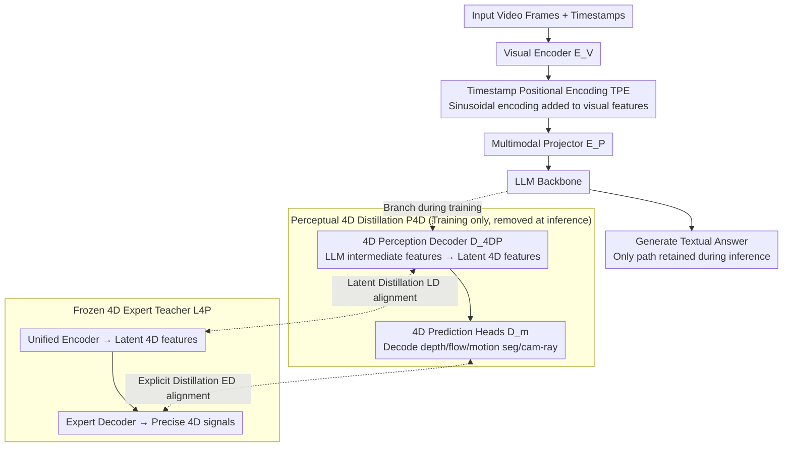

# 4D-RGPT: Toward Region-level 4D Understanding via Perceptual Distillation

**Conference**: CVPR 2026 Highlight  
**arXiv**: [2512.17012](https://arxiv.org/abs/2512.17012)  
**Code**: [GitHub](https://github.com/NVIDIA/4D-RGPT)  
**Area**: Model Compression  
**Keywords**: 4D Understanding, Region-level VQA, Perceptual Distillation, Timestamp Positional Encoding, Depth Perception

## TL;DR

This paper proposes 4D-RGPT and the Perceptual 4D Distillation (P4D) framework, which enhances 4D perception by distilling knowledge such as depth and optical flow from a frozen 4D perceptual expert model into an MLLM. It also introduces R4D-Bench, the first region-level 4D video question-answering benchmark.

## Background & Motivation

Despite significant progress in visual understanding by MLLMs, they still struggle with tasks requiring fine-grained 3D structure and temporal dynamic reasoning. Existing limitations include:

1.  **Weak 4D Perception**: Current SFT/RL methods optimize only through textual supervision, failing to effectively learn low-level 4D representations like depth and optical flow.
2.  **Lack of Region-level Prompts**: Existing 3D/4D VQA benchmarks either lack region prompts or miss dynamic scenes, making it impossible to evaluate the understanding of "specific regions within a 4D context."
3.  **Inference Overhead**: Approaches utilizing external 3D models for knowledge injection (e.g., VG-LLM) introduce additional computational costs during inference.

Key Insight: 4D perception (depth, optical flow, motion segmentation, camera rays) should be an intrinsic capability of the MLLM, acquired through distillation during training rather than depending on external modules during inference.

## Method

### Overall Architecture

The goal is to enable MLLMs to truly "understand" 4D—perceiving both spatial information like depth and 3D structure, and dynamic information of objects moving over time, while grounding answers in specific regions. The challenges are twofold: prior methods either rely solely on textual supervision without learning low-level 4D representations, or they append external 3D models at inference time, which bottlenecks speed.

The strategy of 4D-RGPT is to make 4D perception an **intrinsic capability**, with the cost paid only during training. Video frames pass through a VLM visual encoder, where "Timestamp Positional Encodings" (TPE) are superimposed on the encoder outputs before they enter the LLM backbone, informing the model of the actual time corresponding to each frame. While the LLM backbone generates textual answers normally, an additional set of modules is attached for training: a 4D perception decoder ($D_{4DP}$) extracts latent 4D features from internal LLM features, and a set of 4D prediction heads ($D_m$) decodes explicit 4D signals (depth, optical flow, motion segmentation, camera rays). During training, these outputs are "aligned" with a frozen 4D expert teacher (L4P) at both latent and signal layers. At inference, the entire 4D perception and distillation branch is discarded, leaving only the standard VLM path—achieving enhanced perception with zero additional inference overhead.

### Key Designs

**1. Perceptual 4D Distillation (P4D): Internalizing 4D perception during training rather than externalizing it at inference**

The problem with pure textual supervision (SFT/RL) is that the model is never directly told "how far this region is from the camera" or "which direction it is moving"; it can only guess 4D structure from text. P4D utilizes a frozen 4D perception expert, L4P, as a teacher to distill judgments on depth, optical flow, motion segmentation, and camera rays. Distillation occurs through two complementary branches: Latent Distillation ($\mathcal{L}_{LD}$) aligns the latent 4D features extracted by the 4D perception decoder ($D_{4DP}$) with the teacher's latent representations, providing abstract guidance; Explicit Distillation ($\mathcal{L}_{ED}$) forces the MLLM to decode specific maps (e.g., depth maps) via 4D prediction heads to align with the teacher's precise signals. Both are essential: without LD, the model lacks unified feature constraints; without ED, it only learns a vague "feeling." Crucially, these decoders and the teacher exist only during training, resulting in zero extra computation during inference.

**2. Timestamp Positional Encoding (TPE): Explicitly informing the model of real-world temporal intervals**

MLLMs typically see a sequence of visual tokens without knowing if 0.1s or 1.0s elapsed between frames. For tasks like "Calculating the average speed of this car," the model needs displacement divided by time. TPE encodes the sampling timestamp of each frame into sinusoidal positional encodings, which are added to the visual features of that frame. This ensures time is no longer implicit but bound to the visual content. Ablations show TPE significantly improves performance on time-sensitive tasks like speed and acceleration.

**3. R4D-Bench: The first 4D VQA benchmark grounded in specific regions**

Current 3D/4D VQA benchmarks either lack region prompts (general questions only) or feature static scenes, failing to test "behaviors of specific regions in dynamic 4D contexts." R4D-Bench adapts non-region questions from STI-Bench and VLM4D. It extracts entity keywords, segments objects using GroundingDINO + SAM2, applies SoM (Set-of-Marks) labels, matches regions to questions using Qwen2.5-VL, and finally performs manual verification. The resulting 1,517 region-prompted VQA pairs cover 9 tasks across Static (dimension measurement, 3D localization, spatial relations) and Dynamic (counting, translation, rotation, speed, displacement) categories.

### Loss & Training

-   Total Loss = SFT Cross-Entropy Loss + Latent Distillation Loss ($\mathcal{L}_{LD}$) + Explicit Distillation Loss ($\mathcal{L}_{ED}$)
-   Teacher Model: L4P (frozen), providing four 4D modalities: depth, flow, motion, and cam-ray.
-   Training Data: RoboFAC, SAT, VSTI-Bench training set, Wolf.
-   Baseline Model: NVILA-Lite-8B.

## Key Experimental Results

### Main Results (Non-region Benchmarks)

| Benchmark | NVILA Baseline | 4D-RGPT | Gain |
| :--- | :--- | :--- | :--- |
| STI-Bench | 33.8 | 37.6 | +3.8 |
| VLM4D | 46.5 | 52.7 | +6.2 |
| VSTI-Bench | 45.2 | 59.1 | +13.9 |
| Average (6 Benchmarks) | - | - | +5.3 |

### R4D-Bench

| Method | Static | Dynamic | Overall Average |
| :--- | :--- | :--- | :--- |
| GPT-4o | 30.3 | 47.5 | 42.8 |
| NVILA-Lite-8B | 29.1 | 41.3 | 37.9 |
| 4D-RGPT-8B (Ours) | 32.9 | 45.7 | 42.2 (+4.3) |

### Ablation Study

| Configuration | STI-Bench | R4D | Description |
| :--- | :--- | :--- | :--- |
| Baseline | 33.8 | 37.9 | No distillation |
| + TPE | 35.5 | 39.8 | Temporal awareness |
| + LD | 36.6 | 41.0 | Latent distillation |
| + ED | 36.9 | 41.5 | Explicit distillation |
| + LD + ED (P4D) | 37.6 | 42.2 | Full framework |

### Key Findings

-   Latent and explicit distillation are complementary; both are necessary for optimal performance.
-   TPE contributes significantly to time-sensitive tasks like speed and acceleration.
-   P4D outperforms alternative approaches such as direct SFT on 4D data, concatenating 4D features, or 4D positional encodings.
-   The distillation modules exist only during training, making inference completely overhead-free.

## Highlights & Insights

-   The "distill during training, free during inference" design paradigm is elegant—enhancing perception without increasing inference cost.
-   Dual-branch distillation (latent + explicit) is more effective than single-branch distillation.
-   R4D-Bench fills a gap in region-level 4D VQA, and its construction pipeline is reusable.
-   The results reveal that even GPT-4o achieves only 42.8% on region-level 4D reasoning, highlighting the extreme challenge of these problems.

## Limitations & Future Work

-   The quality of the student model is directly bounded by the teacher model (L4P); teacher limitations propagate to the student.
-   R4D-Bench is converted from existing benchmarks rather than designed with native 4D region-level questions from scratch.
-   Numerical estimations for speed and displacement in dynamic scenes remain insufficiently accurate.
-   Verification was limited to an 8B model; larger models might exhibit different behaviors.

## Related Work & Insights

-   **vs SpaceR/ViLaSR**: RL-based methods optimize via textual rewards without direct 4D perceptual supervision.
-   **vs VG-LLM/SD-VLM**: These rely on external 3D models at inference; P4D utilizes training-time distillation for zero-overhead inference.
-   **vs 3DRS**: While 3DRS handles static 3D scenes, P4D extends to dynamic 4D environments including optical flow and motion segmentation.

## Rating

-   Novelty: ⭐⭐⭐⭐ Innovative combination of training-time 4D distillation and region-level 4D benchmarks.
-   Experimental Thoroughness: ⭐⭐⭐⭐⭐ Comprehensive testing across 6 external benchmarks plus the internal R4D-Bench, with extensive ablations and baseline comparisons.
-   Writing Quality: ⭐⭐⭐⭐ Clear architectural diagrams, modular framework description, and reproducible benchmark pipeline.
-   Value: ⭐⭐⭐⭐ Provides an efficient and general framework for enhancing 4D perception in MLLMs.

<!-- RELATED:START -->

## Related Papers

- [\[NeurIPS 2025\] 4DGCPro: Efficient Hierarchical 4D Gaussian Compression for Progressive Volumetric Video Streaming](../../NeurIPS2025/model_compression/4dgcpro_efficient_hierarchical_4d_gaussian_compression_for_p.md)
- [\[ICLR 2026\] Understanding Dataset Distillation via Spectral Filtering](../../ICLR2026/model_compression/understanding_dataset_distillation_via_spectral_filtering.md)
- [\[AAAI 2026\] Distillation Dynamics: Towards Understanding Feature-Based Distillation in Vision Transformers](../../AAAI2026/model_compression/distillation_dynamics_towards_understanding_feature-based_di.md)
- [\[CVPR 2026\] Ultra-Low Bitrate Perceptual Image Compression with Shallow Encoder](ultra-low_bitrate_perceptual_image_compression_with_shallow_encoder.md)
- [\[CVPR 2026\] PlanaReLoc: Camera Relocalization in 3D Planar Primitives via Region-Based Structure Matching](planareloc_camera_relocalization_in_3d_planar_primitives_via_region-based_struct.md)

<!-- RELATED:END -->
