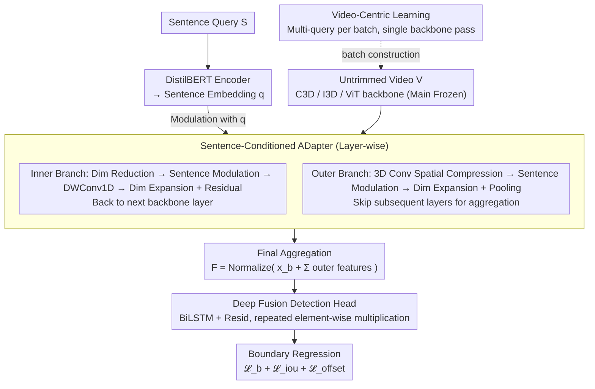

# A Paradigm Shift: Fully End-to-End Training for Temporal Sentence Grounding in Videos

**Conference**: CVPR 2024  
**arXiv**: [2404.02860](https://arxiv.org/abs/2604.02860)  
**Code**: Coming Soon  
**Area**: Model Compression  
**Keywords**: Temporal Sentence Grounding, End-to-End Training, Sentence-Conditioned Adapter, Vision-Language Alignment, TSGV

## TL;DR
Proposes the first fully end-to-end temporal sentence grounding (TSGV) framework that dynamically modulates visual features by injecting sentence embeddings into intermediate backbone layers via a Sentence-Conditioned ADapter (SCADA), while accelerating training with a video-centric learning strategy to outperform SOTA on Charades-STA and ActivityNet.

## Background & Motivation

**Background**: TSGV aims to locate temporal segments in untrimmed videos based on natural language queries. Most existing methods adopt pre-trained video encoders (e.g., C3D/I3D) with frozen features and only train the localization module.

**Limitations of Prior Work**: (1) Video backbones are pre-trained for visual classification, leading to a task mismatch with TSGV; (2) Pre-trained models capture phrase-level objects/actions but struggle with complex natural language semantics; (3) Some methods fail to utilize sentence features during the localization stage, resulting in insufficient cross-modal alignment.

**Key Challenge**: Freezing the backbone prevents features from adapting to TSGV tasks, limiting localization accuracy. However, directly fine-tuning large backbones incurs massive memory overhead and risks catastrophic forgetting.

**Key Insight**: Designing a lightweight adapter to achieve sentence-conditioned backbones while fine-tuning only a minimal number of parameters.

**Core Idea**: SCADA injects sentence embeddings into various backbone layers via internal and external dual branches to achieve sentence-guided visual feature extraction; a video-centric learning strategy allows multiple queries for the same video to share feature extraction, accelerating training.

## Method

### Overall Architecture
The core problem addressed is that previous TSGV methods typically freeze the video backbone, leading to visual features that are misaligned with the task of "finding segments by language." This work bridges the entire pipeline for end-to-end training: sentences are encoded into embeddings via DistilBERT, while video is fed into a backbone (C3D/I3D or ViT) to extract features layer by layer. The backbone is no longer a black box; SCADA adapters are inserted between layers to involve sentence embeddings in modulation while features are still inside the backbone. Features are then aggregated and passed to a BiLSTM detection head with deep sentence modulation to regress temporal boundaries. Video-centric learning groups multiple queries of the same video into one batch, requiring only a single backbone pass. Only the adapters and the detection head are trained while the backbone body remains frozen, achieving E2E benefits while controlling memory and forgetting.

### Key Designs

**1. Sentence-Conditioned ADapter (SCADA): Engaging language in feature extraction inside the backbone**

The limitation is that frozen backbones are pre-trained for classification and only extract "what objects/actions are present" without considering the current query. SCADA inserts a lightweight bypass between backbone layers to modulate visual features using sentence embeddings. It consists of two branches: the Inner Branch reduces dimensionality, applies sentence multiplication modulation, uses Depthwise Separable 1D convolution for temporal context, and expands dimensions with a residual connection back to the next backbone layer, allowing semantics to penetrate the backbone. The Outer Branch uses 3D convolution to compress spatial dimensions and apply sentence modulation, then expands dimensions and pools the result, skipping subsequent layers to aggregate into the final representation. The features are fused as:

$$F = \text{Normalize}\Big(x_b + \sum_{i=1}^{n} x_{outer}^i\Big)$$

where $x_b$ represents backbone trunk features and $x_{outer}^i$ represents query-guided features from various outer branches.

**2. Video-Centric Learning Strategy: Eliminating redundant backbone passes**

The main cost of E2E training comes from backbone forward passes. Since TSGV datasets naturally pair one video with multiple queries, standard sampling repeats backbone extraction for the same video across iterations. Video-centric sampling groups all queries for the same video into a single mini-batch, extracting features once and sharing them. This reduces computation and provides multi-context alignment supervision in a single step.

**3. Deep Sentence Fusion in Detection Head: Retaining language influence during localization**

Unlike methods that discard sentence information in the localization head, this work uses a BiLSTM with residual connections to model temporal dependencies and repeatedly injects sentence embeddings via element-wise multiplication, ensuring deep multi-modal coupling until the final boundary prediction.

### Loss & Training
The total loss is $\mathcal{L} = \mathcal{L}_b + \mathcal{L}_{iou} + \mathcal{L}_{offset}$: $\mathcal{L}_b$ is the boundary probability loss (balanced BCE), $\mathcal{L}_{iou}$ includes classification and L2 regression terms for interval overlap, and $\mathcal{L}_{offset}$ uses Smooth L1 for boundary offset regression.

## Key Experimental Results

### Main Results

| Backbone | Method | Charades R1@0.5 | Charades R1@0.7 | ActivityNet R1@0.5 | ActivityNet mIoU |
|----------|------|-----------------|-----------------|--------------------|----|
| C3D | MS-2D-TAN | 41.10 | 23.25 | 46.16 | - |
| C3D | APGN | 48.20 | 29.37 | - | - |
| C3D | **Ours** | **50.44** | - | - | - |
| I3D | PGSR, etc. | ~53 | ~30 | ~48 | ~48 |
| I3D | **Ours** | **Best Rank1** | **Best Rank1** | **Leading** | **Leading** |

Charades-STA: R1@0.5 = **48.1%** (ViT), ActivityNet: R1@0.5 = **30.5%**.

### Ablation Study

| Configuration | Charades R1@0.5 | Description |
|------|-----------------|------|
| Frozen backbone (baseline) | Base | Standard frozen paradigm |
| E2E Full Fine-tuning | +Significant Gain | Validates E2E effectiveness |
| + SCADA | +Further Gain | Value of sentence conditioning |
| + Video-Centric Learning | Faster Training | Reduces redundant computation |
| w/o Outer Branch | Decrease | Importance of multi-scale features |
| w/o Inner Branch | Decrease | Importance of layer-wise modulation |

### Key Findings
- E2E training brings an **average gain of 16%** compared to frozen baselines across different backbones and datasets.
- SCADA significantly improves I3D backbone performance on Charades R1@0.5 from ~38 to ~53.
- The potential of ViT as a video encoder for TSGV is explored for the first time.
- Video-centric learning accelerates training several times over depending on the number of queries per video.

## Highlights & Insights
- **Systematic Validation of E2E Paradigm**: Systematically validates the value of E2E training for TSGV across C3D/I3D/ViT backbones, challenging the assumption that frozen backbones are sufficient.
- **Clever SCADA Design**: The dual-branch structure ensures sentence information affects internal backbone processing while providing skip connections, achieving deep fusion with minimal parameters.
- **Utility of Video-Centric Learning**: A high-return engineering optimization that leverages the "one video, many queries" nature of TSGV datasets.

## Limitations & Future Work
- Currently validated only on Charades-STA and ActivityNet; other datasets (TACoS, DiDeMo) remain to be explored.
- SCADA placement and quantity are manually set; remains to be seen if optimal configurations can be automatically searched.
- Comparison with Video LLM methods (e.g., D2VLM R1@0.5=50.30) is not yet exhaustive.
- Training time and memory overhead for ViT backbones are not detailed.

## Related Work & Insights
- **vs 2D-TAN/APGN**: These freeze the backbone; this work proves E2E is a superior paradigm.
- **vs Video LLMs**: While LLMs use instruction tuning to predict timestamps, this method achieves comparable results without the overhead of an LLM.
- **vs Other Adapters**: Unlike LoRA, SCADA is specifically designed for cross-modal conditioning.

## Rating
- Novelty: ⭐⭐⭐⭐ SCADA design is innovative; E2E validation is high-value.
- Experimental Thoroughness: ⭐⭐⭐⭐ Extensive backbones and ablations, though dataset coverage could be wider.
- Writing Quality: ⭐⭐⭐⭐ Clear motivation and comprehensive methodology.
- Value: ⭐⭐⭐⭐ Provides a new training paradigm reference for the TSGV field.

<!-- RELATED:START -->

## Related Papers

- [\[ICML 2026\] End-to-End Compression for Tabular Foundation Models](../../ICML2026/model_compression/end-to-end_compression_for_tabular_foundation_models.md)
- [\[ICML 2026\] Towards Resource-Efficient LLMs: End-to-End Energy Accounting of Distillation Pipelines](../../ICML2026/model_compression/towards_resource-efficient_llms_end-to-end_energy_accounting_of_distillation_pip.md)
- [\[CVPR 2026\] Mitigating The Distribution Shift of Diffusion-based Dataset Distillation](mitigating_the_distribution_shift_of_diffusion-based_dataset_distillation.md)
- [\[CVPR 2026\] CORE: Compact Object-centric REpresentations as a New Paradigm for Token Merging in LVLMs](core_compact_object-centric_representations_as_a_new_paradigm_for_token_merging_.md)
- [\[CVPR 2026\] HTTM: Head-wise Temporal Token Merging for Faster VGGT](httm_head-wise_temporal_token_merging_for_faster_vggt.md)

<!-- RELATED:END -->
