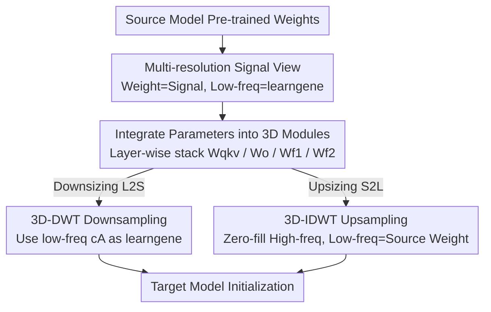

# A Unified Framework for Knowledge Transfer in Bidirectional Model Scaling

**Conference**: CVPR 2026  
**Paper**: [CVF Open Access](https://openaccess.thecvf.com/content/CVPR2026/html/Shen_A_Unified_Framework_for_Knowledge_Transfer_in_Bidirectional_Model_Scaling_CVPR_2026_paper.html)  
**Code**: Not disclosed (Not provided in the paper)  
**Area**: Model Compression / Knowledge Transfer / Efficient Pre-training  
**Keywords**: Cross-architecture initialization, Wavelet Transform, learngene, Model expansion, Model compression  

## TL;DR
BoT treats neural network weights as "continuous signals," where models of different sizes are simply discretized versions of the same signal at different resolutions. By applying 3D Discrete Wavelet Transform (DWT) for downsampling to achieve Large-to-Small (L2S) transfer and Inverse DWT (IDWT) with zero-padded high frequencies for upsampling to achieve Small-to-Large (S2L) transfer, it introduces the first **training-free, zero-parameter** framework that unifies cross-architecture knowledge transfer in both directions. It saves up to 67.1% of pre-training FLOPs on DeiT, BERT, and GPT.

## Background & Motivation
**Background**: Current practices rely on transferring weights from "model zoos" of fixed sizes (e.g., -Base / -Large). However, the pre-train + fine-tune paradigm requires that knowledge transfer predominantly works only when the **source and target architectures are identical**. When model dimensions differ, transferring existing knowledge becomes significantly challenging.

**Limitations of Prior Work**: Practical requirements for this task exist in two directions. First, **S2L (Small-to-Large)**: Driven by Scaling Laws, larger models must be trained, but training from scratch is computationally expensive; ideally, one should reuse small model knowledge to accelerate large model convergence. Second, **L2S (Large-to-Small)**: Large models are costly for inference and memory-intensive, requiring their generalized knowledge to be compressed into resource-constrained small architectures. Existing methods treat these as **two incompatible problems**: S2L is viewed as "parameter synthesis" (e.g., layer copying like bert2BERT or trainable mappings like LiGO/Mango, requiring extra training overhead), while L2S is viewed as "parameter selection" (e.g., Weight Selection, which heuristically samples weight subsets).

**Key Challenge**: This fragmentation results in a plethora of specialized, ad-hoc tools, obscuring the fact that **S2L and L2S are essentially the same "bidirectional model scaling" problem**. The learngene paradigm provides a theoretical perspective: pre-trained models contain a concentrated "knowledge gene" decoupled from specific architectural dimensions. If this gene can be isolated, models of any size could inherit it. Thus, the question becomes: **How can this size-agnostic learngene be materialized such that a single mechanism addresses both S2L and L2S?**

**Key Insight**: The authors observe that the parameter space of high-performing models is not random but highly structured, lying on a low-dimensional manifold. They **hypothesize** that this underlying "signal" represents transferable generalized knowledge, with the **fundamental low-frequency spectrum acting as the learngene**. Due to limited capacity, small models are forced to capture only low-resolution global approximations (like a blurry thumbnail); large models possess the capacity to supplement this with high-resolution, task-specific details.

**Core Idea**: Since models of different sizes are simply different resolution discretizations of the same signal, **L2S = Downsampling** and **S2L = Upsampling**. By applying the dual DWT/IDWT pair from signal processing and utilizing the recursive multi-resolution property—where decomposition levels serve as dynamic scaling factors—the framework transfers learngenes across arbitrary sizes without training.

## Method

### Overall Architecture
BoT is a **training-free framework with zero extra parameters** for cross-architecture initialization. Given pre-trained source model weights, it outputs a well-initialized target model (either larger or smaller) ready for continued pre-training or downstream fine-tuning. The pipeline consists of three steps: first, integrate many 2D weight matrices from the source model into **3D weight modules** to provide structured input for the wavelet transform; then, follow two symmetrical branches depending on the transfer direction—for L2S, perform **3D-DWT downsampling** and use the low-frequency approximation subband as the learngene to initialize the small model; for S2L, treat the small model weights as the learngene for the low-frequency component, zero-pad the seven high-frequency detail subbands, and perform **3D-IDWT upsampling** to reconstruct the large model. The entire process contains no learnable parameters, relying solely on the reversible DWT/IDWT pair.

The key to a unified mechanism for both directions lies in the **duality of decomposition and reconstruction** inherent to wavelet transforms: DWT decomposes a signal into one low-frequency approximation subband $cA$ and seven high-frequency detail subbands (in 3D, by applying low-pass/high-pass filters and downsampling along three axes), while IDWT synthesizes these subbands back into the original signal. Crucially, **IDWT can synthesize a full-sized output even when high-frequency details are zero**, providing the mathematical basis for "growing" a larger model in S2L.

### Key Designs

**1. Multi-resolution Signal View: Weights as Continuous Signals where Low-freq = learngene**

Previous methods focused on moving weights within the "parameter space" (copying, mapping, sampling), always hindered by the need to align source and target dimensions. BoT changes the perspective: since high-performing parameters lie on a low-dimensional manifold, weights are viewed as a **continuous signal**, where models of different sizes are merely discrete samplings of this signal at different resolutions. This perspective transforms the discrete engineering problem of "dimension mismatch" into a standard **sampling** problem from signal processing. Furthermore, low-frequency components are equated to the size-invariant "learngene," while high-frequency details are equated to task-specific details only large models can afford. This allows the **wavelet decomposition level** to act as a continuous "scaling factor," supporting transfer between **arbitrary sizes** rather than restricted integer multiples (e.g., 2x, 4x).

**2. Integrating Parameters into 3D Modules: Structured Input for 3D-DWT**

Wavelet transforms are applied in 3D, but Transformer weights are typically 2D matrices. Applying transforms individually would lose inter-layer structure and prevent scaling along the "depth" dimension. BoT **groups weights by function and stacks them across layers**: for a source model with $L_{src}$ layers, 2D weight matrices with the same function are stacked along the depth dimension into a 3D tensor. For instance, all query/key/value projection weights are stacked into a module $W_{qkv}$, output projections into $W_{o}$, and the two FFN layers into $W_{f1}, W_{f2}$. The source parameters are organized as:

$$\Theta_{src} = \{W_{qkv}, W_o, W_{f1}, W_{f2}\} \in \mathbb{R}^{L_{src}\times d_{in,src}\times d_{out,src}}$$

The three axes of the 3D tensor correspond to "Depth × Input Dim × Output Dim," allowing the wavelet to **simultaneously scale network depth and width**.

**3. L2S via 3D-DWT Downsampling: Distilling Large Models into Compact learngenes**

To downsize a model, BoT applies **3D-DWT** to each integrated source module $W_{src}$. A decomposition level (scaling factor $f$, usually $f=2$ per level) is selected such that the dimension of the resulting low-frequency subband **exactly matches** the target small model's dimensions. 3D-DWT applies low-pass filtering and downsampling along three axes, yielding one low-frequency approximation subband:

$$cA = \mathcal{L}_k(\mathcal{L}_j(\mathcal{L}_i(W)))$$

(where $\mathcal{L}$ is the low-pass operator acting on axes $i,j,k$) and seven high-frequency detail subbands $\{cD_m\}_{m=1}^{7}$. BoT **discards high frequencies and inherits only the low-frequency** $cA$ as the learngene to initialize the target small model ($W_{tgt}=cA_{src}$). Unlike Weight Selection, which **samples subsets** and breaks established parameter dependencies, wavelet downsampling is a **smooth compression** of the overall structure, preserving coherent knowledge.

**4. S2L via 3D-IDWT Upsampling: Zero-filling for Model Expansion**

Conversely, to expand a model, BoT uses the integrated small model weights $W_{src}$ as the learngene, **placing it in the low-frequency approximation slot** for IDWT (setting $cA = W_{src}$), while setting all seven high-frequency detail subbands to **zero**. 3D-IDWT is then used to synthesize weights matching the large model dimensions:

$$W_{tgt} = \text{IDWT}_{3D}(W_{src}, O_1, \dots, O_7)$$

where $\{O_i\}_{i=1}^{7}$ are zero tensors of appropriate shapes. The mathematical property that IDWT can synthesize a full-sized output from low-pass components means the large model begins on a **stable foundation composed entirely of the source model’s learned representations**, leaving high-frequency details to be filled by subsequent training. Compared to bert2BERT (neuron copying/splitting) or LiGO/Mango (trainable mappings), BoT is **completely training-free and one-time**, reducing implementation complexity.

### Case Study: DeiT-S (6 layers) ↔ DeiT-B (12 layers) 
- **L2S (B→S)**: Stacks DeiT-B's weights into four 3D modules (depth dim=12); applies one-level 3D-DWT ($f=2$); the $cA$ subband dimensions match DeiT-S (depth dim=6, width halved); initializes DeiT-S using $cA$. It achieves 70% accuracy using only 39.0% of the training FLOPs compared to training from scratch.
- **S2L (S→B)**: Uses DeiT-S 3D modules as the learngene in the IDWT low-frequency slot; zero-pads high frequencies; IDWT synthesizes the 12-layer DeiT-B. It shows a steeper convergence curve, achieving the 80.8% target accuracy with a 22.0% FLOPs saving.

## Key Experimental Results

### Main Results: Pre-training FLOPs Savings Across Architectures
Evaluated on Vision (DeiT), Encoder (BERT), and Decoder (GPT). The metric is **FLOPs Saving Ratio** $r=\frac{\phi_{scratch}-\phi'}{\phi_{scratch}}$, representing the reduction in computation compared to training from scratch to reach target performance $M$.

| Architecture | Direction | Target Performance | BoT FLOPs Saved | Gain over strongest baseline |
|--------------|-----------|-------------------|------------------|-----------------------------|
| BERT | S2L (S→B) | Same MLM loss | **67.1%** | +22.2% vs LiGO/Mango |
| GPT  | S2L (S→B) | Same GEN loss | **58.3%** | +10.4% vs LiGO/Mango |
| BERT | L2S (B→S) | Same MLM loss | **52.8%** | +19.8% vs WS |
| GPT  | L2S (B→S) | Same GEN loss | **31.0%** | +24.1% vs WS |
| DeiT | L2S (B→S) | 70% acc | 39.0% | Outperforms KD, WS |
| DeiT | S2L (S→B) | 80.8% acc | 22.0% | +11.4% vs LiGO, +5.3% vs Mango |

### Direct Downstream Fine-tuning (No Extra Pre-training)
Testing initialization quality by **directly** fine-tuning on downstream tasks.

DeiT Accuracy on Seven Datasets (Excerpt):

| Setup | Method | C100 | CUB | Cars |
|-------|--------|------|-----|------|
| L2S (DeiT-S) | Scratch | 66.5 | 27.3 | 23.8 |
| L2S (DeiT-S) | WS | 75.2 | 57.7 | 72.1 |
| L2S (DeiT-S) | **BoT** | 75.3 | **61.3** | **74.6** |
| S2L (DeiT-B) | Mango | 82.3 | 73.7 | 87.2 |
| S2L (DeiT-B) | **BoT** | **82.4** | **74.1** | **88.6** |

On BERT (GLUE/SQuAD), BoT L2S achieves an average GLUE score of 70.29 (+9.39% vs WS) and SQuAD score of 48.25 (**over double** WS's 21.28).

### Ablation Study: Choice of Wavelet Family
Evaluating validation loss after fixed steps for various wavelet bases.

| Configuration | Optimal Wavelet | Conclusion |
|---------------|-----------------|------------|
| BERT L2S (B→S) | Haar | Encoder compression prefers simplest, piecewise constant wavelets. |
| BERT S2L (S→B) | bior6.8 | Encoder **expansion** prefers higher vanishing moments and smoothness. |
| GPT L2S (B→S) | coif3 | Decoders generally prefer compactly supported wavelets. |
| GPT S2L (S→B) | db2 | Short filters are more suitable for decoders. |
| All Four | — | **Any** wavelet initialization significantly outperforms Scratch. |

### Key Findings
- **S2L yields the highest contribution**: FLOPs savings in S2L (67.1% / 58.3%) are notably higher than in L2S (52.8% / 31.0%), highlighting the efficiency of growing models from low-frequency foundations and surpassing trainable mapping methods.
- **Optimal wavelets vary by architecture/direction**: There is no "universal" wavelet, but the choice is a second-order factor—the mechanism of multi-resolution transfer itself provides the primary gain.
- **Compute savings without performance loss**: BoT achieves significant wall-time and FLOPs savings while matching or exceeding the final downstream scores of LiGO/Mango.
- **Visual evidence of structure inheritance**: BoT preserves the strong diagonal self-attention patterns found in pre-trained models; CAM visualizations show BoT models focus on salient local features from the start, explaining its superiority in fine-grained tasks like CUB and Cars.

## Highlights & Insights
- **Unified Perspective**: Recasting model scaling as signal up/downsampling allows S2L and L2S to share a mathematical foundation, turning discrete engineering challenges into standard signal processing problems.
- **Practicality**: The training-free, zero-parameter nature makes BoT "plug-and-play," avoiding the overhead of training mappers or teacher inference (as in KD).
- **3D Integration**: Stacking function-specific weights into 3D tensors is a crucial technique that enables simultaneous scaling of depth and width.
- **Theoretical Grounding**: The "learngene = low-frequency" hypothesis provides a clear, verifiable bridge between knowledge transfer and signal analysis.

## Limitations & Future Work
- **Dependence on Low-frequency Assumption**: The framework assumes low-frequency spectra represent transferable genes. This holds for homogeneous Transformers but might differ for heterogeneous architectures.
- **Discrete Scaling Constraints**: Scaling factors are typically power-of-two due to standard DWT levels. Precise alignment for arbitrary ratios may require padding/cropping.
- **Wavelet Selection**: Optimal wavelets currently depend on empirical rules for different architectures and directions.
- **Zero-filling High Frequencies**: While stable, filling higher frequencies with zeros is naive. Filling them with smarter priors from the source model could further accelerate convergence.

## Related Work & Insights
- **vs Weight Selection (WS, L2S)**: WS uses heuristic sampling which breaks dependencies; BoT uses smooth DWT downsampling, resulting in higher quality (+19.8% FLOPs saved on BERT).
- **vs bert2BERT (S2L)**: Neuron copying in bert2BERT limits initial diversity; BoT's synthesized foundation converges faster.
- **vs LiGO / Mango (S2L)**: Trainable mappings introduce complexity; BoT is purely training-free while delivering superior FLOPs savings.
- **vs Frequency Pruning**: While previous work used spectral transforms within a single model architecture, BoT is the **first to apply 3D wavelets for cross-architecture initialization**.

## Rating
- Novelty: ⭐⭐⭐⭐⭐ 
- Experimental Thoroughness: ⭐⭐⭐⭐ 
- Writing Quality: ⭐⭐⭐⭐⭐ 
- Value: ⭐⭐⭐⭐⭐ 

<!-- RELATED:START -->

## Related Papers

- [\[CVPR 2026\] OneSparse: A Unified Framework for Sparse Activation Layers in Vision Models](onesparse_a_unified_framework_for_sparse_activation_layers_in_vision_models.md)
- [\[CVPR 2026\] WPT: World-to-Policy Transfer via Online World Model Distillation](wpt_world-to-policy_transfer_via_online_world_model_distillation.md)
- [\[CVPR 2026\] Towards Unified Human Perception and Machine Understanding: Token Flow Guided Compression Framework](towards_unified_human_perception_and_machine_understanding_token_flow_guided_com.md)
- [\[CVPR 2026\] Decompose, Mix, Adapt: A Unified Framework for Parameter-Efficient Neural Network Recombination and Compression](decompose_mix_adapt_a_unified_framework_for_parameter-efficient_neural_network_r.md)
- [\[ICLR 2026\] ODESteer: A Unified ODE-Based Steering Framework for LLM Alignment](../../ICLR2026/model_compression/odesteer_a_unified_ode-based_steering_framework_for_llm_alignment.md)

<!-- RELATED:END -->
