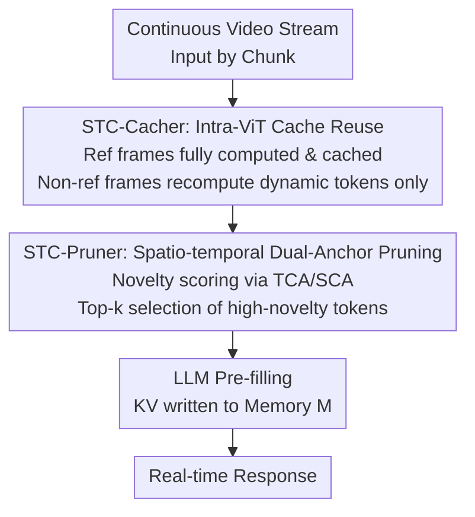

# Accelerating Streaming Video Large Language Models via Hierarchical Token Compression

**Conference**: CVPR 2026  
**Paper**: [CVF Open Access](https://openaccess.thecvf.com/content/CVPR2026/html/Wang_Accelerating_Streaming_Video_Large_Language_Models_via_Hierarchical_Token_Compression_CVPR_2026_paper.html)  
**Code**: https://github.com/lern-to-write/STC  
**Area**: Model Compression / Video Understanding  
**Keywords**: Streaming Video Understanding, Token Compression, ViT Cache Reuse, KV Prefill Acceleration, Plug-and-play

## TL;DR
To address the slow real-time deployment of streaming Video Large Language Models (Streaming VideoLLM), this paper proposes STC, a plug-and-play two-level token compression framework. STC-Cacher caches and reuses static features from adjacent frames during the ViT encoding stage, recomputing only dynamic tokens. STC-Pruner utilizes "spatio-temporal dual anchors" to prune redundant tokens before entering the LLM. STC maintains approximately 99% accuracy on ReKV while reducing ViT encoding latency by 24.5% and LLM pre-filling latency by 45.3%.

## Background & Motivation

**Background**: VideoLLMs demonstrate strong performance in video understanding. Scenarios such as live commentary and AR glasses have given rise to the demand for "Streaming Video Understanding" (SVU), where models must continuously process sequentially arriving video frames and respond in real-time with minimal latency. Existing methods primarily accelerate via two paths: token compression (reducing visual tokens before or inside the LLM) and KV cache compression (evicting unimportant KV pairs during decoding).

**Limitations of Prior Work**: Almost all these methods focus optimization on the LLM side while overlooking the actual bottleneck in streaming scenarios: the **visual encoder (ViT)**. Streaming video requires denser sampling (0.5 fps in this paper), and every frame must independently pass through the ViT. Repetitive ViT forward passes dominate the latency "before the tokens even enter the LLM." Empirical tests show that ViT encoding time for video understanding is 2-3 times that of image understanding; LLaVA-OV processing a 32-frame video generates $32 \times 196 = 6272$ visual tokens for LLM pre-filling, whereas image tasks typically involve only about 1900 tokens—the tripled sequence length directly drags down latency.

**Key Challenge**: Two characteristics of streaming scenarios render existing compression strategies ineffective. First is **temporal redundancy during encoding**: adjacent frames are almost identical. The paper measures a cosine similarity as high as 0.85 for adjacent frame features in deep ViT layers (e.g., layer 20) in streaming video, compared to only 0.60 in offline video. However, most compression methods only operate on final token representations and do not touch the ViT. A few methods like ToMe, which perform token merging within ViT layers, destroy the encoding and lead to significant performance drops. Second is **causal constraints**: in a streaming setting, the model cannot see the complete video nor know the user instructions in advance. Methods relying on global video features for token selection or pruning based on query relevance are inapplicable here.

**Goal / Core Idea**: Design a **causal, query-agnostic, and future-agnostic** compression framework to simultaneously eliminate ViT encoding redundancy and reduce LLM context length. The core idea is a hierarchical two-pronged approach: "cache and reuse static, recompute only dynamic" at the ViT stage, and "prune redundancy by spatio-temporal novelty" at the LLM stage. The entire system is plug-and-play for existing VideoLLMs without requiring retraining.

## Method

### Overall Architecture
STC (Streaming Token Compression) segments a continuous video stream into chunks for processing. It inserts two complementary compressors into the standard pipeline of "ViT Encoding $\rightarrow$ Projection $\rightarrow$ LLM Pre-filling (KV writing to Memory)":

- **STC-Cacher** (embedded **inside ViT**): Caches features of "static tokens" that are nearly invariant over time and reuses them, recomputing only truly changing "dynamic tokens." This eliminates repetitive ViT forward passes to address **temporal redundancy at the encoding stage**.
- **STC-Pruner** (positioned **after ViT, before LLM**): Before the visual token sequence enters the LLM, it uses two anchors—"historical context" and "current frame context"—to score the novelty of each token. Tokens redundant to both history and the current frame are pruned to shorten the pre-filling sequence, addressing **long-context redundancy in LLM pre-fill** (where self-attention is $O(N^2)$).

Both modules are query-agnostic and future-agnostic, naturally satisfying streaming causal constraints. They can be used independently or in combination without modifying the backbone or retraining.

### Key Designs

**1. STC-Cacher: Reference Frame Caching + Selective Recomputation, Eliminating ViT Temporal Redundancy**

Adjacent streaming frames contain significant repetitive content (static backgrounds), yet each frame is typically processed independently through the full ViT. STC-Cacher introduces two hyperparameters: **Cache Interval $N$** and **Cache Reuse Rate $R_{Cacher}$**. A full forward pass is performed for **reference frames**, and intermediate representations $C^l_{ref} = \{K^l_{ref}, V^l_{ref}, A^l_{ref}, M^l_{ref}\}$ (Key, Value, Attention output, MLP output) are cached at each ViT layer. For subsequent **non-reference frames**, the cosine similarity between the current Key projection and the cached reference Key is calculated:

$$S_f = \frac{K^l_{curr,f} \cdot K^l_{ref}}{\|K^l_{curr,f}\| \|K^l_{ref}\|}$$

The top-$k$ tokens with the lowest similarity (highest $1-S_f$) are selected as the "dynamic set" $I_f$, where $k = \lfloor T \cdot r \rfloor$ and $r$ depends on $R_{Cacher}$. Only Query/Value ($Q^l_{sel,f}, V^l_{sel,f}$) are computed for dynamic tokens. The full Key/Value is initialized using the cached reference and then updated by scattering the newly computed tokens. Attention is calculated using only the selected Queries with the full concatenated Keys/Values. Finally, the attention output is scattered back into the cached $A^l_{ref}$ and passed to the MLP. This preserves encoding structure without discarding tokens, saving computation while maintaining temporal integrity.

**2. STC-Pruner: Spatio-temporal Dual-Anchor Novelty Scoring, Eliminating LLM Pre-fill Redundancy**

STC-Pruner identifies token importance via **"dual novelty"** relative to history and the current frame. It establishes two anchors: the **Temporal Context Anchor (TCA)** $a_{temporal} = \frac{1}{|H|} \sum_{h \in H} h$, which is the mean of the history buffer $H$ (mean token vectors of the past $W$ frames), representing "what happened recently"; and the **Spatial Context Anchor (SCA)** $a_{spatial} = \frac{1}{N} \sum_{i=1}^{N} z_i$, the mean of all tokens in the current frame, representing the "global background of this frame." The novelty score for each token $z_j$ is calculated as (using cosine distance $d_{cos} = 1 - \text{sim}$):

$$S(z_j) = \alpha \cdot d_{cos}(z_j, a_{temporal}) + (1-\alpha) \cdot d_{cos}(z_j, a_{spatial})$$

Tokens deviating most from both history and the current background are considered most "novel" and information-rich. Given a pruning rate $R_{Pruner}$, the top-$k$ highest-novelty tokens are retained.

### Loss & Training
STC is a **completely training-free**, plug-and-play framework. No new loss functions are added. Both modules rely on cosine similarity/distance for online decision-making and are integrated into existing VideoLLMs following their original protocols (e.g., 0.5 fps).

## Key Experimental Results

Evaluations cover streaming video understanding (OVO-Bench, StreamingBench) and offline long video understanding (EgoSchema, MLVU-dev, VideoMME). The baseline includes end-to-end online models (Dispider / LiveCC / StreamForest) and the offline-to-online framework ReKV (backbone: LLaVA-OV-7B).

### Main Results

OVO-Bench (Table 1, ReKV framework, Overall score):

| Method | Overall | ViT Enc. Latency | LLM Pref. Latency |
|------|---------|-------------|----------------|
| ReKV (Baseline) | 52.6 | 103.7 | 482.4 |
| +ToMe | 46.4 | 70.5 (↓32%) | 257.8 (↓46.6%) |
| +VisionZip | 47.5 | 103.7 | 258.3 (↓46.5%) |
| +VidCom2 (Prev. SOTA) | 50.4 | 103.7 | 259.1 (↓46.3%) |
| +STC-Pruner | 50.6 | 103.7 | 259.2 (↓46.3%) |
| **+STC-Cacher & Pruner** | **52.0** | **78.3 (↓24.5%)** | **263.7 (↓45.3%)** |

Key Conclusion: Compared to the previous SOTA VidCom2, STC improves by +1.6 on OVO-Bench. Regarding ViT acceleration, STC-Cacher outperforms ToMe by 5.6 points, indicating that "cache reuse" is much more accuracy-friendly than "token merging." STC-Cacher & Pruner maintains approximately 99% of ReKV's accuracy while significantly reducing latency in both stages.

### Ablation Study

STC-Cacher feature reuse (Table 4, OVO-Bench subsets + EgoSchema):

| Configuration | EPM | STU | REC | EgoSchema | Note |
|------|-----|-----|-----|-----------|------|
| Attn Only ($R_{Cacher}=85\%$) | 2.7 | 2.3 | 5.3 | 26.2 | Near collapse |
| MLP Only ($R_{Cacher}=85\%$) | 49.8 | 43.2 | 25.3 | 57.1 | Weaker than combined |
| **Attn + MLP ($R_{Cacher}=75\%$)** | **54.2** | **46.6** | 23.4 | **59.0** | Full strategy |

### Key Findings
- **Cache reuse must include both Attn and MLP paths**: Reusing only the attention path causes scores to collapse. The attention path carries position/context, while the MLP path carries channel/semantic information; both are vital.
- **Key-states are the best baseline for dynamic token identification**: Key states reflect historical relevance and contribution to attention better than other features.
- **Dual anchors are essential**: SCA ignores inter-frame novelty, while TCA ignores intra-frame redundancy. Their combination is most robust for complex reasoning tasks.
- **ViT is the main acceleration battlefield**: STC-Cacher provides 28.4%–34.7% ViT encoding speedup for end-to-end online models.

## Highlights & Insights
- **Heuristically identifies ViT as the bottleneck**: Uses quantitative analysis of latency decomposition and frame similarity to provide a strong motivation for "encoding-first" optimization.
- **Cache Reuse > Token Merging**: By not discarding tokens or destroying the encoding structure, STC-Cacher preserves accuracy far better than ToMe while still saving computation.
- **Query-free Importance Proxy**: Using novelty relative to dual anchors effectively identifies critical tokens without knowing the future or the query, providing a clean solution for causal sequence compression.
- **Plug-and-play**: Online decision-making based on similarity allows for low-cost deployment on existing models without training.

## Limitations & Future Work
- **Hyperparameter dependence**: $N$, $R_{Cacher}$, $R_{Pruner}$, and $\alpha$ are fixed; the framework lacks an adaptive strategy for varying video dynamics.
- **Formula discrepancy**: There is a contradiction between the weighted sum in Formula (8) and the "product" mentioned in the text description of STC-Pruner.
- **Offline performance**: The combination of modules slightly underperforms STC-Pruner alone on offline long videos, suggesting potential cumulative losses.

## Related Work & Insights
- **vs ToMe**: ToMe merges tokens within layers, which speeds up both stages but drops significant accuracy (46.4 on OVO-Bench). STC-Cacher’s "reuse" approach is 5.6 points higher.
- **vs VidCom2**: VidCom2 only accelerates LLM pre-filling and relies on global visibility, making it difficult to satisfy streaming causal constraints. STC accelerates both stages.
- **vs ReKV**: ReKV handles the transition from offline to online via frame-level KV cache, but leaves the ViT encoding cost unaddressed. STC complements this by optimizing the encoder.

## Rating
- Novelty: ⭐⭐⭐⭐
- Experimental Thoroughness: ⭐⭐⭐⭐
- Writing Quality: ⭐⭐⭐⭐
- Value: ⭐⭐⭐⭐

<!-- RELATED:START -->

## Related Papers

- [\[CVPR 2026\] Hybrid Token Compression for Vision-Language Models](hybrid_token_compression_for_vision-language_models.md)
- [\[CVPR 2026\] Rethinking Token Reduction for Large Vision-Language Models](rethinking_token_reduction_for_large_vision-language_models.md)
- [\[CVPR 2026\] UniComp: Rethinking Video Compression Through Informational Uniqueness](unicomp_rethinking_video_compression_through_informational_uniqueness.md)
- [\[CVPR 2026\] Content-Adaptive Hierarchical Hyperprior for Neural Video Coding](content-adaptive_hierarchical_hyperprior_for_neural_video_coding.md)
- [\[NeurIPS 2025\] 4DGCPro: Efficient Hierarchical 4D Gaussian Compression for Progressive Volumetric Video Streaming](../../NeurIPS2025/model_compression/4dgcpro_efficient_hierarchical_4d_gaussian_compression_for_p.md)

<!-- RELATED:END -->
