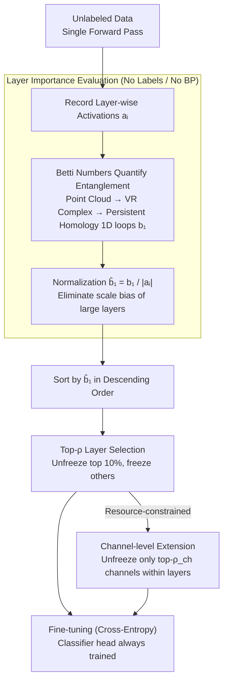

# AdaBet: Gradient-free Layer Selection for Efficient Training of Deep Neural Networks

**Conference**: CVPR2026  
**arXiv**: [2510.03101](https://arxiv.org/abs/2510.03101)  
**Code**: [https://github.com/Nokia-Bell-Labs/efficient_layer_selection](https://github.com/Nokia-Bell-Labs/efficient_layer_selection)  
**Area**: Model Compression  
**Keywords**: Layer Selection, Betti Numbers, Topological Data Analysis, Gradient-free Fine-tuning, Edge Devices, Transfer Learning

## TL;DR
This paper proposes AdaBet, a gradient-free layer selection method based on algebraic topology (the first Betti number $b_1$). By calculating the topological complexity of the activation space of each layer through only a forward pass, it determines which layers require fine-tuning without the need for labels, gradients, or backpropagation. On ResNet50/VGG16/MobileNetV2/ViT-B16, AdaBet achieves higher accuracy than full training with only 10% of layers fine-tuned, while reducing peak memory by approximately 40%.

## Background & Motivation

**Background**: There is a growing demand for fine-tuning deep neural networks on edge devices (smartphones, IoT, embedded systems). However, memory and computational resources on edge devices are extremely limited, making full fine-tuning infeasible.

**Limitations of Prior Work**: (1) Traditional transfer learning freezes most layers and trains only the last few, but this heuristic selection ignores the potential need for intermediate layers to adapt to new tasks. (2) Layer selection methods based on Fisher Information require backpropagation and labeled data, making them unsuitable for unlabeled or privacy-sensitive scenarios. (3) Structured pruning (PruneTrain) and elastic training (ElasticTrainer) reduce computation but still rely on gradient information.

**Key Challenge**: Layer selection requires measuring the "importance" of each layer for a new task. However, existing metrics (Fisher, gradient norms) require backpropagation, which is the primary computational bottleneck. It is logically contradictory to use expensive operations to decide how to save resources.

**Goal**: How to determine which layers most require updates using only a forward pass, without labels, gradients, or backpropagation?

**Key Insight**: Leveraging Topological Data Analysis (TDA) to measure the complexity or entanglement of features in each layer's activation space using its topological structure (specifically, 1-dimensional loops).

**Core Idea**: High $b_1$ (more 1D loops) = entangled activation space manifolds = misalignment between pre-trained features and the new task → update required. Low $b_1$ (fewer loops) = approximately linearly separable = reusable features → freeze.

## Method

### Overall Architecture

AdaBet aims to address a specific question: which layers should be unfrozen when fine-tuning a pre-trained network on an edge device with limited memory? The decision process is divided into two lightweight stages. The first stage is layer importance evaluation, where a batch of unlabeled data undergoes **a single forward pass**. Activations are recorded layer-wise, and a normalized first Betti number $\hat{b}_1$ is calculated as a score for how much each layer needs to adapt. The second stage is layer selection and fine-tuning, where layers are ranked by $\hat{b}_1$ in descending order. The top-$\rho$ proportion (default 10%) with the highest scores are unfrozen for training, while all other layers are frozen. The classification head is always trained. The entire evaluation phase requires no labels, backpropagation, or server-side meta-training, and can run entirely locally on the device.

### Key Designs

**1. Quantifying "Entanglement" via the First Betti Number $b_1$**

The core difficulty of layer selection is judging whether a layer is worth updating without using gradients. AdaBet's solution comes from algebraic topology. For the activation tensor $a_i \in \mathbb{R}^{B \times C \times H \times W}$ of the $i$-th layer, each sample is flattened into a point in $\mathbb{R}^{d}$ ($d = C \times H \times W$), resulting in a point cloud of $B$ points. A Vietoris-Rips complex is constructed over the point cloud, and persistent homology analysis is performed to count the number of 1D loops ($b_1^{(i)}$) that persist across scales. The physical meaning of $b_1$ is the degree of "entanglement" of the activation space manifold. More loops indicate that feature manifolds of different categories are intertwined, making them inseparable by a linear classifier, thus requiring updates to "disentangle" them. Fewer loops signify that activations are already nearly linearly separable and pre-trained weights can be reused. This step only reads forward activations and naturally requires no labels or backpropagation.

This outperforms traditional importance metrics like Fisher Information. Fisher requires backpropagation and labels, which are the exact costs edge devices aim to avoid. Furthermore, Fisher is highly sensitive to batch size and the number of backproportions, leading to significant fluctuations in layer rankings (Fig. 3 in the paper). In contrast, $b_1$ rankings are highly consistent across batches (Kendall-$\tau$ > 0.95, vs Fisher < 0.7), making them more reliable on devices with limited batch capacities.

**2. Normalized Betti Number $\hat{b}_1$: Balancing Importance and Cost**

Directly using $b_1$ for selection introduces bias: larger layers with more parameters and higher activation dimensions naturally accumulate more loops, causing the ranking to favor them. However, large layers are also the most expensive to fine-tune. AdaBet eliminates this scale bias through normalization:

$$\hat{b}_1^{(i)} = \frac{b_1^{(i)}}{|a_i|}, \qquad |a_i| = C \times H \times W$$

The denominator $|a_i|$ is the parameter count of the layer's activations. The normalized value represents the "topological complexity per unit of parameters." The selected layers are thus those that provide the **maximum disentanglement benefit for the minimum cost**. Ablations show that accuracy drops by 1.6–1.8% without normalization, as the budget is wasted on large but non-critical layers.

**3. top-$\rho$ Layer Selection: A Tunable Resource Knob**

With $\hat{b}_1$ rankings, selection involves unfreezing the top $\lceil \rho \times L \rceil$ layers while freezing the rest. $\rho$ acts as a resource knob for the user—set to 5% for extreme constraints or 20% when resources allow, with 10% being optimal across multiple architectures. Notably, unfreezing only 10% often **outperforms 100% full training**. Freezing layers that are already well-aligned naturally prevents catastrophic forgetting and overfitting on small datasets.

**4. Channel-level Extension $\rho_{ch}$: Finer Granularity**

Unfreezing entire layers can still be coarse, as only specific channels within a layer might need adaptation. AdaBet calculates $b_1$ for each channel individually within selected layers and unfreezes only the top-$\rho_{ch}$ proportion of channels. This further reduces trainable parameters. While the implementation is more complex and gains are smaller (~0.3% in ablations), it is a valuable fine-grained option for extremely resource-constrained scenarios.

### Loss & Training

The fine-tuning stage uses standard Cross-Entropy loss. Gradients are not backpropagated through frozen layers. Layer selection is performed once before training and remains fixed, so after the initial forward pass and topological computation, the process is identical to standard fine-tuning.

## Key Experimental Results

### Main Results (Accuracy %)

| Method | ResNet50 Flowers | ResNet50 CIFAR-100 | MobileNetV2 Cars | ViT-B16 CIFAR-100 |
|------|-----------------|-------------------|-----------------|-------------------|
| Full Training | 82.3 | 75.8 | 80.1 | 85.2 |
| Transfer Learning (last layers) | 79.5 | 72.1 | 76.8 | 82.7 |
| PruneTrain | 80.1 | 73.6 | 77.4 | 83.5 |
| ElasticTrainer | 81.2 | 74.3 | 78.9 | 84.1 |
| Fisher-based Selection | 81.8 | 74.9 | 79.2 | 84.6 |
| **AdaBet (ours, ρ=10%)** | **84.5** | **77.4** | **82.8** | **87.1** |

### Resource Efficiency

| Method | Trainable Params (%) | Peak Memory (Rel.) | Training Time (Rel.) |
|------|--------------|----------------|----------------|
| Full Training | 100% | 1.00× | 1.00× |
| Transfer Learning | ~20% | 0.72× | 0.45× |
| Fisher Selection (10%) | 10% | 0.62× | 0.88× (incl. FI calc) |
| **AdaBet (ρ=10%)** | **10%** | **0.60×** | **0.52×** |

### Ablation Study

| Configuration | ResNet50 Flowers | CIFAR-100 |
|------|-----------------|-----------|
| Random Selection (10%) | 80.8 | 73.2 |
| Selection by Parameter Count | 81.1 | 73.8 |
| Without $b_1$ Normalization | 82.9 | 75.6 |
| With $b_1$ Normalization (AdaBet) | **84.5** | **77.4** |
| AdaBet + Channel (ρ_ch=50%) | 84.2 | 77.1 |

### Key Findings
- **$b_1$ Normalization is Crucial**: Accuracy drops by 1.6-1.8% without it, as the model favors large layers over critical small layers.
- **Significantly Superior to Fisher**: AdaBet outperforms Fisher by 2.5%+ with lower total training time (Fisher requires extra BP for information estimation).
- **10% Layer Tuning > 100% Full Training**: While counter-intuitive, this is reasonable; freezing well-aligned layers prevents catastrophic forgetting and overfitting.
- **High Stability of $b_1$ Ranking**: Kendall-τ > 0.95 across batches, compared to τ < 0.7 for Fisher.
- **Strong Generalization**: Effective across CNNs (ResNet50, VGG16, MobileNetV2) and Transformers (ViT-B16).

## Highlights & Insights
- **Topological Interpretation of Adaptation**: Transforming the "which layer to tune" problem into topological feature analysis is a novel and elegant perspective. The intuition of high $b_1$ = manifold entanglement = "disentanglement" needed is compelling.
- **No Labels or Gradients Required**: This is highly valuable for privacy-preserving scenarios (Federated Learning, edge personalization) as devices need not send data/gradients to servers.
- **One-time Decision via Forward Pass**: Layer selection requires only one forward pass. Subsequent training is identical to standard fine-tuning, making it easy to implement.
- **Clever Normalization**: $\hat{b}_1 = b_1/|a_i|$ balances importance and computational cost simultaneously.

## Limitations & Future Work
- The computation of Betti numbers itself incurs costs (Vietoris-Rips construction). Feasibility on large-scale models (e.g., LLaMA) requires further investigation into dimensionality reduction or sampling.
- The $\rho$ ratio is a manually set hyperparameter. Optimal $\rho$ may vary by task, and the method lacks an adaptive selection strategy.
- Validation is limited to classification; performance on detection, segmentation, or generation tasks and unknown.
- The gain from channel-level selection $\rho_{ch}$ is limited (~0.3%) despite significantly increased implementation complexity.
- No comparison with Parameter-Efficient Fine-Tuning (PEFT) methods like LoRA/Adapters, which are also candidates for edge fine-tuning.

## Related Work & Insights
- **vs Fisher Information Selection**: FI requires BP and labels and is batch-sensitive. AdaBet is gradient-free and significantly more stable.
- **vs ElasticTrainer**: ElasticTrainer uses elastic search strategies but still requires gradient information.
- **vs PruneTrain**: PruneTrain performs dynamic pruning during training, whereas AdaBet makes a one-time decision before training.
- **vs LoRA/Adapter**: While LoRA inserts low-rank matrices, AdaBet selectively freezes layers. These could be combined by applying LoRA to layers selected by AdaBet.
- **TDA in DL**: TDA was previously used for analyzing training dynamics and data complexity; AdaBet is the first to use it to guide training strategies.

## Rating
- Novelty: ⭐⭐⭐⭐⭐ First use of algebraic topology for layer selection with elegant intuition.
- Experimental Thoroughness: ⭐⭐⭐⭐ Covered 4 architectures and 4 datasets with full ablations, though PEFT comparisons are missing.
- Writing Quality: ⭐⭐⭐⭐ Clear motivation and convincing visualization of the FI vs. Betti comparison.
- Value: ⭐⭐⭐⭐ Practical for edge fine-tuning with a simple and efficient implementation.

<!-- RELATED:START -->

## Related Papers

- [\[ICLR 2026\] Towards Lossless Memory-efficient Training of Spiking Neural Networks via Gradient Checkpointing and Spike Compression](../../ICLR2026/model_compression/towards_lossless_memory-efficient_training_of_spiking_neural_networks_via_gradie.md)
- [\[CVPR 2026\] Neural Differentiation in Deep Networks: A Theoretical Framework for Expressivity and Representational Diversity](neural_differentiation_in_deep_networks_a_theoretical_framework_for_expressivity.md)
- [\[ICML 2026\] SURGE: Surrogate Gradient Adaptation in Binary Neural Networks](../../ICML2026/model_compression/surge_surrogate_gradient_adaptation_in_binary_neural_networks.md)
- [\[ICLR 2026\] BEP: A Binary Error Propagation Algorithm for Binary Neural Networks Training](../../ICLR2026/model_compression/bep_a_binary_error_propagation_algorithm_for_binary_neural_networks_training.md)
- [\[ICLR 2026\] Robust Training of Neural Networks at Arbitrary Precision and Sparsity](../../ICLR2026/model_compression/robust_training_of_neural_networks_at_arbitrary_precision_and_sparsity.md)

<!-- RELATED:END -->
