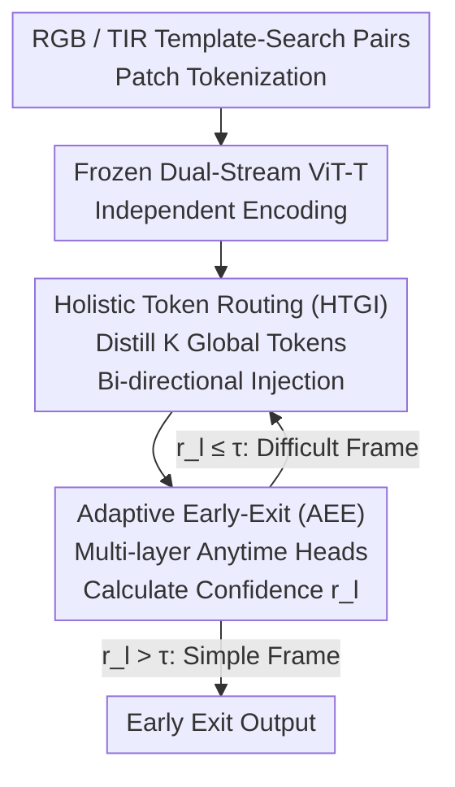

# Adaptive Depth Lightweight RGB-T Tracking with Holistic Token Routing

**Conference**: CVPR 2026  
**Paper**: [CVF Open Access](https://openaccess.thecvf.com/content/CVPR2026/html/Ding_Adaptive_Depth_Lightweight_RGB-T_Tracking_with_Holistic_Token_Routing_CVPR_2026_paper.html)  
**Code**: To be confirmed  
**Area**: Model Compression  
**Keywords**: RGB-T Tracking, Adaptive Early-Exit, Lightweight, Cross-modal Fusion, Dynamic Inference

## TL;DR
ADTrack treats network depth as a dynamically allocatable computational budget. By equipping a frozen dual-stream ViT-T backbone with multi-layer "anytime" prediction heads and a confidence-calibrated early-exit strategy, and employing a minimalist Holistic-Token-Guided Interaction (HTGI) module with only 37.3K parameters for low-cost cross-modal fusion, it achieves 70.2% PR / 56.3% SR on LasHeR. It runs at 148.3 FPS on GPU, 50.2 FPS on CPU, and 28.7 FPS on edge devices.

## Background & Motivation
**Background**: RGB-T tracking utilizes Thermal Infrared (TIR) to compensate for RGB limitations in night, glare, fog, and occlusion scenarios. Recent mainstream shifts have moved from treating TIR as a weak prior or prompt to **dual-branch Transformers + explicit cross-modal interaction** (e.g., TBSI, BAT, STTrack, XTrack). These methods exchange higher accuracy for heavy backbones and stacked global cross-attention/adapters.

**Limitations of Prior Work**: This accuracy comes at the cost of computation. Even without cross-modal interaction, processing two modalities already doubles the computation compared to RGB-only tracking. Adding heavy fusion/alignment blocks further inflates FLOPs, memory usage, and bandwidth, making real-time performance difficult even on high-end GPUs and nearly impossible on resource-constrained edge platforms like UAVs or mobile robots.

**Key Challenge**: The trade-off between accuracy and efficiency. Common practices for compressing multi-modal trackers involve **narrowing the backbone width**, while depth usually remains fixed at generic configurations. The authors observe that in domain-specific tasks like RGB-T tracking with clear priors, the marginal utility of depth diminishes—redundant layers increase latency and energy consumption (and may exacerbate overfitting) without proportional accuracy gains.

**Key Insight**: By visualizing score maps layer-by-layer, the authors found that in deeper layers, maps become highly similar and information saturates early (SSIM / Peak Alignment / Cosine >0.95 in mid-to-deep layers), indicating decision convergence. However, "saturation" does not mean "layers are deletable"—removing any layer from a 12-layer ViT leads to significant performance drops on LasHeR, suggesting each layer is structurally necessary for **building discriminative representations**. The conclusion: depth should be treated as an **optimizable resource** rather than a fixed hyper-parameter, allowing redundant computation to be skipped per-frame while **retaining full model capacity**.

**Core Idea**: Combining "Adaptive Early-Exit" (dynamically deciding which layer to stop at per frame) with "Holistic Token Routing" (mutually guiding modalities using a minimal set of global tokens) allows depth to become a controllable computational budget without structural changes or teacher distillation.

## Method

### Overall Architecture
ADTrack is a dual-stream tracker using **frozen** lightweight ViT-T backbones for both RGB and TIR. Given a template-search pair $(z, c)$, input images are partitioned into patch token sequences $z_{rgb}, c_{rgb}, z_{tir}, c_{tir} \in \mathbb{R}^{N\times D}$, encoded independently. Two core modules are integrated: **HTGI** (Holistic-Token-Guided Interaction) is inserted between specific backbone layers (layers 3/6/9) to distill global tokens for lightweight fusion; **AEE** (Adaptive Early-Exit) attaches "anytime" prediction heads at multiple depths, determining the stopping layer dynamically based on confidence scores. The pipeline: dual-stream encoding → multi-layer HTGI cross-modal guidance → AEE confidence assessment → output score map and bounding box.

During inference, AEE confidence is defined as the ratio of the **maximum response to the sum of all responses** in the intermediate score map. If this exceeds a pre-calibrated threshold $\tau$ (default 0.75), inference terminates immediately—simple frames exit early, while difficult frames proceed deeper.

### Key Designs

**1. Adaptive Early-Exit (AEE): Transforming Depth from a Fixed Hyper-parameter to a Per-frame Budget**

The pain point is that fixed depth consumes the same computation for every frame, even when score maps saturate early for simple cases, yet layers cannot be statically removed without performance loss. AEE attaches lightweight prediction heads at various depths. These heads generate intermediate score maps $S_l$ and **share parameters** with the main decoder, but are jointly optimized to mimic the final convergent behavior. A **self-supervised calibration scheme** defines normalized confidence as:
$$r_l = \frac{\max(S_l)}{\sum_i S_{l,i}}, \quad r^* = \frac{\max(S_L)}{\sum_i S_{L,i}},$$
where $S_L$ is the final layer's score map. The training objective is:
$$L_{AEE} = \sum_l \Big[ L_{pred}(S_l, y) + |r_l - r^*| + M(r_l, r^*, \tau) \Big],$$
where the margin function $M(r_l, r^*, \tau) = (\tau - r_l)_+$ if $r^* > \tau$, otherwise $(r_l - \tau)_+$. The first term ensures localizing ability for each head; the second aligns confidence across depths to force a monotonic increase; the margin term creates a soft boundary around $\tau$. This end-to-end training internalizes "convergence" and "exit boundaries," upgrading early-exit from a heuristic rule to a learned process.

**2. Holistic-Token-Guided Interaction (HTGI): Near-Zero-Cost Cross-modal Guidance**

Heavy cross-modal interactions (cross-attention/adapters) are the primary source of latency and parameters. HTGI is based on the observation that cross-modal dependencies are often **low-rank** and can be carried by a few global descriptors. It proceeds in two steps. **Holistic Token Generator (HTG)**: Given template features $X_t \in \mathbb{R}^{B\times N_t\times C}$, it learns $K$ holistic tokens $H = [h_1,\dots,h_K]$. Instead of simple pooling, it uses a **Token Router** (a lightweight MLP $f_k$) to generate per-patch weights which are element-wise multiplied by features before global summation:
$$h_k = \sum_{i=1}^{N_t} \big( f_k(x_i) \odot x_i \big), \quad k=1,\dots,K,$$
where each token learns a distinct semantic component (structure, thermal signal). **Feature Interaction**: The holistic tokens $H_n$ from one modality are concatenated with the search features $X_m$ of the other and passed through a Transformer block: $Z = \text{TransformerBlock}([H_n : X_m])$. The injected holistic tokens act as **semantic anchors**, diffusing global priors via self-attention. This mechanism reuses existing layers and introduces only 37.3K×3 parameters (<0.2% of the model).

### Loss & Training
The model is trained on VTUAV and LasHeR (1:2 ratio). Each sample contains two 128×128 templates and one 256×256 search image. Training runs for 15 epochs on 8 RTX 4090 GPUs. AdamW is used with an initial learning rate of $1\times10^{-5}$ for the ViT backbone and $1\times10^{-4}$ for others, decaying by 10x after 10 epochs. The backbone is **frozen**, and no teacher distillation is used.

## Key Experimental Results

### Main Results
Comparison with SOTA on LasHeR / RGBT234 (PyTorch FPS):

| Method | Backbone | LasHeR PR | LasHeR SR | RGBT234 MPR | GPU FPS | CPU FPS | Edge FPS |
|------|------|-----------|-----------|-------------|---------|---------|----------|
| **ADTrack (Ours)** | ViT-T | 70.2 | 56.3 | 88.6 | 148.3 | 50.2 | 28.7 |
| CMDTrack-T12 | ViT-T | 67.5 | 55.3 | 84.5 | - | - | - |
| LightFC-T | ViT-T | 64.7 | 50.7 | 83.4 | 35.2 | 7.9 | 7.1 |
| SUTrack-Tiny | HIViT-T | 66.7 | 53.9 | 85.9 | 102.4 | 26.6 | 15.6 |
| TBSI-Tiny | ViT-T | 61.7 | 48.9 | - | 48.9 | 19.3 | 8.8 |
| CAFormer | ViT-B | 70.0 | 55.6 | 88.3 | 63.5 | 8.7 | 7.5 |
| BAT | ViT-B | 70.2 | 56.3 | 86.8 | 62.0 | 5.4 | 5.9 |

ADTrack using ViT-T matches or exceeds ViT-B heavy methods (PR 70.2 vs. BAT, +1.0% over TBSI), while being over 10x faster on CPU. It is the only tracker to achieve **real-time performance across GPU, CPU, and Edge platforms**.

### Ablation Study

HTGI and Template Design (LasHeR):

| Config | PR | NPrec | SR | Description |
|------|------|------|------|------|
| Single template w/o HTGI | 66.3 | 62.2 | 52.7 | Single static template, no interaction |
| w/o HTGI | 66.9 | 63.0 | 53.2 | Late fusion only, no explicit interaction |
| RGB→TIR | 68.2 | 64.5 | 54.3 | Unidirectional routing |
| TIR→RGB | 67.9 | 64.4 | 53.9 | Unidirectional routing |
| Full Model | 70.2 | 66.3 | 56.3 | Bi-directional HTGI + Dual templates |

Early-exit threshold $\tau$ trade-off (LasHeR):

| Threshold τ | PR | SR | GPU FPS | CPU FPS | Description |
|--------|------|------|---------|---------|------|
| 0.65 | 68.6 | 54.7 | 192.0 | 63.5 | Aggressive, lower accuracy |
| 0.70 | 69.7 | 55.9 | 175.6 | 57.9 | |
| **0.75*** | 70.2 | 56.3 | 148.3 | 50.2 | Optimal balance |
| 1.00 | 70.2 | 56.4 | 84.3 | 27.1 | No early-exit |

### Key Findings
- **Bi-directional HTGI is the main driver**: SR increases by 3.1% compared to a baseline without explicit interaction.
- **Early-exit saves 50% computation with negligible loss**: Increasing $\tau$ to 1.0 (disabling AEE) only adds 0.1% SR but slows down the GPU by over 40%.
- **Layers are non-deletable but skippable**: Removing any layer statically causes severe degradation, proving the AEE approach of "skipping redundancy per-frame" is superior to static pruning.

## Highlights & Insights
- **"Depth as Computational Budget" perspective**: The core insight is that for RGB-T tasks, score maps saturate early, but structural depth is still needed for representation. The solution: change the inference path, not the network structure.
- **Normalized confidence as a halting signal**: Using the "peak/sum" ratio of the score map allows for a deterministic halting criterion that inherently describes convergence without extra classification heads.
- **Extreme Efficiency of HTGI**: By compressing modalities into $K$ holistic tokens and reusing self-attention, the module achieves dual-branch interaction with <0.2% additional parameters.

## Limitations & Future Work
- **Threshold τ is a static hyper-parameter**: 0.75 was tuned for specific datasets; whether it needs recalibration for different scenes or can be made adaptive is not explored. ⚠️
- **Backbone Constraints**: The method was validated on a frozen ViT-T; its benefits on larger or trainable backbones remain unverified.
- **Sensitivity to Multi-peak Confidence**: The peak/sum ratio may be unreliable in scenarios with strong distractors (multi-peak response maps). ⚠️

## Related Work & Insights
- **vs. CMDTrack**: CMD uses dual-teacher distillation; ADTrack achieves higher accuracy (PR 70.2 vs 67.5) **without distillation**, relying on self-supervised calibration and dynamic inference.
- **vs. TBSI / BAT**: These rely on heavy cross-attention/adapters. ADTrack achieves comparable accuracy while being 10x faster on CPU due to the HTGI design and early-exit.

## Rating
- Novelty: ⭐⭐⭐⭐
- Experimental Thoroughness: ⭐⭐⭐⭐⭐
- Writing Quality: ⭐⭐⭐⭐
- Value: ⭐⭐⭐⭐⭐

## Related Papers

- [\[AAAI 2026\] Group Orthogonal Low-Rank Adaptation for RGB-T Tracking](../../AAAI2026/model_compression/group_orthogonal_low-rank_adaptation_for_rgb-t_tracking.md)
- [\[CVPR 2026\] Vision-Oriented Lightweight Neural Architecture Search with Budget-Adaptive Evaluation](vision-oriented_lightweight_neural_architecture_search_with_budget-adaptive_eval.md)
- [\[CVPR 2026\] Adapting Lightweight Image-based Counting Models for Video Crowd Counting](adapting_lightweight_image-based_counting_models_for_video_crowd_counting.md)
- [\[CVPR 2026\] Dual-branch Distilled Transformer for Efficient Asymmetric UAV Tracking](dual-branch_distilled_transformer_for_efficient_asymmetric_uav_tracking.md)
- [\[CVPR 2026\] One Layer's Trash is Another Layer's Treasure: Adaptive Layer-wise Visual Token Selection in LVLMs](one_layers_trash_is_another_layers_treasure_adaptive_layer-wise_visual_token_sel.md)

<!-- RELATED:END -->

<!-- RELATED:START -->

## Related Papers

- [\[AAAI 2026\] Group Orthogonal Low-Rank Adaptation for RGB-T Tracking](../../AAAI2026/model_compression/group_orthogonal_low-rank_adaptation_for_rgb-t_tracking.md)
- [\[CVPR 2026\] Dual-branch Distilled Transformer for Efficient Asymmetric UAV Tracking](dual-branch_distilled_transformer_for_efficient_asymmetric_uav_tracking.md)
- [\[CVPR 2026\] Teacher-Guided Routing for Sparse Vision Mixture-of-Experts](teacher-guided_routing_for_sparse_vision_mixture-of-experts.md)
- [\[CVPR 2026\] LiDeRe: A Lightweight Readout for Fast and Data-Efficient Dense Prediction](lidere_a_lightweight_readout_for_fast_and_data-efficient_dense_prediction.md)
- [\[CVPR 2026\] SANER: Switchable Adapter with Non-parametric Enhanced Routing for Person De-Reidentification](saner_switchable_adapter_with_non-parametric_enhanced_routing_for_person_de-reid.md)

<!-- RELATED:END -->
