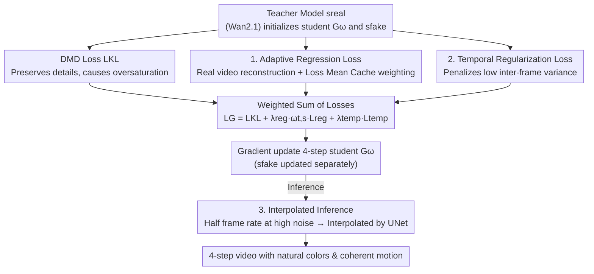

# Adaptive Video Distillation: Mitigating Oversaturation and Temporal Collapse in Few-Step Generation

**Conference**: CVPR 2026  
**Paper**: [CVF Open Access](https://openaccess.thecvf.com/content/CVPR2026/html/You_Adaptive_Video_Distillation_Mitigating_Oversaturation_and_Temporal_Collapse_in_Few-Step_CVPR_2026_paper.html)  
**Code**: https://github.com/yuyangyou/Adaptive-Video-Distillation  
**Area**: Model Compression / Video Diffusion Distillation  
**Keywords**: Video Diffusion, Distribution Matching Distillation, Oversaturation, Temporal Collapse, Few-step Generation

## TL;DR
Addressing the common issues of "color oversaturation + motion collapse" in DMD (Distribution Matching Distillation) for video diffusion models, this paper proposes an adaptive regression loss (using an EMA cache to dynamically down-weight unreliable real samples with high variance) and a temporal regularization loss (directly penalizing low inter-frame variance). Combined with an inference acceleration strategy that reduces the frame rate at high-noise steps and interpolates them back at low-noise steps, the method achieves 4-step generation on Wan2.1-1.3B/14B. The VBench/VBench2 scores surpass all distillation baselines, and user preference even exceeds that of the 50-step teacher model.

## Background & Motivation

**Background**: Video diffusion models offer high quality but require processing tens of thousands of tokens per step over dozens of iterations, resulting in extremely slow inference. Distillation into 1- or 4-step student models is essential for deployment. In image distillation, DMD (Distribution Matching Distillation), which matches the student distribution to the teacher's score field, is widely adopted due to its detail preservation and industrial viability.

**Limitations of Prior Work**: Video distillation methods are scarce, and most directly adapt image distillation techniques. However, DMD's existing issues with oversaturation and mode collapse are severely amplified by the temporal dimension in video: ① **Oversaturation**—teacher scores overemphasize local details, pushing the student toward a sub-optimal distribution of excessively saturated colors, which accumulates frame-by-frame in autoregressive videos; ② **Temporal Collapse**—mode collapse in images manifests as reduced motion or nearly static frames in videos. This "lack of motion" is far more damaging to perceived quality than a drop in spatial diversity.

**Key Challenge**: Intuitively, adding a regression loss with real video supervision should correct these biases. However, if the student simultaneously fits the teacher's distribution while being pulled by real samples distant from the teacher, it converges to an inadequate "middle distribution," causing worse artifacts such as tearing, object fusion, or duplication/disappearance (e.g., Fig. 4: two orange dogs merging at t=2.5s). Supervision must be selective: samples should be trusted or down-weighted based on their reliability.

**Goal**: (1) Correct oversaturation while avoiding middle-distribution artifacts through real data supervision; (2) Explicitly recover motion dynamics to counter temporal collapse; (3) Further reduce inference costs without sacrificing quality.

**Core Idea**: Add two targeted regularizations to DMD: an **Adaptive Regression Loss** that injects real data with weights dynamically assigned by sample reliability, and a **Temporal Regularization Loss** that maximizes inter-frame variance to prevent static outputs. During inference, a decoupled frame interpolation strategy is used to save computation at high-noise steps.

## Method

### Overall Architecture

The method builds upon the two-time-scale framework of DMD2: the student generator $G_\omega$ and an online model $s_{fake}$ (used to estimate student distribution) are both initialized with teacher weights. $s_{fake}$ is updated for multiple steps before each student update. A student update combines three losses:

1.  **Distribution Matching Loss $L_{KL}$** (standard DMD): The student generates video from pure noise and text prompt. The score difference between the teacher $s_{real}$ and the online $s_{fake}$ provides the gradient to pull the student toward the teacher distribution—this provides "detail" but causes oversaturation.
2.  **Adaptive Regression Loss $L_{reg}$**: The student reconstructs real video-prompt pairs from noise. It calculates a regression loss against ground-truth, dynamically weighted by a **Loss Mean Cache** maintained per timestep—this is the primary driver for correcting oversaturation.
3.  **Temporal Regularization Loss $L_{temp}$**: Calculated directly on the videos generated in step 1 (no extra forward pass), penalizing low inter-frame variance—this specifically addresses temporal collapse.

The training pipeline adds only **one extra forward pass** (for the regression reconstruction) per student update. Inference is further accelerated by a decoupled frame interpolation module. The parameters $G_\omega$ are updated by gradient descent on the weighted sum of three losses, while $s_{fake}$ is updated separately with a denoising loss.

### Key Designs

**1. Adaptive Regression Loss: Down-weighting unreliable real samples via EMA cache**

The limitation is that DMD alone causes oversaturation, but adding a standard regression loss $L = \|\hat y - y\|_2^2$ produces tearing or object fusion artifacts because high-gradient points deviate too far from the student's current distribution (Fig. 4). The key insight is to use **per-sample adaptive weighting**: points with higher deviations receive lower weights, ensuring the student learns only from "reliable, alignable" data regions.

The loss is defined as $L = w_{t,s}\,\|\hat\varepsilon_\theta(x_t,t)-\varepsilon\|_2^2$, where $w_{t,s}$ is a weight that varies by timestep $t$ and training iteration $s$. To determine if a sample's loss is excessive, a **Loss Mean Cache** (via EMA) is maintained for each denoising timestep in the few-step schedule:

$$\bar L_{t,s} = \omega\, \bar L_{t,s-1} + (1-\omega)\, L_s$$

The weight is calculated via a Sigmoid function based on the deviation from the cache:

$$w_{t,s} = 1 - \sigma\!\big(k\cdot(L_s - \bar L_{t,s-1})\big),\quad \sigma(x)=\frac{1}{1+e^{-x}}$$

Where $L_s$ is significantly higher than the historical mean (unreliable), $\sigma\to1$ and $w\to0$, effectively ignoring the sample. $k$ is a scale factor (3.0) and $\omega$ is the EMA coefficient (0.95). This allows the student to smoothly approach the real distribution, suppressing oversaturation and mitigating spatial mode collapse. An added benefit is that this branch supports **simultaneous Supervised Fine-Tuning (SFT)** during distillation by using domain-specific data (e.g., animation, ads), allowing the student to learn styles the teacher cannot generate (Fig. 6).

**2. Temporal Regularization Loss: Maximizing variance to prevent motion collapse**

While regression helps spatially, temporal supervision remains weak. In video, mode collapse often results in near-static scenes. The paper directly penalizes low variance along the temporal dimension:

$$L_{temp} = -\log\!\big(\mathbb{E}_{x\sim p_\omega}[\mathrm{Var}(x)] + \vartheta\big)$$

Where $\mathrm{Var}(x)$ is computed across the time dimension and $\vartheta$ is a numerical stability constant. Smaller variance (closer to static) results in higher loss, forcing the student to produce meaningful motion. This is calculated on the videos generated for the distribution matching loss, **adding no extra forward pass**. To prevent the loss from causing jitters after escaping the collapse zone, it is **truncated** once the temporal distribution converges (at approx. 0.6). Ablations show that removing this causes the Dynamic Degree (percentage of videos with meaningful optical flow) to drop by over 10 points compared to DMD.

**3. Decoupled Frame Interpolation Inference: Half frame rate at high noise to save 30% inference**

Even with 4 steps, processing all frames is computationally intensive. The authors observed that high-noise steps primarily handle coarse semantics with minimal inter-frame feature variance (adjacent frames are highly similar), while low-noise steps refine details. Consequently, for a 4-step schedule, the **first two steps (high noise) operate at half the frame rate**. Before the third step, a lightweight, pre-trained **UNet interpolation module** fills in the missing latent sequences. Subsequent low-noise steps then clean up any interpolation artifacts. The UNet is pre-trained on real data using a regression loss to predict intermediate frame features. This reduces inference time by approx. 30% with negligible loss in perceptual quality.

### Loss & Training
The final loss is a weighted sum:
$$L_G = L_{KL} + \lambda_{reg}\, w_{t,s}\, L_{reg} + \lambda_{temp}\, L_{temp}$$
Hyperparameters: AdamW, $lr=2\times10^{-6}$, EMA decay $\omega=0.95$, $k=3.0$, $\lambda_{reg}=2.0$, $\lambda_{temp}=0.05$, CFG scale=5.0. Temporal regularization is truncated once it reaches 0.6. The regression loss is calculated on a cleaned subset of 150,000 high-quality videos. Distributed training across 24 GPUs using Wan2.1-T2V-1.3B/14B as teachers, producing 5-second, 16fps, 832×480 videos.

## Key Experimental Results

### Main Results

Comparison of distillation methods on VBench2 and VBench1. While the 1.3B teacher (50×2 steps) takes 270s, the proposed method (4 steps) takes only 7.8s:

| Model (1.3B) | Steps | Inference Time | VBench2 Total | VBench1 Total |
| :--- | :--- | :--- | :--- | :--- |
| Teacher | 50×2 | 270s | 50.99 | 80.13 |
| DMD\* (baseline) | 4 | 10.8s | 53.63 | 80.66 |
| LCM | 6 | 16.2s | 40.12 | 72.12 |
| DCM | 6 | 16.2s | 51.80 | 73.92 |
| rCM | 4 | 10.8s | 54.03 | 80.15 |
| **Ours** | 4 | **7.8s** | **55.08** | **81.35** |

Similar leads are observed at 14B (Ours VBench2 Total 59.06 vs DMD\* 56.87 and Teacher 52.14). The metric for "Human Fidelity" shows the most significant gain (1.3B: 88.26 vs DMD\* 86.75). User studies (12 annotators, 180 samples) show the method not only beats all baselines but is **preferred over the 50-step teacher**.

### Ablation Study

Starting from the 1.3B DMD baseline (Instance Preservation measures temporal consistency; lower values indicate fusion/splitting):

| Configuration | Steps | Time | Instance Preservation | Dynamic Degree |
| :--- | :--- | :--- | :--- | :--- |
| Teacher | 50×2 | 270s | 92.39 | 85.56 |
| DMD | 4 | 10.8s | 88.88 | 72.22 |
| +TR (Temporal Reg) | 4 | 10.8s | 85.38 | 100.00 |
| +TR+RegLoss (Stdz) | 4 | 10.8s | 83.04 | 78.61 |
| +TR+AdaLoss (Adaptive) | 4 | 10.8s | **92.39** | 99.72 |
| Full+VIF (Interpolation) | 4 | **7.8s** | 91.81 | 97.77 |

### Key Findings
- **Standard regression loss can be counterproductive**: Adding standard RegLoss (+TR+RegLoss) drops Instance Preservation from 85.38 to 83.04, reflecting tearing/distortion artifacts. Replacing it with adaptive weighting boosts it to 92.39, matching the teacher.
- **Temporal Regularization is binary for motion**: DMD's Dynamic Degree is only 72.22. Adding TR pushes it to 100.00, confirming its role in countering temporal collapse.
- **Frame interpolation is nearly "free" acceleration**: Full+VIF reduces time from 10.8s to 7.8s (approx. 30% saving) with negligible drops in Instance Preservation (92.39 $\to$ 91.81) or Dynamic Degree.

## Highlights & Insights
- **Weighting over Supervision**: The key to fixing oversaturation with real data is not the supervision itself, but down-weighting unreliable samples. The per-timestep EMA cache + Sigmoid weighting is a transferable strategy for dual teacher/real-data distillation.
- **Simplicity of Temporal Regularization**: Avoiding complex motion modeling or optical flow, a simple $-\log(\mathbb{E}[\mathrm{Var}(x)]+\vartheta)$ penalty effectively restores motion.
- **Integrated SFT in Distillation**: Since the adaptive regression loss operates on real data, swapping in domain-specific datasets allows SFT and distillation to happen simultaneously, bypassing the traditional two-stage process.
- **Efficiency via Denoising Stages**: Utilizing the observation that high-noise stages possess high inter-frame redundancy, allocating compute resources differently across steps allows for significant speedups without quality loss.

## Limitations & Future Work
- **Hyperparameter Sensitivity**: Parameters such as $k$, $\lambda_{reg}$, $\lambda_{temp}$, and the truncation threshold are empirically determined; their robustness across different teachers or datasets is not fully explored.
- **Dependency on Real Data and Pre-training**: The method requires 150,000 high-quality videos and a pre-trained UNet for interpolation, making it costlier to replicate than pure data-free distillation.
- **Motion Quantity vs. Quality**: Maximizing variance ensures "motion" but not necessarily "semantic correctness." There is a theoretical risk of generating jitter to satisfy the Dynamic Degree metric, though truncation helps.
- **Evaluation Scope**: Validation is primarily based on automated VBench metrics and small-scale user studies; long-video error accumulation remains to be analyzed.

## Related Work & Insights
- **vs DMD / DMD2**: Builds on the DMD2 dual-time-scale framework. While DMD focuses on detail, this method applies surgical regularizations to fix its inherent oversaturation and mode/temporal collapse issues.
- **vs rCM (Consistency Distillation)**: Consistency models offer good mode coverage but often lack fine detail. This method follows the distribution-matching path (preserving detail) and uses regularizations to recover diversity and motion, outperforming rCM in Total metrics.
- **vs Image DMD Improvements**: While other works address oversaturation in images, this paper identifies that video requires unique temporal handling, introducing a temporal variance regularization absent in image-based methods.

## Rating
- Novelty: ⭐⭐⭐⭐ The first DMD distillation specifically designed for video, with a targeted triad of adaptive weighting, temporal variance, and decoupled interpolation.
- Experimental Thoroughness: ⭐⭐⭐⭐ Uses dual benchmarks, two teacher scales, and human studies, though long-video robustness is less explored.
- Writing Quality: ⭐⭐⭐⭐ Effectively identifies and explains the causes of oversaturation and temporal collapse.
- Value: ⭐⭐⭐⭐ High industrial potential due to the 4-step generation, preference over teacher, and 30% inference saving.

<!-- RELATED:START -->

## Related Papers

- [\[CVPR 2026\] Phased DMD: Few-step Distribution Matching Distillation via Score Matching within Subintervals](phased_dmd_few-step_distribution_matching_distillation_via_score_matching_within.md)
- [\[ICLR 2026\] π-Flow: Policy-Based Few-Step Generation via Imitation Distillation](../../ICLR2026/model_compression/pi-flow_policy-based_few-step_generation_via_imitation_distillation.md)
- [\[CVPR 2026\] Mitigating The Distribution Shift of Diffusion-based Dataset Distillation](mitigating_the_distribution_shift_of_diffusion-based_dataset_distillation.md)
- [\[NeurIPS 2025\] Mitigating Semantic Collapse in Partially Relevant Video Retrieval](../../NeurIPS2025/model_compression/mitigating_semantic_collapse_in_partially_relevant_video_retrieval.md)
- [\[CVPR 2026\] Content-Adaptive Hierarchical Hyperprior for Neural Video Coding](content-adaptive_hierarchical_hyperprior_for_neural_video_coding.md)

<!-- RELATED:END -->
