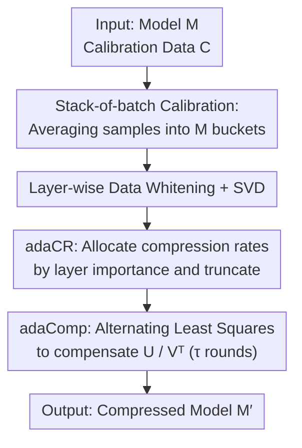

# AdaSVD: Singular Value Decomposition with Adaptive Mechanisms for Large Multimodal Models

**Conference**: CVPR 2026  
**Paper**: [CVF Open Access](https://openaccess.thecvf.com/content/CVPR2026/html/Li_AdaSVD_Singular_Value_Decomposition_with_Adaptive_Mechanisms_for_Large_Multimodal_CVPR_2026_paper.html)  
**Code**: To be open-sourced (Authors committed to releasing code and models)  
**Area**: Model Compression  
**Keywords**: SVD compression, low-rank decomposition, truncation error compensation, adaptive compression rate, large multimodal models  

## TL;DR
AdaSVD utilizes "alternating least squares to compensate for truncated singular matrices" and "adaptive compression rate allocation based on layer importance." These mechanisms significantly reduce accuracy loss in SVD-based Large Multimodal Models (LMMs) under high compression rates (60%+), consistently outperforming SVD-LLM across LLaMA2, OPT, Mistral, and Vicuna.

## Background & Motivation
**Background**: Large Multimodal Models (LMMs) and Large Language Models (LLMs) often possess tens of billions of parameters, making deployment on memory-constrained devices like mobile phones or IoT hardware extremely difficult. Among strategies like quantization, pruning, and low-rank decomposition, **SVD-based low-rank decomposition** is attractive because it decomposes a large weight matrix $W$ into the product of two smaller matrices, requiring **no specialized hardware or custom operators** (unlike quantization). It is cross-platform compatible and orthogonal to quantization and pruning.

**Limitations of Prior Work**: Existing SVD compression methods (e.g., FWSVD using Fisher information weighting, ASVD considering activation distributions, and SVD-LLM using data whitening to relate singular values to compression loss) perform reasonably at low compression rates. However, they **collapse when the compression rate exceeds 60%**, with perplexity surging from double digits to thousands or tens of thousands, and generated content degrading into gibberish.

**Key Challenge**: The authors identify two overlooked factors. First, **lack of compensation after truncation**: when the smallest singular vectors in $U$ and $V^\top$ are removed, the remaining parts should be adjusted to minimize the error, yet existing methods fail to address this rigorously. Second, **uniform compression rates across all layers**: Transformer layers vary drastically in importance (empirical results on OPT-6.7B show a ratio of up to 386× between the most and least important layers). A one-size-fits-all approach inevitably causes excessive loss in critical layers.

**Goal**: (1) Effectively compensate for truncation errors to stably reduce compression loss; (2) Adaptively allocate compression rates across layers under a fixed total compression budget.

**Key Insight**: Reframe "compensating for truncation error" as a solvable least-squares problem (rather than simple inversion) and use the pseudo-inverse to ensure numerical stability. Quantify "layer importance" as the similarity between input and output, then linearly map this to the retention rate of each layer.

**Core Idea**: Replace "truncate and stop" and "uniform compression" with "alternating updates of singular matrices for error compensation (adaComp) + adaptive compression rate allocation (adaCR)" to bridge the performance gap between the compressed and original models.

## Method

### Overall Architecture
AdaSVD is a **post-training, backpropagation-free** SVD compression pipeline. The input is a target model $M$ and a small batch of calibration data $C$; the output is the compressed model $M'$. The process (Algorithm 1) involves: sampling from the calibration set, using **stack-of-batch** to concentrate samples into a fixed number of "buckets" to save GPU memory; performing layer-wise data whitening followed by SVD; determining how many singular vectors to retain via **adaCR** based on layer importance; and finally performing multiple rounds of compensation updates on the truncated $U, V^\top$ using **adaComp** via alternating least squares. The three contributions (stack-of-batch, adaCR, adaComp) address "insufficient calibration data," "how much to compress," and "how to compensate for truncation errors."

### Key Designs

**1. adaComp: Alternating compensation via Least Squares and Pseudo-inverse**

Design Motivation: After SVD decomposes weights as $W=U\Sigma V^\top$, retaining only the top $k$ singular values yields $\widehat{W}=U_k\Sigma_k V_k^\top$. Simple truncation without compensation fails to minimize the error during **actual inference**. The authors define the error based on activations rather than the weights themselves:

$$\mathcal{L}_{\text{SVD}}=\|\widehat{W}X-WX\|_F^2=\|U_k^\sigma (V_k^\sigma)^\top X - WX\|_F^2$$

where $\Sigma_k$ is absorbed into $U_k^\sigma=U_k\Sigma_k^{1/2}$ and $V_k^\sigma=V_k\Sigma_k^{1/2}$. Setting partial derivatives of $U_k^\sigma$ and $V_k^\sigma{}^\top$ to zero yields a closed-form solution involving matrix inversion $\big((V_k^\sigma)^\top XX^\top V_k^\sigma\big)^{-1}$, which is numerically unstable in ill-conditioned cases and amplifies errors.

Mechanism: AdaSVD reformulates the update as **Least Squares Estimation (LSE) with the Moore-Penrose pseudo-inverse**. To update $U_k^\sigma$, let $A=X^\top V_k^\sigma$ and $B=(WX)^\top$, transforming the problem into $\min_{U_k^\sigma}\|A (U_k^\sigma)^\top - B\|_F^2$. SVD is performed on $A=U_A\Sigma_A V_A^\top$, and the closed-form solution is given by the pseudo-inverse:

$$U_k^\sigma=(A^+B)^\top=(V_A\Sigma_A^+ U_A^\top B)^\top$$

where $\Sigma_A^+$ takes the reciprocal only for non-zero singular values ($\sigma_i^{-1}\mathbb{1}_{\sigma_i\neq 0}$), preventing inversion explosion. $V_k^\sigma{}^\top$ is updated similarly using the pseudo-inverse of $U_k^\sigma$. These updates **iterate alternately** $(U_k^\sigma)_1\to(V_k^\sigma{}^\top)_1\to(U_k^\sigma)_2\to\dots$ until convergence. The pseudo-inverse replaces the unstable update curve with a "smooth, monotonically decreasing" one (Fig. 3a), increasing the overlap between compressed and original output distributions from 0.9504 to 0.9980.

**2. Stack-of-batch Calibration: Concentrating samples under memory constraints**

Limitations of Prior Work: adaComp updates depend on calibration data $X$; more samples improve accuracy, but memory constraints limit $X$ to ~32 samples on an 80GB GPU.

Mechanism: To "concentrate" more samples without increasing memory usage, given $N$ calibration samples and a bucket size $M$ (memory limit), samples are shuffled and **averaged** into buckets of size $\text{mini\_bsz}=\lceil N/M\rceil$:

$$X'[k]=\frac{1}{\text{mini\_bsz}}\sum_{i=1}^{\text{mini\_bsz}} X_{\text{rand}}[(k-1)\cdot\text{mini\_bsz}+i]$$

This allows the compensation to utilize statistical information from far more than $M$ samples. This is effective because truncation error compensation relies on the second-order statistics of input activations, which are approximately preserved by averaging.

**3. adaCR: Adaptive compression rate allocation by layer importance**

Design Motivation: Uniform compression ignores layer importance variance (up to 386× in OPT-6.7B, where the first layer is typically critical). Over-compressing important layers degrades overall performance.

Mechanism: AdaSVD measures layer importance by the influence of weights on inputs, specifically the cosine similarity between input $X$ and output $Y=WX$:

$$I(W)=\text{similarity}(X,\,WX),\qquad I_n(W)=I(W)/\text{mean}(I(W))$$

Normalized importance $I_n$ averages to 1. Relative importance is linearly mapped to the **retention rate** of the layer:

$$\text{CR}(W)=\text{mrr}+I_n(W)\cdot(\text{trr}-\text{mrr})$$

where $\text{trr}$ and $\text{mrr}$ are the target and minimum retention rates, respectively. Each layer truncates singular vectors based on $\text{CR}(W_i) = \frac{\#\text{params}(U_k^\sigma)+\#\text{params}(V_k^\sigma{}^\top)}{\#\text{params}(W_i)}$. This allocates more budget to critical layers and less to redundant ones under a **fixed total compression rate**.

### Loss & Training
The method is entirely post-training with no gradient backpropagation. It uses 256 WikiText-2 samples for calibration and initial data whitening (following ASVD/SVD-LLM settings). The number of alternating update rounds $\tau$ is a key hyperparameter: at low compression rates (40/50/60%), **one round outperforms SVD-LLM**, while excessive iterations may lead to overfitting due to limited calibration data. High compression rates (70/80%) benefit from more iterations. All experiments were conducted on a single A100-80GB.

## Key Experimental Results

### Main Results
Performance of LLaMA2-7B at various compression rates (Perplexity↓ is better, Average Accuracy↑ is better):

| Ratio | Method | WikiText-2↓ | PTB↓ | C4↓ | 5-Task Avg. Acc↑ |
|--------|------|------------|------|-----|--------------|
| 0% | Original | 5.68 | 8.35 | 7.34 | 68.85 |
| 40% | SVD-LLM | 16.11 | 719.44 | 61.95 | 40.69 |
| 40% | **AdaSVD** | **14.76** (↓8%) | **304.62** (↓58%) | **56.98** | **42.63** |
| 50% | SVD-LLM | 27.19 | 1,772.91 | 129.66 | 37.83 |
| 50% | **AdaSVD** | **25.58** | **593.14** (↓67%) | **113.84** | **39.17** |
| 60% | SVD-LLM | 89.90 | 2,052.89 | 561.00 | 35.48 |
| 60% | **AdaSVD** | **50.33** (↓44%) | **1,216.95** | **239.18** (↓57%) | **36.87** |

The advantage grows with the compression rate: at 60%, WikiText-2 perplexity drops by 44% and C4 by 57% relative to SVD-LLM.

Cross-model performance (60% compression rate, WikiText-2↓):

| Method | OPT-6.7B | LLaMA2-7B | Mistral-7B | Vicuna-7B |
|------|----------|-----------|------------|-----------|
| SVD | 18,607 | 65,187 | 30,378 | 78,705 |
| FWSVD | 8,570 | 27,213 | 5,481 | 8,186 |
| ASVD | 10,326 | 10,004 | 22,706 | 20,241 |
| SVD-LLM | 92.10 | 89.90 | 72.17 | 64.06 |
| **AdaSVD** | **86.64** (↓6%) | **50.33** (↓44%) | **67.22** (↓7%) | **56.97** (↓11%) |

### Ablation Study
LLaMA2-7B, WikiText-2 Perplexity↓:

| Configuration | 40% | 50% | 60% | Notes |
|------|-----|-----|-----|------|
| AdaSVD (full) | 14.76 | 25.58 | 50.33 | Full model |
| w/o adaComp | 15.47 | 30.00 | 78.82 | No compensation; PPL rises to 78.82 at 60% |
| w/o adaCR | 15.38 | 27.33 | 69.46 | Uniform compression; PPL rises to 69.46 at 60% |
| SVD-LLM (baseline) | 16.11 | 27.19 | 89.90 | Still outperformed by stripped AdaSVD |

### Key Findings
- **adaComp is the primary performance driver**, becoming critical at higher compression rates: at 60%, removing adaComp degrades perplexity from 50.33 to 78.82.
- There is a balance between iterations and calibration data: with limited samples, excessive iterations cause overfitting.
- Layer importance varies significantly (up to 386× for OPT-6.7B). The importance curve for LLaMA is "bowl-shaped," meaning both early and late layers are critical—a finding adaCR exploits.

## Highlights & Insights
- **Reframing truncation compensation as LSE + Moore-Penrose pseudo-inverse** is the key engineering insight. It stabilizes the update curve, a trick applicable to any low-rank compression requiring closed-form updates on ill-conditioned matrices.
- **stack-of-batch** bypasses the memory wall by averaging samples, providing better statistics within constant memory—a simple but practical technique for post-training compression/quantization.
- **Using cosine similarity between input and output** as a proxy for layer importance is gradient-free, Hessian-free, and computationally lightweight, yet captures the core necessity of protecting critical layers.
- adaComp is orthogonal to data whitening, acting as the "last mile" compensation.

## Limitations & Future Work
- Calibration data scale remains a bottleneck: stack-of-batch is a lossy approximation, and overfitting occurs with too many iterations.
- ⚠️ Quantitative benchmarks for VLM multimodal tasks (e.g., VQA, COCO metrics) are missing; the paper relies heavily on qualitative image captioning comparisons for LLaVA.
- The adaCR importance proxy is simple; its optimality across different layer types (Attention vs. MLP) or multimodal branches is not fully explored.
- Experiments focus on 7B models; gains on larger scales (70B+) or on-device inference speedups are not reported.

## Related Work & Insights
- **vs SVD-LLM**: SVD-LLM uses whitening to relate singular values to loss; AdaSVD **adds post-truncation compensation** and **adaptive layer-wise rates**, leading to a widening lead at high compression (60%+).
- **vs ASVD / FWSVD**: These methods lack post-truncation compensation and fail at 60% compression; AdaSVD exhibits much higher robustness.
- **vs Quantization/Pruning**: Those routes often require custom CUDA kernels for hardware acceleration; SVD is hardware-agnostic, cross-platform, and orthogonal to quantization/pruning.

## Rating
- Novelty: ⭐⭐⭐⭐ (Refining compensation via LSE+pseudo-inverse and light adaptive rate is a clear, effective combination.)
- Experimental Thoroughness: ⭐⭐⭐⭐ (Good coverage of models and ratios, but weak on quantitative VLM metrics.)
- Writing Quality: ⭐⭐⭐⭐ (Logically sound with good alignment between motivation, observation, and method.)
- Value: ⭐⭐⭐⭐ (Significant accuracy gains for high-ratio compression without re-training or specialized hardware.)

<!-- RELATED:START -->

## Related Papers

- [\[ICML 2026\] Quantifying the Uncertainty of Foundation Models with Singular Value Ensembles](../../ICML2026/model_compression/quantifying_the_uncertainty_of_foundation_models_with_singular_value_ensembles.md)
- [\[CVPR 2026\] CoIn: Coverage and Informativeness-Guided Token Reduction for Efficient Large Multimodal Models](coin_coverage_and_informativeness-guided_token_reduction_for_efficient_large_mul.md)
- [\[NeurIPS 2025\] Hankel Singular Value Regularization for Highly Compressible State Space Models](../../NeurIPS2025/model_compression/hankel_singular_value_regularization_for_highly_compressible_state_space_models.md)
- [\[CVPR 2026\] Attention-aware Inference Optimizations for Large Vision-Language Models with Memory-efficient Decoding](attention-aware_inference_optimizations_for_large_vision-language_models_with_me.md)
- [\[CVPR 2026\] Quant Experts: Token-aware Adaptive Error Reconstruction with Mixture of Experts for Large Vision-Language Models Quantization](quant_experts_token_aware_vlm_quantization.md)

<!-- RELATED:END -->
