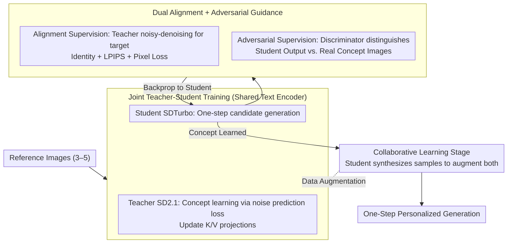

# Adversarial Concept Distillation for One-Step Diffusion Personalization

**Conference**: CVPR 2026 Findings  
**arXiv**: [2510.20512](https://arxiv.org/abs/2510.20512)  
**Code**: [https://liulisixin.github.io/OPAD/](https://liulisixin.github.io/OPAD/)  
**Area**: Model Compression  
**Keywords**: One-step diffusion models, Concept learning, Adversarial distillation, Personalized generation, Accelerated inference

## TL;DR
OPAD is the first to address the one-step diffusion personalization (1-SDP) problem. Through joint teacher-student training, alignment loss, and adversarial supervision, it enables high-quality one-step concept generation and introduces a collaborative learning stage to mutually enhance both models using student-generated feedback.

## Background & Motivation
1. **Background**: Large-scale generative models dominate T2I generation, where personalized generation (learning new concepts) is a critical application. Distillation techniques have already compressed inference speeds down to a single step.
2. **Limitations of Prior Work**: Applying traditional personalization methods (e.g., Textual Inversion, Custom Diffusion, IP-Adapter) to one-step diffusion models fails completely—textual inversion cannot learn tokens, weight optimization degrades quality, and encoder-based methods lack generalization.
3. **Key Challenge**: Three main challenges: (i) Student unadaptability: One-step models cannot independently learn text tokens effectively; (ii) Teacher unreliability: The teacher model itself may fail to accurately capture certain concepts; (iii) Inefficiency: Multi-step generation and non-end-to-end distillation significantly slow down the learning process.
4. **Goal**: Design the first framework capable of achieving reliable, high-quality personalization within one-step diffusion models.
5. **Key Insight**: Treat personalization and acceleration as a joint optimization problem rather than a sequential two-step pipeline.
6. **Core Idea**: Joint teacher-student training where the student is guided by both alignment loss (matching teacher output) and adversarial loss (matching the real image distribution).

## Method

### Overall Architecture
OPAD aims to learn new user-provided concepts on a **one-step** diffusion model (SDTurbo). Existing personalization methods fail in the one-step setting. The proposed strategy avoids letting the one-step student learn in isolation; instead, a multi-step teacher (SD2.1) is utilized for guidance, treating personalization and acceleration as a joint optimization task.

Mechanism: The teacher and student **share the same text encoder** and are trained together. Each iteration follows three steps: first, the teacher learns the new concept using reference images via noise prediction loss to update weights; next, the student produces a one-step candidate image, which is sent back to the teacher for alignment supervision and evaluated by discriminators against real concept images; finally, the discriminators are updated. Once the student masters the concept, a collaborative learning stage is initiated, leveraging the student's one-step generation capability to synthesize samples that reinforce both models. After training, the student generates personalized content in a single step.

### Key Designs

**1. Joint Teacher-Student Training: Compressing "Personalization then Distillation" into End-to-End Optimization**

Sequential pipelines (where a teacher learns concepts and then distills to a student) are slow and unreliable—errors in the teacher's concept acquisition are propagated to the student. OPAD parallelizes this: the teacher learns concepts using reference images following the Custom Diffusion paradigm, while the student's output is processed by the teacher (adding noise then denoising) to produce $x_0^{tc}$ as the alignment target. Crucially, the models **share a text encoder** and only update their respective attention key/value projection layers. This shared encoder locks language-visual representations in the same space, allowing the student to directly "understand" teacher-learned semantics, leading to more stable knowledge transfer and eliminating the need to wait for teacher convergence.

**2. Dual Guidance (Alignment + Adversarial): Alignment for Concept Fidelity, Adversarial for Image Quality**

Relying solely on matching the teacher’s denoised output (alignment) often results in blurry student outputs because the one-step student struggles to fit the intermediate targets of a multi-step teacher. OPAD adds adversarial supervision alongside alignment. The alignment loss consists of three parts: identity feature loss $\mathcal{L}_{id}$ (cosine similarity via CLIP image encoder), LPIPS perceptual loss $\mathcal{L}_{lpips}$, and pixel-level $\mathcal{L}_{mse}$. The adversarial branch uses discriminators to push the student’s one-step output to be indistinguishable from real concept images. Alignment ensures "looking like the concept," while adversarial loss ensures "looking like a real image." Ablation studies show that quality drops significantly without the adversarial loss, making it essential for the framework’s success.

**3. Collaborative Learning Stage: Using the Student to Augment Data for Both Parties**

Personalization is inherently data-scarce, often limited to 3–5 reference images. OPAD exploits the fact that once the student learns a concept, its **one-step generation is fast and accurate**. The student synthesizes a batch of additional concept samples, which are then used as data augmentation to continue training both the teacher and the student in a beneficial cycle. This step does more than just improve the student; evaluations show teacher performance also increases because the diverse samples provide a more robust characterization of the concept. Efficiency gained from acceleration is thus recycled as a tool to solve data scarcity.

### Loss & Training
Teacher loss: standard noise prediction loss $\mathcal{L}_{rec}$. Student loss: $\mathcal{L}_{id}$ (identity) + $\mathcal{L}_{lpips}$ (perceptual) + $\mathcal{L}_{mse}$ (pixel) + $\mathcal{L}_{adv}$ (adversarial). Discriminators are trained with a reverse adversarial loss. The three components (teacher, student, discriminator) are updated iteratively.

## Key Experimental Results

### Main Results

| Method | Model | DINO-I↑ | CLIP-I↑ | CLIP-T↑ | Note |
|------|------|---------|---------|---------|------|
| Textual Inversion | SDTurbo | Fail | Fail | - | Failed to learn |
| Custom Diffusion | SDTurbo | Fail | Fail | - | Quality degraded |
| IP-Adapter | TCD+SDXL | Low | Low | - | Poor concept fidelity |
| **Ours (OPAD)** | SDTurbo | **Best** | **Best** | **Best** | First success |

### Ablation Study

| Configuration | Key Metrics | Note |
|------|---------|------|
| Full OPAD | Best | Complete model |
| w/o Adversarial Loss | Significant Drop | Adversarial supervision is crucial |
| w/o Collaborative Learning | Drop | Data augmentation is effective |
| w/o Shared Text Encoder | Drop | Unified semantic space matters |

### Key Findings
- All existing personalization methods fail under the 1-SDP setting; OPAD is the first successful solution.
- Adversarial loss is the key to success—without it, the student cannot generate high-quality personalized images.
- The collaborative learning stage improves both student and teacher performance, creating a mutual benefit.
- OPAD also supports few-step (2-step, 4-step) personalized generation as an additional benefit.

## Highlights & Insights
- **Identified and defined the new 1-SDP problem**, filling the gap at the intersection of accelerated inference and personalization.
- **The design of collaborative learning** is ingenious: the student's efficient generation capability is naturally suited for data augmentation.
- Demonstrated that internal representations of one-step diffusion models differ fundamentally from multi-step models, meaning techniques cannot be simply transferred.

## Limitations & Future Work
- Dependent on SD2.1 as the teacher and SDTurbo as the student; generalization to other models remains unverified.
- Still requires 3–5 reference images; not applicable to pure zero-shot scenarios.
- Although faster than sequential distillation, joint training still incurs certain computational overhead.

## Related Work & Insights
- **vs DreamBooth**: DreamBooth is effective for multi-step models but cannot transfer to one-step models; OPAD solves this via joint distillation.
- **vs ADD/SDXL-Turbo**: These acceleration methods do not involve personalization; OPAD unifies acceleration and personalization.

## Rating
- Novelty: ⭐⭐⭐⭐⭐ First to define and solve the 1-SDP problem; novel collaborative learning.
- Experimental Thoroughness: ⭐⭐⭐⭐ Solid DreamBench evaluation, though more concept types could be tested.
- Writing Quality: ⭐⭐⭐⭐ Clear problem definition and thorough challenge analysis.
- Value: ⭐⭐⭐⭐⭐ Opens a new research direction with high practical application value.

<!-- RELATED:START -->

## Related Papers

- [\[NeurIPS 2025\] One-Step Diffusion-Based Image Compression with Semantic Distillation](../../NeurIPS2025/model_compression/one-step_diffusion-based_image_compression_with_semantic_distillation.md)
- [\[CVPR 2026\] BinaryAttention: One-Bit QK-Attention for Vision and Diffusion Transformers](binaryattention_one-bit_qk-attention_for_vision_and_diffusion_transformers.md)
- [\[ICML 2026\] Toward Understanding Adversarial Distillation: Why Robust Teachers Fail](../../ICML2026/model_compression/toward_understanding_adversarial_distillation_why_robust_teachers_fail.md)
- [\[CVPR 2026\] Mitigating The Distribution Shift of Diffusion-based Dataset Distillation](mitigating_the_distribution_shift_of_diffusion-based_dataset_distillation.md)
- [\[CVPR 2026\] Adaptive Video Distillation: Mitigating Oversaturation and Temporal Collapse in Few-Step Generation](adaptive_video_distillation_mitigating_oversaturation_and_temporal_collapse_in_f.md)

<!-- RELATED:END -->
