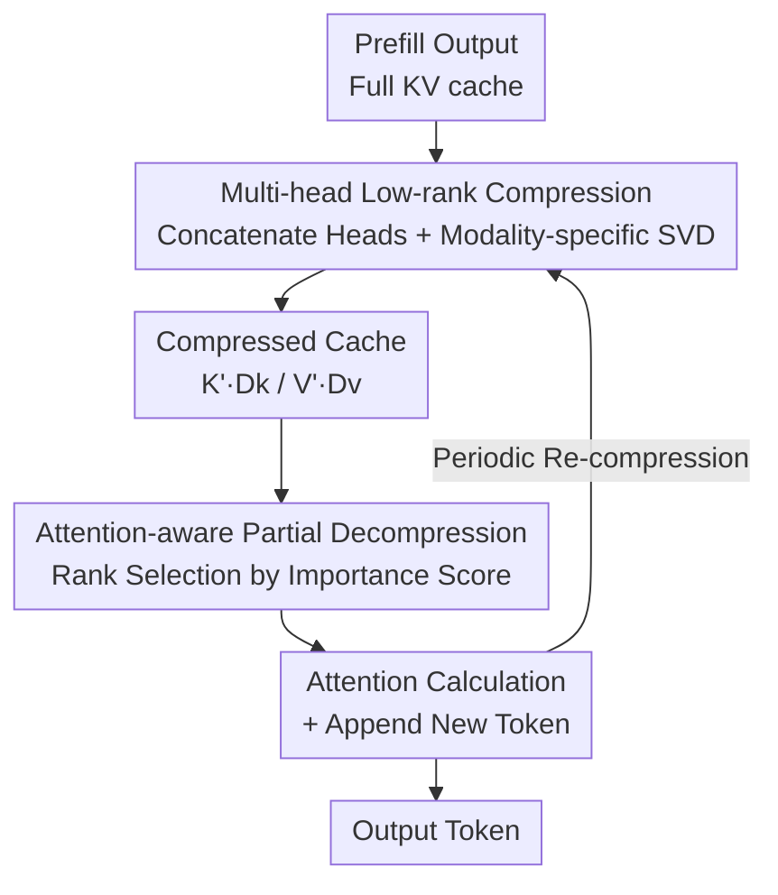

# Attention-aware Inference Optimizations for Large Vision-Language Models with Memory-efficient Decoding

**Conference**: CVPR 2026  
**Paper**: [CVF Open Access](https://openaccess.thecvf.com/content/CVPR2026/html/Ilhan_Attention-aware_Inference_Optimizations_for_Large_Vision-Language_Models_with_Memory-efficient_Decoding_CVPR_2026_paper.html)  
**Code**: To be confirmed  
**Area**: Model Compression  
**Keywords**: KV cache compression, low-rank decomposition, vision tokens, inference acceleration, vision-language models  

## TL;DR
AttentionPack leverages the inherent low-rank observation of LVLM KV caches (especially vision tokens). It compresses the cache along the hidden dimension using SVD via "multi-head concatenation + modality separation" and employs an "attention-aware partial decompression" strategy based on cumulative attention scores to select ranks on-demand. Without significant performance loss, it reduces memory consumption to 1/5–1/8 of the original, supporting larger batches/longer contexts and achieving up to a 74% increase in decoding throughput.

## Background & Motivation
**Background**: Large Vision-Language Models (LVLMs, such as LLaVA and QwenVL) encode an image into hundreds or thousands of visual tokens for LLM processing. To avoid redundant computation during decoding, the key/value vectors of all past tokens are stored as a KV cache.

**Limitations of Prior Work**: The volume of the KV cache expands linearly with "sequence length × hidden dimension × batch size." This is particularly severe in long-context scenarios (multi-image, video, documents). For instance, a 13B LVLM processing 16 images (256 tokens each) with a batch size of 64 requires approximately 214 GB of memory in half-precision. Since actual computation per decoding step is minimal (vector-matrix multiplication), the bottleneck lies in moving the massive cache from memory to the GPU, leading to compute idling and high latency.

**Key Challenge**: Existing KV cache reduction routes do not target the fundamental dimension. **Token eviction** (e.g., H2O, Scissorhands, FastV) removes tokens along the sequence axis, leaving the hidden dimension per token unchanged, which limits savings and causes information loss. **Quantization** (e.g., KVQuant, GEAR) is constrained by outliers and hardware compatibility. Both treat the "hidden dimension" as an incompressible constant.

**Key Insight**: Analysis of the cached vectors reveals that stored key/value matrices—especially for vision tokens—exhibit a clear **low-rank structure** (Figure 2: a few singular values explain most of the variance). Given this low rank, SVD can be used to compress the matrices along the hidden dimension without discarding tokens or reducing bit-precision.

**Core Idea**: Replace "token deletion / quantization" with "low-rank SVD compression along the hidden dimension + partial decompression based on token importance." This exploits the low-rank redundancy of the KV cache without requiring model fine-tuning or weight modification.

## Method

### Overall Architecture
AttentionPack is a **plug-and-play, training-free** inference-time KV cache optimization framework that integrates into standard LVLM decoding. The prefill stage calculates the full KV cache as usual. During decoding, it performs two tasks: (1) it applies low-rank compression along the hidden dimension after prefill (and periodically during decoding) to slash storage volume; (2) at each decoding step before calculating attention scores, it performs "attention-aware partial decompression" on compressed vectors, restoring full rank only for important tokens while maintaining low rank for others to minimize decompression overhead. The memory savings allow for larger batches or longer contexts, where increased parallelism offsets decompression costs, yielding net throughput gains.

Let LVLM vision features after projection have the same dimension as text embeddings $H_v, H_t \in \mathbb{R}^{T\times HD}$ ($H$ heads, $D$ dimensions). Let attention block weights be $\{W_q,W_k,W_v,W_o\}$. After prefill, the cache is $C=\{K,V\in\mathbb{R}^{T\times HD}\}$, where $T=T_v+T_t$ represents the number of vision and text tokens.

### Key Designs

**1. Multi-head Low-rank Compression: Compressing KV cache along the hidden dimension via SVD with head concatenation and modality separation**

This step addresses the limitation that "eviction/quantization do not modify the hidden dimension." Analyzing the LLaVA1.5-7B first-layer cache on OCR-VQA ($T_v=576$), the authors found that key/value matrices are low-rank. SVD decomposes each cache matrix into two low-rank components: $K \approx K' D_k$ and $V \approx V' D_v$, where the compressed cache is $K'\in\mathbb{R}^{T\times R_k}$ and the decompression matrix is $D_k\in\mathbb{R}^{R_k\times HD}$ (similarly for value). Each column of $K'$ is scaled by the singular values. For a single-layer vision key, storage is reduced from $T_v HD$ to $T_v R_{kv}+R_{kv}HD$. The compression ratio is:

$$c_{kv}=\frac{T_v HD}{T_v R_{kv}+R_{kv}HD}$$

With $T_v=1000, H=40, D=128, R_{kv}=64$, memory reduction is approximately 13×.

Two critical details enhance compression: **(i) Concatenation across heads before compression**—The authors found that performing low-rank decomposition on concatenated multi-head caches is more effective than per-head compression (Figure 2 "combine along head" curve reaches higher variance explanation at lower ranks) due to shared redundancy across heads. **(ii) Modality-specific compression**—Vision and text tokens originate from different sources and have distinct statistical properties. Processing them together via SVD is suboptimal; thus, vision tokens ($\diamond=v$) and text tokens ($\diamond=t$）follow separate pipelines. Ranks ($R_{kv},R_{kt},R_{vv},R_{vt}$) for each modality and matrix are adjustable based on memory budgets.

**2. Attention-aware Partial Decompression: Reducing overhead via importance-based rank selection**

While compression occurs only after prefill and periodically, **decompression happens at every decoding step**, introducing latency—up to 30% in single-instance inference depending on context length. This design mitigates that overhead based on the observation that "not all tokens are equally important at every step." Lower ranks are used to deconstruct less significant tokens.

Importance is determined using an exponential moving average (parameter $\omega\in[0,1)$) to track the **scaled cumulative attention score** of each token. At decoding step $t$, the importance score for position $t_p$ is:

$$I_{t_p}\leftarrow \omega^{T_q} I_{t_p} + (1-\omega^{T_q})\frac{\sum_{t'=t-T_q}^{t} A_{t'\,t_p}}{T_q}$$

where $T_q$ is the number of new tokens (usually 1). $A_{t'\,t_p}$ is the attention weight for $t_p$ at step $t'$, averaged across heads. Tokens are split into $F$ groups; Group 1 (highest scores) uses the original compression rank $R^{(1)}_{kv}=R_{kv}$, while lower groups use smaller ranks. Decompression FLOPs for vision keys decrease from $2T_v HD R_{kv}$ to $2T_v HD \sum_{f=1}^{F} r_f R^{(f)}_{kv}$ (where $r_f T_v$ tokens are in group $f$). Example: $F=2, T=1000, r_1=0.1, r_2=0.9, R^{(1)}_{kv}=64, R^{(2)}_{kv}=16$. Here, 90% of tokens use only 25% of the rank, reducing decompression FLOPs by 67.5%. The key cache is more sensitive to partial decompression than the value cache, so the strategy is primarily applied to the value cache.

### Loss & Training
**Training-free, no fine-tuning**—AttentionPack is a pure inference-time method. It does not update model weights or require calibration datasets. All compression/decompression processes are algebraic operations (SVD and matrix multiplication). Default settings: Partial decompression on value cache with $F=2$, $r_1=0.25, r_2=0.75$, and a low-group rank of 1/4 of the full rank. Importance EMA $\omega=0.25$ (robust within $[0.05, 0.75]$).

## Key Experimental Results

Datasets: Image QA (A-OKVQA, OCR-VQA, MMMU); Video QA (MSVD-QA, MSRVTT-QA). Models: LLaVA1.5-7B/13B, QwenVL-Chat-7B, VideoLLaVA-7B (plus Qwen3VL-8B-instruct for GQA). Baselines: Full KV cache, FastV, Scissorhands, H2O (all 50% eviction), Minicache. Metrics: ROUGE-L for text, accuracy for multiple-choice.

### Main Results
Image/Video QA Main Results (selected $R_{kv}=R_{vv}=64$, nearly lossless precision while reducing cache significantly):

| Model | Method | Cache Reduction | Throughput Change | A-OKVQA | OCR-VQA | MMMU |
|------|------|-----------|---------|---------|---------|------|
| LLaVA1.5-7B | Full KV | — | — | 76.64 | 51.05 | 34.68 |
| LLaVA1.5-7B | Minicache | 4.51× | +44% | 76.54 | 51.93 | 33.75 |
| LLaVA1.5-7B | **AttentionPack (64)** | **5.09×** | **+54%** | 76.88 | 52.44 | 34.59 |
| LLaVA1.5-13B | **AttentionPack (64)** | 5.17× | +43% | 81.25 | 53.22 | 36.38 |
| QwenVL-Chat-7B | **AttentionPack (64)** | 2.77× | +61% | 75.33 | 68.45 | 35.72 |
| VideoLLaVA-7B | **AttentionPack (128)** | **8.11×** | +60% | MSVD 69.21 / MSRVTT 55.47 | | |

For LLaVA1.5-7B, single-sample cache dropped from 328.2 MB to 64.5 MB. In video tasks, high inter-frame similarity allowed 8.11× compression with <0.4% performance drop.

### Ablation Study
Compression Rank Scan (LLaVA1.5-7B, batch 32, selected from Table 3):

| $R_{kv}$ / $R_{vv}$ | Total Cache Reduction | A-OKVQA | OCR-VQA | Description |
|--------------------|--------------|---------|---------|------|
| Full | — | 76.64 | 51.05 | Baseline |
| 64 / 128 | 3.92× | 76.75 | 52.47 | High rank, near lossless |
| 64 / 64 | 5.09× | 76.88 | 52.44 | Sweet spot: slight improvement |
| 32 / 64 | 5.98× | 76.46 | 52.00 | Slight degradation starts |
| 32 / 32 | 7.24× | 75.91 | 51.69 | Still acceptable |
| 16 / 16 | 9.18× | 72.13 | 48.44 | Over-compressed, clear drop |

Combining with other compression techniques (Table 4, LLaVA1.5-7B):

| Method | Avg Cache (MB) | Throughput Change | A-OKVQA | OCR-VQA |
|------|----------------|---------|---------|---------|
| Full KV - fp16 | 328.2 | — | 76.64 | 51.05 |
| KVQuant-4bit | 82.1 | +49% | 75.90 | 50.67 |
| AttentionPack | 64.5 | +54% | 76.88 | 52.44 |
| AttentionPack + eviction (E) | 62.1 | +70% | 76.88 | 51.63 |
| AttentionPack-4bit | 16.1 | +97% | 75.27 | 50.18 |
| AttentionPack-4bit (E) | 15.5 | +115% | 75.27 | 49.11 |

### Key Findings
- **Rank 64 is the sweet spot**: Performance drops below 64, while increasing to 128 yields negligible gains. OCR-VQA scores actually improved by +1.39% at rank 64, suggesting compression may filter out noise in visual inputs.
- **Early layers dominate quality**: Linearly increasing rank (rank 16 at the first layer, 128 at the last) is ~0.37% better than rank 16 throughout, though memory doubles. Early layer rank selection is critical.
- **Orthogonal and stackable**: Can be combined with eviction, 4-bit quantization, and kernel fusion. Under 4-bit + eviction, cache reduces to 15.5 MB with a +115% throughput increase.
- **Key cache more sensitive than value**: Since keys directly affect attention weight calculation, partial decompression is mainly applied to the value cache.
- **Latency gains depend on batch size**: While decompression adds latency in single-instance cases, saving ~80% memory allows ~4× larger batches, reducing total latency by up to 54% (RTX3060, 4-bit weight + half-precision measurements).

## Highlights & Insights
- **Hidden dimension as a compressible axis**: Eviction targets tokens and quantization targets bits, both assuming the hidden dimension is fixed. This paper applies low-rank decomposition to the hidden dimension, creating a new axis orthogonal to and stackable with previous methods.
- **Multi-head concatenation + Modality separation**: Concatenating heads before SVD allows shared redundancy across heads to be compressed. Modality separation avoids suboptimal compression caused by mixing vision and text statistics.
- **Attention scores for budget allocation**: Reusing attention scores (a natural byproduct) to determine the resource allocation for decompression reflects an efficient mechanism transferable to other compute-budgeting scenarios.
- **Deployment-ready**: No training, no fine-tuning, and no calibration data required. Purely algebraic operations make it highly accessible for production.

## Limitations & Future Work
- **Single-instance latency increase**: Decompression adds up to 30% latency in single-request scenarios; benefits rely entirely on batch processing.
- **Over-compression cliff**: Performance drops sharply at rank 16 (A-OKVQA 76→72). Low-rank assumptions fail at high compression rates, requiring dataset/layer-specific tuning.
- **Periodic re-compression costs**: While the method mentions "periodic" re-compression, the trade-off between frequency, latency, and quality is not fully quantified in the main text.
- **Dependency on low-rank structures**: Gains are maximized in tasks with high visual redundancy (e.g., video); info-dense inputs with weak low-rank structures may see limited space.

## Related Work & Insights
- **vs Token Eviction (H2O / Scissorhands / FastV)**: These methods remove tokens along the sequence axis. AttentionPack keeps all tokens but compresses the hidden dimension. They are orthogonal and can be stacked for higher speed (as shown in experiments).
- **vs Quantization (KVQuant / GEAR)**: Quantization is affected by outliers. This low-rank approach can be combined with 4-bit quantization (AttentionPack-4bit at 16 MB). While GEAR uses SVD for quantization residuals, this paper applies it directly to the raw KV cache with modality separation.
- **vs Weight Low-rank/Pruning**: Traditional low-rank approximation for weights requires modification on representative data and can hurt quality. This method only compresses the inference-time cache and leaves weights untouched.
- **vs GQA / FlashAttention / PageAttention**: GQA shares KV across heads, and FlashAttention/PageAttention optimize memory scheduling, but none change the cache volume itself. AttentionPack reduces volume directly and can coexist with these optimizations.

## Rating
- Novelty: ⭐⭐⭐⭐ Target compression on the hidden dimension of LVLM KV caches is innovative; the combination of multi-head + modality + attention-aware decompression is new, though SVD itself is a standard tool.
- Experimental Thoroughness: ⭐⭐⭐⭐⭐ Covers 4 models, 5 image/video datasets, rank scanning, decompression ablation, and stacking with quantization/eviction including latency decomposition.
- Writing Quality: ⭐⭐⭐⭐ Mechanism and formulas are clear. The logic for the two-step process is smooth. Some notation (e.g., scaling terms in importance formulas) is slightly unrefined.
- Value: ⭐⭐⭐⭐ Plug-and-play, orthogonal to existing techniques, with clear practical benefits for long-context LVLM deployment.

<!-- RELATED:START -->

## Related Papers

- [\[CVPR 2026\] Rethinking Token Reduction for Large Vision-Language Models](rethinking_token_reduction_for_large_vision-language_models.md)
- [\[CVPR 2026\] VLM-PTQ: Efficient Post-Training Quantization for Large Vision-Language Models](vlm-ptq_efficient_post-training_quantization_for_large_vision-language_models.md)
- [\[CVPR 2026\] Quant Experts: Token-aware Adaptive Error Reconstruction with Mixture of Experts for Large Vision-Language Models Quantization](quant_experts_token_aware_vlm_quantization.md)
- [\[CVPR 2026\] Masking Teacher and Reinforcing Student for Distilling Vision-Language Models](masking_teacher_and_reinforcing_student_for_distilling_vision-language_models.md)
- [\[CVPR 2026\] Hybrid Token Compression for Vision-Language Models](hybrid_token_compression_for_vision-language_models.md)

<!-- RELATED:END -->
