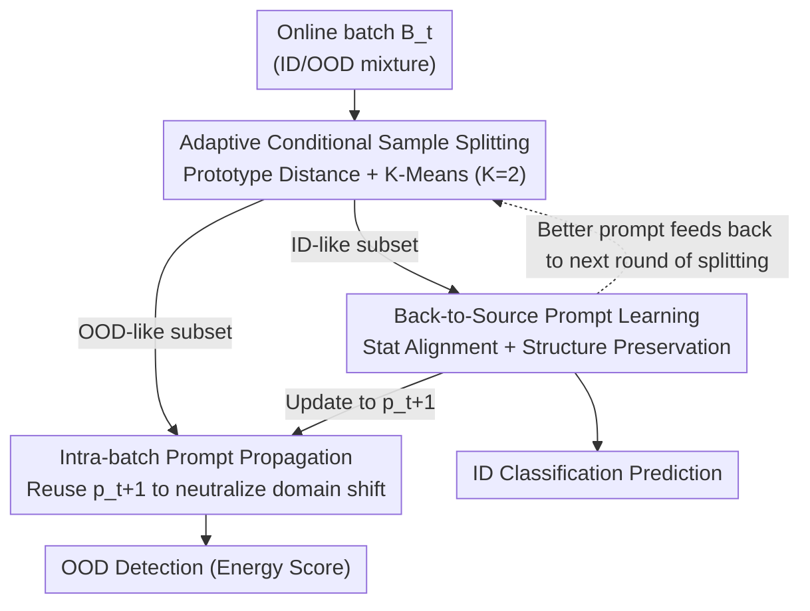

# Back to Source: Open-Set Continual Test-Time Adaptation via Domain Compensation

**Conference**: CVPR 2026  
**arXiv**: [2604.21772](https://arxiv.org/abs/2604.21772)  
**Code**: https://github.com/ekyle0522/DOCO (Available)  
**Area**: Test-Time Adaptation / Open-Set Recognition / OOD Detection  
**Keywords**: Test-Time Adaptation, Continual Learning, Open-Set, OOD Detection, Visual Prompt Learning

## TL;DR
Aiming at the Open-set Continual Test-Time Adaptation (OCTTA) scenario where "continual domain drift" and "unknown novel classes" occur simultaneously, this paper proposes DOCO. The method first splits the current batch into ID-like and OOD-like subsets. It then learns a visual prompt on the ID samples to "pull" feature statistics back to the source domain. Finally, this prompt is directly reused for OOD samples in the same batch to strip away their domain shift and expose their semantic novelty. This three-step closed-loop mutual assistance achieves an H-score 4.7% higher than the second-best method on ImageNet-C.

## Background & Motivation

**Background**: Test-time adaptation (TTA) allows a model trained on a source domain to adapt online to domain shifts during inference using only unlabeled target data. Recent developments have followed two realistic axes: Continual TTA (CoTTA, EATA, SAR, ViDA, DPCore, etc.) to handle evolving domain streams, and Open-set TTA (OSTTA, UniEnt, STAMP, COME, etc.) to handle novel classes appearing during testing that were not seen during training.

**Limitations of Prior Work**: In real-world deployment, these two phenomena occur **simultaneously**: a field-deployed perception system must adapt from a sunny highway to a foggy forest (domain shift) while identifying unseen objects like a deer appearing on the road (semantic shift). This paper formally defines this intersection as **OCTTA (Open-set Continual Test-Time Adaptation)** and points out that existing methods fail in three ways: ① Continual domain streams exacerbate catastrophic forgetting; ② Mixing ID and OOD samples in a single batch contaminates BN/normalization statistics and misleads entropy minimization; ③ Most critically, there is an **adversarial coupling of domain shift and semantic shift**.

**Key Challenge**: Severe domain shift causes the feature space to "collapse"—squeezing embeddings of both known and unknown classes into an indistinguishable region (visualized by t-SNE in Fig. 1). This collapse destroys both the model's classification ability and its ability to detect novel classes, making them impossible to decouple.

**Goal**: To correctly classify known classes and reliably detect unknown classes in an online stream with evolving domains and emerging new classes, using only the current batch and a single backpropagation step.

**Key Insight**: The authors' key observation is that if target domain feature statistics can be "compensated" back to the source domain (back to source), the collapsed features can be separated again. Since OOD samples and ID samples in the same batch share the same "domain drift factor" $\delta_t$, the compensation learned from ID samples can be **directly transferred to OOD samples**. Only after this transfer is the semantic novelty of OOD samples exposed.

**Core Idea**: Use a lightweight visual prompt for "domain compensation," creating a self-reinforcing closed loop of three steps: ID/OOD splitting → Prompt learning on ID → Prompt propagation to OOD.

## Method

### Overall Architecture
DOCO integrates "domain adaptation" and "OOD detection" into an online closed loop. For each incoming batch $\mathcal{B}_t$: it first extracts features using the current prompt $p_t$ and splits the batch into an ID-like subset $\hat{\mathcal{B}}_t^{\mathrm{ID}}$ and an OOD-like subset $\hat{\mathcal{B}}_t^{\mathrm{OOD}}$ based on "distance to source domain class prototypes." One-step backpropagation is performed only on the ID subset to learn a new prompt $p_{t+1}$ that pulls feature statistics back to the source domain. This $p_{t+1}$ is then immediately applied to OOD samples in the same batch to neutralize their domain shift and expose their semantic novelty for detection. Cleaner splitting leads to more accurate prompts, which in turn leads to better inference and splitting in the next round, forming a virtuous cycle. The backbone is a frozen ViT-B/16, and only 8 prompt tokens are updated (VPT paradigm), providing natural resistance to forgetting.

### Key Designs

**1. Adaptive Conditional Sample Splitting: Separating ID and OOD in Collapsed Features**
The prerequisite for the closed loop is splitting each batch into ID and OOD groups; otherwise, OOD samples contaminate prompt learning. However, severe domain shift causes significant overlap in discriminative signals, making splitting on raw features inaccurate. The authors' approach is to **split after compensation by the current prompt $p_t$**. For the compensated features $z=\phi(x;p_t)$, prototype distance is defined as $d_{\mathrm{proto}}(z) = 1 - \max_{c\in\mathcal{Y}^S} C(z, w_c)$, where $\{w_c\}$ are the weights of the frozen classification head (serving as source domain prototypes) and $C(\cdot,\cdot)$ is cosine similarity. Smaller distances indicate proximity to source prototypes (ID-like). $K$-Means with $K=2$ is then run on the scalar distances of the batch to classify the cluster with the smaller centroid as ID and the larger as OOD. The brilliance is that structure-preserving prompts have strong cross-domain generalization (reducing statistical loss even in the first batch of a new domain), pulling originally overlapping bimodal distributions apart and making cluster splitting reliable—this is the key to handling "Continual" scenarios.

**2. Back-to-Source Prompt Learning: Pulling ID Statistics to Source without Distorting Semantics**
After splitting the ID subset, a prompt is learned to "neutralize domain drift." The most direct idea is to align ID batch statistics with source statistics: pre-stored source means $\mu_S$ and standard deviations $\sigma_S$ (calculated from only 300 unlabeled samples). The statistical alignment loss is minimized: $\mathcal{L}_{\mathrm{stat}}(p_t) = \|\hat{\mu}_{t,p}^{\mathrm{ID}} - \mu_S\|_2 + \|\hat{\sigma}_{t,p}^{\mathrm{ID}} - \sigma_S\|_2$. However, using only this term risks a pitfall: batch statistics contain both domain shift and the batch's own narrow semantics. Forcing statistics of a "cats and dogs" batch to match those of a thousand-class source domain would force the prompt to distort feature structures and overfit to narrow semantics.

To address this, the authors add a **structural preservation regularizer**, requiring geometric consistency of pairwise similarities before and after adding the prompt. For $n$ samples in the ID subset, let $z_i^{\mathrm{raw}}=\phi(x_i)$ and $z_i^{p_t}=\phi(x_i;p_t)$ be raw and prompt-augmented features respectively. The regularizer is the Frobenius norm of the difference between pairwise cosine similarity matrices:

$$\mathcal{L}_{\mathrm{reg}}(p_t) = \left\| \mathrm{sim}(\hat{Z}_{t,p}^{\mathrm{ID}}) - \mathrm{sim}(\hat{Z}_{t,\mathrm{raw}}^{\mathrm{ID}}) \right\|_F$$

The total objective is $\mathcal{L}_{\mathrm{DOCO}}(p_t) = \mathcal{L}_{\mathrm{stat}}(p_t) + \beta \mathcal{L}_{\mathrm{reg}}(p_t)$. Statistical alignment handles the "pull back to source," while the structural regularizer ensures the relative geometry is not destroyed. This push-and-pull allows the prompt to learn generalized domain compensation rather than batch-specific details.

**3. Intra-batch Prompt Propagation: Direct Transfer of ID Domain Knowledge to OOD**
How to use the learned $p_{t+1}$ for OOD samples? The key insight is that all samples in the same batch share a batch-level domain factor $\delta_t$. If features are approximated as $\phi(x) \approx s(x) + \delta_t$ (where $s(x)$ is class semantics), then applying $p_{t+1}$ learned from pure ID samples to OOD results in $\phi(x;p_{t+1}) \approx \phi(x) - \delta_t \approx s(x)$, effectively removing the domain component and leaving only semantics. Logits are calculated using the frozen head $h$, and OOD status is determined by energy scores. This step is non-trivial as it: (i) pulls misclassified ID samples back to the source neighborhood, (ii) makes true OOD samples appear more novel relative to the "compensated source geometry," and (iii) **avoids backpropagation on OOD samples**, preventing pseudo-label noise leakage and stabilizing the decision boundary. This decouples "domain shift" from "semantic novelty."

### Loss & Training
- The ViT-B/16 backbone (ImageNet-1K pretrained, timm weights) is frozen throughout, updating only $L=8$ prompt tokens. Most baselines update only LayerNorm affine parameters, while CoTTA updates all parameters.
- Each batch uses AdamW (learning rate $1\text{e-}1$) for a **one-step** update of the prompt, with $\beta=0.5$.
- 300 unlabeled samples are used for offline source statistics; a one-time self-supervised 50-step update refines the initial state of the prompt.
- The test stream follows a Huber contamination model $P_{\text{test}} = (1-\kappa)P_{\text{ID-C}} + \kappa P_{\text{OOD-C}}$, with OOD ratio $\kappa=0.5$ and batch size 64. Hyperparameters are tuned only on the first "dataset-domain" combination and frozen for all unseen datasets (blind test protocol).

## Key Experimental Results

### Main Results
ImageNet→ImageNet-C (severity=5, $\kappa=0.5$, average of 15 corruptions across 6 OOD datasets). ACC measures known class classification, AUC measures OOD detection, and H-score is their harmonic mean:

| Method | Avg. ACC | Avg. AUC | H-score |
|------|----------|----------|---------|
| Source | 49.8 | 68.0 | 56.4 |
| EATA (ICML'22) | 52.9 | 67.3 | 57.8 |
| OSTTA (ICCV'23) | 56.2 | 61.9 | 58.5 |
| UniEnt (CVPR'24) | 57.8 | 77.0 | 65.4 |
| E-COME (ICLR'25) | 58.3 | 75.5 | 65.2 |
| DPCore (ICML'25) | 54.1 | 76.2 | 62.6 |
| **DOCO (Ours)** | **61.5** | **82.7** | **70.1** |

Ours pushes the H-score to **70.1%**, which is **4.7%** higher than the second-best UniEnt, leading in both ACC (61.5%) and AUC (82.7%)—demonstrating balanced enhancement for both tasks.

On the more difficult LAION-C benchmark (severity=3, 6 switching domains), all methods dropped significantly, but DOCO remained on top with an **H-score of 32.7%**, leading the recent DPCore (30.3%) by **2.4%**. In closed-set CTTA, Ours also achieved the best ACC at **43.1%**, showing that open-set design does not compromise standard TTA performance.

### Ablation Study
Breaking down the three main components—Sample Splitting (S), OOD Propagation (O), and Structural Regularizer (R). The H-score column is based on the prompt-based method (ImageNet-C):

| Config | S | O | R | H-score | Gain |
|------|---|---|---|---------|------|
| Source | - | - | - | 56.4 | - |
| w/o S.O.R (Stat Alignment only) | - | - | - | 64.0 | +7.6 |
| w/o S.O | - | - | ✓ | 67.6 | +11.2 |
| w/o R | ✓ | ✓ | - | 68.5 | +12.1 |
| **Full Model** | ✓ | ✓ | ✓ | **70.1** | **+13.7** |

### Key Findings
- **All components are essential and complementary**: Statistical alignment alone yields +7.6%; adding S+O (Splitting + Propagation) jumps to +12.1% (68.5); adding the structural regularizer R completes it at 70.1%. The three are synergetically magnifying rather than purely additive.
- **Structural regularization is a "safety net for split failure"**: Even when the splitting mechanism is disabled (w/o S.O), the regularizer prevents the prompt from aligning OOD semantics to source ID, gaining +3.6% over w/o S.O.R—meaning the model won't crash even if ID subsets aren't perfectly separated.
- **Robust to hyperparameters & data efficient**: H-score remains high across a wide range of $\beta$ and $L$. Performance stabilizes at batch sizes $\ge 8$ and reaches near-optimal results with only **50 source samples**.
- **Robust to domain order**: DOCO's accuracy remains stable across 6 random domain sequences. It remains strong on difficult domains like Contrast where other methods drop sharply.

## Highlights & Insights
- **"Transferable shared domain factor" is a clever lever**: Learning compensation from pure ID samples and transferring it to OOD samples within the same batch at zero cost bypasses the deadlock of "how to compensate OOD without knowing OOD." This relies only on the mild assumption of shared $\delta_t$ and avoids backpropagation on OOD to prevent noise leakage.
- **Closed-loop self-reinforcement design is reusable**: The splitting $\leftrightarrow$ prompt learning $\leftrightarrow$ propagation cycle becomes more accurate as it is used. This online virtuous cycle of "using the previous step's output to improve the next step's input" can be migrated to any TTA task requiring online pseudo-labeling.
- **Structural preservation solves the "overfitting to narrow semantics" problem**: Using pairwise similarity matrix invariance to constrain geometry is a lightweight but universal trick for any scenario where statistical alignment risk distorting semantics.
- **Formalizing OCTTA as a Huber contamination mixture** and using t-SNE/Grad-CAM to show the "collapse → compensation → separability" process makes the problem definition and visualization very persuasive.

## Limitations & Future Work
- **Core assumption of "within-batch single domain factor $\delta_t$"**: Realistically, a batch might contain multiple domains (e.g., video scene transitions, multi-sensors). In these cases, the single-factor approximation $\phi(x)\approx s(x)+\delta_t$ and the "subtract domain factor" logic for prompt propagation may degrade.
- **Dependence on sufficient ID samples per batch**: When $\kappa$ is very high (OOD dominant) or batch size is tiny, ID statistics become noisy and K-Means splitting may degenerate. The paper uses structural regularization as a fallback, but performance decreases slightly without it at small batch sizes.
- **Pre-stored source statistics requirement**: Requires offline access to 300 (or at least 50) source samples to calculate $\mu_S/\sigma_S$, which is not applicable in purely black-box/source-free scenarios.
- **Verified only on classification + OOD detection**: The feasibility of "back-to-source statistics" in dense prediction tasks like segmentation or object detection remains unknown and is a valuable direction for extension.

## Related Work & Insights
- **vs UniEnt (CVPR'24)**: UniEnt minimizes entropy on pseudo-ID and maximizes it on pseudo-OOD. Ours does not rely on iterative entropy optimization but on "domain compensation → exposing novelty," outperforming it by 4.7% H-score and staying more stable under varying $\kappa$.
- **vs CoTTA (CVPR'22)**: CoTTA updates all parameters and relies on weight/augmentation averaging. Ours updates only 8 prompt tokens, providing better resistance to forgetting and lower computation while natively supporting open-set scenarios.
- **vs DPCore (ICML'25)**: DPCore uses a dynamic prompt coreset to remember and replay domains. DOCO does not maintain memory, relying on a "learn-and-propagate per batch" closed loop to handle continual drift, resulting in higher OOD detection AUC (82.7 vs 76.2).
- **vs Domain Generalization (DG) methods**: DG methods aim to remove domain components during training. DOCO is an **online, in-process correction during test time** that fits existing models without retraining.

## Rating
- Novelty: ⭐⭐⭐⭐⭐ Formally defines OCTTA and uses the "learn from ID, propagate to OOD" closed loop to cleverly decouple domain and semantic shifts.
- Experimental Thoroughness: ⭐⭐⭐⭐⭐ ImageNet-C/LAION-C/Closed-set CTTA benchmarks + ablation + sensitivity analysis + visualisations under a rigorous blind test protocol.
- Writing Quality: ⭐⭐⭐⭐ Clear motivation, intuitive diagrams, and complete formulas; well-explained causal relationships in the closed loop.
- Value: ⭐⭐⭐⭐⭐ Highly relevant to real-world deployment; the method is lightweight (8 tokens, one-step update), plug-and-play, and data-efficient.

<!-- RELATED:START -->

## Related Papers

- [\[CVPR 2026\] Cross-Architecture Adaptation: Cloud-Edge Continual Test-Time Adaptation with Dynamic Sampling and Heterogeneous Distillation](cross-architecture_adaptation_cloud-edge_continual_test-time_adaptation_with_dyn.md)
- [\[CVPR 2026\] FOZO: Forward-Only Zeroth-Order Prompt Optimization for Test-Time Adaptation](fozo_forward-only_zeroth-order_prompt_optimization_for_test-time_adaptation.md)
- [\[CVPR 2026\] DiT-Distill: Open-Set Fine-Grained Retrieval via Generative Curriculum Knowledge](dit-distill_open-set_fine-grained_retrieval_via_generative_curriculum_knowledge.md)
- [\[CVPR 2026\] Test-time Sparsity for Extreme Fast Action Diffusion](test-time_sparsity_for_extreme_fast_action_diffusion.md)
- [\[CVPR 2026\] TALON: Test-time Adaptive Learning for On-the-Fly Category Discovery](talon_test-time_adaptive_learning_for_on-the-fly_category_discovery.md)

<!-- RELATED:END -->
