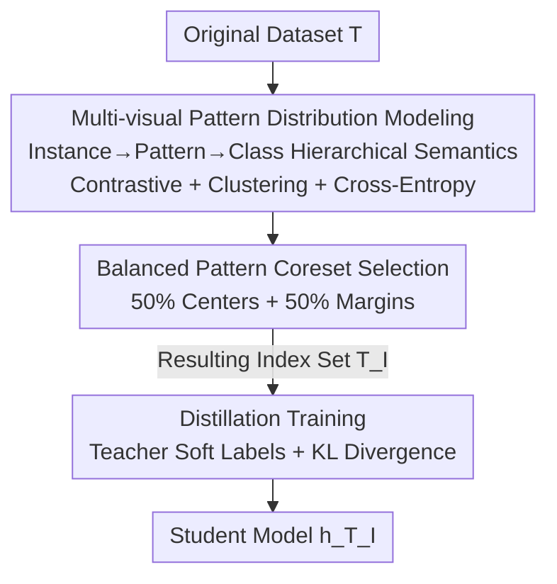

# Balanced Dataset Distillation via Modeling Multiple Visual Pattern Distribution

**Conference**: CVPR 2026  
**Paper**: [CVF Open Access](https://openaccess.thecvf.com/content/CVPR2026/html/Shi_Balanced_Dataset_Distillation_via_Modeling_Multiple_Visual_Pattern_Distribution_CVPR_2026_paper.html)  
**Code**: https://github.com/BeCarefulOfYournaoke/BPS  
**Area**: Model Compression / Dataset Distillation  
**Keywords**: Dataset distillation, coreset selection, pattern balance, multi-visual pattern modeling, cross-architecture generalization

## TL;DR
This work identifies a prevalent "pattern imbalance" in existing dataset distillation methods (either favoring intra-class majority class-general patterns or rare marginal patterns). It proposes the BPS framework: first, each class is modeled as a distribution of multiple visual patterns using a hierarchical semantic structure; then, a pattern-balanced coreset is constructed by taking half of the IPC budget from both the "center" and "margin" of each pattern; finally, a student model is trained via knowledge distillation. BPS comprehensively outperforms previous SOTA across four benchmarks and naturally possesses advantages in cross-architecture generalization and efficiency through its "mode once, reuse for all IPC" approach.

## Background & Motivation
**Background**: Dataset Distillation (DD) aims to compress large-scale datasets into small subsets consisting of a few images per class (IPC), such that models trained on these small sets approach the performance of full-dataset training. Mainstream approaches include: ① coreset selection—picking a representative subset; ② synthetic-based—optimizing highly condensed synthetic images in pixel space; and more recently ③ generative (GAN/Diffusion) methods.

**Limitations of Prior Work**: Through in-depth analysis, the authors find that these methods share a common deficiency—**pattern imbalance**. The distribution of each class contains two types of critical information: class-general patterns (pattern centers) representing the majority, and marginal patterns (pattern margins) that are sparse but crucial for generalization. Heuristic coreset methods (e.g., Herding using moment matching) over-emphasize global statistical constraints, tending to retain high-density representative samples while ignoring "hard" samples near decision boundaries. Importance-based methods (e.g., Forgetting) do the opposite, selecting only "hard" samples and losing the representative samples that provide baseline performance. Synthetic methods, when encoding an entire dataset into a few images, naturally bias the optimization toward high-frequency class-general patterns, struggling with scarce marginal patterns. While some subsequent works attempt to "patch" synthetic sets with real hard images, this is reactive patching rather than an explicit realization of balance.

**Key Challenge**: Existing methods default to the assumption that "each class is a single cluster." Under this incorrect assumption, it is impossible to simultaneously and balancedly cover both center and marginal patterns. Furthermore, synthetic optimization depends on specific network architectures, inheriting model-specific inductive biases and leading to poor cross-architecture generalization.

**Goal**: To construct an **explicitly pattern-balanced** and **model-agnostic** coreset without relying on synthetic images.

**Key Insight**: Since synthetic optimization is naturally biased toward mainstream patterns and tied to specific architectures, can the approach return to "optimizing sample selection" so that the selection process itself inherently incorporates pattern balance?

**Core Idea**: Abandon the "one class = one cluster" assumption. Use a hierarchical semantic structure to model each class as a **mixture distribution of multiple visual patterns**, then take **half the budget** from the center and margin of each pattern to obtain a pattern-balanced coreset.

## Method

### Overall Architecture
BPS (Balanced Pattern Selection) addresses the problem of constructing an index set $T_I=\{(x_i,y_i)\mid i\in I\}$ (the distilled dataset $\tilde{S}=T_I$) that balancedly covers both "pattern centers" and "pattern margins" under the coreset selection paradigm. The process consists of three serial stages: **Stage 1** trains an encoder to explicitly model the multi-visual pattern distribution of each class, enabling the localization of centers and margins for each pattern; **Stage 2** selects half the IPC budget from the center and half from the margin for each discovered pattern to form the balanced coreset $T_I$; **Stage 3** uses a teacher $h_T$ trained on the full dataset to provide soft labels for the coreset, training the student model $h_{T_I}$ via knowledge distillation to approach $h_T$'s performance.

The entire pipeline is linked by three theoretical guarantees: Axiom 1 (real data has a multi-pattern structure) supports the GMM modeling in Stage 1; Proposition 2 proves that the coreset selected by BPS aligns with the original data manifold in terms of "information coverage" (measured by fill distance $d_{\text{fill}}$ with an upper bound); Proposition 3 proves that the student's risk on the original dataset can approach that of the teacher (where the risk difference $R_{\text{diff}}$ is bounded by $d_{\text{fill}}$).

### Key Designs

**1. Multi-visual Pattern Distribution Modeling: Replacing "One Class = One Cluster" with Hierarchical Semantics**

This design addresses the limitation where existing methods assume a single cluster per class, making it impossible to separate centers from margins. BPS is built on Axiom 1—the latent space distribution of each class is a Gaussian Mixture Model (GMM), $p(v)=\sum_{m=1}^{M} w_m \mathcal{N}(v;\mu_m,\Sigma_m)$, where each component corresponds to a visual pattern. All components together form a multi-pattern data manifold $\mathcal{M}=\bigcup_m \mathcal{M}_m$, with $\mathcal{M}_m=\{v\mid \|v-\mu_m\|\le R_m\}$. The modeling goal is split into two tasks: **minimizing intra-pattern variance** (reducing radius $R_m$) and **maximizing inter-pattern separability** (increasing distance between centroids $\mu_m$).

Ours implements "Instance→Pattern→Class" hierarchical semantic learning: ① **Instance-level** uses contrastive learning (MoCo v2) to pull different augmented views of the same image closer in representation space, reducing intra-pattern variance and $R_m$, with InfoNCE loss $L_{con}=-\frac{1}{|T|}\sum_i \log\frac{\exp(\text{sim}(v_i,v_i^+)/\tau_1)}{\sum_k \exp(\text{sim}(v_i,v_k)/\tau_1)}$; ② **Pattern-level** performs adaptive clustering to discover patterns—since the number of patterns $M$ is neither known nor balanced, the authors formulate "pattern discovery" as "minimizing the conditional entropy of sample distributions." Treating sample representations as graph nodes, random walks calculate transition probabilities $p_{i\to j}=\frac{v_i^\top v_j}{\|v_i\|\|v_j\|}$ to obtain the steady-state distribution $P_T$. The optimal pattern partition is found via $O^*=\arg\min_O H(P_T\mid O)$ (computed efficiently using the Infomap algorithm at the start of each epoch), paired with a clustering loss $L_{clu}$ to enhance separability; ③ **Class-level** adds standard cross-entropy $L_{CE}$ to ensure inter-class separability. The total objective is $L_{total}=L_{con}+L_{clu}+L_{CE}$. This results in a multi-pattern representation space $V$ and an optimal partition $O^*$.

**2. Balanced Pattern Coreset Selection: Equal Budget for Center and Marginal Samples**

This is the step where BPS solves the "imbalance." In the discovered patterns, samples are taken **equally** from the centers and margins. This is theoretically backed by Proposition 2—measuring coreset coverage of the manifold using fill distance $d_{\text{fill}}(V_I,\mathcal{M})=\sup_{v\in\mathcal{M}}\min_{\hat g\in V_I}\|v-\hat g\|$, with the upper bound:

$$d_{\text{fill}}(V_I,\mathcal{M}) \le \max_m R_m + \min(\epsilon_{clu},\epsilon_{eps})$$

Stage 1 implicitly minimizes this bound ($L_{con}$ reduces $R_m$, entropy minimization brings discovered centers $\hat c_m$ closer to true centers $\mu_m$).

Specific selection follows two paths: **Center samples** represent class-general patterns, receiving half the budget $\text{IPC}\times C/2$. Slots $N_m=\text{round}(\text{IPC}\times C/2)\times(|O_m|/|T|)$ are allocated proportionally to pattern size $|O_m|$, selecting $N_m$ samples closest to the center $\hat c_m=\frac{1}{|O_m|}\sum_{i\in O_m} v_i$. **Marginal samples** represent marginal patterns, located using "low confidence from teacher $h_T$" as a proxy: the $K$ samples with the lowest confidence in each pattern form a candidate set $I_{hard}^m$. To avoid noise, a **noisy label learning** method filters these into $N_m$ truly valuable samples $I_{hard}^{m,filter}$. If the IPC budget is insufficient to cover all patterns, BPS prioritizes center samples.

**3. Distillation Training: Soft Labels and KL Divergence for Student-Teacher Alignment**

Stage 3 encourages the student $h_{T_I}$ trained on the coreset to approach the full-data teacher $h_T$. Proposition 3 decomposes the risk difference $R_{\text{diff}}=\mathbb{E}_{v\sim V_T}[\|h_{T_I}(v)-h_T(v)\|]$ into an upper bound $R_{\text{diff}}\le \epsilon_{appr}+\epsilon_{inter}\cdot d_{\text{fill}}(V_I,\mathcal{M})$. Since $d_{\text{fill}}$ is minimized in Stages 1/2, BPS only needs to minimize $\epsilon_{appr}$ via knowledge distillation. The teacher $h_T$ provides soft labels $y_i'=h_T(x_i)$, and the student minimizes the KL divergence:

$$L_{KD}=\frac{1}{|T_I|}\sum_{x_i\in T_I} \text{KL}\big(y_i'/\tau_2 \,\big\|\, h_{T_I}(x_i)/\tau_2\big),$$

where $\tau_2$ is the distillation temperature.

### Loss & Training
- Stage 1 total loss $L_{total}=L_{con}+L_{clu}+L_{CE}$. Contrastive learning uses MoCo v2 with $\tau_1=0.5$, momentum 0.999, and memory size 65536. Infomap updates $O^*$ at every epoch.
- Stage 2 candidate ratio $K$: 20% for ImageNet-1K, 10% for others.
- Stage 3 uses AdamW for 500 epochs, batch size 512, initial lr 0.001 with cosine annealing, and temperature $\tau_2=20$. Training is conducted on 2×NVIDIA 3090 GPUs.

## Key Experimental Results

### Main Results
BPS was compared against 9 SOTA methods across CIFAR-10/100, Tiny-ImageNet, and ImageNet-1K. Evaluation utilized ResNet-18. BPS ranked first in **all settings**:

| Dataset (IPC) | Herding | RDED | DCS | CCFS (Next Best) | BPS (Ours) | Gain |
|---|---|---|---|---|---|---|
| CIFAR10 (10) | 20.1 | 37.1 | 39.0 | 34.1 | **48.8** | +5.8 |
| CIFAR10 (50) | 31.9 | 62.1 | 63.2 | 67.2 | **77.1** | +9.9 |
| CIFAR100 (10) | 10.3 | 42.6 | 50.6 | 52.7 | **57.7** | +5.0 |
| Tiny-ImageNet (10) | 7.3 | 41.9 | 38.9 | 42.1 | **47.4** | +4.4 |
| ImageNet-1K (10) | 2.5 | 42.0 | 46.7 | 49.9 | **52.4** | +2.5 |

Highlights: On Tiny-ImageNet with only 5% of data, BPS narrowed the gap to the full model (60.5%) to within **1.5%** (achieving 59.0%). BPS also showed lower standard deviation, indicating higher stability.

**Cross-architecture Generalization** (ImageNet-1K, IPC=10, distilled with ResNet-18):

| Method | R18 | R50 | E-B0 | M-v2 | ViT-S | ViT-B |
|---|---|---|---|---|---|---|
| RDED | 42.3 | 49.7 | 40.4 | 31.0 | 14.9 | 18.5 |
| DCS | 46.7 | 55.2 | 51.1 | 41.5 | 20.4 | 24.2 |
| CCFS | 49.9 | 57.2 | 42.1 | 43.7 | 24.0 | 30.8 |
| **BPS** | **52.4** | **58.0** | **55.7** | **49.1** | **30.2** | **35.7** |
| Gain | +2.5 | +0.8 | +4.6 | +5.4 | +6.2 | +4.9 |

BPS is optimal across all architectures, with the largest gains on "data-hungry" ViTs, validating the advantages of model-agnostic selection.

### Ablation Study

| Configuration / Hyperparameter | Key Metric | Description |
|---|---|---|
| $K$=10% / 20% / 30% (CIFAR100) | 57.7 / 57.1 / 56.8 | 10% is best for clean datasets. |
| $K$=10% / 20% / 30% (ImageNet-1K) | 51.9 / **52.4** / 51.6 | Larger $K$=20% needed for noisy data. |
| $\tau_1$ sweep {0.05~1.0} | $\tau_1$=0.5 best | Too small increases variance; too large masks patterns. |
| $\tau_2$ sweep {2~30} | $\tau_2$=20 best | Too small yields one-hot labels; too large lose supervision. |
| Imbalance ratio sweep | Accuracy drops with imbalance | Balanced coreset achieves lowest MMD and highest accuracy. |

### Key Findings
- **Pattern balance is the core source of gain**: Loss of performance strongly correlates with MMD (comparing distilled space vs. a balanced reference). BPS achieves the lowest MMD and most concentrated distribution, verifying that "balance" is the key factor.
- **Potential of the coreset paradigm**: While synthetic methods generally outperformed traditional coresets, BPS demonstrates that sophisticated selection strategies can push the coreset route to new heights.
- **Efficiency via "one-time modeling"**: BPS's primary cost is the Stage 1 modeling. Once done, different IPCs only require re-sampling without re-training models. Synthetic methods require expensive re-optimization for every IPC level.
- **$K$ adjusts for data noise**: ImageNet-1K's noise requires a larger candidate pool to ensure valuable marginal samples are preserved.

## Highlights & Insights
- **Diagnosing "imbalance" as a measurable problem**: Using MMD to quantify "pattern balance" transforms a vague intuition into an optimizable goal.
- **Revisiting coreset as a solution**: Instead of chasing higher synthetic realism, the authors argue that optimized selection is naturally model-agnostic and explicitly balanced, resolving the "imbalance vs. generalization" trade-off.
- **Adaptive pattern discovery via entropy minimization**: Letting $H(P_T|O)$ determine the number of visual patterns per class avoids manual cluster settings and is transferable to tasks like long-tail recognition.
- **Theoretical closure**: The Axiom 1 → fill distance (Prop.2) → risk difference (Prop.3) chain logically connects "good selection" to "good student performance."

## Limitations & Future Work
- **Static sampling ratio**: BPS uses a fixed 50/50 center/margin split across all classes; the authors plan to explore class-adaptive dynamic allocation.
- **Teacher dependence**: Both marginal sample localization and Stage 3 soft labels rely on a pre-trained teacher $h_T$. The impact of teacher quality remains to be fully explored.
- **Stage 1 cost**: While modeling is done once, the contrastive learning and adaptive clustering in Stage 1 incur significant costs on very large datasets.
- **Filtering robustness**: The selection of "valuable" marginal samples depends on noisy-label learning methods, making it a potential bottleneck for balance quality.

## Related Work & Insights
- **vs. Heuristic coreset (Herding)**: Herding satisfies global statistical constraints but ignores margins; BPS explicitly models multi-patterns to fill this gap.
- **vs. Importance coreset (Forgetting)**: Forgetting picks only "hard" samples, losing representative ones; BPS keeps both and filters out noise.
- **vs. Synthetic DD (SRe2L / CCFS / SelMatch)**: These optimize synthetic images which bias toward majority modes and tied to specific architectures; BPS optimizes selection, ensuring structural balance and model-agnosticism.

## Rating
- Novelty: ⭐⭐⭐⭐⭐ Diagnoses "pattern imbalance" as a measurable issue and solves it via structural selection.
- Experimental Thoroughness: ⭐⭐⭐⭐⭐ Comprehensive across four benchmarks, including cross-arch, efficiency, and MMD analysis.
- Writing Quality: ⭐⭐⭐⭐ Clear mapping between method and theory, though some filtering details are relegated to supplementary materials.
- Value: ⭐⭐⭐⭐⭐ Model-agnostic and efficient; highly practical for downstream tasks like NAS and continual learning.

<!-- RELATED:START -->

## Related Papers

- [\[CVPR 2026\] Mitigating The Distribution Shift of Diffusion-based Dataset Distillation](mitigating_the_distribution_shift_of_diffusion-based_dataset_distillation.md)
- [\[AAAI 2026\] TGDD: Trajectory Guided Dataset Distillation with Balanced Distribution](../../AAAI2026/model_compression/tgdd_trajectory_guided_dataset_distillation_with_balanced_distribution.md)
- [\[CVPR 2026\] DMGD: Train-Free Dataset Distillation with Semantic-Distribution Matching in Diffusion Models](dmgd_train-free_dataset_distillation_with_semantic-distribution_matching_in_diff.md)
- [\[CVPR 2026\] Dataset Distillation by Influence Matching](dataset_distillation_by_influence_matching.md)
- [\[CVPR 2026\] Progressive Supernet Training for Efficient Visual Autoregressive Modeling](progressive_supernet_training_for_efficient_visual_autoregressive_modeling.md)

<!-- RELATED:END -->
