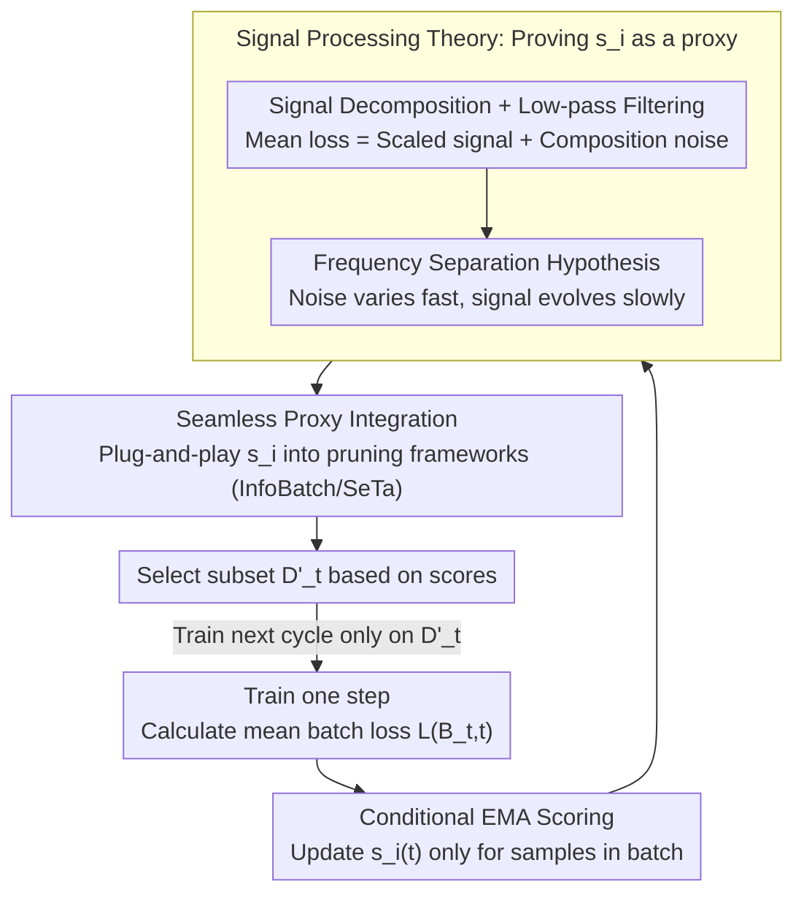

# Batch Loss Score for Dynamic Data Pruning

**Conference**: CVPR 2026  
**arXiv**: [2604.04681](https://arxiv.org/abs/2604.04681)  
**Code**: [https://github.com/mrazhou/BLS](https://github.com/mrazhou/BLS)  
**Area**: Training Efficiency / Data Pruning  
**Keywords**: dynamic data pruning, batch loss, EMA, training efficiency, sample importance

## TL;DR

Batch Loss Score (BLS) is proposed to estimate sample importance using only the mean batch loss instead of hard-to-acquire per-sample losses. Providing theoretical guarantees from a signal processing perspective via EMA low-pass filtering, it can be integrated into existing dynamic pruning frameworks with only 3 lines of code.

## Background & Motivation

Dynamic data pruning accelerates deep learning training by skipping less informative samples. Per-sample loss is the most intuitive measure of importance, but acquiring it in practice faces significant obstacles: standard training pipelines are highly optimized for computing mean batch loss, and recovering individual losses from aggregated loss is non-trivial. For complex objective functions (e.g., multi-component detection loss), defining and isolating per-sample scalars requires deep task-specific knowledge and code modification.

The core insight of BLS: while per-sample loss is difficult to obtain, mean batch loss is ubiquitous. By maintaining an Exponential Moving Average (EMA) score for each sample (updated only when the sample appears in the current batch), sample importance can be inferred indirectly.

## Method

### Overall Architecture

BLS aims to bypass the challenge of "difficult per-sample loss acquisition": standard training pipelines only calculate the mean batch loss, and extracting per-sample scalars usually requires extensive task-specific code modification. The approach maintains an EMA score for each sample, updated only when it appears in the current batch: $s_i(t) = \alpha\, s_i(t-1) + (1-\alpha)\, L(B_t, t)$. This score acts as a transparent proxy for per-sample importance, integrated back into any loss-based dynamic pruning framework. The entire process forms a **sampling → scoring → selection → retraining** loop: the mean batch loss is calculated at each training step to update the EMA scores of samples within the batch, and the framework selects the next subset based on these scores.

### Key Designs

**1. Conditional EMA Scoring: Update only when a sample appears in the current batch to accumulate a unique loss history**

This is the core algorithm of BLS. A score $s_i(t)$ is maintained for each sample $i$, initialized with the mean loss of the first batch $s_i(0)=L(\mathcal{B}_0,0)$. Subsequently, **only when the sample appears in the current batch** is the EMA updated using that batch’s mean loss: $s_i(t)=\alpha\,s_i(t-1)+(1-\alpha)\,L(\mathcal{B}_t,t)$ (if $i\in\mathcal{B}_t$), otherwise it remains unchanged. The "conditional update" allows different samples to accumulate distinct temporal histories, providing discriminative power. The mechanism uses only the mean batch loss available in standard pipelines.

**2. Signal Decomposition + Low-pass Filtering: Treating mean batch loss as "signal + noise" with EMA as a first-order IIR filter**

Why can this score proxy per-sample loss? From a single sample $i$’s perspective, the mean loss of its batch can be decomposed into two parts: its own scaled signal $\frac{1}{B} l_i(t)$ and the batch composition noise $\frac{1}{B}\sum_{j\neq i} l_j(t)$ from the other $B-1$ samples. BLS views the EMA update as a first-order IIR low-pass filter $H_\alpha$. The impulse response $h[n] = (1-\alpha)\alpha^n u[n]$ and frequency response $|H(e^{j\omega})| = \frac{1-\alpha}{\sqrt{1-2\alpha\cos(\omega)+\alpha^2}}$ are maximized at $\omega=0$ and decay with frequency. Thus, it attenuates high-frequency batch composition noise while retaining low-frequency persistent loss trends.

**3. Frequency Separation Hypothesis: Batch composition noise changes rapidly, while per-sample loss evolves slowly**

For low-pass filtering to be effective, signals and noise must be separable in the frequency domain. This work argues that batch composition noise arises from random sampling at each step, resulting in high-frequency fluctuations. Conversely, the scaled per-sample loss is driven by slow model parameter updates, resulting in low-frequency evolution. When these frequency bands are sufficiently separated, the EMA can filter out noise without erasing the signal.

**4. Seamless Proxy Integration: Plug-and-play with 3 lines of code**

The difficulty of using per-sample loss often stems from engineering overhead. The $s_i$ calculated by BLS acts as a transparent proxy for existing pruning frameworks (e.g., InfoBatch, SeTa) to replace the hard-to-extract per-sample loss. Downstream algorithms are agnostic to the score source, requiring no changes to core scheduling logic or hyperparameters. Integration requires only 3 lines of code, significantly reducing migration costs compared to invasive modifications.

### Loss & Training

BLS does not modify the training loss itself; it only affects sample selection. It replaces the "sample scoring" component within pruning frameworks, while sample selection and gradient calculation logic are inherited from the original framework.

## Key Experimental Results

### Main Results

| Dataset/Task | Method | Pruning Rate | Performance | Note |
|------------|------|--------|------|------|
| ToCa (3M, Zero-shot Captioning) | BLS-SeTa | 32% | CIDEr 71.2 | ≈ SeTa 71.5 |
| MJ+ST (15M, Text Recognition) | BLS-SeTa | 33% | IIIT5k 96.2% | ≈ Full 96.1% |
| CIFAR10 | BLS-InfoBatch | 30% | 95.5% | ≈ Full 95.6% |

BLS serves as a transparent proxy for frameworks like InfoBatch and SeTa with only 3 lines of code (vs. 33+ lines of invasive modification for InfoBatch). Downstream pruning algorithms are completely agnostic to the source of the scores.

### Key Findings

- BLS was validated across 14 datasets, 11 tasks, and 18 models, achieving lossless pruning of 20%-50% of samples.
- Performance using BLS as a proxy for per-sample loss is comparable to or better than the original methods.
- It is particularly suitable for complex scenarios (multi-component loss, large-scale data) where per-sample loss is difficult to obtain.
- BLS is initialized with the first batch's mean loss and only updates when a sample appears in the current batch.

## Highlights & Insights

- Provides rigorous theoretical guarantees for BLS from a signal processing (low-pass filtering) perspective.
- A minimalist 3-line implementation lowers the barrier to entry.
- Decouples "sample scoring" from "sample selection," allowing combination with any loss-based pruning strategy.
- The frequency separation hypothesis is intuitively clear and experimentally verified.

## Limitations & Future Work

- The EMA factor $\alpha$ may require tuning based on the specific task.
- Performance may be less accurate in the very early stages of training before scores have sufficiently accumulated.

## Rating

- Novelty: ⭐⭐⭐⭐ — Novel idea of using batch loss as a proxy for per-sample loss.
- Technical Depth: ⭐⭐⭐⭐⭐ — Rigorous theoretical analysis through signal processing.
- Experimental Thoroughness: ⭐⭐⭐⭐⭐ — 14 datasets, 11 tasks, 18 models.
- Value: ⭐⭐⭐⭐⭐ — 3 lines of code, extremely high practical utility.

<!-- RELATED:START -->

## Related Papers

- [\[CVPR 2026\] SCoRe: Salience-Coverage Reduction for Vision Token Pruning in Vision-Language Models](score_salience-coverage_reduction_for_vision_token_pruning_in_vision-language_mo.md)
- [\[CVPR 2026\] LoPrune: Efficient Data Pruning for LoRA-Based Fine-Tuning of Vision Transformer](loprune_efficient_data_pruning_for_lora-based_fine-tuning_of_vision_transformer.md)
- [\[CVPR 2026\] Model Merging on Loss Landscape: A Geometry Perspective](model_merging_on_loss_landscape_a_geometry_perspective.md)
- [\[CVPR 2026\] HeSS: Head Sensitivity Score for Sparsity Redistribution in VGGT](hess_head_sensitivity_score_for_sparsity_redistribution_in_vggt.md)
- [\[CVPR 2026\] Phased DMD: Few-step Distribution Matching Distillation via Score Matching within Subintervals](phased_dmd_few-step_distribution_matching_distillation_via_score_matching_within.md)

<!-- RELATED:END -->
