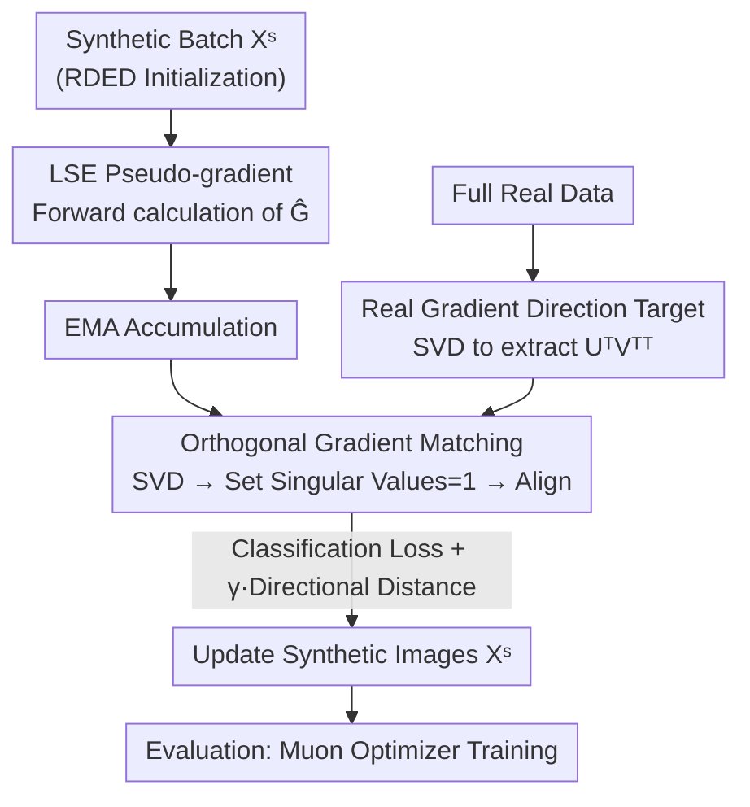

# Beyond Soft Label: Dataset Distillation via Orthogonal Gradient Matching

**Conference**: CVPR 2026  
**Paper**: [CVF Open Access](https://openaccess.thecvf.com/content/CVPR2026/html/Bo_Beyond_Soft_Label_Dataset_Distillation_via_Orthogonal_Gradient_Matching_CVPR_2026_paper.html)  
**Code**: None (Not publicly available)  
**Area**: Model Compression / Dataset Distillation  
**Keywords**: Dataset Distillation, Gradient Direction Matching, Singular Vectors, Hard Label, ImageNet-1K  

## TL;DR
Addressing the issue where existing ImageNet-1K dataset distillation methods rely excessively on BN statistics matching and suffer performance collapse without soft labels, this paper argues from a gradient perspective that BN matching only aligns gradient "scales" while ignoring the "directions" that determine training. The authors propose Orthogonal Gradient Matching (OGM), which performs SVD on real/synthetic gradients, forces all singular values to 1 to align only the singular vectors, and utilizes the closed-form gradient of the Least Squares Error (LSE) loss to complete matching during the forward pass. At IPC=10, OGM achieves 47.0% with soft labels and 16.7% with hard labels, significantly surpassing baselines like RDED.

## Background & Motivation
**Background**: Dataset Distillation (DD) aims to compress large datasets into a few synthetic images per class so that models trained on these synthetic sets approximate the performance of those trained on full data. On large-scale data like ImageNet-1K, the mainstream paradigm since SRe2L has been **matching BatchNorm statistics** (means and variances of real and synthetic data) and training students with **soft labels** generated by a teacher model as knowledge distillation.

**Limitations of Prior Work**: Such BN matching methods have two major drawbacks. First, the soft labels themselves consume a significant amount of storage space—defeating the original purpose of distillation for storage efficiency. Second, when using **hard labels** (one-hot classes without teacher guidance), their performance drops drastically, often falling behind simple coreset methods like "random subset selection." Paper Figure 1a shows that under hard labels, "advanced methods" like SRe2L and G-VBSM are completely outperformed by random subsets.

**Key Challenge**: Why do synthetic datasets fail without soft labels? The authors provide a theoretical explanation from a gradient perspective (Proposition 1): the backward gradient of a linear layer with BN is $\nabla_W L = \frac{\gamma}{\sigma}\frac{\partial L}{\partial H}X^\top$, where the variance $\sigma$ only scales the **magnitude** of the gradient, while the directional term $\frac{\partial L}{\partial H}X^\top$, which carries the optimization information, is entirely ignored by BN matching. Essentially, BN matching fails to learn the knowledge of "how to optimize the model," relying solely on teacher soft labels as a safety net.

**Key Insight & Core Idea**: The authors further conduct a critical experiment (Section 3.2) comparing SGD and Muon optimizers. Muon performs SVD on matrix gradients, discards singular values, and updates parameters using only singular vectors $UV^\top$. On sparse data with IPC=10, Muon outperforms SGD by +7.1%. This suggests that **the direction (singular vectors) rather than the scale (singular values) of the gradient is the key determinant for training, especially on small datasets**. Based on this, the core idea is: **instead of matching BN statistics or using only cosine distance, OGM orthogonalizes real/synthetic gradients and aligns their singular vectors directly**, ensuring synthetic data carries directional information for model optimization.

## Method

### Overall Architecture
The goal of OGM is to optimize a batch of synthetic images $X^S$ such that the high-order gradients they generate on a distillation network match the **direction** of gradients from the full real dataset. The process follows a local-to-global structure: "calculate real gradient directions offline as targets → online optimization of each synthetic batch to align with these targets."

Specifically, for a high-order layer (e.g., convolutional or fully connected), the gradient tensor is reshaped into a 2D matrix $G\in\mathbb{R}^{c_{out}\times c_{in}\cdot k\cdot k}$. SVD is performed such that $G=USV^\top$, and **all singular values are set to 1** to obtain the orthogonal gradient $G_o=UV^\top$, which retains only direction without scale. The matching loss is the MSE between real and synthetic directions. To avoid the double computational overhead of backpropagation, OGM approximates gradients using the **closed-form gradient of the Least Squares Error (LSE)** (a pseudo-gradient), allowing matching to be completed during the forward pass. Training includes a classification loss, supplemented by EMA, RDED initialization, patch-level augmentation, and the Muon optimizer.

### Key Designs

**1. Orthogonal Gradient Matching (OGM): Align Direction, Discard Scale**

This is the core of the paper, addressing the issue where BN matching only handles scale. Traditional Gradient Matching (GM) uses cosine distance $d(g^T,g^S)=1-\frac{g^T\cdot g^S}{\|g^T\|\|g^S\|}$, but cosine distance is suited for vectors; for **matrix gradients**, it is calculated row-wise and fails to align the matrix direction properly. OGM uses "singular vectors" as the intrinsic representation of matrix gradient direction. By setting all singular values of $G=USV^\top$ to 1, the orthogonal gradient $G_o=UV^\top$ **explicitly eliminates scale information**. The matching target is defined as the squared Frobenius norm between real and synthetic orthogonal gradients:

$$d(G^T_o, G^S_o) = \big\| U^T V^{T\top} - U^S V^{S\top} \big\|_F^2$$

The final loss combines classification and direction matching terms: $L=\sum_b L_{cls}(X^S_b,Y^S_b)+\gamma\cdot d(G^T_o,G^S_{o,b})$, with $\gamma=0.05$. Ablations (Table 3, "OGM w/o SVD") verify that matching raw gradients (without setting singular values to 1) leads to a performance drop, indicating that **scale information acts as noise** that harms synthetic data quality.

**2. Least Squares Pseudo-gradient: Forward-pass Matching without Backprop**

The efficiency bottleneck of GM methods is the requirement for backpropagation to obtain gradients, doubling distillation time. OGM avoids this by using the **closed-form gradient of Least Squares Error (LSE)**. For a linear layer $L_{LSE}=\|WX-Y\|_F^2$, the gradient is $\nabla_W L_{LSE}=WXX^\top-YX^\top$. The first term $WXX^\top$ represents channel correlations, while the second term $YX^\top$ represents class-level representations. Using im2col to treat convolutions as matrix multiplications, this is extended to CNNs by reshaping input/output feature maps into $\hat X_{in}\in\mathbb{R}^{c_{in}\times nhw}$ and $\hat X_{out}\in\mathbb{R}^{c_{out}\times nhw}$. The $YX^\top$ term is replaced with the mean feature $\mathrm{avg}(\hat X^\top_{in})$, yielding the final pseudo-gradient:

$$\hat G = \frac{1}{nhw}\hat X_{out}\hat X^\top_{in} - \mathrm{avg}(\hat X^\top_{in})$$

This pseudo-gradient is calculated entirely during the **forward pass**, significantly reducing computational complexity.

**3. Engineering Implementation: EMA + RDED Initialization + Patch Augmentation + Muon Evaluation**

Under the local-to-global framework, each synthetic batch approximates the full real data, but independence between batches can lead to a lack of diversity. OGM uses **EMA** to accumulate pseudo-gradients across batches: $\hat G^S_b=\frac{1}{b}\hat G^S_b+(1-\frac{1}{b})\hat G^S_{b-1}$. For **initialization**, it uses images synthesized by RDED rather than Gaussian noise to preserve semantics. For **augmentation**, since global RandomResizedCrop can confuse different patches, **patch-level augmentation** is used to prevent overfitting. Finally, the **Muon optimizer** is used during the evaluation phase to maximize the potential of synthetic data.

### Loss & Training
The total loss is $L=\sum_{b=1}^{B}L_{cls}(X^S_b,Y^S_b)+\gamma\cdot d(G^T_o,G^S_{o,b})$, with $\gamma=0.05$. Both distillation and evaluation use ResNet-18. Per Algorithm 2: for each synthetic batch and convolutional layer, calculate feature maps → pseudo-gradients → EMA → SVD orthogonalization → minimize total loss to update synthetic images.

## Key Experimental Results

Experiments were performed on ImageNet-1K using CDA's evaluation strategy for fairness, with a ResNet-18 backbone.

### Main Results

Under the soft label setting, performance is competitive across methods, with OGM being the best:

| IPC | Random | RDED | SRe2L | G-VBSM | DWA | OGM |
|-----|--------|------|-------|--------|-----|-----|
| 10 | 35.8 | 38.4 | 33.5 | 35.8 | 37.9 | **39.4** |
| 50 | 57.2 | 56.2 | 52.6 | 54.8 | 55.2 | **57.5** |
| 100 | 61.2 | 60.2 | 57.4 | 59.2 | 59.2 | **61.5** |

Under the hard label setting, the gap widens significantly—training-based BN matching methods (SRe2L/CDA/G-VBSM/LPLD/DWA) fail even against random subsets, whereas OGM is the only training-based method to exceed the strong training-free baseline RDED:

| IPC | Random | RDED | SRe2L | CDA | G-VBSM | DWA | OGM |
|-----|--------|------|-------|-----|--------|-----|-----|
| 10 | 4.6 | 11.5 | 1.5 | 1.6 | 1.6 | 1.9 | **11.8** |
| 50 | 20.6 | 30.8 | 3.8 | 5.8 | 9.0 | 5.3 | **31.2** |
| 100 | 31.7 | 39.2 | 4.9 | 8.0 | 16.6 | 7.5 | **39.5** |

Notably, OGM at IPC=50 performs similarly to random images at IPC=100, effectively doubling storage efficiency.

### Ablation Study

Table 3 (IPC=10) breaks down the components of OGM and compares the impact of SVD orthogonalization:

| Configuration | Soft Label (w/ SVD) | Hard Label (w/ SVD) | Soft Label (w/o SVD) | Hard Label (w/o SVD) |
|------|---------------|---------------|----------------|----------------|
| Basic (Real Init) | 35.4 | 5.3 | 35.0 | 3.9 |
| + RDED Init | 37.8 | 10.2 | 37.5 | 9.5 |
| + Patch Aug | 39.4 | 11.8 | 38.8 | 10.6 |
| + Muon Eval | **47.0** | **16.7** | 45.4 | 14.8 |

### Key Findings
- **SVD Orthogonalization provides real gain**: Comparing w/ SVD vs. w/o SVD shows consistent improvements (e.g., 16.7% vs 14.8% for hard labels), confirming that discarding singular values/scales enhances synthetic data quality.
- **Incremental Gains from Components**: Hard label performance increases from Basic 5.3 → RDED Init 10.2 → Patch Aug 11.8 → Muon 16.7; the Muon optimizer provides the largest jump.
- **Strong Cross-Architecture Generalization**: OGM consistently outperforms RDED on ResNet-50/101, EfficientNet, MobileNetV2, and ConvNext-Tiny.

## Highlights & Insights
- **Bridging Optimizer Theory and DD**: By drawing from singular vector update perspectives (Muon/Shampoo), the paper reinterprets why BN matching fails without soft labels—the diagnosis itself is a significant contribution.
- **Pseudo-gradients for Efficiency**: Mapping gradient matching into forward-pass matrix operations is a reusable engineering trick for bi-level optimizations requiring repeated gradient calculations.
- **Simplicity of Orthogonalization**: Setting singular values to 1 is a simple yet effective design that removes noise, following a "less is more" philosophy.

## Limitations & Future Work
- The method **only applies direction matching to high-order (matrix) parameters**; vectors like bias and normalization are excluded.
- The use of $\mathrm{avg}(\hat X^\top_{in})$ to replace class-specific terms in pseudo-gradients is an approximation with potential information loss.
- The best results depend on introducing Muon during evaluation; while a fair comparison was maintained using Adam for qualitative tests, the peak performance (47.0%) may be tied to the specific optimizer.
- The observation that ResNet-18 outperforms larger models under hard labels suggests current DD still lacks optimal transferability of optimization information.

## Related Work & Insights
- **Comparison with SRe2L / G-VBSM (BN Matching)**: These methods align BN statistics (scales) and rely on soft labels. OGM aligns directions (singular vectors), enabling high performance even with hard labels.
- **Comparison with Classic Gradient Matching (GM)**: GM uses row-wise cosine distance, which doesn't perfectly align matrix directions. OGM treats the matrix as a whole and uses pseudo-gradients to eliminate the need for backpropagation.
- **Comparison with RDED (Training-free)**: RDED is used for initialization; OGM demonstrates that further optimization beyond initialization provides substantial gains in learning directional optimization info.

## Rating
- Novelty: ⭐⭐⭐⭐⭐ 
- Experimental Thoroughness: ⭐⭐⭐⭐ 
- Writing Quality: ⭐⭐⭐⭐⭐ 
- Value: ⭐⭐⭐⭐ 

<!-- RELATED:START -->

## Related Papers

- [\[CVPR 2026\] Dataset Distillation by Influence Matching](dataset_distillation_by_influence_matching.md)
- [\[CVPR 2026\] DMGD: Train-Free Dataset Distillation with Semantic-Distribution Matching in Diffusion Models](dmgd_train-free_dataset_distillation_with_semantic-distribution_matching_in_diff.md)
- [\[NeurIPS 2025\] Rectifying Soft-Label Entangled Bias in Long-Tailed Dataset Distillation](../../NeurIPS2025/model_compression/rectifying_soft-label_entangled_bias_in_long-tailed_dataset_distillation.md)
- [\[CVPR 2026\] Rethinking Dataset Distillation: Hard Truths about Soft Labels](rethinking_dataset_distillation_hard_truths_about_soft_labels.md)
- [\[CVPR 2026\] Mitigating The Distribution Shift of Diffusion-based Dataset Distillation](mitigating_the_distribution_shift_of_diffusion-based_dataset_distillation.md)

<!-- RELATED:END -->
