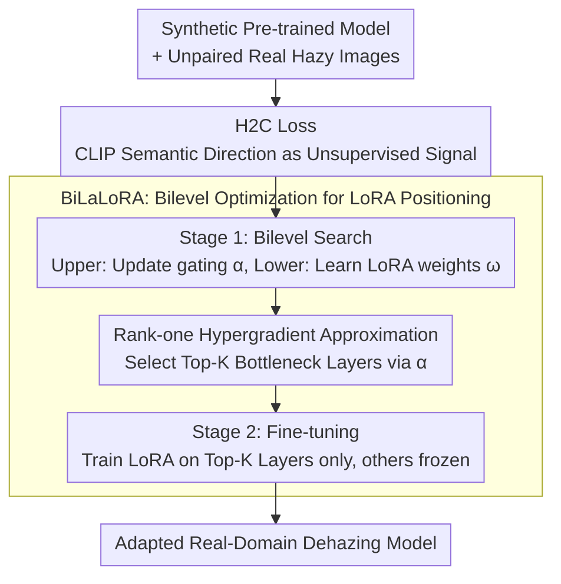

# Bilevel Layer-Positioning LoRA for Real Image Dehazing

**Conference**: CVPR2026  
**arXiv**: [2603.10872](https://arxiv.org/abs/2603.10872)  
**Code**: [GitHub](https://github.com/YanZhang-zy/BiLaLoRA)  
**Area**: Model Compression  
**Keywords**: image dehazing, LoRA, bilevel optimization, CLIP, unsupervised adaptation, parameter-efficient fine-tuning

## TL;DR

Ours proposes BiLaLoRA, which automatically locates the optimal network layers for LoRA insertion through bilevel optimization. Combined with H2C Loss (an unsupervised dehazing loss based on CLIP semantic directions), it achieves efficient adaptation of synthetic-data pre-trained dehazing models to real-world scenarios—reducing training time by 77.7% while maintaining performance comparable to full fine-tuning across models and domains.

## Background & Motivation

Image dehazing is a classic low-level vision problem. Current mainstream methods rely on supervised training with synthetic data (e.g., ITS/OTS from RESIDE), but face severe domain gap issues:

**Synthetic-Real Domain Gap**: Synthetic hazy images generated via the atmospheric scattering model $I(x) = J(x)t(x) + A(1-t(x))$ differ significantly from complex real-world degradation (non-uniform haze, color shifts, multi-layer haze, etc.).

**Unpaired Real Data**: It is nearly impossible to obtain paired hazy/haze-free images in real scenarios, making traditional supervised fine-tuning infeasible.

**High Cost of Full Fine-tuning**: For Transformer-based dehazing models, fine-tuning all parameters is time-consuming and prone to overfitting on limited adaptation data.

Limitations of Prior Work:
- **Domain Adaptation Methods** (DA-dehazing, USID-Net) use CycleGAN-style translation, but training is unstable and may introduce artifacts.
- **LoRA Fine-tuning** reduces parameter count, but **where to insert LoRA is critical**—random selection or uniform distribution is far from optimal.

## Core Problem

How to adapt a dehazing model pre-trained on synthetic data to real hazy scenarios with minimal training cost and no real-world paired supervision? Specifically:
1. Designing an unsupervised optimization objective without real GT.
2. Automating and optimizing the selection of LoRA layers.

## Method

### Overall Architecture

BiLaLoRA aims to adapt a dehazing model pre-trained on synthetic haze to real scenarios without paired supervision or the cost of full fine-tuning. The pipeline decouples "what signal to train with" and "where to train"—the former utilizes the unsupervised H2C Loss instead of missing real GT, while the latter uses bilevel optimization (BiLaLoRA) to automatically locate "bottleneck layers" for LoRA insertion. The key insight is that bottleneck layers affected by domain gaps are not fixed but vary dynamically with the backbone (the end of the encoder often contributes most, though specifics depend on the architecture); thus, layer selection must be automated. BiLaLoRA execution involves two stages: Stage 1 (Bilevel Search) learns layer-selection gating $\alpha$ and LoRA weights $\omega$ simultaneously, selecting Top-K layers based on $\alpha$; Stage 2 (LoRA Fine-tuning) trains LoRA only on these Top-K layers while freezing others. Both stages use H2C Loss.

### Key Designs

**1. H2C Loss: CLIP Semantic Direction as Supervision without Real GT**

Real scenarios lack paired hazy/haze-free images. H2C Loss leverages the aligned vision-language space of CLIP to reformulate "dehazing" as cross-modal semantic alignment. A negative prompt $T_{\text{neg}}$ ("a photo with haze") and a positive prompt $T_{\text{pos}}$ ("a clear photo") are encoded via the CLIP text encoder. The difference $\Delta T_{\text{text}} = T_{\text{pos}} - T_{\text{neg}}$ represents the ideal "hazy to clear" semantic direction. Adapting to different scenarios (e.g., nighttime haze) only requires changing the prompts.

Correspondingly, hazy input $I_{\text{in}}$ and dehazed output $I_{\text{out}}$ are passed through the CLIP image encoder to obtain a displacement vector $\Delta V_{\text{img}} = V_{\text{out}} - V_{\text{in}}$, where $V_{\text{in}} = \text{CLIP}_{\text{img}}(I_{\text{in}})$ and $V_{\text{out}} = \text{CLIP}_{\text{img}}(I_{\text{out}})$. The loss enforces alignment between these directions via cosine similarity:

$$\mathcal{L}_{\text{H2C}} = 1 - \frac{\Delta V_{\text{img}} \cdot \Delta T_{\text{text}}}{\|\Delta V_{\text{img}}\|_2 \cdot \|\Delta T_{\text{text}}\|_2}$$

The key lies in "directional alignment" rather than "absolute distance"—it constrains the image to move toward a clear direction without forcing the output to match a specific text, avoiding artifacts and training instability typical of CycleGAN method.

**2. BiLaLoRA: Modeling LoRA layer positioning as Differentiable Bilevel Optimization**

LoRA efficiency depends heavily on layer placement. However, bottleneck layers affected by domain gaps vary across architectures. BiLaLoRA reformulates layer selection as a differentiable architecture search by attaching a learnable gating $\alpha$ (constrained to $(0,1)$ via sigmoid) to each candidate LoRA module, modulating the contribution of the low-rank increment alongside the scaling factor $\gamma$:

$$W' = W_0 + \alpha \cdot \gamma \cdot \Delta W$$

The gating $\alpha$ and LoRA weights $\omega$ involve hierarchical dependencies that single-level optimization cannot capture. This is formulated as a bilevel optimization problem where the upper level selects layers and the lower level learns weights:

$$\min_{\alpha} \varphi(\omega^*(\alpha), \alpha), \quad \text{s.t.}\ \omega^*(\alpha) \in \arg\min_{\omega} \psi(\omega, \alpha)$$

To avoid the prohibitive cost of second-order Hessian inversion in the hypergradient $\nabla_\alpha \varphi$, a rank-one outer product approximation is used, reducing the hypergradient to first-order derivatives:

$$g_\alpha \approx \nabla_\alpha \varphi - \frac{\nabla_\omega \varphi^\top \nabla_\omega f}{\|\nabla_\omega f\|^2} \nabla_\alpha f$$

This step facilitates automatic and efficient layer selection, while training time is drastically saved by only fine-tuning Top-K layers in Stage 2.

### Loss & Training

The pipeline uses H2C Loss as the sole objective and proceeds in two stages: **Stage 1 (Bilevel Positioning, $t=0 \ldots T_s-1$)** performs alternating updates—arch parameters $\alpha$ are updated via rank-one hypergradients, followed by LoRA weights $\omega$. At the switching epoch $T_s$, Top-K layers are fixed based on $\alpha$ values. **Stage 2 (LoRA Fine-tuning, $t=T_s \ldots T$)** freezes the selection $\alpha^*$ and focuses solely on training LoRA weights in those Top-K layers.

## Key Experimental Results

### Performance Across Model Backbones

BiLaLoRA is effective across four distinct dehazing backbones:

| Base Model | Method | RTTS (MUSIQ↑) | URHI (MUSIQ↑) | Parameters |
|:---:|:---:|:---:|:---:|:---:|
| MSBDN | Full Fine-tuning | Baseline | Baseline | 100% |
| MSBDN | **BiLaLoRA** | **Comparable** | **Comparable** | ~5% |
| DeHamer | Full Fine-tuning | Baseline | Baseline | 100% |
| DeHamer | **BiLaLoRA** | **Comparable** | **Comparable** | ~5% |
| ConvIR | Full Fine-tuning | Baseline | Baseline | 100% |
| ConvIR | **BiLaLoRA** | **Comparable** | **Comparable** | ~5% |
| DEA | Full Fine-tuning | Baseline | Baseline | 100% |
| DEA | **BiLaLoRA** | **Comparable** | **Comparable** | ~5% |

### Main Results

| Method | RTTS | URHI | Fattal |
|:---:|:---:|:---:|:---:|
| DAD (CVPR 2020) | Low | Low | Low |
| USID-Net (TIP 2022) | Mid | Mid | Mid |
| **BiLaLoRA (Ours)** | **SOTA** | **SOTA** | **SOTA** |

Ours achieves SOTA results on RTTS, URHI, and Fattal real-world datasets.

### Efficiency

| Method | Training Time | Rel. to Full Fine-tuning |
|:---:|:---:|:---:|
| Full Fine-tuning | 100% | Baseline |
| LoRA (Uniform) | ~40% | -60% |
| **BiLaLoRA** | **~22.3%** | **-77.7%** |

Training time is reduced by 77.7% as Stage 2 only trains a subset of layers.

### Ablation Study

| Component | MUSIQ | Description |
|:---:|:---:|:---:|
| Full BiLaLoRA | Best | — |
| w/o H2C Loss (use L1) | Significant drop | Cannot adapt without supervision |
| Uniform LoRA (no Search) | Drop | Highlighting importance of layer selection |
| Random Selection | Further drop | Random is worse than uniform |
| Full-Layer LoRA | Mid | More params but less effective than positioning |

### Cross-Domain Adaptation

| Training Data | Test Data | BiLaLoRA Effect |
|:---:|:---:|:---:|
| ITS (Indoor Synthetic) | RTTS (Real) | Effective |
| OTS (Outdoor Synthetic) | URHI (Real) | Effective |
| Daytime Haze | Nighttime Haze | Effective |
| Synthetic A | Synthetic B | Effective |

## Highlights & Insights

1.  **Elegant H2C Loss**: Leverages CLIP's semantic space for unsupervised loss construction; more stable than CycleGAN and artifact-free. Use of "direction" instead of "distance" allows adaptation by simply changing prompts.
2.  **NAS for LoRA Placement**: Introduces differentiable architecture search to LoRA positioning, avoiding manual trial and error.
3.  **Efficiency via Rank-one Approximation**: Simplifies the hypergradient from second-order to first-order, making bilevel optimization practical for large models.
4.  **Generality**: Proven effective across both CNN and Transformer architectures.
5.  **Two-stage Decoupling**: Separating search from training allows fast convergence on the most critical bottleneck layers.

## Limitations & Future Work

1.  **CLIP Dependency**: H2C Loss quality depends on the CLIP semantic space; it may be less accurate for degradation types not well-represented in CLIP.
2.  **Top-K Hard Truncation**: Fixing Top-K layers is a discrete approximation that might overlook marginal contributions from other layers.
3.  **Task Scope**: Currently only validated on dehazing; effectiveness for other low-level tasks (deraining, denoising, SR) remains to be seen.
4.  **Reference Metrics Missing**: Primarily evaluated with no-reference metrics (MUSIQ); lacks validation with reference-based metrics (PSNR/SSIM) on paired sets.
5.  **Foundation Model Baseline**: Comparisons with recent generative dehazing methods (e.g., Stable Diffusion based) are missing.

## Related Work & Insights

- **Vs. Standard LoRA**: Uniform LoRA insertion is inferior to adaptive positioning, proving "where to insert" is more vital than "how much to insert."
- **Vs. DARTS**: BiLaLoRA adapts the bilevel optimization of DARTS to PEFT layer selection—an intersection of NAS and PEFT.
- **Vs. CLIP-guided Methods**: Like CLIPasso or StyleCLIP, it uses semantic directions but adapts this to physical degradation in low-level vision.
- **Inspiration**: The bilevel positioning logic can be extended to other PEFT methods like Adapters or Prefix Tuning.

## Rating

- **Novelty**: ⭐⭐⭐⭐
- **Experimental Thoroughness**: ⭐⭐⭐⭐
- **Value**: ⭐⭐⭐⭐⭐
- **Writing Quality**: ⭐⭐⭐⭐
- **Overall**: ⭐⭐⭐⭐ (4.0/5)

<!-- RELATED:START -->

## Related Papers

- [\[CVPR 2025\] CoA: Towards Real Image Dehazing via Compression-and-Adaptation](../../CVPR2025/model_compression/coa_towards_real_image_dehazing_via_compression-and-adaptation.md)
- [\[CVPR 2026\] Towards Generalizable AI-Generated Image Detection via Image-Adaptive Prompt Learning](towards_generalizable_ai-generated_image_detection_via_image-adaptive_prompt_lea.md)
- [\[ICLR 2026\] LD-MoLE: Learnable Dynamic Routing for Mixture of LoRA Experts](../../ICLR2026/model_compression/ld-mole_learnable_dynamic_routing_for_mixture_of_lora_experts.md)
- [\[CVPR 2026\] One Layer's Trash is Another Layer's Treasure: Adaptive Layer-wise Visual Token Selection in LVLMs](one_layers_trash_is_another_layers_treasure_adaptive_layer-wise_visual_token_sel.md)
- [\[CVPR 2026\] AdaBet: Gradient-free Layer Selection for Efficient Training of Deep Neural Networks](adabet_gradient-free_layer_selection_for_efficient_training_of_deep_neural_netwo.md)

<!-- RELATED:END -->
