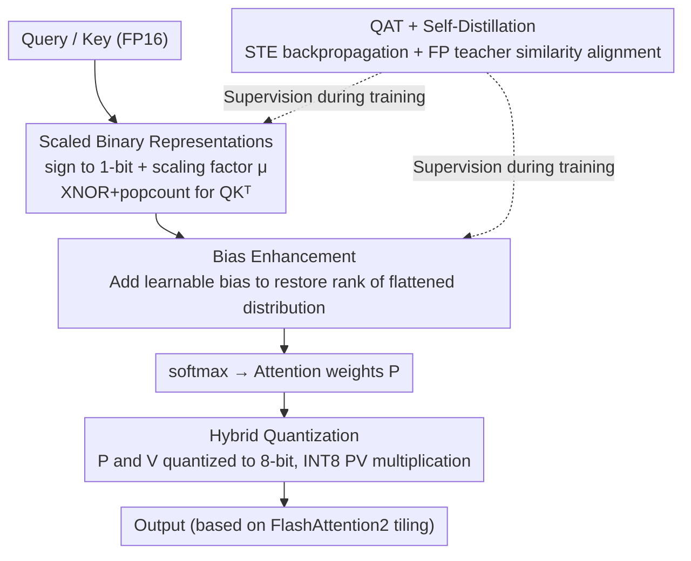

# BinaryAttention: One-Bit QK-Attention for Vision and Diffusion Transformers

**Conference**: CVPR 2026  
**arXiv**: [2603.09582](https://arxiv.org/abs/2603.09582)  
**Code**: [EdwardChasel/BinaryAttention](https://github.com/EdwardChasel/BinaryAttention)  
**Area**: Model Compression  
**Keywords**: attention quantization, binary quantization, vision transformer, diffusion transformer, 1-bit attention, FlashAttention

## TL;DR

BinaryAttention is proposed to quantize the Query and Key in Transformer attention into 1-bit binary representations. By replacing floating-point dot products with XNOR + popcount bitwise operations, it achieves over $2\times$ speedup compared to FlashAttention2 on A100 GPUs, while maintaining or even surpassing full-precision attention performance across vision classification, detection, segmentation, and diffusion generation tasks.

## Background & Motivation

**Background**: Standard Transformer attention computation complexity grows quadratically with sequence length, becoming the primary inference bottleneck in high-resolution vision tasks.

**Limitations of Prior Work**: Existing SageAttention series quantize QK to INT8/INT4/FP4. However, further reduction to sub-4-bit, especially binary (1-bit), leads to severe information loss, unstable optimization, and sharp performance degradation.

**Cost of Architectural Alternatives**: Alternatives like Linear Attention, Sparse Attention, and SSMs (e.g., Mamba) reduce complexity but often at the cost of the expressive power inherent in standard attention across diverse tasks.

**Key Insight**: NVIDIA A100 Tensor Cores support binary operations with a theoretical throughput of 4992 TOPs/s, which is $16\times$ that of FP16, providing a hardware foundation for extreme low-bit attention.

**Theoretical Feasibility**: The authors demonstrate from the perspectives of distance metrics (Hamming vs. Euclidean) and directional similarity (cosine similarity preservation) that the core "similarity relations" in attention can be preserved after binarization.

**Goal**: Orthogonal to architectural changes, quantizing attention computation is a plug-and-play acceleration method that keeps the architecture unchanged, offering greater universality and practicality.

## Method

### Overall Architecture

BinaryAttention replaces the most computationally expensive $\mathbf{QK}^\top$ dot product with bitwise operations to achieve acceleration without changing the attention architecture. The pipeline involves: quantizing Query/Key into 1-bit binary vectors with scaling factors; using XNOR + popcount for similarity computation (Scaled Binary Representations); adding a learnable bias to the binary scores to recover the flattened attention distribution (Bias Enhancement); quantizing the post-softmax attention coefficients and Value to 8-bit for accelerated PV multiplication (Hybrid Quantization); and implementing the entire scheme via QAT + self-distillation. The kernel is built upon the FlashAttention2 tiled attention framework to reuse IO-friendly tiling, ensuring acceleration is additive to FlashAttention2.

### Key Designs

**1. Scaled Binary Representations: Compressing Q/K to 1-bit for Bitwise Similarity**

The objective is to convert floating-point $\mathbf{QK}^\top$ into bitwise operations. Each query $\mathbf{q}_i$ and key $\mathbf{k}_j$ is compressed into $\{-1,+1\}^d$ binary vectors via the sign function and multiplied by scalar scaling factors: $\mathbf{s}_i = \mu_q \cdot \text{sign}(\mathbf{q}_i)$, $\mathbf{t}_j = \mu_k \cdot \text{sign}(\mathbf{k}_j)$. The vector multiplication in the similarity $\mu_q \mu_k\, \mathbf{s}_i^\top \mathbf{t}_j$ consists only of $\pm1$ products, executable via a single XNOR + popcount instruction. This theoretically yields $16\times$ throughput on A100. Theorem 1 proves that the outer product of binary Q/K is a consistent estimate of the original covariance matrix, meaning the similarity structure is statistically preserved despite losing magnitude.

**2. Bias Enhancement: Restoring the Flattened Attention Distribution**

1-bit quantization discards magnitude entirely, causing the rank of the attention score matrix to drop and the post-softmax distribution to become nearly uniform (the "flattened effect"). To fix this, a bias term is added to the binary dot product:

$$S_{ij} = \mu_q \mu_k\, \mathbf{s}_i^\top \mathbf{t}_j / \sqrt{d} + b_{ij}$$

where $b_{ij}$ can be a dense learnable matrix, relative position bias, or context-aware bias. This re-injects spatial and contextual information, increases the matrix rank, and allows softmax to recover the ability to distinguish salient features. This is critical for small models (DeiT-T +0.44%) which lack redundancy.

**3. Hybrid Quantization: Accelerating PV Multiplication**

To achieve end-to-end speedup, the $\mathbf{PV}$ multiplication between the post-softmax coefficient matrix $P$ and Value $V$ must also be addressed. Static unsigned 8-bit quantization is used for $P_{ij}$ (scale fixed at $1/255$ as coefficients lie in $[0,1]$), and channel-wise 8-bit quantization for $V_j$. The multiplication utilizes the INT8 Tensor Core instruction `mma.s32.u8.s8.s32`, providing a $2\times$ speedup. Using 8-bit here ensures precision where numerical ranges are moderate, while the combined $16\times$ (QK) and $2\times$ (PV) gains yield significant end-to-end acceleration.

**4. QAT + Self-Distillation: Resisting 1-bit Distribution Drift**

Since 1-bit quantization introduces large approximation errors, Quantization-Aware Training (QAT) is employed. Forward passes use the actual sign quantization, while backward passes use the Straight-Through Estimator (STE). A full-precision pre-trained model acts as a teacher for self-distillation, with a loss function forcing the binary attention similarity to align with the teacher's sign-aligned similarity. This allows the model to adapt to quantization noise and provides a clear alignment target.

## Loss & Training

- **QAT Strategy**: Sign quantization for Q/K in forward pass; STE gradient approximation in backward pass.
- **Self-Distillation**: Use an FP pre-trained teacher model; distillation loss encourages binary attention to match the teacher's sign-aligned similarity.
- **Mechanism**: Built on FlashAttention2; QK uses `mma.s32.b1.b1.s32` PTX instructions, PV uses `mma.s32.u8.s8.s32`.

## Key Experimental Results

### Table 1: ImageNet-1K Image Classification (Top-1 Accuracy)

| Method | Size | Resolution | OPs | Top-1 (%) |
|------|------|--------|-----|-----------|
| DeiT-T (FlashAttention2) | 6M | 224² | 1.2G | 72.2 |
| SageAttention-T | 6M | 224² | 1.2G | 72.11 |
| **BinaryAttention-T (Ours)** | **6M** | **224²** | **1.1G** | **72.88** |
| DeiT-S | 22M | 224² | 4.6G | 79.8 |
| SageAttention-S | 22M | 224² | 4.5G | 79.82 |
| **BinaryAttention-S (Ours)** | **22M** | **224²** | **4.3G** | **80.24** |
| DeiT-B | 87M | 384² | 55.4G | 83.1 |
| SageAttention-B | 87M | 384² | 53.2G | 82.89 |
| **BinaryAttention-B (Ours)** | **87M** | **384²** | **50.2G** | **83.64** |

### Table 2: ADE20K Semantic Segmentation (mIoU)

| Backbone | OPs | mIoU (SS) | mIoU (MS) |
|----------|-----|-----------|-----------|
| DeiT-B | 2654G | 46.86 | 47.74 |
| SageAttention-B | 2539G | 46.86 | 47.74 |
| **BinaryAttention-B (Ours)** | **2384G** | **47.76** | **48.37** |

### Table 3: DiT-XL/2 Image Generation (ImageNet 256×256, cfg=1.50)

| Method | OPs | Training Steps | FID↓ | IS↑ |
|------|-----|---------|------|-----|
| FlashAttention2 | 118.6G | 7000K | 2.27 | 278.24 |
| SageAttention | 117.1G | 7000K | 2.27 | 278.03 |
| **BinaryAttention (Ours)** | **115.0G** | **4000K** | **2.19** | **278.03** |

### Table 4: Ablation Study (ImageNet-1K Top-1)

| Scale | Bias | Distill | DeiT-T | DeiT-S | DeiT-B |
|-------|------|---------|--------|--------|--------|
| ✗ | ✗ | ✗ | 71.95 | 79.59 | 81.10 |
| ✓ | ✗ | ✗ | 72.42 | 79.81 | 81.33 |
| ✓ | ✗ | ✓ | 72.44 | 79.97 | 81.99 |
| ✓ | ✓ | ✓ | **72.88** | **80.24** | **82.04** |

## Highlights & Insights

1.  **Theory & Practice**: Theorem 1 provides theoretical guarantees for covariance structure preservation under Gaussian assumptions, distinguishing it from purely empirical quantization works.
2.  **Surpassing Full-Precision**: In several tasks, BinaryAttention outperforms FP FlashAttention2, suggesting that QAT + distillation acts as a form of regularization.
3.  **Significant Acceleration**: At the kernel level, it is $2\times$ faster than FlashAttention2; end-to-end it is $1.5\times$ faster for $1024^2$ inputs.
4.  **Generative Efficacy**: Achieves comparable or better FID on DiT/SiT diffusion models with fewer training steps, demonstrating viability for generative AI.
5.  **Smart Bias Design**: Combating distribution collapse via simple relative position bias is highly effective, especially for smaller models.

## Limitations & Future Work

1.  **Requirement for QAT**: Not a PTQ solution; requires fine-tuning from a full-precision model, increasing deployment costs.
2.  **Hardware Dependency**: Binary Tensor Core instructions (`mma.b1`) are currently unique to NVIDIA GPUs; portability to other platforms is unexplored.
3.  **Theoretical Assumptions**: Theorem 1 relies on zero-mean Gaussian assumptions; actual Q/K distributions might deviate, limiting the strictly rigorous nature of the guarantee.
4.  **Scale Verification**: Experiments capped at DeiT-B / DiT-XL sizes (~87M parameters); applicability to ViT-L/H or LMMs (e.g., LLaVA) is unknown.
5.  **Value Quantization Limit**: Value still remains at 8-bit. Further compression of V could yield even higher gains in the PV phase.

## Related Work & Insights

- **SageAttention Series** [Zhang et al.]: Progressive path from INT8 to FP4; BinaryAttention pushes this to the 1-bit limit.
- **FlashAttention** [Dao et al.]: IO-aware tiled framework; BinaryAttention serves as a complementary hardware optimization layer.
- **Binary Neural Networks** (e.g., BiBERT): Previously focused on linear layers; this work successfully applies binarization to attention QK computation.
- **DiT / SiT**: Representation of diffusion Transformers; this work validates binary attention for generative models.

## Rating

- **Novelty**: ⭐⭐⭐⭐ — Successfully pushes QK to 1-bit without performance loss; deep theoretical analysis.
- **Experimental Thoroughness**: ⭐⭐⭐⭐⭐ — Covers classification, detection, segmentation, and generation; comprehensive ablations.
- **Writing Quality**: ⭐⭐⭐⭐ — Clear derivations, organized experiments, intuitive design motivations.
- **Value**: ⭐⭐⭐⭐ — Significant practical speedup, plug-and-play, and complementary to existing methods.

<!-- RELATED:START -->

## Related Papers

- [\[CVPR 2026\] Trainable Log-linear Sparse Attention for Efficient Diffusion Transformers](trainable_log-linear_sparse_attention_for_efficient_diffusion_transformers.md)
- [\[CVPR 2026\] ResCa: Residual Caching for Diffusion Transformers Acceleration](resca_residual_caching_for_diffusion_transformers_acceleration.md)
- [\[CVPR 2026\] LS-ViT: Least-Squares Hessian Based Block Reconstruction for Low-Bit Post-Training Quantization of Vision Transformers](ls-vit_least-squares_hessian_based_block_reconstruction_for_low-bit_post-trainin.md)
- [\[CVPR 2026\] Saliency-Driven Token Merging for Vision Transformers](saliency-driven_token_merging_for_vision_transformers.md)
- [\[CVPR 2026\] PPCL: Pluggable Pruning with Contiguous Layer Distillation for Diffusion Transformers](ppcl_pluggable_pruning_dit_distillation.md)

<!-- RELATED:END -->
