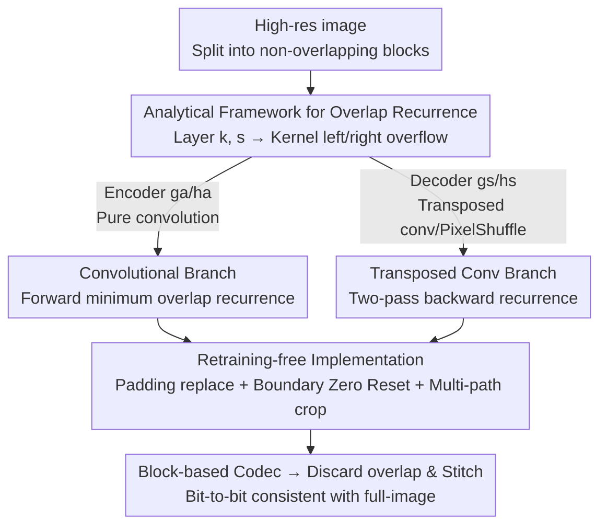

# Block-based Learned Image Compression without Blocking Artifacts

**Conference**: CVPR 2026  
**Paper**: [CVF Open Access](https://openaccess.thecvf.com/content/CVPR2026/html/Kim_Block-based_Learned_Image_Compression_without_Blocking_Artifacts_CVPR_2026_paper.html)  
**Code**: None  
**Area**: Model Compression / Learned Image Compression  
**Keywords**: Learned image compression, block-based encoding, overlapping propagation, peak memory, retraining-free  

## TL;DR
This paper utilizes a set of analytical recurrence formulas to precisely calculate the **minimum overlap** required for each layer when a CNN-based image compression model is executed block-wise. This enables off-the-shelf models to run on a per-block basis without retraining, reducing peak memory to approximately 13% while achieving bit-to-bit consistency with full-image inference and completely eliminating block boundary artifacts.

## Background & Motivation
**Background**: Learned Image Compression (LIC) has reached or even surpassed traditional codecs like VVC. The mainstream approach is Ballé's VAE architecture—an encoder $g_a$ transforms image $x$ into latents $y$, a hyper-encoder $h_a$ extracts statistics $z$, and the decoder reconstructs the image using an entropy model.

**Limitations of Prior Work**: These models suffer from exploding peak memory when decoding high-resolution images. For instance, decoding a single 4K image with ELIC requires approximately 3.95 GB of VRAM, which is prohibitive for mobile or embedded devices. While traditional codecs utilize **block-based processing** (e.g., 8×8 DCT in JPEG, block partitioning in HEVC/VVC) to save memory, CNN-based LIC relies on wide receptive fields. Simple tiling without block-external information leads to severe blocking artifacts at low bitrates.

**Key Challenge**: There is a direct conflict between memory efficiency (independent block processing) and artifact-free reconstruction (requiring cross-block context). Existing hybrid solutions either append a post-processing network to suppress artifacts (introducing non-negligible computational overhead and only reducing average artifacts) or add an **overlap** to each block like JPEG-AI to introduce extra-boundary context.

**Goal**: Enable off-the-shelf LIC models to run block-wise while maintaining artifact-free reconstruction and Rate-Distortion (RD) performance without requiring retraining.

**Key Insight**: JPEG-AI's patch-based approach is on the right track—adding overlap provides extra-boundary context. However, it relies on **empirical search** to determine the overlap size: too small an overlap leaves residual artifacts, while too large an overlap wastes memory and computation. Furthermore, the search must be repeated for every architecture change. The authors observe that the required overlap is actually **entirely determined by the network structure** (kernel size and stride for each layer) and can be derived analytically.

**Core Idea**: Formulate the **propagation** of overlap through convolutional and transposed convolutional layers as a recurrence relation. This allows the analytical calculation of the minimum overlap per layer required to guarantee "block-level reconstruction equivalent to full-image inference." This is paired with retraining-free implementation rules to convert any CNN-based LIC into a block-based version.

## Method

### Overall Architecture
The method solves what appears to be an engineering problem through rigorous derivation: splitting a high-resolution image into blocks, each with a calculated "overlap margin," and feeding them independently into the LIC model. After processing, the overlaps are discarded and the blocks are stitched. If the overlap is **just large enough**, the result is bit-to-bit identical to full-image inference. The pipeline has two stages: **offline analysis** to calculate the minimum overlap $(l_n, r_n)$ per layer, and **online block-wise execution** using implementation rules (padding, boundary zero-reset, multi-path rules).

The key insight is that receptive fields expand cumulatively across layers. Therefore, the neighborhood size needed at layer $N$ (input) to produce a correct pixel at layer 0 (output) can be derived layer by layer. For encoders $g_a, h_a$ (convolutions only), overlap grows **along the layer index**. For decoders $g_s, h_s$ (transposed convolutions/PixelShuffle), overlap grows **backwards from the output toward the input**.

### Key Designs

**1. Analytical Framework for Overlap Propagation: Formalizing Receptive Field Expansion**

This is the foundation of the work, addressing the pain point of empirical overlap search. The authors assume: **Assumption 1**: input size is a multiple of the stride, ensuring strict downsampling/upsampling factors ($s_n$); **Assumption 2**: the kernel center aligns with the first element of the unpadded input and moves by $s_n$. Under these, the kernel center index is $c_n=\lfloor (k_n-1)/2\rfloor$. The elements extending beyond the left boundary during the first operation are $k^l_n=c_n$, and those extending beyond the right boundary are:

$$k^r_n=\max\big(0,\,(k_n-1-k^l_n)-(s_n-1)\big)$$

These "kernel overflows" $k^l_n, k^r_n$ represent the single-layer increment of overlap. Transposed convolution is treated as standard convolution with flipped kernels, where left and right overflows are swapped: $k'^r_n=k^l_n$ and $k'^l_n=k_n-1-k'^r_n$. By substituting $k, s$ parameters, the overlap per layer is calculated analytically without trial and error.

**2. Convolutional Branch: Forward Overlap Recurrence**

Applied to encoders/hyper-encoders ($g_a, h_a$). Since convolutions with stride $>1$ reduce resolution, the required overlap is larger at higher layers (input side). The recurrence propagates forward along layer indices:

$$l_n=s_n\cdot l_{n-1}+k^l_n,\qquad r_n=s_n\cdot r_{n-1}+k^r_n,\quad n\in N_L$$

Intuition: Overlap from the previous layer is scaled by the stride and then added to the current layer's kernel overflow. Initializing $l_0=r_0=0$ at the output and iterating forward provides the minimum integer overlap per layer.

**3. Transposed Convolution / PixelShuffle Branch: Two-pass Backward Recurrence**

Applied to decoders ($g_s, h_s$). Upsampling causes overlap to grow as layer indices decrease. The recurrence is the "inverse" of the convolutional form:

$$l_{n-1}=s_n\cdot l_n-k'^l_n,\qquad r_{n-1}=s_n\cdot r_n-k'^r_n-(s_n-1)$$

Because the recurrence includes subtraction, starting with arbitrary values doesn't guarantee $l_0, r_0 \ge 0$. The algorithm uses **two passes**: the first pass propagates from high to low layers to find the **minimum non-negative top-layer overlap** $(l^\star_N, r^\star_N)$ that ensures valid lower-layer overlaps; the second pass uses these initial values to define the per-layer overlap. PixelShuffle is handled by scaling the overlap by the integer factor $u$.

**4. Retraining-free Implementation: Padding Replacement, Boundary Zero Reset, and Multi-path Cropping**

To achieve bit-level equivalence, three implementation details are critical: ① **Padding Replacement**: For internal blocks, the overlap region replaces the original symmetric padding (set $p_n=0$ for standard convs). ② **Boundary Zero Reset**: Boundary blocks lack real overlap on their outer edges. To avoid separate logic branches, the authors apply zero-padding of size $l_n$ (or $r_n$) to maintain uniform input shapes across all blocks. Since zero-filling contaminates outputs via kernel biases, the **output regions of width $l_{n-1}$ (or $r_{n-1}$) are reset to zero after every convolution** to prevent error propagation—this solves the root cause of artifacts seen in the JPEG-AI baseline. ③ **Multi-path Cropping**: In residual or gated structures, different paths may have different overlap sizes. Before element-wise merging, the secondary path is cropped by $\Delta l=|l^{out}_P-l^{out}_S|$ and $\Delta r=|r^{out}_P-r^{out}_S|$ to ensure spatial alignment.

## Key Experimental Results

Four LIC models (Hyperprior w/o AR, Hyperprior+CKBD, Cheng+CKBD, ELIC) trained on COCO2017 were evaluated on DIV2K/DIV8K using 256×256 and 512×512 blocks.

### Main Results: Equivalent Reconstruction + Resource Efficiency (4K Images)

| Metric | Full-image Inference | Ours (Block-based) | Description |
|------|---------|---------|------|
| Peak Memory (Enc) | 100% | **13.94%** | Average across models |
| Peak Memory (Dec) | 100% | **13.33%** | Average |
| Peak MACs (Enc) | 100% | **2.6%** | Average |
| Peak MACs (Dec) | 100% | **1.24%** | Average |
| BD-rate (Sufficient Overlap vs. Full) | 0 | **≈0%** | Residuals only from numerical precision |

With sufficient overlap, the BD-rate difference is negligible (e.g., +0.0013%), proving the calculated overlap is "minimum yet sufficient."

### Ablation Study: Effect of Reducing Overlap by 1 Pixel (Hyperprior w/o AR, 2K, 256×256)

| Network with Reduced Overlap | BD-rate (%) | BD-PSNR (dB) | Phenomenon |
|------|------|------|------|
| $h_a$ | +76.34 | −2.99 | Inaccurate hyperprior probability modeling; bpp spike |
| $h_s$ | +230.52 | −5.91 | Severe bpp spike |
| $g_a$ | — (N/A) | −14.36 | Total loss of latent information |
| $g_s$ | — (N/A) | −20.31 | Total loss of structural information |

Reducing overlap by even 1 pixel leads to catastrophic RD degradation, confirming that the calculated overlap is a **necessary condition**, not a conservative estimate.

### Key Findings
- **Sensitivity Varies**: Overlap insufficiency in the hyper-branch ($h_a/h_s$) mainly impacts bitrate, whereas insufficiency in the transform-branch ($g_a/g_s$) causes PSNR to collapse, indicating that main transforms are more sensitive to boundary context.
- **Precision Matters**: JPEG-AI's larger-than-necessary overlap still resulted in artifacts because it lacked the Zero Reset logic. Correct padding and zero-resetting are more important than just "larger margins."
- **Retraining-free**: The weights remain identical, making the method immediately applicable to any CNN-based LIC model.

## Highlights & Insights
- **From Engineering to Closed-form**: Replaces JPEG-AI's empirical search with a simple recurrence based on $k_n, s_n$. This "structural parameter derivation" approach is transferable to other tiling-based dense prediction tasks (super-resolution, denoising, segmentation).
- **Engineering Elegance of Zero Reset**: Allows boundary blocks to use the same logic as internal blocks (avoiding code branching) while preventing bias contamination via targeted zeroing.
- **Constraint Solving for Transposed Conv**: The two-pass backward recurrence elegantly handles the negative growth of overlap in upsampling layers.

## Limitations & Future Work
- **CNN-only**: Currently covers CNN-based architectures. Extension to Transformer-based LIC is needed, as self-attention receptive fields do not follow local convolutional expansion rules.
- **Supplementary Reliance**: Many derivation details (Eq. 7–11) and full overlap tables are in the supplementary material, which is necessary for reproduction.
- **Latency Trade-off**: Decoding time increases slightly due to overhead, though compensated by lower peak computational load.

## Related Work & Insights
- **vs. JPEG-AI patch-based [10]**: Both use overlap, but JPEG-AI uses empirical search and suffers from artifacts due to bias contamination in internal blocks. This work is bit-to-bit equivalent with smaller overlaps.
- **vs. Post-processing [24,25,27]**: Post-processing networks add overhead and cannot guarantee artifact elimination across all images. This method requires no extra weights and eliminates artifacts at the source.
- **vs. Specialized Architectures [26]**: Those require specific components and often restrict kernel sizes. This method is a post-hoc implementation rule compatible with most off-the-shelf CNN-based LICs.

## Rating
- Novelty: ⭐⭐⭐⭐ (Converts empirical search into closed-form recurrence)
- Experimental Thoroughness: ⭐⭐⭐⭐ (Bit-to-bit equivalence proven across multiple models; gap in direct comparison with post-processing methods)
- Writing Quality: ⭐⭐⭐⭐ (Clear derivations and visualizations)
- Value: ⭐⭐⭐⭐⭐ (Retraining-free, plug-and-play, reduces peak memory to ~13%; high practical utility)

<!-- RELATED:START -->

## Related Papers

- [\[ICML 2026\] Efficient Learned Image Compression without Entropy Coding](../../ICML2026/model_compression/efficient_learned_image_compression_without_entropy_coding.md)
- [\[AAAI 2026\] DynaQuant: Dynamic Mixed-Precision Quantization for Learned Image Compression](../../AAAI2026/model_compression/dynaquant_dynamic_mixed-precision_quantization_for_learned_i.md)
- [\[ICCV 2025\] Learned Image Compression with Hierarchical Progressive Context Modeling](../../ICCV2025/model_compression/learned_image_compression_with_hierarchical_progressive_context_modeling.md)
- [\[CVPR 2026\] On the Robustness of Diffusion-Based Image Compression to Bit-Flip Errors](on_the_robustness_of_diffusion-based_image_compression_to_bit-flip_errors.md)
- [\[CVPR 2026\] CADC: Content Adaptive Diffusion-Based Generative Image Compression](cadc_content_adaptive_diffusion-based_generative_image_compression.md)

<!-- RELATED:END -->
