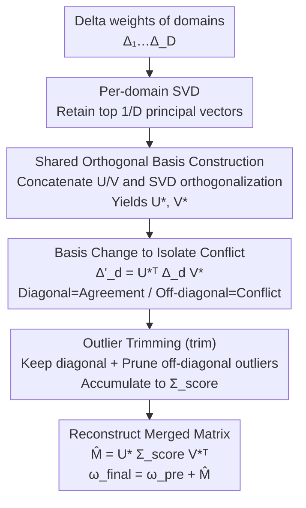

# Bridging Domains through Subspace-Aware Model Merging

**Conference**: CVPR 2026  
**Paper**: [CVF Open Access](https://openaccess.thecvf.com/content/CVPR2026/html/Chaves_Bridging_Domains_through_Subspace_Aware_Model_Merging_CVPR_2026_paper.html)  
**Code**: https://github.com/VirtualSpaceman/score_cvpr26 (Available)  
**Area**: Model Compression / Model Merging  
**Keywords**: Model Merging, Domain Generalization, Singular Value Decomposition, Subspace Conflict, CLIP  

## TL;DR
This paper discovers that merging models fine-tuned on different domains to generalize to unseen domains produces much stronger singular subspace conflicts than conventional multi-task merging. It proposes SCORE: a method that performs a change-of-basis using a shared orthogonal basis constructed from the concatenated principal singular vectors of all models. By retaining diagonal elements (consistent directions) and trimming off-diagonal outliers (conflicted directions), SCORE outperforms existing merging methods across 8 domain generalization benchmarks and 3 model scales.

## Background & Motivation
**Background**: Model merging combines multiple models fine-tuned from the same pre-trained backbone by directly summing them in the parameter space. This requires no data sharing or re-training, and inference follows a single forward pass. Prevailing approaches revolve around task vectors ($\Delta w = \omega_{\text{fine-tuned}} - \omega_{\text{pre-trained}}$): TIES trims small magnitudes and aggregates based on sign consistency; DARE uses random sparsification; TSV performs SVD on the task matrix to measure and merge interference in singular subspaces.

**Limitations of Prior Work**: Existing methods are almost exclusively evaluated in **i.i.d. / multi-task** scenarios, where the merged tasks are the evaluation tasks themselves, aiming for multi-task performance. The use of merging for **domain generalization** (combining domain experts to generalize to unseen domains) remains largely unexplored.

**Key Challenge**: Analyzing parameter competition via SVD, the authors identified a critical difference: in multi-task settings (e.g., MNIST digit classification vs. RESIC45 geographic classification), singular subspaces are relatively disjoint. However, in **domain generalization, models share the same label space but differ in data distribution**. Consequently, their $\Delta w$ tends to align along similar singular directions, leading to high subspace overlap. This overlap means that the principal singular directions of multiple domains compete during merging, where domains with stronger singular values suppress weaker ones, harming generalization to unseen domains. The authors quantified this using the Subspace Alignment Ratio (SAR), confirming that subspace overlap in domain generalization is significantly higher than in multi-tasking.

**Goal**: To mitigate conflicts arising from subspace overlap and enhance the domain generalization of merged models without **accessing target domain data or performing any optimization/gradient steps** (utilizing only source domain checkpoints).

**Key Insight**: By concatenating and orthogonalizing the principal singular directions of all domains into a "shared basis," the task matrix of each domain can be projected into this basis. In this coordinate system, **diagonal elements represent the agreement with shared directions, while off-diagonal elements represent cross-direction conflicts**. This explicitly isolates conflicts. By retaining the diagonal and trimming only the statistical outliers in the off-diagonal, disruptive conflicts can be removed without losing useful cross-domain covariant information.

## Method

### Overall Architecture
SCORE (Subspace COnflict-Resolving mErging) operates layer-wise. It takes delta weights $\{\Delta_1,\dots,\Delta_D\}$ ($\Delta_d=\omega_d-\omega_{\text{pre}}$) from $D$ domains as input and outputs a merged task matrix $\hat M$, resulting in the final model $\omega_{\text{final}}=\omega_{\text{pre}}+\hat M$. The pipeline consists of pure weight/matrix operations without data access: SVD is performed for each domain, retaining only the top $\tfrac{1}{D}$ principal components → Left/right singular vectors are concatenated horizontally → A second SVD is performed on the concatenated matrices to derive a **shared orthogonal basis** $U_*, V_*$ → Each $\Delta_d$ is projected into the basis $U_*, V_*$ to differentiate "agreement" from "conflict" → Each projected matrix is trimmed (retaining the diagonal and pruning off-diagonal outliers) and accumulated into $\Sigma_{\text{score}}$ → The merged matrix is reconstructed as $\hat M=U_*\Sigma_{\text{score}}V_*^\top$.

### Key Designs

**1. Shared Orthogonal Basis Construction: Finding a common coordinate system closest to all domains**

The pain point is that singular subspaces of different domains are highly overlapping but not mutually orthogonal; summing them directly allows domains with strong singular values to dominate. SCORE performs SVD on each $\Delta_d=U_d\Sigma_d V_d^\top$, keeping only the first $\tfrac{1}{D}$ principal directions (sharing the rank budget among $D$ domains), and concatenates them into $U_*\!\leftarrow[U_1|\cdots|U_D]$ and $V_*\!\leftarrow[V_1|\cdots|V_D]$. Since concatenation does not guarantee orthogonality, which is necessary for SVD reconstruction properties, the TSV approach is utilized to re-orthogonalize via SVD: $U_*=P_{U_*}\Sigma_{U_*}Q_{U_*}^\top$, setting $U_*\leftarrow P_{U_*}Q_{U_*}^\top$ (discarding singular values and keeping orthogonal factors). The resulting $U_*, V_*$ serve as a "shared basis" closest to all $D$ domain subspaces.

**2. Basis Change to Isolate Conflict: Diagonal as agreement, off-diagonal as conflict**

With a shared basis, SCORE projects each $\Delta_d$ into this common coordinate system:

$$\Delta'_d = U_*^\top \Delta_d V_* = (U_*^\top U_d)\,\Sigma_d\,(V_d^\top V_*).$$

Defining $R_U^{(d)}=U_*^\top U_d$ and $R_V^{(d)}=V_d^\top V_*$ as the inner products between the shared basis and the domain-specific basis, the change-of-basis explicitly splits information: **diagonal elements $(\Delta'_d)_{ii}$** measure the magnitude of domain $d$ along the $i$-th shared principal direction (agreement); **off-diagonal elements $(\Delta'_d)_{ij},\,i\neq j$** measure how domain $d$ couples the $i$-th and $j$-th shared directions (cross-talk/conflict). Visualizing $\Sigma_{\text{score}}=\sum_{d=1}^{6}U_*^\top\Delta_d V_*$ on ViT-B/32 attention layers reveals that the change-of-basis makes "conflict" quantifiable as off-diagonal terms.

**3. Outlier Trimming (trim): Retaining diagonal and useful cross-domain covariance**

While retaining only the diagonal (consistent directions) is intuitive, the authors found that it discards useful cross-domain covariant information (diagonal-only is ~2 p.p. lower than full SCORE). Conversely, retaining all off-diagonals introduces excessive interference. SCORE thus keeps the diagonal and trims off-diagonal statistical outliers:

$$\text{trim}(\Delta'_k)_{ij}=\begin{cases}(\Delta'_k)_{ii}, & i=j\ (\text{Keep diagonal})\\[2pt](\Delta'_k)_{ij}, & i\neq j,\ |(\Delta'_k)_{ij}-\mu_{\text{off}}|<\varsigma\cdot\sigma_{\text{off}}\\[2pt]0, & \text{Otherwise (Prune outliers)}\end{cases}$$

Here, $\mu_{\text{off}}$ and $\sigma_{\text{off}}$ are the mean and standard deviation of all off-diagonal elements, and $\varsigma=1.96$ corresponds to a 95% confidence interval. This prunes extreme "inter-direction cross-talk" while preserving normal covariance. The matrices are then summed as $\Sigma_{\text{score}}=\sum_{d=1}^{D}\text{trim}(\Delta'_d)$ and reconstructed via $\hat M=U_*\Sigma_{\text{score}}V_*^\top$.

### Loss & Training
SCORE involves no training or optimization. The scaling factor is fixed at $\varepsilon=1$ (since target data is inaccessible for tuning). During fine-tuning: the CLIP image encoder is fully fine-tuned with a batch size of 128, learning rate of 1e-5 with cosine annealing, and AdamW (weight decay 0.1). The text encoder is frozen as a classification head to maintain open-vocabulary capabilities.

## Key Experimental Results

### Main Results
Evaluated across 3 CLIP variants (ViT-B/32, ViT-B/16, ViT-L/14) and 8 domain generalization benchmarks (PACS, DomainNet, ImageNet-R, NICOpp, OfficeHome, TerraIncognita, and two medical datasets FedISIC, RetinaDomains, totaling 49 domains and 4–365 classes). A leave-one-domain-out protocol is used. Accuracy is reported for natural images, while balanced accuracy is used for medical datasets.

| Model | Method | Avg. Accuracy | Gain over 2nd Best |
|------|------|-----------|----------|
| ViT-B/32 | TSV (Runner-up) | 64.95 | — |
| ViT-B/32 | **SCORE** | **65.69** | **+0.74 p.p.** |
| ViT-L/14 | TIES (Runner-up) | 72.46 | — |
| ViT-L/14 | **SCORE** | **73.04** | **+0.58 p.p.** |

On individual datasets: ViT-B/32 ranks first on DomainNet, NICOpp, and OfficeHome (+0.15, +0.40, +0.49 p.p. respectively). ViT-L/14 gains +1.01 on NICOpp and +1.18 p.p. on TerraIncognita. As a reference, Task Experts (upper bound) for ViT-B/32 averages 78.63, while Zero-shot (lower bound) is 55.63.

Merging vs. Ensemble (Logit Ensemble):

| Method | ViT-B/32 | ViT-B/16 | ViT-L/14 |
|------|----------|----------|----------|
| Model ensemble | 64.57 | 68.07 | 71.81 |
| **SCORE** | **65.69 (+1.12)** | **69.97 (+1.90)** | **73.04 (+1.24)** |

SCORE exceeds ensemble performance by 1.12–1.90 p.p. while maintaining only the inference cost of a single model.

### Ablation Study
Ablation on which elements of $\Sigma_{\text{score}}$ to retain (using Diagonal-only as baseline):

| Configuration | ViT-B/32 | ViT-B/16 | ViT-L/14 | Description |
|------|----------|----------|----------|------|
| Diagonal | 63.62 | 67.38 | 71.50 | Only diagonal (Agreement) |
| Off-diagonal | 58.41 (-5.21) | 62.41 (-4.97) | 67.46 (-4.04) | Only off-diagonal (Conflict) -> Decrease |
| Full matrix | 7.59 (-56.03) | 7.66 (-59.72) | 7.70 (-63.80) | Diagonal + Off-diagonal -> Collapse |
| **Trimmed (SCORE)** | **65.69 (+2.07)** | **69.97 (+2.59)** | **73.04 (+1.53)** | Diagonal + Trimmed Off-diagonal |

### Key Findings
- **Trim is the core source of gain**: While diagonal-only is a strong baseline, trimming off-diagonal outliers contributes a stable +1.5~2.6 p.p. Retaining the full off-diagonal causes a collapse to 7~8% accuracy, confirming that conflicting directions must be pruned.
- **Off-diagonal alone drops 4~5 p.p.**: While off-diagonals contain useful information, they cannot replace the consistent directions on the diagonal.
- **Model merging can exceed zero-shot and ensemble performance**: Except for Task Arithmetic (which is sensitive to $\varepsilon$), mainstream merging methods surpass the zero-shot lower bound. On medical datasets, all merging methods gain at least +6 to +8 p.p. over zero-shot.

## Highlights & Insights
- **Quantification of stronger DG merging conflict**: The observation that overlapping singular directions in DG lead to higher conflict is a key contribution. This explains why existing merging methods underperform in DG scenarios.
- **Basis change makes conflict visible**: Projecting $\Delta_d$ onto a shared basis transforms implicit directional competition into locatable matrix elements (diagonal vs. off-diagonal), providing more structure than pruning in the original parameter space.
- **Statistical CI for outlier pruning**: Using $\varsigma=1.96$ (95% CI) provides a parameter-free statistical criterion for identifies "abnormal cross-talk," which is more robust than heuristic thresholds.
- **Fully data-free and optimization-free**: The method works solely with checkpoints and does not require target data or gradients, making it practical for real-world model repository reuse.

## Limitations & Future Work
- **Ours** is only applicable to parameter-wise merging of models sharing the same architecture and pre-trained backbone.
- **Incremental Gains**: The average lead over the runner-up is modest (0.58~0.74 p.p.). SCORE is "more stable on average" rather than "best on every single dataset," particularly on medical datasets where it is often second.
- **Fixed hyperparameters**: $\varepsilon=1$ is used due to the lack of target data for tuning, and other parameters like the truncation rank ($\tfrac{1}{D}$) or $\varsigma$ were not extensively analyzed for sensitivity.
- **Future Directions**: Merging models trained with different DG losses or using merging as a tool to investigate the combinability of deep models.

## Related Work & Insights
- **vs TSV**: Both use SVD and concatenated singular vectors. However, TSV is multi-task oriented. SCORE introduces "basis change to isolate conflict + off-diagonal outlier trimming" specifically for the higher subspace overlap in DG.
- **vs TIES / MagMax / PCB**: These methods prune in the **original parameter/magnitude/sign** space. SCORE prunes in the **shared singular basis**, which provides a more structured representation of conflict despite higher SVD computation costs.
- **vs Wortsman et al. (Model Soups)**: Model Soups primarily uses simple averaging. SCORE provides a structured conflict-resolution mechanism and is validated across a much wider array of DG benchmarks.
- **vs Test-time training**: SCORE maintains the core advantage of merging by remaining data-free and incurring zero extra cost at test time.

## Rating
- Novelty: ⭐⭐⭐⭐ Systematic study of merging for DG and the specific basis-change solution for subspace conflict.
- Experimental Thoroughness: ⭐⭐⭐⭐ Extensive coverage across scales and domains, including comparison to ensembles.
- Writing Quality: ⭐⭐⭐⭐ Clear motivation, mechanism description, and logical flow.
- Value: ⭐⭐⭐⭐ Practical for data-free scenarios with single-model inference costs, despite the modest average gain.

<!-- RELATED:START -->

## Related Papers

- [\[CVPR 2026\] Preference-Aligned LoRA Merging: Preserving Subspace Coverage and Addressing Directional Anisotropy](preference-aligned_lora_merging_preserving_subspace_coverage_and_addressing_dire.md)
- [\[CVPR 2026\] Model Merging on Loss Landscape: A Geometry Perspective](model_merging_on_loss_landscape_a_geometry_perspective.md)
- [\[ICML 2026\] Saliency-Aware Model Merging](../../ICML2026/model_compression/saliency-aware_model_merging.md)
- [\[ICLR 2026\] RAIN-Merging: A Gradient-Free Method to Enhance Instruction Following Through Model Merging](../../ICLR2026/model_compression/rain-merging_a_gradient-free_method_to_enhance_instruction_following_through_mod.md)
- [\[CVPR 2026\] Continual Distillation of Teachers from Different Domains](continual_distillation_of_teachers_from_different_domains.md)

<!-- RELATED:END -->
