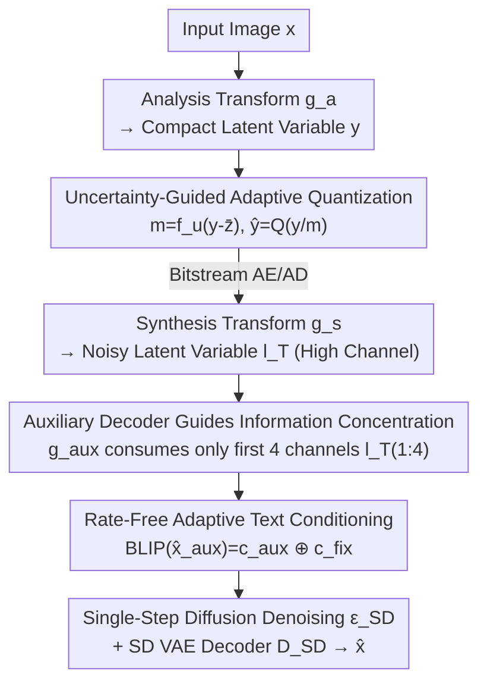

# CADC: Content Adaptive Diffusion-Based Generative Image Compression

**Conference**: CVPR 2026  
**Paper**: [CVF Open Access](https://openaccess.thecvf.com/content/CVPR2026/html/Sheng_CADC_Content_Adaptive_Diffusion-Based_Generative_Image_Compression_CVPR_2026_paper.html)  
**Code**: Not publicly available (not provided in the paper)  
**Area**: Model Compression / Diffusion Models / Generative Image Compression  
**Keywords**: Generative image compression, Diffusion codec, Adaptive quantization, Ultra-low bitrate, Text conditioning  

## TL;DR
CADC makes the "encoding-side representation" and "decoding-side generation prior" of diffusion-based image compression content-adaptive throughout the process. It uses an uncertainty map to drive spatially varying quantization, a lightweight auxiliary decoder to force semantic information into the first 4 channels actually utilized by the diffusion decoder, and derives content-related text conditions bit-free from the auxiliary reconstructed image. It achieves SOTA perceptual quality at ultra-low bitrates (approximately 0.005–0.01 bpp).

## Background & Motivation
**Background**: At ultra-low bitrates, traditional codecs (JPEG/BPG) and learned image compression models targeting pixel fidelity suffer from severe blurring and loss of texture details, as they optimize for signal fidelity (e.g., PSNR) rather than perceptual quality. Generative compression leverages strong generative models to "imagine" realistic reconstructions. Among these, diffusion-based codecs (DiffEIC, ResULIC, StableCodec, etc.) exhibit the most prominent performance at extremely low bitrates due to the powerful generation capabilities of diffusion models. A typical approach involves encoding an image into a noisy latent variable $l_T$, followed by denoising and restoration using a pre-trained Stable Diffusion VAE decoder.

**Limitations of Prior Work**: The authors identify three major flaws in current diffusion codecs that hinder "content adaptation." First, **isotropic quantization**: a globally uniform quantization step size is applied to the entire compact latent variable, ignoring spatial heterogeneity. Diffusion models are inherently "noise-level dependent": they tend to use generative priors to hallucinate textures at high noise levels and act as conservative denoisers to preserve structure at low noise levels. A uniform step size forces a compromised noise level across the image, resulting in insufficient generation intervention in texture regions (blurring) and excessive regularization in smooth regions (unnecessary artifacts). Second, the **information concentration bottleneck**: noisy latents produced by learned codecs often have a high channel count (e.g., 320), but the pre-trained SD VAE decoder is fixed to only 4 channels, and denoising only acts on the first 4 channels $l_T^{(1:4)}$. Without explicit supervision, the model does not necessarily pack the most critical semantic information into these first 4 channels, leading to non-adaptive latent representations. Third, **inefficient text conditioning**: existing methods either transmit text descriptions (which consumes valuable bits in a ~450-byte budget) or use a fixed universal prompt (e.g., "A high-resolution, 8K..."), which is irrelevant to the specific image content.

**Key Challenge**: To fully leverage the diffusion prior, the "what the encoder sends" and "how the decoder generates" must be dynamically aligned with the semantics/structure of the image. However, the three components mentioned above are all content-agnostic fixed strategies, which disrupt this alignment.

**Goal**: To transform quantization, information allocation, and text conditioning into content-adaptive processes, ensuring that text conditioning does not consume additional bitrate.

**Core Idea**: Use a **learned spatial uncertainty map** to modulate quantization (allowing stronger generation intervention in texture regions), use an **auxiliary decoder** to force semantics into the first 4 channels, and use the **auxiliary reconstructed image** as a proxy to caption content-related text. All three methods restore content adaptation "for free."

## Method

### Overall Architecture
CADC follows the standard autoencoder structure common in learned compression. Encoder side: Analysis transform $g_a$ encodes the input image $x$ into a compact latent variable $y$; simultaneously, a lightweight network $f_u$ estimates an uncertainty map $m$ from the residuals, which is used to modulate $y$ before quantization to obtain $\hat{y}$, subsequently transmitted via arithmetic encoding (AE). Decoder side: Synthesis transform $g_s$ upsamples $\hat{y}$ into a noisy latent variable $l_T$ (with high channel count), which is fed into the U-Net $\epsilon_{SD}$ to estimate 4-channel noise. One-step diffusion denoising is performed only on the first 4 channels $l_T^{(1:4)}$ to obtain the clean latent $l_0$, which is then restored to $\hat{x}$ by the frozen SD VAE decoder $\mathcal{D}_{SD}$. Two "adaptive add-ons" are attached to this main chain: a lightweight auxiliary decoder $g_{aux}$ takes only the first 4 channels to reconstruct an auxiliary image $\hat{x}_{aux}$ (providing both supervision and acting as a text proxy); $\hat{x}_{aux}$ is then processed by a frozen BLIP model $f_c$ to caption content text $c_{aux}$, which is concatenated with a fixed description $c_{fix}$ as the condition for diffusion denoising.

### Key Designs

**1. Uncertainty-Guided Adaptive Quantization (UGAQ): Symmetrizing Quantization Noise with Spatial Content**

The fundamental problem with isotropic quantization is the "single noise level for the whole image," which is mismatched with the diffusion model's ability to schedule generation intensity by region. UGAQ uses the following approach: first, the hyper-prior latent $\hat{z}$ is bilinearly upsampled to the main latent resolution $\bar{z} = \mathrm{UP}(\hat{z})$, and the residual $r = y - \bar{z}$ is calculated. This residual measures how poorly $\bar{z}$ explains $y$; large residuals indicate complex textures and high uncertainty, serving as an inherently content-adaptive signal. A lightweight network $f_u$ maps the residual to an uncertainty map $m = f_u(r)$ (where each element $m_{i,j} \ge 1$), which is then used for element-wise modulation before quantization:

$$\bar{y} = y / m, \quad \hat{y} = Q(\bar{y}) = \lfloor \bar{y}/\Delta \rceil \cdot \Delta$$

Quantization error can be approximated as uniform noise $\epsilon_{i,j} \sim U(-\Delta/2, \Delta/2)$, thus $\hat{y} \approx y/m + \epsilon$. Crucially, the decoder **does not perform inverse scaling** and feeds $\hat{y}$ directly into the diffusion model. Although the quantization noise variance is fixed at $\sigma_\epsilon^2 = \Delta^2/12$, the $1/m$ modulation before quantization causes the local signal-to-noise ratio (SNR) at the decoder input to vary spatially:

$$\mathrm{SNR}_{i,j} \propto \frac{E[\bar{y}_{i,j}^2]}{\sigma_\epsilon^2} = \frac{E[y_{i,j}^2]}{m_{i,j}^2 \cdot \sigma_\epsilon^2}$$

This leads to the core mechanism: in high-uncertainty regions (larger $m$), the signal power is suppressed by $m^2$, resulting in a lower local SNR, which encourages the diffusion model to rely more on the generative prior to synthesize textures. In low-uncertainty regions (smaller $m$), the SNR remains high, prompting the diffusion model to faithfully preserve the transmitted structural information. This actively shapes "quantization distortion" into "content-aware noise" aligned with the diffusion denoising strategy. ⚠️ Notably, the authors emphasize that this is opposite to existing spatial scaling quantization methods—complex texture regions are assigned a **larger** $m$ (stronger generation intervention) rather than a smaller one.

**2. Auxiliary Decoder Guided Information Concentration (ADGIC): Forcing Semantics into the First 4 Channels**

The information concentration bottleneck stems from architectural mismatch: the noisy latent $l_T$ has far more than 4 channels, but the SD VAE decoder only uses $l_T^{(1:4)}$. Without explicit supervision, there is no guarantee that critical semantics will be concentrated in these 4 channels. ADGIC's solution is straightforward: introduce a lightweight auxiliary decoder $g_{aux}$ that acts **only** on the first 4 channels to reconstruct an auxiliary image:

$$\hat{x}_{aux} = g_{aux}(l_T^{(1:4)}), \quad \mathcal{L}_{aux} = \| x - \hat{x}_{aux} \|_2^2$$

This auxiliary reconstruction loss is integrated into the total loss. Since $g_{aux}$ can only see the first 4 channels, the model is forced to pack the most semantically critical information into these channels to make $\hat{x}_{aux}$ resemble the original image. This imposes a content-driven constraint on "where information is placed." Energy analysis in the ablation (measuring energy via channel variance) shows that the energy concentration in the first 4 channels significantly increases with ADGIC, confirming it enforces content-aware information allocation.

**3. Bit-Free Adaptive Text Conditioning (BFATC): Inferring Content Text from Auxiliary Reconstruction**

Text conditioning typically either costs bitrate or uses generic prompts. BFATC's clever idea is to reuse the auxiliary reconstructed image $\hat{x}_{aux}$, which is already "free" from Design 2, as a proxy. Since $\hat{x}_{aux}$ is derived entirely from the transmitted $l_T^{(1:4)}$, the decoder can reproduce it locally without receiving any additional text bits. $\hat{x}_{aux}$ is fed into a frozen BLIP image captioning model $f_c$ to obtain content text $c_{aux} = f_c(\hat{x}_{aux})$, which is then concatenated with a fixed universal description $c_{fix}$ ("A high-resolution, 8K, ultra-realistic image...") to form $c = c_{aux} + c_{fix}$ as the condition for one-step diffusion denoising. The fixed description is included for robustness and stability. Experiments show that even at extremely low bitrates where auxiliary reconstruction noise is high, the captioned text remains semantically consistent with the image content (e.g., "a boat in the water"), thus providing stable content-related semantic guidance at zero bitrate cost.

### Loss & Training
The total objective is the rate-distortion loss $\mathcal{L} = \lambda R + D$, where $\lambda$ is the Lagrange multiplier and $R$ is the bitrate. For the distortion term $D$, in addition to the newly introduced auxiliary reconstruction loss $\mathcal{L}_{aux}$, the model adopts the multi-component combination from StableCodec [66]: MSE, LPIPS (VGG features), CLIP distance, and GAN loss. Implementation-wise, a distilled version of Stable Diffusion 2.1 is used for one-step diffusion to balance generation capability and decoding complexity. BLIP-image-captioning-base is used for captioning. The entropy model utilizes both a hyper-prior $c_h$ and a spatial prior $c_s$ generated by a 4-step quadtree autoregression. Training datasets include DF2K and CLIC 2020 Professional.

## Key Experimental Results

### Main Results
The evaluation sets used are Kodak (24 images, 768×512), DIV2K Val (100 images, 2K), and CLIC 2020 Test (428 images, 2K), all evaluated at original resolution. Perceptual metrics include DISTS, LPIPS, FID, and KID (FID/KID omitted for Kodak due to small sample size). Bitrate is measured in bpp. Comparison targets include GAN-based (HiFiC), VQ-based (DLF, GLC), and various diffusion-based (DiffEIC, ResULIC, MKIC, OSCAR, StableCodec) methods. Primary results are presented as RD curves (Fig. 3): across three datasets and all metrics (LPIPS/DISTS/FID/KID), CADC **consistently outperforms** all diffusion-based competitors in the ultra-low bitrate range. The following table provides representative values (bpp / DISTS↓ / MS-SSIM↑) from the qualitative comparison in Fig. 4 for Kodak at similar bitrates:

| Method | bpp | DISTS ↓ | MS-SSIM ↑ |
|------|-----|---------|-----------|
| **Ours** | 0.008 | **0.150** | 0.583 |
| StableCodec | 0.008 | 0.157 | 0.694 |
| DLF | 0.008 | 0.162 | 0.669 |
| **Ours** | 0.008 | **0.109** | 0.809 |
| MKIC | 0.009 | 0.283 | 0.714 |
| OSCAR | 0.010 | 0.175 | 0.612 |

> ⚠️ The above values are extracted from scatter plots in Fig. 4 annotations (different rows correspond to different test images) and are for illustrative purposes; full quantitative comparisons refer to the RD curves in Fig. 3. It can be observed that CADC generally achieves the lowest DISTS, though MS-SSIM is not always the highest—this aligns with the goal of prioritizing perceptual quality over pixel fidelity at ultra-low bitrates.

### Ablation Study
The contribution of each module was evaluated on Kodak using BD-rate (larger negative values indicate better bitrate savings):

| Model | UGAQ | ADGIC | BFATC | LPIPS BD-rate | DISTS BD-rate |
|------|:----:|:-----:|:-----:|:-------------:|:-------------:|
| M0 (Baseline) | ✗ | ✗ | ✗ | 0.0% | 0.0% |
| M1 | ✓ | ✗ | ✗ | −3.7% | −2.7% |
| M2 | ✓ | ✓ | ✗ | −5.3% | −3.5% |
| M3 (Full) | ✓ | ✓ | ✓ | −6.8% | −5.5% |

### Key Findings
- **Positive contribution from all three modules**: UGAQ alone brings LPIPS −3.7% / DISTS −2.7%, representing the largest single-point gain among the three (quantization alignment is a major bottleneck); ADGIC adds approximately LPIPS −1.6% / DISTS −0.8%; BFATC further adds LPIPS −1.5% / DISTS −2.0% (where the DISTS gain even exceeds that of ADGIC, highlighting the value of content-related text for perceptual quality).
- **Semantically interpretable uncertainty maps in UGAQ**: Visualizations show that residuals $y-\bar{z}$ are large in high-texture areas, with correspondingly large $m$. Consequently, quantization residuals $y-\hat{y}$ are strongly correlated with content complexity—proving that it indeed "shapes quantization error by content."
- **ADGIC effectively alters energy distribution**: Variance (energy) concentration in the first 4 channels increases significantly after adding ADGIC, confirming that supervision effectively "squeezes" semantics into critical channels.
- **BFATC remains robust at low bitrates**: Even when auxiliary reconstructions are blurry, BLIP provides semantically consistent descriptions, ensuring that zero-bit text conditioning does not "deviate" due to distortion.

## Highlights & Insights
- **The "modulation before quantization + no inverse scaling at decoder" approach is ingenious**: By manually creating local SNR differences via $y/m$ on fixed-variance quantization noise, the authors transform "quantization"—usually treated as a pure source of distortion—into a knob for actively controlling diffusion generation intensity. This is a elegant link between signal processing intuition and the diffusion prior mechanism.
- **Auxiliary decoder serves two ends**: $g_{aux}$ provides supervision for information concentration (ADGIC) in the first 4 channels, and its byproduct $\hat{x}_{aux}$ is recycled as a proxy for text conditioning (BFATC). One lightweight module simultaneously addresses two limitations, making the design economically efficient.
- **Migratable "bit-free text" concept**: The paradigm of "using a proxy reconstruction reproducible at the decoder to infer side information" can be generalized to any scenario requiring content-related side information without consuming bitrate (e.g., inferring other semantic labels instead of captions).

## Limitations & Future Work
- All three modules rely on the 4-channel architecture assumption of the pre-trained SD VAE. The method is tightly coupled with the implementation where "only the first 4 channels are decoded"; switching diffusion backbones might require redesigning ADGIC.
- BFATC's text quality is limited by BLIP's captioning ability on severely degraded images. While the paper shows semantic consistency, ⚠️ it does not quantify the negative impact of incorrect captions on reconstruction, leaving the robustness boundaries unclear.
- Main results are primarily shown via RD curves, with PSNR/MS-SSIM placed in the supplementary materials. The cost of pixel fidelity trade-offs relative to perceptual quality is not fully detailed in the main text; MS-SSIM is not leading in all comparisons.
- It still utilizes one-step diffusion and an autoregressive entropy model. Decoding complexity (especially the 4-step quadtree autoregressive entropy decoding) remains an issue for real-time applications at ultra-low bitrates; no latency data was provided by the authors.

## Related Work & Insights
- **vs StableCodec [66]**: The direct baseline for this work. It uses multiple distortion losses and an architecture where the "whole $l_T$ enters U-Net, but only the first 4 channels are denoised." StableCodec uses isotropic quantization and fixed generic prompts; CADC modifies quantization (UGAQ), information allocation (ADGIC), and text (BFATC) to be content-adaptive, achieving BD-rate improvements on Kodak.
- **vs Relic et al. [51]**: They align quantization error with Gaussian diffusion noise via SNR-matching using universal quantization, but their quantization parameters remain globally isotropic. UGAQ in CADC further allows the SNR to vary based on spatial content.
- **vs PerCo [10] / ResULIC [28] / MKIC [18]**: These methods use multimodal LLMs to generate text that is then losslessly compressed and transmitted, providing content-aware guidance at the cost of text bitrate. CADC's BFATC uses the auxiliary image as a proxy to infer text for free, achieving the same goal without consuming the bit budget.
- **vs DiffEIC [38] / RDEIC [39]**: These works demonstrate that VAE-compressed latents alone can be competitive without transmitting text. CADC proves that "zero-bit but content-related" text can further improve perceptual quality.

## Rating
- Novelty: ⭐⭐⭐⭐ The three improvements specifically target mechanism mismatches in diffusion-based compression. The ideas of "quantization SNR modulation" and "dual-purpose auxiliary decoder" are clever, though they represent precise modifications to existing frameworks.
- Experimental Thoroughness: ⭐⭐⭐⭐ Evaluations across three datasets with multiple metrics, clear step-by-step ablations, and mechanism visualizations (uncertainty maps, energy distribution, caption robustness). However, it lacks complexity/latency data, and PSNR is relegated to supplementary materials.
- Writing Quality: ⭐⭐⭐⭐ Mapping of "limitations → corresponding methods" is clear, and motivation/mechanisms are well-explained. Mathematical derivations (local SNR) are lucid.
- Value: ⭐⭐⭐⭐ Achieves SOTA perceptual quality in ultra-low bitrate generative compression. Insights like "bit-free content text" are practically valuable for future research in this direction.

<!-- RELATED:START -->

## Related Papers

- [\[CVPR 2026\] Content-Adaptive Hierarchical Hyperprior for Neural Video Coding](content-adaptive_hierarchical_hyperprior_for_neural_video_coding.md)
- [\[CVPR 2026\] Grid Distillation: Compositional Image Distillation via Structured Generative Grids](grid_distillation_compositional_image_distillation_via_structured_generative_gri.md)
- [\[CVPR 2026\] Towards Generalizable AI-Generated Image Detection via Image-Adaptive Prompt Learning](towards_generalizable_ai-generated_image_detection_via_image-adaptive_prompt_lea.md)
- [\[CVPR 2026\] Generative Video Compression with One-Dimensional Latent Representation](generative_video_compression_with_one-dimensional_latent_representation.md)
- [\[CVPR 2026\] What Matters in Practical Learned Image Compression](what_matters_in_practical_learned_image_compression.md)

<!-- RELATED:END -->
