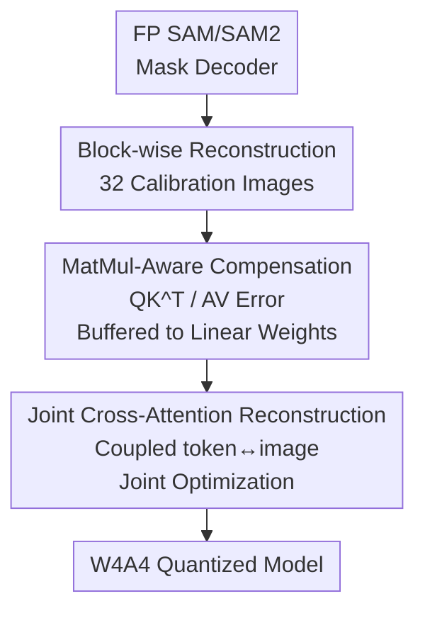

# CAR-SAM: Cross-Attention Reconstruction for Post-Training Quantization of the Segment Anything Model

**Conference**: CVPR 2026  
**Paper**: [CVF Open Access](https://openaccess.thecvf.com/content/CVPR2026/html/Wen_CAR-SAM_Cross-Attention_Reconstruction_for_Post-Training_Quantization_of_the_Segment_Anything_CVPR_2026_paper.html)  
**Code**: TBD  
**Area**: Model Compression  
**Keywords**: Post-Training Quantization, Segment Anything, Cross-Attention, Cross-layer Error Compensation, 4-bit Quantization  

## TL;DR
Addressing the unique challenges of "attention dissipation caused by low-bit quantization" and "reconstruction oscillation due to bidirectional coupling" in the SAM decoder, CAR-SAM employs MatMul-Aware Compensation (MAC)—which channels activation quantization errors from MatMul inputs back into preceding linear layer weights—and Joint Cross-Attention Reconstruction (JCAR)—which optimizes coupled cross-attention blocks together. This framework successfully compresses SAM/SAM2 to W4A4, achieving mAP improvements of 14.6% and 6.6% over previous state-of-the-art methods on SAM-B and SAM-L, respectively.

## Background & Motivation
**Background**: SAM / SAM2 represent milestones in general image segmentation, but their Large / Huge variants exceed 1 billion parameters and 1 TFLOPs, making them difficult to deploy on edge devices. Post-Training Quantization (PTQ) is the most lightweight compression method, requiring only a small unlabeled calibration set and no retraining to compress models to low-bit formats. Mature solutions like PTQ4ViT, BRECQ, QDrop, and APHQ-ViT already exist for ViT architectures.

**Limitations of Prior Work**: These methods are primarily designed for encoder-only architectures and perform reconstruction layer-by-layer or block-by-block. Attempts specifically for SAM, such as PTQ4SAM, MIX-QSAM, and PQ-SAM, ignore the critical bottleneck: the **bidirectional cross-attention structure in the decoder**. Consequently, SAM performance collapses under W4A4 (e.g., PTQ4SAM drops to 24.7 mAP on SAM-B, while RTN/BRECQ fail completely).

**Key Challenge**: The degradation is attributed to two SAM-specific problems. First, **attention dissipation**: cross-attention scores are calculated via MatMul between prompt tokens (queries) and image embeddings (keys), but their statistical distributions differ drastically—image embeddings are narrowly distributed in $[-14, 15]$, while prompt tokens spread across $[-40, 65]$. Quantizing the inputs of this MatMul amplifies scale mismatch and flattens the attention distribution, causing focused semantic heatmaps to collapse into diffuse masks. Existing PTQ methods only compensate linear projection layers, neglecting the **MatMul operation itself**, where cross-modality interaction occurs. Second, **reconstruction oscillation**: the two-way cross-attention paths in the decoder are partially parallel rather than strictly serial. Information is continuously exchanged between image and prompt tokens, creating a feedback loop where errors from one path propagate to the other. This leads to violent oscillations in reconstruction loss along the decoder depth, preventing the model from converging to a global optimum.

**Goal**: Develop a unified PTQ framework compatible with both SAM and SAM2 that specifically targets the cross-attention mechanism in their decoders to resolve "dissipation" and "oscillation."

**Key Insight**: Since dissipation stems from uncompensated MatMul and oscillation arises from treating coupled blocks as independent, **compensation should be extended to MatMul** and **coupled cross-attention blocks should be reconstructed jointly**.

**Core Idea**: Stabilize low-bit quantization of the SAM decoder by replacing "linear-only compensation + independent block-wise reconstruction" with "MatMul-Aware Compensation (MAC) + Joint Cross-Attention Reconstruction (JCAR)."

## Method

### Overall Architecture
CAR-SAM maintains the original network structure of SAM. During the PTQ calibration phase (32 images, per-channel weight + per-tensor activation asymmetric quantization, while keeping PatchEmbed and Mask Head in FP), it inserts two decoder-specific modules. Starting with a full-precision SAM/SAM2 mask decoder, the pipeline performs block-wise reconstruction optimization. When encountering attention blocks: **MAC** back-propagates activation quantization errors from MatMul inputs (Q, K, V) into the weights of preceding projection layers; then, **JCAR** treats the coupled token→image and image→token cross-attention blocks as a single composite module for joint optimization of quantization parameters.

### Key Designs

**1. MatMul-Aware Compensation (MAC): Channelling Input Activation Errors to Preceding Linear Weights**

This design targets attention dissipation. Attention involves two types of linear operations: projection layers (Q/K/V) and MatMul for scores ($QK^\top$, $AV$). Previous methods (GPTAQ, ERQ, QDrop) compensate for activation errors within projection layers, but **MatMul remains unmodeled**, despite it being the point of cross-modality interaction. MAC explicitly defines a reconstruction objective for the two MatMul operations. Using $QK^\top$ as an example, the objective is to minimize $L_{mse}=\mathbb{E}\big[\lVert QK^\top-\hat{Q}\hat{K}^\top\rVert_2^2\big]$. The perturbation is parameterized by setting $\hat{Q}=X_Q(W_Q+\delta W_Q)$ and $\hat{K}=K+\delta K$. By treating the quantization error $\delta K$ as a fixed perturbation, a compensation term $\delta W_Q$ is derived for the query projection weights to counteract it. L2 regularization is added to prevent excessive weight shifts:

$$L_{mse}=\big\lVert QK^\top-X_Q(W_Q+\delta W_Q)(K+\delta K)^\top\big\rVert_2^2+\lambda\lVert\delta W_Q\rVert_2^2$$

Setting the derivative with respect to $W_Q$ to zero yields a Sylvester matrix equation $AX+XB=C$ (where $A=(X_Q^\top X_Q)^{-1}\lambda I$, $B=\hat{K}^\top\hat{K}$, $C=W_Q\delta K^\top\hat{K}$, and $X=\delta W_Q$). This is solved efficiently using the Bartels–Stewart algorithm, and the result is merged: $W_Q\leftarrow W_Q+\delta W_Q$. The key insight is: **quantization error in K does not need to be compensated locally in the key branch; it can be rerouted to the upstream $Q_{proj}$** to align the MatMul output. Symmetrically, $\delta Q$ is channeled back to $W_K$, and a closed-form solution $\delta W_V=(X_V^\top\hat{A}^\top\hat{A}X_V+\lambda I)^{-1}X_V^\top\hat{A}^\top(A-\hat{A})V$ is derived for the V branch. This unified cross-layer compensation suppresses dissipation by preserving focused attention.

**2. Joint Cross-Attention Reconstruction (JCAR): Coupled Optimization of Bidirectional Blocks**

This design targets reconstruction oscillation. Cross-attention blocks in the decoder are partially parallel: the token→image block updates tokens $T'=f(I,T)$, and the subsequent image→token block uses $T'$ to refine embeddings $I'=g(I,T')$. While CNN/ViT PTQ assumes errors only accumulate forward, the bidirectional feedback here causes oscillations when blocks are optimized independently. Using first-order linearization, the authors prove that output perturbation satisfies:

$$\Delta I'\approx J_g^{(T')}\big(J_f^{(T)}\Delta T+J_f^{(I)}\Delta I\big)+J_g^{(I)}\Delta I$$

The error comprises a depth-accumulated term and a **cross-term** (within parentheses) introduced by cross-branch feedback. Further analysis of the gradient of the loss with respect to the scale parameter $s_f$ of block $f$ shows $\nabla_{s_f}L\propto\big(J_g^{(T')}\big)^\top\big(J_g^{(T')}\delta_f+\delta_g\big)$. Since the gradient depends on the Jacobian sensitivities of **both modules**, isolated optimization is insufficient. JCAR optimizes the paired blocks as a composite function $F_{f,g}$ to minimize the total reconstruction loss:

$$\min_{s_{f,g},\,\alpha_{f,g}}\big\lVert F_{f,g}(\hat{T}_{f,g},\hat{I}_{f,g},\hat{w}_{f,g})-F_{f,g}(T_{f,g},I_{f,g},w_{f,g})\big\rVert_2^2$$

This increases the reconstruction granularity. Experiments show that as granularity expands to cover both blocks, mAP on SAM-B improves from ~0.33 to 0.421, validating the necessity of joint optimization.

### Loss & Training
The framework is entirely unsupervised PTQ: 32 random training images are used as the calibration set. Weights use per-channel asymmetric quantization, while activations use per-tensor asymmetric quantization. PatchEmbed and Mask Head remain in full precision. MAC compensation terms are merged into weights after solving Sylvester equations. JCAR jointly optimizes the quantization scale $s$ and rounding offset $\alpha$ over 140,000 steps to ensure convergence.

## Key Experimental Results

Evaluations were conducted on SAM (B/L/H) and SAM2 (T/S/B+/L) across instance segmentation, object detection, and video object segmentation (VOS). Ground-truth boxes were used to simulate "perfect prompts" to isolate segmentation quality.

### Main Results

Instance Segmentation on COCO (mAP):

| Model | Method | W6A6 | W4A4 |
|------|------|------|------|
| SAM-B | QDrop | 50.7 | 26.4 |
| SAM-B | PTQ4SAM | 50.9 | 24.7 |
| SAM-B | **CAR-SAM** | **53.3** | **39.3** |
| SAM-L | QDrop | 58.4 | 38.0 |
| SAM-L | PTQ4SAM | 58.6 | 41.9 |
| SAM-L | **CAR-SAM** | 58.7 | **48.5** |

Under W4A4, CAR-SAM outperforms PTQ4SAM by 14.6 mAP on SAM-B and 6.6 mAP on SAM-L. Similar gains or competitive results were observed on SAM2 (e.g., SAM2-B+ reaching 46.5 mAP vs. PTQ4SAM's 45.5). In object detection (COCO), SAM-B/L/H reached 60.6 / 65.2 / 66.3 mAP, significantly exceeding BRECQ/QDrop/PTQ4SAM.

### Ablation Study

| Config | MAC | JCAR | W6A6 | W4A4 |
|------|-----|------|------|------|
| 1 (baseline) | × | × | 50.7 | 28.0 |
| 2 | ✓ | × | 52.7 | 31.2 |
| 3 | × | ✓ | 53.0 | 35.4 |
| 4 (Full) | ✓ | ✓ | **53.3** | **39.3** |

(SAM-B, COCO Instance Segmentation mAP)

### Key Findings
- **JCAR contributes more at lower bits**: Adding JCAR alone increased W4A4 mAP from 28.0 to 35.4 (+7.4), whereas MAC alone reaching 31.2 (+3.2). This suggests "oscillation" is more detrimental than "dissipation" at 4-bit, though both are complementary.
- **Coarser reconstruction granularity increases stability**: Jointly reconstructing the two cross-attention blocks yielded the highest mAP, confirming the theoretical necessity of joint optimization.
- **Compression Efficiency**: W4A4 reduces storage by approximately 60–67% (mean ≈64%) and provides 2.9×–5.0× acceleration (median ≈4.1×), with larger models benefiting more due to heavier transformer blocks.
- ⚠️ Note: In VOS benchmarks (Table 4), SAM2-L scores for all methods under W4A4 were unusually low (approx. 10 J&F), suggesting a potential failure mode for the 4-bit setup in this specific video context.

## Highlights & Insights
- **"Error Rerouting" as Compensation**: MAC cleverly demonstrates that K-quantization error can be solved for and "injected" into the upstream $Q_{proj}$ via Sylvester equations. This transforms the intuition of "which layer to compensate" into a solvable matrix equation, for the first time covering MatMul operations.
- **Theory-Driven Joint Optimization**: Instead of heuristic block-grouping, JCAR is derived from first-order Jacobian analysis that explicitly identifies cross-terms as the source of oscillation, motivating the coarse-grained reconstruction.
- **Transferability**: The MatMul-Aware Compensation concept is not limited to SAM; any cross-modal attention or attention with heterogeneous distributions (e.g., multimodal VLMs) could leverage this paradigm of channeling MatMul input errors back to projection layers.

## Limitations & Future Work
- The use of GT boxes masks the impact of prompt noise from real detectors, which might affect end-to-end accuracy in practice.
- The calibration process takes 140,000 steps, which is statistically significant for PTQ, though still faster than retraining.
- VOS performance for Large models (SAM2-L) under W4A4 remains near collapse (J&F ≈ 10), indicating that extreme "Video + Huge Model + 4-bit" combinations require further research.
- The code is not yet public, requiring manual implementation of the Sylvester solver and joint reconstruction logic for reproduction.

## Related Work & Insights
- **vs. PTQ4SAM**: PTQ4SAM uses Bimodal Integration to model bimodal activations and log-quantization for softmax. However, SAM2 no longer consistently exhibits bimodal distributions, making CAR-SAM’s MatMul/coupling approach more universal.
- **vs. PQ-SAM**: PQ-SAM focuses on encoder outliers via Grouped Activation Distribution Transformation, but CAR-SAM identifies the **decoder** as the primary source of degradation.
- **vs. QDrop / BRECQ**: These methods use block-wise reconstruction for encoder-only models, assuming unidirectional error propagation. CAR-SAM shows that bidirectional feedback in decoders breaks this assumption, requiring joint reconstruction.

## Rating
- Novelty: ⭐⭐⭐⭐⭐ Extending error compensation to MatMul and proving the necessity of joint cross-attention reconstruction are significant contributions.
- Experimental Thoroughness: ⭐⭐⭐⭐ Broad coverage of sizes and tasks; however, the lack of code and the 4-bit failure in VOS for large models are minor drawbacks.
- Writing Quality: ⭐⭐⭐⭐ Clear decomposition of challenges and derivations.
- Value: ⭐⭐⭐⭐⭐ Successfully quantizing SAM to 4-bit with substantial gains is highly practical for edge deployment.

<!-- RELATED:START -->

## Related Papers

- [\[ECCV 2024\] PQ-SAM: Post-training Quantization for Segment Anything Model](../../ECCV2024/model_compression/pq-sam_post-training_quantization_for_segment_anything_model.md)
- [\[CVPR 2026\] LS-ViT: Least-Squares Hessian Based Block Reconstruction for Low-Bit Post-Training Quantization of Vision Transformers](ls-vit_least-squares_hessian_based_block_reconstruction_for_low-bit_post-trainin.md)
- [\[CVPR 2026\] VLM-PTQ: Efficient Post-Training Quantization for Large Vision-Language Models](vlm-ptq_efficient_post-training_quantization_for_large_vision-language_models.md)
- [\[CVPR 2026\] Rethinking Asymmetric Quantization: Hidden Symmetry in Vision Model Weights](rethinking_asymmetric_quantization_hidden_symmetry_in_vision_model_weights.md)
- [\[CVPR 2026\] Gradient Knows Best: Mixed-Precision Quantization via Gradient-Guided Bit Allocation for Super-Resolution](gradient_knows_best_mixed-precision_quantization_via_gradient-guided_bit_allocat.md)

<!-- RELATED:END -->
