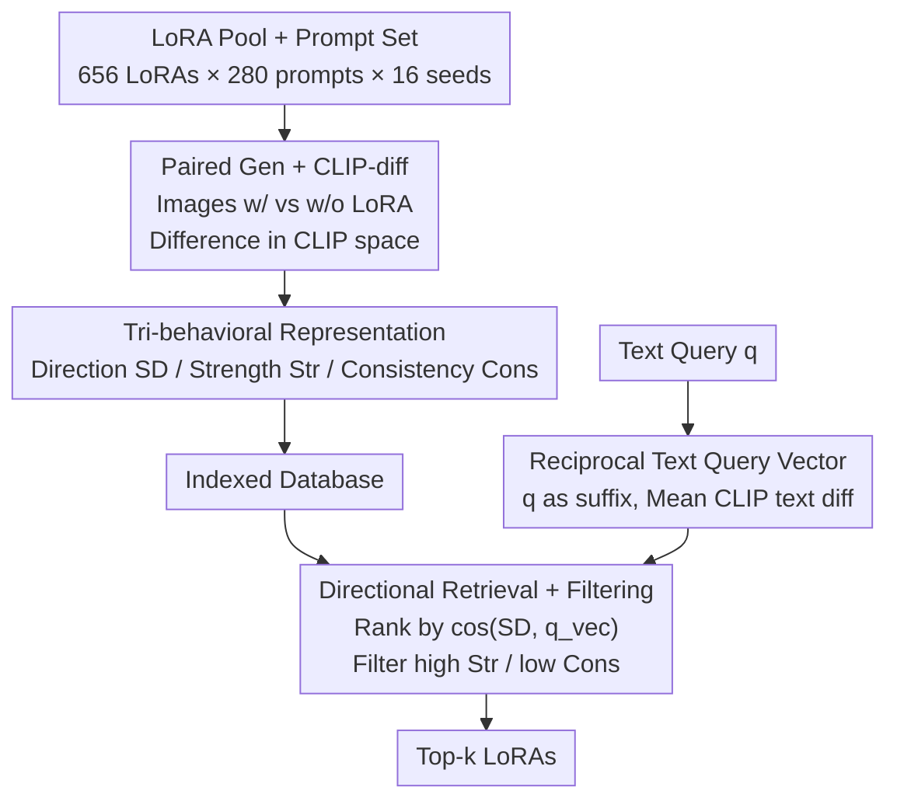

# CARLoS: Retrieval via Concise Assessment Representation of LoRAs at Scale

**Conference**: CVPR 2026  
**Paper**: [CVF Open Access](https://openaccess.thecvf.com/content/CVPR2026/html/Sarfaty_CARLoS_Retrieval_via_Concise_Assessment_Representation_of_LoRAs_at_Scale_CVPR_2026_paper.html)  
**Code**: TBD (Dataset, prompts, generated images, CARLoS representations, query benchmarks, and code will be open-sourced upon acceptance)  
**Area**: Model Compression / LoRA Retrieval  
**Keywords**: LoRA Retrieval, Behavioral Representation, CLIP-diff, Diffusion Models, Copyright Attribution

## TL;DR
CARLoS bypasses metadata provided by LoRA authors. Instead, it "activates" each LoRA by generating images across a large set of prompt × seed pairs, computing the CLIP-space difference from the base model images. These are distilled into a tri-representation of "Direction / Strength / Consistency," enabling LoRA retrieval based on actual generative behavior rather than textual metadata. It outperforms four strong text-based retrieval baselines in both automated and human evaluations.

## Background & Motivation
**Background**: Visual generation, exemplified by ComfyUI, has evolved into a full pipeline of components. Beyond the base model, LoRAs are the most influential elements. The open-source community has released hundreds of thousands of LoRAs, creating a vast but unorganized "zoo" covering various styles, atmospheres, and specific concepts (e.g., cat ears).

**Limitations of Prior Work**: Finding the "right LoRA" currently relies on trial and error. Authors often omit training data, write minimal descriptions, and provide no quantitative metrics for effectiveness or stability. Existing visual LoRA selection/routing works (Stylus, LoRAverse, AutoLoRA, DiffAgent, etc.) mostly depend on **metadata** such as names, descriptions, and community images. This metadata is often sparse, subjective, and multi-lingual, making it an unreliable predictor of a LoRA's true behavior. Conversely, language-domain retrieval methods (LoRARetriever, PHATGOOSE, Arrow, LoGo, etc.) are not directly applicable to visual generation.

**Key Challenge**: A LoRA's "identity" should be defined by its **impact on generation**. However, available descriptors (textual metadata, popularity, community images) are detached from this impact—a text label like "Coloring Book" might not actually perform coloring, and community images are often entangled with other components.

**Goal**: To provide LoRAs with a standardized behavioral representation computed solely from the adapter itself, **without extra metadata**, to support high-quality retrieval and analyses like copyright attribution.

**Key Insight**: Since descriptions are unreliable, observed behavior should be used. By attaching a LoRA and generating images across diverse prompts and seeds, the difference from the base model generation serves as the LoRA's "fingerprint." Using diverse prompt/seed pairs removes biases and component entanglement found in single community examples.

**Core Idea**: Replace "author-written text" with "CLIP-space difference of generative effects" to characterize and retrieve LoRAs—compressing each LoRA into a triad of Direction (semantic bias), Strength (magnitude of change), and Consistency (stability of the effect).

## Method

### Overall Architecture
CARLoS consists of two phases: **Offline Indexing**, where large-scale paired generations are performed for each LoRA to extract and store the tri-behavioral representations in CLIP space; and **Online Retrieval**, where text queries are converted into "effect difference vectors" in the same CLIP space. Candidates are ranked by directional similarity and filtered by strength and consistency thresholds to remove "overpowering" or "unstable" LoRAs. The input is a pool of SDXL LoRAs (656) and a text query (e.g., "vibrant colors"), and the output is a top-k list of LoRAs ranked by behavioral relevance and quality.

Indexing is a one-time intensive task: generating ~3M images for 656 LoRAs across 280 prompts and 16 seeds (approx. 7 A6000 GPU hours per LoRA). Once indexed, retrieval is extremely fast—approx. 5s for the query vector and 0.09s for ranking 656 signatures.

### Key Designs

**1. Paired Generation + CLIP-diff: Fingerprinting LoRAs via "Behavior" not "Metadata"**

CARLoS uses a fixed set of prompts $P$ ($N=280$, covering 10 semantic categories like portraits and fantasy, generated by an LLM to avoid user bias) and random seeds $S$ ($M=16$). For each LoRA $l$, prompt $p$, and seed $s$, it generates two images with identical hyperparameters: $x^{(0)}_{p,s}$ from the base SDXL and $x^{(l)}_{p,s}$ with the LoRA. A pre-trained CLIP image encoder $v$ maps these to a joint vision-text space to compute the CLIP-diff ensemble:

$$V = \{\, v(x^{(l)}_{p,s}) - v(x^{(0)}_{p,s}) \,\}_{p\in P,\, s\in S}$$

The key is "paired subtraction + multi-prompt/seed averaging," which cancels prompt content unrelated to the LoRA and smooths out single-image bias, leaving the **pure semantic/stylistic shift** of the LoRA.

**2. Tri-behavioral Representation: Direction / Strength / Consistency**

CARLoS summarizes the ensemble $V^l$ into three metrics. **Direction (SD)** is the average CLIP-diff, a $d$-dimensional vector ($d=512$ for ViT-B/32) representing the typical semantic shift:

$$\mathrm{SD}(l) = \frac{1}{|V^l|}\sum_{v\in V^l} v$$

**Strength (Str)** is the mean magnitude of the CLIP-diff vectors, measuring how "strongly" the LoRA modifies the base image:

$$\mathrm{Str}(l) = \frac{1}{|V^l|}\sum_{v\in V^l} \lVert v\rVert_2$$

**Consistency (Cons)** is the mean pairwise cosine similarity of vectors in $V^l$, measuring stability across prompts/seeds:

$$\mathrm{Cons}(l) = \frac{1}{\binom{|V^l|}{2}}\sum_{v_i,v_j\in V^l,\, i<j} \frac{v_i\cdot v_j}{\lVert v_i\rVert_2\,\lVert v_j\rVert_2}$$

Consistency near 1 indicates a predictable effect; low consistency suggests chaotic behavior. These metrics allow for both "finding the right effect" (Direction) and "ensuring quality" (Strength/Consistency).

**3. Reciprocal Text Query Vectors + Directional Retrieval + Dual-threshold Filtering**

To match a text query $q$ (living in text space) with LoRA signatures (living in image CLIP-diff space), CARLoS models the query as a **text CLIP difference vector**. Using an independent prompt set $P'$, it computes the mean difference between prompts with and without the query as a suffix:

$$\bar{\Delta}_q = \frac{1}{|P'|}\sum_{p'\in P'} \big(u(p'\oplus q) - u(p')\big)$$

Where $u$ is the CLIP text encoder and $\oplus$ is concatenation. This "reciprocal" design captures the semantic increment of the query as a modifier, aligning it with the LoRA's semantic increment.

Retrieval involves **Ranking** (cosine similarity between $\bar{\Delta}_q$ and $\mathrm{SD}(l)$) and **Filtering** (removing LoRAs where $\mathrm{Str}(l) > \varepsilon_s$ or $\mathrm{Cons}(l) < \varepsilon_c$). Experiments fixed $\varepsilon_s = 9.8$ and $\varepsilon_c = 0.041$.

## Key Experimental Results

### Main Results
Evaluation used 700+ text queries generated by LLMs. For each query, the top-k LoRAs generated images, which were scored for "image-query relevance" by four SOTA VLM/aesthetic models (normalized to [0,1]). Baselines include four strong text-embedding retrievers (Qwen3, E5, GTE, BGE) using LoRA metadata.

| Retriever | SigLIP2 | Qwen2.5 | IR | HPS |
|--------|---------|---------|------|------|
| E5 | 0.289 | 0.480 | 0.449 | 0.565 |
| GTE | 0.258 | 0.461 | 0.439 | 0.556 |
| BGE | 0.199 | 0.429 | 0.387 | 0.543 |
| Qwen3 | 0.307 | 0.495 | 0.491 | 0.590 |
| **CARLoS** | **0.350** | **0.532** | **0.505** | **0.596** |

CARLoS leads across all evaluators. A user study with 36 participants showed a consistent preference for CARLoS-retrieved LoRAs in terms of quality, relevance, and overall preference.

### Ablation Study
| Configuration | SigLIP2 | Qwen2.5 | IR | HPS | Description |
|------|---------|---------|------|------|------|
| Full | 0.350 | 0.532 | 0.505 | 0.596 | Full method |
| No Strength Filtering | 0.335 | 0.525 | 0.495 | 0.596 | Remove strength threshold |
| No Consistency Filtering | 0.342 | 0.529 | 0.501 | 0.599 | Remove consistency threshold |
| No Filtering | 0.335 | 0.525 | 0.495 | 0.596 | Remove both thresholds |
| Query as Prefix | 0.338 | 0.523 | 0.488 | 0.589 | Query as prefix |
| Only Query | 0.328 | 0.511 | 0.426 | 0.538 | Encode query alone |

### Key Findings
- **Filtering improves performance**: Removing strength filtering causes a larger drop than removing consistency filtering, suggesting that "overpowering the prompt" is a common failure mode.
- **Reciprocal Suffixing is critical**: Using the query as a suffix (Full) is significantly better than as a prefix or encoding the query alone (which sees a sharp drop on IR). This best captures the semantic increment of the modifier.
- **Strength/Consistency Scatter Analysis**: LoRAs that overpower prompts (e.g., ignoring "old man's face" to force a character) are effectively identified and filtered by the Strength and Consistency metrics.

## Highlights & Insights
- **"Behavior-First" Paradigm**: characterizes adapters via actual output rather than unreliable metadata. This "behavioral fingerprint" approach is potentially transferable to other components (ControlNet, IP-adapter).
- **Decoupled Representation**: Direction handles relevance, while Strength and Consistency handle quality. This makes the retrieval system computationally light (one cosine + two thresholds).
- **Bridge to Legal Semantics**: The paper links Strength to "substantiality" (copyright usage) and Consistency to "volition" (predictability), providing technical metrics for copyright risk screening.
- **Reusable Reciprocal Query Modeling**: The method of measuring the mean increment of a modifier is a generalizable solution for aligning text intent with visual effects.

## Limitations & Future Work
- **Compute-Intensive Indexing**: Generating ~3M images is costly, making it expensive to frequently update or expand the LoRA database.
- **Non-linear Scale Relationship**: Strength is tied to the LoRA factoring scale, but this relationship is non-linear and varies across LoRAs, making it difficult to predict optimal per-LoRA scales.
- **Single Backbone Constraint**: Evaluation was limited to the SDXL LoRA ecosystem (Civitai); generalization across different backbones (e.g., SD1.5) remains to be fully explored.
- **Heuristic Thresholds**: Thresholds for strength and consistency are currently fixed empirical values.

## Related Work & Insights
- **vs. Text Metadata Retrieval**: Methods like Qwen3 match keywords (e.g., "Coloring Book"). CARLoS matches actual behavior, avoiding "description $\neq$ behavior" pitfalls.
- **vs. Visual Routing / Selection**: Existing works (Stylus, LoRAverse) often rely on metadata or gating mechanisms. CARLoS provides a **prompt-agnostic** standardized behavioral descriptor that could serve as an upstream input for these systems.
- **vs. Language Domain Adapter Retrieval**: Unlike text-based task-embedding or weight-attribute retrieval, CARLoS adapts the "behavioral representation" to visual generation using CLIP-diff to capture stylistic and semantic nuances.

## Rating
- Novelty: ⭐⭐⭐⭐⭐ Uses "generative behavior difference" rather than metadata; bridges technical metrics with legal semantics.
- Experimental Thoroughness: ⭐⭐⭐⭐ Extensive VLM evaluation + user study; however, limited to a single backbone (SDXL).
- Writing Quality: ⭐⭐⭐⭐ Clear motivation, well-structured formulas, and helpful visualizations.
- Value: ⭐⭐⭐⭐⭐ Provides a standardized, metadata-free descriptor for the unorganized LoRA ecosystem, benefiting retrieval and quality assessment.

<!-- RELATED:START -->

## Related Papers

- [\[NeurIPS 2025\] BaRISTA: Brain-Scale Informed Spatiotemporal Representation of Human Intracranial EEG](../../NeurIPS2025/model_compression/barista_brain_scale_informed_spatiotemporal_representation_of_human_intracranial.md)
- [\[CVPR 2026\] Generative Video Compression with One-Dimensional Latent Representation](generative_video_compression_with_one-dimensional_latent_representation.md)
- [\[CVPR 2026\] DiT-Distill: Open-Set Fine-Grained Retrieval via Generative Curriculum Knowledge](dit-distill_open-set_fine-grained_retrieval_via_generative_curriculum_knowledge.md)
- [\[CVPR 2026\] Fixed Anchors Are Not Enough: Dynamic Retrieval and Persistent Homology for Dataset Distillation](fixed_anchors_are_not_enough_dynamic_retrieval_and_persistent_homology_for_datas.md)
- [\[CVPR 2026\] Discovering Adaptive Task Dependencies for Efficient Multi-Task Representation Compression](discovering_adaptive_task_dependencies_for_efficient_multi-task_representation_c.md)

<!-- RELATED:END -->
