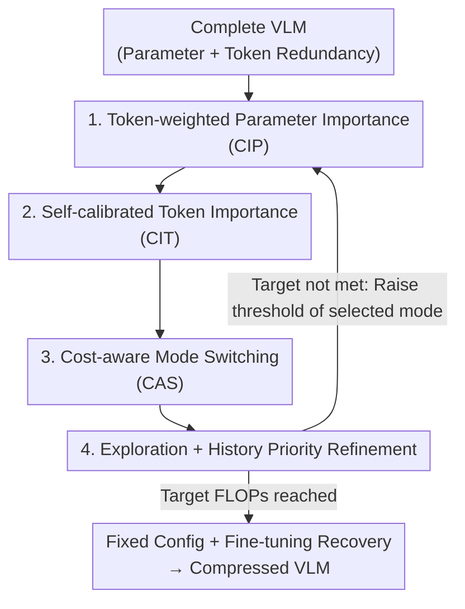

# Collaborative Multi-Mode Pruning for Vision-Language Models

**Conference**: CVPR 2026  
**Paper**: [CVF Open Access](https://openaccess.thecvf.com/content/CVPR2026/html/Wu_Collaborative_Multi-Mode_Pruning_for_Vision-Language_Models_CVPR_2026_paper.html)  
**Code**: https://github.com/Wuzimeng/CoMP.git  
**Area**: Model Compression  
**Keywords**: VLM Pruning, Parameter Pruning, Token Pruning, Joint Pruning, Progressive Compression  

## TL;DR
Addressing the simultaneous "parameter redundancy" and "token redundancy" in VLMs, CoMP introduces a Collaborative Importance Measure (CIM, eliminating interference between parameter and token pruning) and a Multi-mode Pruning Strategy (MPS, adaptively selecting the most cost-effective pruning mode at each step). It significantly outperforms single-mode methods at high pruning rates (e.g., leading by 3.51% in test accuracy on NLVR2 at a 0.85 pruning rate).

## Background & Motivation

**Background**: The deployment of VLMs (such as BLIP, CLIP, LLaVA) on edge devices is limited by the high computational overhead of Transformers. Pruning is a mainstream compression technique, typically following two paths: **parameter pruning** (removing unimportant channels/structures to reduce feature dimension $D$, compressing the $O(N^2D+ND^2)$ complexity of a single block) and **token pruning** (discarding unimportant image/text tokens to shorten sequence length $N$).

**Limitations of Prior Work**: Most existing methods focus on a single mode—either parameter pruning only (e.g., UPop, MoPE-CLIP) or token pruning only (e.g., MADTP, CrossGET, FastV). Parameter and token redundancies are inherently complementary (one in model structure, the other in input data). Single-mode pruning only exploits half of the redundancy, leading to accuracy collapse at high pruning rates due to the "over-pruning of a single mode."

**Key Challenge**: Can these two pruning methods be simply concatenated (Simple Joint Pruning, SJP)? Preliminary experiments by the authors show that simple concatenation (sequential or simultaneous) only matches single-mode performance, failing to release the full potential. This is due to two **deep conflicts**:

1.  **Interference between parameter and token importance measures**. The paper provides evidence (Fig. 2): in the 10th layer of the BLIP vision encoder, the overlap rate between tokens contributing most to "parameter importance" and those with the highest "token importance" is less than 30%. This implies that redundant tokens, which should be discarded, dominate the estimation of parameter importance. Conversely, in the 2nd layer, 75% of the least important parameters still strongly influence token importance scoring. Separate metrics mislead each other.
2.  **Rigid application of pruning modes**. Existing progressive pruning methods split the process into multiple stages but apply **fixed modes and orders** to all modalities simultaneously. Since the model evolves during pruning, the optimal mode (Pruning vision parameters? Language tokens? Cross-modal parameters?) shifts across stages. A fixed sequence is inherently sub-optimal.

**Core Idea**: Replace **concatenation** with **collaboration**. This involves "calibrating" the two importance measures rather than letting them interfere (CIM) and dynamically selecting the most cost-effective pruning mode at each progressive stage (MPS) to fully exploit the potential of joint pruning.

## Method

### Overall Architecture

CoMP targets standard Transformer-based VLMs (stacked MHA + FFN blocks, where a single block is denoted as $Z=f(X)=\phi(XW_{in})W_{out}+X$). Structured parameter pruning and token pruning aim to find binary masks $M^p\in\{0,1\}^D$ and $M^t\in\{0,1\}^N$, permanently discarding components via broadcast Hadamard products $\hat{W}=W\odot M^p$ and $\hat{X}=X\odot M^t$. Masks are obtained by thresholding importance scores $M^p=\mathbb{I}(S^p>\theta^p),\ M^t=\mathbb{I}(S^t>\theta^t)$, where progressive pruning involves gradually raising the threshold $\theta$.

CoMP organizes the compression into a **double nested loop**: The **inner loop** uses the CIM module to calculate importance—injecting token importance into parameter calculations (suppressing redundant token interference) and injecting parameter masks into token calculations (suppressing redundant parameter interference). The **outer loop** uses the MPS module to periodically select the optimal mode from five pruning modes, raising its threshold to increase the pruning rate, followed by parameter updates. The process continues until the target FLOPs are reached, followed by a final fine-tuning stage to recover accuracy.

B and C belong to CIM (inner loop, eliminating mutual interference), while D and E belong to MPS (outer loop, selecting and stabilizing pruning modes).

### Key Designs

**1. Token-Weighted Parameter Importance (CIP): Letting Important Tokens Dominate Scoring**

This addresses Conflict ①—due to LayerNorm in Transformers, conventional parameter importance measures struggle to distinguish contributions from different tokens, allowing redundant tokens to mislead pruning decisions. CoMP extends the efficient Wanda metric to structured pruning. The base importance for the $i$-th row of parameter matrix $W\in\mathbb{R}^{D\times d}$ is $S^p_{i,:}=\frac{1}{d}\sum_{j=1}^{d}|W_{i,j}|\cdot\|X_{:,i}\|_2$ (weight magnitude × input activation norm). The key modification is weighting the input within the norm using **token importance**:

$$S'^p_{i,:}=\frac{1}{d}\sum_{j=1}^{d}|W_{i,j}|\cdot\Big(\sum_{n=0}^{N}\omega_n\cdot X_{n,i}^2\Big)^{\frac{1}{2}},\quad \omega_0=1,\ \omega_n=\frac{S^t_n}{\sum_{n=1}^{N}S^t_n}\ (n>1)$$

Here, $n=0$ represents the [CLS] token with a fixed weight of 1. Weights for other tokens are normalized from their token importance scores $S^t_n$. This normalization ensures the total contribution of ordinary tokens equals that of [CLS], highlighting global [CLS] while counteracting norm scale bias caused by varying token counts across layers (the $\omega_0$ term is omitted for models like LLaVA without [CLS]). Consequently, redundant tokens no longer "distort" parameter importance, and pruning relies on activations of truly important tokens. The paper also notes that since tokens interact via attention, FFN uses $S^{t,l+1}$ from the next layer, while MHA uses $S^{t,l}$ from the current layer.

**2. Self-Calibrated Token Importance (CIT): Injecting Parameter Masks into Attention**

This addresses the second half of Conflict ①—token importance is calculated via attention, but redundant parameters (especially redundant attention heads) can interfere. Basic token importance is aggregated using attention: $S^t_i=\mathrm{Norm}\big(\sum_{n=1}^{N}\max_{h=1,\dots,H}A_{h,n,i}\big)$, where $A\in\mathbb{R}^{H\times N\times N}$ is the attention matrix $\mathrm{Softmax}(QK^T/\sqrt{d_k})$. The issue is that conventional pruning (Eq. 2), while suppressing redundant heads, causes Softmax normalization to produce nearly uniform attention distributions in suppressed heads, **distorting** token importance rankings (Fig. 5 shows that rankings are shuffled after shielding redundant heads via Eq. 2). CoMP applies the parameter mask directly to the attention matrix: $\hat{A}=A\odot\hat{M}^p$, where $\hat{M}^p\in\mathbb{R}^H$ is aligned to the head dimension from $M^p$. Using $\hat{A}$ for Eq. 6 ensures redundant heads are **gradually suppressed** rather than flattened by Softmax, preserving correct token rankings.

**3. Cost-Aware Mode Switching (CAS): Selecting the Most Cost-Effective Mode**

Addressing Conflict ②, CoMP defines **5 pruning modes** $B=\{B^p_v,B^p_l,B^p_c,B^t_v,B^t_l\}$ based on "modality × redundancy type" (vision params, language params, cross-modal params, vision tokens, language tokens). Each mode has an optimizable threshold $\Theta=\{\theta^p_v,\theta^p_l,\theta^p_c,\theta^t_v,\theta^t_l\}$. Each stage selects only **one mode** to advance. CoMP maintains **cost estimates** $\mathcal{R}=\{r^p_v,\dots,r^t_l\}$, updated after each execution:

$$r=\frac{\Delta\mathit{val\_acc}}{\Delta\mathit{FLOPs}},\quad \mathcal{R}^{\text{cur}}_m\leftarrow r,\quad m\leftarrow\arg\min(\mathcal{R})$$

Here, $r$ measures the sensitivity (accuracy change per unit FLOPs reduction). The next stage greedily selects the mode with the **lowest cost**.

**4. Exploration + History Priority Refinement: Avoiding Local Optima**

Pure greed (Design 3) might lead to over-pruning a single mode. CoMP utilizes a hybrid strategy: First, **random exploration** selects a mode with probability $\rho$. Second, **history-guided selection** uses a timestamp $\mathcal{T}$ and the interval since the last execution $I_m=T-\mathcal{T}_m$ to bias selection toward neglected modes via Softmax $\rho_m=\mathrm{Softmax}(I_m/\tau)$. Finally, the interval is used to smooth the cost using EMA:

$$\mathcal{R}^{\text{cur}}_m\leftarrow\lambda\mathcal{R}^{\text{pre}}_m+(1-\lambda)r,\quad \lambda=\max\!\Big(\lambda_0-\frac{\lambda_0}{I_{\max}}(I_m-1),\,0\Big)$$

$\lambda$ decays from $\lambda_0$ to 0, ensuring only recent costs influence current decisions.

### Loss & Training
CoMP utilizes the UPop framework for parameter pruning and MADTP (BLIP/CLIP) or PDrop (LLaVA) for token pruning. Thresholds $\theta^p, \theta^t$ are extended for multi-mode collaborative optimization. MPS hyperparameters: $\rho=0.2, \tau=5, \lambda_0=0.4, I_{\max}=5$. Training follows a "prune then fine-tune" pipeline. LLaVA experiments were completed within one epoch of supervised fine-tuning on 665K instruction data.

## Key Experimental Results

### Main Results

Comparison on NLVR2 (BLIP) across different pruning rates ('P/T/J/C' = Parameter/Token/Joint/Collaborative, SJP = Simple Joint Pruning baseline):

| Pruning Rate | Method | Mode | Test Acc.(%) | GFLOPs |
|:---:|:---:|:---:|:---:|:---:|
| — | Uncompressed | / | 83.08 | 132.54 |
| 0.7 | UPop | P | 68.76 | 39.93 |
| 0.7 | MADTP | T | 80.78 | 39.63 |
| 0.7 | **CoMP** | C | **81.37** | 39.72 |
| 0.8 | MADTP | T | 77.61 | 26.46 |
| 0.8 | SJP(M→U) | J | 77.44 | 26.61 |
| 0.8 | **CoMP** | C | **79.62** | 25.97 |
| 0.85 | MADTP | T | 72.57 | 20.57 |
| 0.85 | **CoMP** | C | **76.08** | 20.26 |

At medium pruning rates (≤ 0.6), CoMP matches top single-mode methods. At high rates (≥ 0.7), it leads consistently, outperforming MADTP by **3.51%** at 0.85 rate. Cross-task results (BLIP/CLIP):

| Task/Model | Method | Rate | Key Metric | GFLOPs |
|:---:|:---:|:---:|:---:|:---:|
| Flickr30K I→T (BLIP) | MADTP | 0.7 | R@1 92.6 | 30.96 |
| Flickr30K I→T (BLIP) | **CoMP** | 0.7 | **R@1 94.4** | 30.47 |
| COCO retrieval (CLIP) | MADTP | 0.75 | I→T R@1 66.2 | 49.7 |
| COCO retrieval (CLIP) | **CoMP** | 0.75 | **I→T R@1 68.7** | 44.7 |
| Image Caption COCO (BLIP)| MADTP | 0.7 | CIDEr 120.1 | 22.1 |
| Image Caption COCO (BLIP)| **CoMP** | 0.7 | **CIDEr 126.8** | 21.2 |
| VQAv2 (BLIP) | MADTP | 0.7 | Test-dev 76.3 | 61.6 |
| VQAv2 (BLIP) | **CoMP** | 0.7 | **Test-dev 76.5** | 59.7 |

On LLaVA-v1.5-7B, CoMP collaboratively prunes vision tokens, text tokens, and LLM parameters. At a 0.46 rate, it achieves 69.23 (vs. 69.28 uncompressed, reducing TFLOPs from 5.63 to 2.94). At a 0.62 rate, it scores 66.98, outperforming PDrop†/VisionZip†/DART† by 4.03%/1.59%/1.06%.

### Ablation Study

Results on NLVR2 (BLIP) at 0.8 rate (baseline = SJP):

| Config | Test Acc.(%) | GFLOPs | Description |
|:---:|:---:|:---:|:---:|
| SJP baseline | 77.88 | 26.39 | Simple Joint Pruning |
| + CIM | 78.60 | 26.04 | Eliminating interference, +0.72% |
| + CIM + MPS | **79.62** | 25.97 | Full CoMP, +1.02% more |

CIM/MPS component breakdown:

| Module | Sub-component | Test Acc.(%) | Description |
|:---:|:---:|:---:|:---:|
| CIM | CIP only | 78.27 | Token-weighted params, +0.39% |
| CIM | CIT only | 78.29 | Self-calibrated tokens, +0.41% |
| CIM | CIP+CIT | 78.60 | Full CIM |
| MPS | CAS only | 78.24 | Pure greedy switching |
| MPS | +RE | 79.02 | + Random Exploration, +0.78% |
| MPS | +RE+HI | **79.62** | + History Info, +0.60% |

### Key Findings
- **Early redundancy is mostly token-based, late stages converge**: At low rates, CoMP adaptively selects token pruning. As rates increase, interference intensifies, highlighting the advantage of collaboration.
- **CIP and CIT contribute equally** (+0.39% vs. +0.41%), proving that bidirectional interference must be addressed.
- **Pure greed fails; exploration is vital**: CAS alone underperforms. Random exploration and history tracking are essential to avoid local optima.

## Highlights & Insights
- **Explicit bidirectional calibration**: By quantifying interference (Fig. 2) and using CIP and CIT to symmetrically block it, CoMP provides a clean, transferable solution for coupled compression scenarios.
- **Pruning as an online decision problem**: Using "accuracy/FLOPs" as a cost metric and employing multi-armed bandit logic (greedy + exploration + decay) for mode scheduling is an elegant alternative to fixed sequences.
- **Identifying the Softmax trap**: The observation that masking redundant heads distorts token rankings due to Softmax normalization is a subtle but critical insight.

## Limitations & Future Work
- CoMP's advantages are **concentrated at high pruning rates**; gains at low rates are negligible.
- MPS introduces several hyperparameters ($\rho, \tau, \lambda_0, I_{\max}$); while values are provided, robustness across diverse tasks requires care.
- Calculating cost $r$ requires measuring validation accuracy at each stage, which increases **pruning-time overhead**, potentially limiting scalability for extremely large models.
- Pruning modes are manually defined by "modality × redundancy"; extension to MoE or more complex architectures is not discussed.

## Related Work & Insights
- **vs. UPop / MADTP**: While these exploit half the redundancy, CoMP collaborates between them to avoid performance collapse at high rates.
- **vs. SJP**: SJP fails due to interference and rigid ordering. CoMP proves that joint pruning's failure in previous works was a matter of coupling management, not strategy.
- **vs. Turbo / CrossGET**: CoMP's adaptive scheduling outperforms rigid joint schemes, leading Turbo's SJP variant by 2.19% at a 0.6 rate.

## Rating
- Novelty: ⭐⭐⭐⭐ (Systematic modeling of parameter/token interference and online scheduling)
- Experimental Thoroughness: ⭐⭐⭐⭐ (Extensive models, tasks, and ablation of sub-components)
- Writing Quality: ⭐⭐⭐⭐ (Quantified pain points and clear logical chain)
- Value: ⭐⭐⭐⭐ (Practical for edge deployment, modular CIM/MPS)

<!-- RELATED:START -->

## Related Papers

- [\[CVPR 2026\] SigLino: Efficient Multi-Teacher Distillation for Agglomerative Vision Foundation Models](siglino_efficient_multi-teacher_distillation_for_agglomerative_vision_foundation.md)
- [\[CVPR 2026\] Masking Teacher and Reinforcing Student for Distilling Vision-Language Models](masking_teacher_and_reinforcing_student_for_distilling_vision-language_models.md)
- [\[ECCV 2024\] Isomorphic Pruning for Vision Models](../../ECCV2024/model_compression/isomorphic_pruning_for_vision_models.md)
- [\[CVPR 2026\] LoPrune: Efficient Data Pruning for LoRA-Based Fine-Tuning of Vision Transformer](loprune_efficient_data_pruning_for_lora-based_fine-tuning_of_vision_transformer.md)
- [\[CVPR 2026\] OneSparse: A Unified Framework for Sparse Activation Layers in Vision Models](onesparse_a_unified_framework_for_sparse_activation_layers_in_vision_models.md)

<!-- RELATED:END -->
