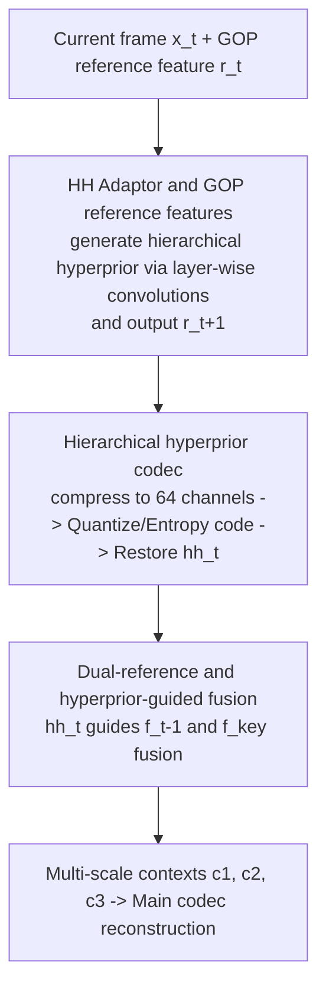

# Content-Adaptive Hierarchical Hyperprior for Neural Video Coding

**Conference**: CVPR 2026  
**Paper**: [CVF Open Access](https://openaccess.thecvf.com/content/CVPR2026/html/Liao_Content-Adaptive_Hierarchical_Hyperprior_for_Neural_Video_Coding_CVPR_2026_paper.html)  
**Code**: None (Not publicly available)  
**Area**: Model Compression / Neural Video Coding  
**Keywords**: Neural video coding, hierarchical structure, hyperprior, content-adaptive, rate-distortion optimization  

## TL;DR
Addressing the long-neglected optimization of "hierarchical structure" (quality structure + reference structure) in neural video coding (NVC), this paper extracts a **hierarchical hyperprior (hh)** from the current frame. This prior uniformly guides the content-adaptive joint optimization of quality allocation and dual-reference fusion, saving 15.51% and 12.20% bitrate compared to the previous SOTA, DCVC-FM, under IP -1 and IP 32 settings respectively.

## Background & Motivation

**Background**: Modern neural video coding predominantly follows the "conditional coding" paradigm (the DCVC family), performing motion compensation in the feature domain and accumulating temporal information through implicit context features. The latest DCVC-FM has outperformed the H.266/VVC reference software VTM under the IP -1 setting. However, most existing works focus solely on improving **network architectures and encoding modules**.

**Limitations of Prior Work**: Traditional encoders (e.g., VTM) have always employed collaborative optimization of "algorithms + hierarchical structure"—featuring explicit hierarchical structures with specific Quantization Parameter (QP) offsets and reference frame lists for different layers, adjusted via multi-QP optimization, RDOQ, and reference frame RDO for content adaptation. In contrast, hierarchical structures in NVC are **implicit**: the quality structure depends on frame-level quality allocation learned end-to-end, while the reference structure is hidden within the inter-frame propagation of context generation. Dedicated optimization in this area is scarce.

**Key Challenge**: The few existing NVC hierarchical structure works (e.g., DCVC-DC via hierarchical Lagrange weights, DCVC-FM via periodic context refreshing, and EHVC via dual-reference schemes) share two major shortcomings: **(1) Lack of content adaptation in hierarchical structure optimization**, as they apply fixed structures to diverse video content; and **(2) Independent optimization of quality and reference structures**, failing to consider them jointly. Essentially, NVC lacks a unified mechanism to "understand current frame content while simultaneously adjusting quality and references."

**Goal**: To enable NVC hierarchical structures to be content-adaptive while jointly optimizing both the quality and reference structures.

**Key Insight**: The authors observe that "hyperprior" is already a mature component in NVC for extracting side information from latent variables to assist entropy modeling. Could a **"hierarchical hyperprior" extracted directly from the current raw frame** be created to carry hierarchical information? Since it originates from the current frame, it naturally contains content-specific information; as a singular source, it can simultaneously guide both quality and reference structures.

**Core Idea**: Introducing a brand-new "hierarchical hyperprior codec" that extracts a hierarchical hyperprior $hh_t$ from the current frame. This $hh_t$ is used to **simultaneously** drive the content-adaptive joint optimization of the quality structure (layer-wise adaptive quality allocation) and the reference structure (fusion of previous frame + key frame references).

## Method

### Overall Architecture
This NVC framework is built upon the mainstream conditional NVC (main codec + hyperprior codec) with the addition of a third branch: the **hierarchical hyperprior codec** (indicated by red arrows in Fig. 1(b)). The encoding flow for a frame is: the current frame $x_t$ and the GOP reference feature $r_t$ enter the **HH Adaptor**, generating hierarchical-aware features $\check{h}_t$ and the GOP reference feature for the next frame $r_{t+1}$. $\check{h}_t$ is compressed into 64-channel latent variables $h_t$ via the **HH Encoder**, followed by quantization and entropy coding into the bitstream. On the decoder side, after entropy decoding, the **HH Decoder** upsamples and restores the hierarchical hyperprior $hh_t$ at the original resolution. Finally, $hh_t$ enters the **context generation** module to guide the fusion of the previous frame reference feature $f_{t-1}$ and the key frame reference feature $f_{key}$, outputting multi-scale temporal contexts $c_{1,t}, c_{2,t}, c_{3,t}$ to the main codec for reconstruction.

The hierarchical structure itself maintains a fixed skeleton: following DCVC-DC's 4-frame GOP with hierarchical weights of $[0.5, 1.2, 0.5, 0.9]$. Three different weights correspond to three "layers," where the frame with weight 1.2 has the highest quality and serves as the intra-GOP key frame. All innovations in this paper involve **content-adaptive** fine-tuning on top of this fixed skeleton using the hierarchical hyperprior.

### Key Designs

**1. Hierarchical Hyperprior + HH Adaptor: Content-Adaptive Layer-wise Quality Modulation**

To address the issue where "NVC quality structures are learned via fixed training, leading to poor generalization for variable-length prediction chains," the authors designed the **HH Adaptor**. It consists of a set of $3\times3$ convolutions and LeakyReLU activations. The input is the current frame $x_t$ and the GOP reference feature $r_t$, while the output is the hierarchical-aware feature $\check{h}_t$. Crucially, **different convolutional parameters are applied based on the layer index of the frame** (grey sections in Fig. 5), thereby generating contexts of varying quality for different layers. This explicitly moves "model-parameter-guided quality allocation" into a content-adaptive module. It offers two benefits: (1) it uses the current frame as input, allowing layer-wise parameters to adjust quality based on content; and (2) the adaptor output embeds quality information, which, after subsequent processing, enables the hierarchical hyperprior to guide context generation, grounding the joint optimization of quality and references.

The companion **GOP reference feature $r_t$** is another input to the adaptor, used to carry information from other frames within the GOP. For non-key frames, the adaptor output from the previous frame is directly used as the current frame's $r_t$; for the first inter-coded frame, $r_t$ is initialized as a zero tensor. To prevent error propagation, key frames (excluding the first inter frame) trigger a **refresh**: the hierarchical hyperprior is still generated using $x_t$ and the inherited $r_t$, but the GOP reference feature passed to the next frame is recalculated using "$x_t$ + zero tensor" (Fig. 5(b)), effectively cutting off the propagation of prior errors at key frames.

**2. Hierarchical Hyperprior Codec: Lightweight Compression of $hh_t$**

The hierarchical hyperprior must be transmitted to the decoder to guide context generation on both sides, requiring separate encoding. To balance computational cost and feature extraction capability, the authors carefully designed the channel count and layer depth: the encoder compresses the adaptor output through a series of convolutions into a compact representation with **64 channels and 64x spatial downsampling**, followed by quantization and entropy coding. The decoder then **upsamples by 64x** using sub-pixel convolutions (SubConv) to restore the 12-channel hierarchical hyperprior $hh_t$ at the original resolution (Fig. 4). This codec is intentionally lightweight—its role is to transmit "side information" rather than primary content, utilizing minimal bitrate to achieve content-adaptive control over the hierarchical structure.

**3. Dual-reference + Hyperprior-guided Context Fusion: Content-Adaptive Reference Structure**

The optimization of the reference structure is concentrated in the context generation module (Fig. 3), consisting of **initial context generation** and **context fusion**. Initial context generation uses dual branches: the $f_{t-1}$ branch (high similarity, adjacent frames) sequentially performs feature extraction, warping, and alignment to obtain three scales of initial context $\tilde{c}_{1,t}, \tilde{c}_{2,t}, \tilde{c}_{3,t}$, following the DCVC-DC structure; the $f_{key}$ branch (high quality, key frames) performs similar feature extraction followed by $n$ warps (where $n$ is the distance to the key frame) and key alignment to obtain the key frame initial context $\tilde{c}_{k,t}$. Parameters are not shared between branches. Notably, the authors **removed the previous feature adaptors used in prior NVCs at this stage** to concentrate all "model-parameter-guided quality structure optimization" within the HH Adaptor, avoiding disjointed management.

Context fusion is where joint optimization occurs: $hh_t$, the highest-scale initial context $\tilde{c}_{1,t}$, and the key frame initial context $\tilde{c}_{k,t}$ are fed into the context merge module. $hh_t$ **guides** the fusion of information from the previous frame and the key frame, outputting a single-scale fused context $\check{c}_{1,t}$. This is then merged with the remaining scales $\tilde{c}_{2,t}, \tilde{c}_{3,t}$ to produce the final multi-scale contexts $c_{1,t}, c_{2,t}, c_{3,t}$. Visualizations (Fig. 9) confirm the significance of this fusion: $\tilde{c}_{1,t}$ preserves high-texture details of moving objects due to temporal proximity, while $\tilde{c}_{k,t}$ blurs moving objects due to frame distance but preserves high-quality static backgrounds. The fused $c_{1,t}$ gains both rich features of moving parts and high-quality background features. Since both the quality structure (HH Adaptor) and reference structure (fusion here) are driven by the same content-derived hierarchical hyperprior, end-to-end training **jointly** optimizes them.

## Key Experimental Results

Training utilized Vimeo-90k (pre-trained on 7-frame clips and fine-tuned on 32-frame raw videos). Evalution was conducted on six datasets: UVG, MCL-JCV, and HEVC Class B/C/D/E. Metrics used are BD-Rate (relative to VTM-23.4 LDB as the anchor, lower is better), supplemented by bpp and PSNR.

### Main Results

Average BD-Rate (%) comparison under IP -1 (Intra only for the first frame, full sequence):

| Encoder | Avg. BD-Rate (%) | Description |
|--------|------------------|------|
| VTM-23.4 (Anchor) | 0.00 | H.266/VVC Reference Software |
| DCVC-DC | 25.16 | Worse than VTM |
| DCVC-FM | -7.07 | Previous SOTA NVC |
| DCVC-RT | 25.66 | Focuses on low complexity, severe RD degradation |
| **Ours** | **-22.58** | Best across all datasets, 15.51% better than DCVC-FM |

Average BD-Rate (%) comparison under IP 32 (96 frames, short prediction chain):

| Encoder | Avg. BD-Rate (%) | Description |
|--------|------------------|------|
| VTM-23.4 (Anchor) | 0.00 | — |
| DCVC-DC | -12.47 | — |
| DCVC-FM | -8.82 | — |
| **Ours** | **-21.02** | Best across all datasets, 12.20% better than DCVC-FM |

The proposed NVC achieves the best performance across all datasets in both settings, indicating improvements hold for both long and short prediction chains.

### Ablation Study

Ablation by component on HEVC B/C/D/E (IP -1, full sequence) (BD-Rate %, baseline Ma = DCVC-DC with context refreshing):

| Config | HH-guided Context Fusion | HH Adaptor | GOP Ref Feature | Refresh in Adaptor | BD-Rate (%) |
|------|:--:|:--:|:--:|:--:|:--:|
| Ma (Baseline) | | | | | 0.0 |
| Mb | ✓ | | | | -17.3 |
| Mc | ✓ | ✓ | | | -18.5 |
| Md | ✓ | ✓ | ✓ | | -19.4 |
| Me (Full) | ✓ | ✓ | ✓ | ✓ | -20.0 |

### Key Findings
- **The largest contribution comes from "HH-guided Context Fusion" (Reference Structure Optimization)**: This single component provides a 17.3% bitrate saving, the clear majority of the total 20.0% gain. The HH Adaptor, GOP reference features, and adaptor refreshing contribute further incremental improvements.
- **Improved Quality Structure Stability**: Comparing frame-level PSNR on *KristenAndSara* at 0.01 bpp (Fig. 8), DCVC-DC shows severe error propagation. While DCVC-FM alleviates this via periodic refreshing, it still exhibits significant fluctuations within the 32-frame cycle. The proposed NVC achieves quality stability nearly identical to VTM.
- **Acceptable Complexity**: The proposed NVC requires 1530 kMACs/pixel with encoding/decoding times of 1.04s/0.88s (V100, 1080p). This is slightly higher than DCVC-DC (1344 kMACs/pixel), but the rate-distortion gain is substantial. Note: DCVC-FM's complexity (1125 kMACs/pixel) is lower than ours, indicating a trade-off between complexity and performance.

## Highlights & Insights
- **Repurposing the "Hyperprior"**: Traditional hyperpriors provide side information for latent variable entropy modeling; this paper creates a "hierarchical hyperprior" specifically for the hierarchical structure, extracted from raw frames to incorporate content information—a clever conceptual transfer that requires minimal changes to the backbone.
- **Unified Control for Dual Structures**: Quality and reference structures were previously treated as separate issues. By using a single $hh_t$ to drive both, end-to-end training naturally achieves joint optimization. This "unified handle" is a transferable idea for other multi-structure coordination tasks.
- **Visualizing Dual-Reference Utility**: Adjacent frames provide motion details while key frames provide high-quality backgrounds. Fusion achieves the best of both worlds—this "high similarity + high quality" complementarity is intuitive and explains why HH-guided fusion is the dominant factor in the ablation results.

## Limitations & Future Work
- **Closed Source**: The code is not public, posing a barrier to reproduction.
- **Fixed Hierarchical Skeleton**: The 4-frame GOP and weight set $[0.5, 1.2, 0.5, 0.9]$ are directly adopted from DCVC-DC. Content adaptation only occurs as modulation on top of this skeleton; whether the GOP length/weights themselves should be content-adaptive remains unexplored.
- **Focus on Low-Delay (LD) Configuration**: The authors note that Random Access (RA) is typically superior in traditional coding, but currently no RA NVC exceeds SOTA LD NVC. This work remains in the LD domain; the effectiveness of hierarchical hyperpriors under RA is an open question.
- **Higher Complexity than DCVC-FM**: Introducing an additional codec branch results in extra computation and latency, which may be unfriendly to real-time scenarios.

## Related Work & Insights
- **vs DCVC-DC**: DCVC-DC uses hierarchical Lagrange weights in the RD loss to create a 4-frame GOP quality structure, but those weights are fixed. Ours adopts its skeleton but uses the HH Adaptor to make quality allocation content-adaptive, shifting BD-Rate from +25.16% to -22.58% under IP -1.
- **vs DCVC-FM**: DCVC-FM relies on periodic context refreshing to mitigate long-chain error propagation. Ours not only refreshes GOP reference features at key frames but also adds content-adaptive joint optimization of quality and reference, saving an additional 15.51% (IP -1) and showing more stable quality.
- **vs EHVC**: EHVC proposed a "t-1 frame + key frame" dual-reference scheme but ignored content adaptation and joint quality-reference optimization. Ours inherits the dual-reference concept and uses the hierarchical hyperprior to guide fusion and joint training, filling the gaps in EHVC's approach.

## Rating
- Novelty: ⭐⭐⭐⭐ Transferring the hyperprior concept to hierarchical structures for joint optimization of quality and reference is a novel angle, though it relies on the DCVC-DC skeleton.
- Experimental Thoroughness: ⭐⭐⭐⭐ Comprehensive across six datasets, two IP settings, component-wise ablation, and quality/visual analysis; lacks RA configuration and larger-scale ablation.
- Writing Quality: ⭐⭐⭐⭐ Motivations and background on hierarchical structures are clear; dense notations ($\check{h}_t$, $\check{c}$, $\tilde{c}$) require close reference to diagrams.
- Value: ⭐⭐⭐⭐ Achieves a clear SOTA in the overlooked direction of hierarchical structures; the methodology is inspiring for future NVC work, though limited by being closed-source and high complexity.

<!-- RELATED:START -->

## Related Papers

- [\[CVPR 2026\] CADC: Content Adaptive Diffusion-Based Generative Image Compression](cadc_content_adaptive_diffusion-based_generative_image_compression.md)
- [\[CVPR 2026\] Ultra-Fast Neural Video Compression](ultra-fast_neural_video_compression.md)
- [\[CVPR 2026\] Accelerating Streaming Video Large Language Models via Hierarchical Token Compression](accelerating_streaming_video_large_language_models_via_hierarchical_token_compre.md)
- [\[CVPR 2026\] Vision-Oriented Lightweight Neural Architecture Search with Budget-Adaptive Evaluation](vision-oriented_lightweight_neural_architecture_search_with_budget-adaptive_eval.md)
- [\[CVPR 2026\] Adaptive Video Distillation: Mitigating Oversaturation and Temporal Collapse in Few-Step Generation](adaptive_video_distillation_mitigating_oversaturation_and_temporal_collapse_in_f.md)

<!-- RELATED:END -->
