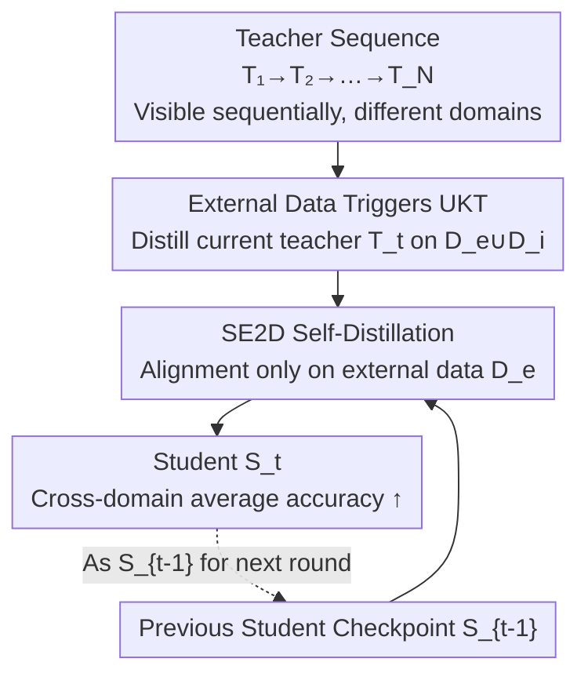

# Continual Distillation of Teachers from Different Domains

**Conference**: CVPR 2026  
**arXiv**: [2605.04059](https://arxiv.org/abs/2605.04059)  
**Code**: https://github.com/Nicolas1203/continual_distillation (Available)  
**Area**: Model Compression / Knowledge Distillation / Continual Learning  
**Keywords**: Continual Distillation, Knowledge Distillation, External Data, Unseen Knowledge Forgetting, Foundation Models

## TL;DR
The paper proposes a new paradigm called "Continual Distillation (CD)" — where a student sequentially distills from **a stream of teachers who arrive one after another, belong to different domains, and are mutually invisible**. It identifies that distilling with "external data" (unseen by teachers) can transfer unseen domain knowledge (UKT), but sequential progression leads to the forgetting of this knowledge (UKF). Consequently, the authors propose SE2D (restricting self-distillation to external data) to alleviate forgetting and improve cross-domain average accuracy across multiple benchmarks.

## Background & Motivation
**Background**: Knowledge Distillation (KD) involves a student mimicking a large teacher and is a cornerstone of model compression and transfer. Continual Learning (CL) studies how models can avoid forgetting when "data arrives continuously and old data is inaccessible." Both assume that **what changes is the data**.

**Limitations of Prior Work**: In the era of Foundation Models (FM), what is truly updated continuously and difficult to store long-term is the **model itself**. A 10B parameter model requires approximately 38GB, and FMs often exceed 100B; older versions often become inaccessible after API updates; and the teachers' original training data is usually not public, confidential, or too large to reuse. Thus, the act of "distilling from historical teachers again" is practically impossible in reality.

**Key Challenge**: When teachers arrive continuously like a data stream and possess different domain expertise (e.g., one specialized in animals, another in insects) while being mutually invisible, the student must learn new skills from the current teacher while preserving skills transferred from previous ones—this is an overlooked "model stream" version of the continual learning problem, which standard KD and standard CL do not cover.

**Goal**: To decompose the problem into two steps—(1) under the constraints of no teacher training data, no labels, and teachers arriving one by one, how to maximize the transfer of each teacher's **domain-specific knowledge** to the student; (2) how to prevent the previously transferred knowledge from being washed away when subsequent teachers arrive.

**Key Insight**: The authors observe that distillation data can be categorized into two types—**Internal Data (ID, $\mathcal{D}_i$)**, seen by all teachers, and **External Data (ED, $\mathcal{D}_e$)**, seen by none of the teachers. Counter-intuitively, it is the "data the teacher has never seen" that extracts the teacher's generalized knowledge of other domains during distillation.

**Core Idea**: Adapt the "self-distillation regularization" from continual learning, but **perform it only on external data** to align the student with its checkpoint from the previous round. This specifically preserves the unseen domain knowledge that was transferred via external data and is most prone to being lost.

## Method

### Overall Architecture
The setup for continual distillation is: given a sequence of teachers $\{\mathcal{T}_0, \mathcal{T}_1, \dots, \mathcal{T}_N\}$, each $\mathcal{T}_t$ is trained on a dataset $\mathcal{D}_t^{\mathcal{T}}$, and any two teachers overlap only on a shared domain $\mathcal{D}_i$ ($\mathcal{D}_t^{\mathcal{T}} \cap \mathcal{D}_{t'}^{\mathcal{T}} = \mathcal{D}_i$), with the rest being unique domains. On **a fixed, unlabeled distillation set** $\mathcal{D}^{\mathcal{S}} = \mathcal{D}_e \cup \mathcal{D}_i$, the student $\mathcal{S}$ performs logits distillation sequentially against the current teacher; while distilling the $t$-th teacher, other teachers are invisible. The goal is for the student to perform well in **all domains mastered by at least one teacher**, even if the student has never "seen" labeled data from those domains.

The pipeline first uses "external data to trigger UKT" to bring in the current teacher's unseen domain knowledge, then uses "SE2D self-distillation" to constrain the student against the previous checkpoint to preserve the transferred unseen knowledge, and finally outputs a student capable of cross-domain generalization.

### Key Designs

**1. Continual Distillation Paradigm: Shifting from "Data Stream" to "Model Stream" Continual Learning**

In reality, foundation models are what update continuously and are difficult to store or access, not just data. However, no prior work treats "a sequence of sequentially arriving, mutually invisible teachers" as an object of continual learning. The authors define Continual Distillation based on this: with a fixed distillation dataset, a single student distills sequentially from a teacher sequence, and other teachers are inaccessible when distilling a specific teacher—this is isomorphic to Domain Incremental Learning (DIL), but replaces "each task is a batch of new data" with "each task is a new teacher." Formally denoted as $\mathbb{D}_{\mathcal{S}}(\mathcal{T}_t, \mathcal{D}^{\mathcal{S}})$, which is "distilling teacher $\mathcal{T}_t$ into student using distillation set $\mathcal{D}^{\mathcal{S}}$." It is effective because it precisely characterizes real-world constraints in the FM era (teacher data missing, old teacher APIs expiring, models too large to store), turning an overlooked but common engineering hurdle into a researchable and measurable learning problem.

**2. External Data Triggers UKT: Using data the teacher "never trained on" to transfer unseen domain knowledge**

Standard KD defaults to using the teacher's training domain data for distillation, but here the teacher's training data is unavailable. The authors split the distillation set into internal data $\mathcal{D}_i$ (seen by all teachers) and external data $\mathcal{D}_e$ (where $\mathcal{D}_e \cap \mathcal{D}_t = \varnothing$ for any teacher $t$). They found that: when distilling only on $\mathcal{D}_i$, the student only learns that one shared domain; however, when $\mathcal{D}_e$ is also included, the student surprisingly achieves high scores on domains it has never "seen" but the teacher has mastered—the authors call this **Unseen Knowledge Transfer (UKT)**. The intuition is that when faced with external data, the teacher outputs "general" soft labels when uncertain and "specific" soft labels when certain; these soft labels leak the teacher's cross-domain discriminative structure to the student. Experiments further show that the larger the external proportion $|\mathcal{D}_e|/|\mathcal{D}^{\mathcal{S}}|$, the higher the unseen domain scores, indicating that UKT intensity can be directly adjusted by the ratio of external data.

**3. UKF: Sequential distillation washes away previously transferred unseen knowledge**

The knowledge transferred by UKT is fragile: as the student sequentially learns from subsequent teachers, it loses the unseen domain knowledge transferred from previous teachers via external data, which the authors call **Unseen Knowledge Forgetting (UKF)**. It is fundamentally different from classic catastrophic forgetting in DIL—the forgotten knowledge **does not come from the student's own training data** but from the teacher, which the student never directly contacted. Thus, forgetting occurs in "unseen dimensions" and is harder to detect. Experiments confirm that mainstream distillation methods (KL, DKD, LS, MDS) focus only on maximizing current transfer and largely ignore UKF: for example, the MNIST-M accuracy of DKD on Digits drops from $54.50\%$ to $33.84\%$. Identifying UKF and treating it as the core contradiction of CD provides the target for subsequent method design—the essence of CD becomes finding the **optimal trade-off between UKT and UKF** (similar to the stability-plasticity trade-off in CL).

**4. SE2D: Restricting self-distillation to external data to specifically preserve the most fragile unseen knowledge**

Regarding UKF, the authors propose **Self External Data Distillation (SE2D)**: at each distillation step $t$, the student $\mathcal{S}_t$ learns not only from the current teacher $\mathcal{T}_t$ but also from its own previous checkpoint $\mathcal{S}_{t-1}$. Crucially, **the self-distillation toward the checkpoint is performed only on external data $\mathcal{D}_e$**:

$$\mathcal{L}_{\text{SE2D}}=\mathcal{L}_{\text{KD}}(\mathcal{S}_t,\mathcal{T}_t;\mathcal{D}^{\mathcal{S}})+\mathcal{L}_{\text{KD}}(\mathcal{S}_t,\mathcal{S}_{t-1};\mathcal{D}_e).$$

Why target $\mathcal{D}_e$ specifically? Because previous observations indicate that "unseen domain performance" is almost entirely supported by external samples; if self-distillation were also applied to $\mathcal{D}_i$, it would only strengthen the already stable shared domain knowledge and wouldn't help the truly fragile unseen knowledge at all. In other words, SE2D precisely places the "preservation" regularization where knowledge is most likely to be lost, thereby suppressing UKF without sacrificing UKT—this is the core difference compared to standard Self-Distillation that operates on both internal and external data.

### Loss & Training
The distillation term $\mathcal{L}_{\text{KD}}$ is the temperature-scaled KL divergence:

$$\mathcal{L}_{\text{KD}}(\mathcal{S},\mathcal{T};\mathcal{D}^{\mathcal{S}})=T^2\,\mathbb{E}_{x\sim\mathcal{D}^{\mathcal{S}}}\Big[\text{KL}\big(\sigma(\tfrac{z_{\mathcal{T}}(x)}{T})\,\big\|\,\sigma(\tfrac{z_{\mathcal{S}}(x)}{T})\big)\Big],$$,

where $T$ is the distillation temperature, $\sigma(\cdot)$ is softmax, and $z(\cdot)$ represents logits. The entire process **uses only distillation with no label-dependent losses**, and only utilizes logits (no intermediate representations, as they are architecture-dependent, computationally heavy, and require accessing the entire teacher). SE2D simply adds one "self-distillation term toward the previous checkpoint, only on $\mathcal{D}_e$" to $\mathcal{L}_{\text{KD}}$, making it simple to implement without replay buffers or storing historical teachers.

## Key Experimental Results

Setup: Domain incremental datasets are used to simulate CD—CIFAR20 (20 superclasses of CIFAR-100, where different subclasses under each superclass form different domains), Digits (mixture of MNIST/MNIST-M/USPS/SVHN, with KMNIST as the related external domain), and DomainNet (6 style domains, 345 shared classes). Teachers share domain 0 in pairs and each has one unique domain; the student distills only on a fixed unlabeled distillation set. Reported is the **student's accuracy across all domains mastered by the teachers** (average of 3 runs).

### Main Results
Accuracy of the student at the end of the sequence on CIFAR20 + related external data (D4) (%):

| Method | D0(ID) | D1 | Avg(0-3) | Gain↑ |
|------|--------|------|----------|-------|
| KL-divergence | 97.05 | 48.55 | 71.36 | +9.42 |
| DKD [CVPR'22] | 96.05 | 44.13 | 65.10 | +10.68 |
| LS [CVPR'24] | 96.85 | 47.25 | 70.39 | +11.64 |
| MDS [ICLR'25] | 96.55 | 45.26 | 67.56 | +14.01 |
| Self-Distillation | 97.71 | 61.23 | 74.93 | +17.11 |
| **SE2D (Ours)** | 97.46 | **70.71** | **76.17** | n/a |

Look specifically at D1 (the domain covered first and most prone to forgetting): SE2D achieves $70.71\%$, overhead of more than $9$ points compared to Self-Distillation's $61.23\%$, and $22$ points higher than pure KL's $48.55\%$; meanwhile, Avg(0-3) is also the highest, indicating that preservation does not sacrifice overall performance. On Digits + KMNIST, SE2D averages $87.00\%$ > Self-Distillation $85.58\%$ ($61.84\%$ vs $55.86\%$ on SVHN).

### Ablation Study
Influence of external data "source/relevance" on Avg(0-3) for KL-divergence on CIFAR20:

| External Data | KL-div Avg(0-3) | Description |
|----------|-----------------|------|
| Internal Data Only (D0) | 61.94 | No ED, UKT is almost zero |
| + D4 (Related) | 71.36 | Related ED triggers strong UKT, +9.4 |
| + CUB (Birds, Less Related) | 67.02 | Increased domain gap, gains shrink |
| + MNIST (Unrelated) | 59.78 | Overly large domain gap, actually **lower** than no ED |

SE2D vs Self-Distillation across datasets (Related ED, Avg):

| Dataset | Self-Dist | SE2D | Conclusion |
|--------|-----------|------|------|
| CIFAR20 + D4 | 74.93 | **76.17** | SE2D wins |
| Digits + KMNIST | 85.58 | **87.00** | SE2D wins |
| DomainNet + Sketch | **48.76** | 48.01 | SE2D falls behind |

### Key Findings
- **External data is the switch for UKT, and the larger the proportion, the stronger the transfer**: In Table 1, as the external proportion increased from 0% to 33%/50%/66%, unseen domain scores rose monotonically; students distilling only on internal domains were proficient in only that one domain.
- **External data source determines success**: Gains are consistent when ED is sufficiently related to internal domains (D4, CUB), but when the domain gap is too large (MNIST), ED becomes a drag and is even worse than using no ED—UKT is not a free lunch.
- **SE2D's boundaries are honest**: When teacher quality is low or the gap between the external domain and teacher domain is large (DomainNet), the supervision signals on ED are too poor, and SE2D degrades to being inferior to Self-Distillation; the authors attribute this to "weak supervision provided by the teacher on ED."

## Highlights & Insights
- **Formalizing the "Model Stream" as a Continual Learning Object**: Shifting from "continuously changing data" to "continuously changing teachers" accurately addresses real-world pain points in the FM era like "models hard to store, old versions expiring, unpublished training data." This paradigm shift itself is very inspiring.
- **Counter-intuitive UKT**: Distilling with data the teacher **never trained on** actually brings in the teacher's discriminative knowledge about **other domains**—this turns "accidental external data in data-free distillation" from a bug into a feature.
- **Precision Targeted Regularization Logic is Transferable**: The core of SE2D is not "adding self-distillation," but "adding self-distillation only on the subset of data where knowledge is most easily lost (external data)." This approach of "first locating fragile knowledge, then applying regularization only there" can be extended to other distillation and continual learning scenarios involving heterogeneous teachers/data.
- **The phenomenon of UKF has independent value**: It points out that forgetting can occur in dimensions "the student has never directly seen," representing a type of risk missed by traditional forgetting metrics.

## Limitations & Future Work
- **Dependence on External Data and Teacher Quality**: SE2D's benefits strongly depend on (1) a sufficiently small domain gap between teacher domains and external data, and (2) the teacher being inherently strong in the student's unseen domains; if these are not met (as in DomainNet), SE2D may be inferior to simple self-distillation.
- **Need for "Data Source Prior"**: SE2D requires the ability to distinguish which samples belong to the teacher's known vs. unknown domains, but when data is generated to mimic the training set, determining if a sample falls outside the teacher's domain is difficult—the authors admit this is non-trivial in practice.
- **Scale and Modality Limitations**: Experiments were conducted on small-to-medium image classification backbones. The paper acknowledges that future work should expand to language/multimodal large models; whether CD holds on true FMs remains to be verified.
- **Security Risks**: UKT is both an opportunity and a hazard—if distillation data is maliciously selected, undesired or biased knowledge might be quietly injected into the student. The authors list this as an attack surface for future research.

## Related Work & Insights
- **vs Standard Knowledge Distillation (KD)**: Standard KD assumes the teacher and student use the same data and the teacher is always accessible; this work uses unlabeled data, sequential teachers with only one visible at a time, and distillation data intentionally including teacher-unseen domains. The goal shifts from "reproducing teacher domain" to "knowledge accumulation and preservation across multiple heterogeneous teachers."
- **vs Multi-Teacher Distillation**: Traditional multi-teacher methods assume all teachers are **simultaneously accessible**; this work involves **sequential** access, one at a time, without storing historical teachers.
- **vs Continual Learning (CL/DIL)**: CL studies forgetting under data streams. This work replaces "stream" with teachers and uses "fixed data" as a premise. The object of forgetting shifts from "data the model learned itself" to "unseen knowledge (UKF) passed from the teacher that the student never directly contacted."
- **vs Self-Distillation (Common CL Baseline)**: Standard self-distillation aligns with old checkpoints on both internal and external data; SE2D aligns only on external data, thereby concentrating regularization on the most fragile unseen knowledge, consistently outperforming it on CIFAR20/Digits.

## Rating
- Novelty: ⭐⭐⭐⭐⭐ Proposes the new "Model Stream Continual Learning" paradigm and identifies the unstudied phenomena of UKT/UKF.
- Experimental Thoroughness: ⭐⭐⭐⭐ Covers 3 types of datasets, 5 baselines, related/unrelated ED, and external proportion ablations; however, limited to small-medium image backbones, excluding large models.
- Writing Quality: ⭐⭐⭐⭐ Clear concept definitions, logical progression of problem motivation, and honest discussion of scenarios where the method fails.
- Value: ⭐⭐⭐⭐ Addresses real-world needs in the FM era regarding "hard-to-store/access teachers." SE2D is simple to implement and the paradigm has room for expansion.

<!-- RELATED:START -->

## Related Papers

- [\[CVPR 2026\] Bridging Domains through Subspace-Aware Model Merging](bridging_domains_through_subspace-aware_model_merging.md)
- [\[ICML 2026\] Toward Understanding Adversarial Distillation: Why Robust Teachers Fail](../../ICML2026/model_compression/toward_understanding_adversarial_distillation_why_robust_teachers_fail.md)
- [\[ACL 2025\] Who Taught You That? Tracing Teachers in Model Distillation](../../ACL2025/model_compression/who_taught_you_that_tracing_teachers_in_model_distillation.md)
- [\[CVPR 2026\] Cross-Architecture Adaptation: Cloud-Edge Continual Test-Time Adaptation with Dynamic Sampling and Heterogeneous Distillation](cross-architecture_adaptation_cloud-edge_continual_test-time_adaptation_with_dyn.md)
- [\[CVPR 2026\] Elastic Weight Consolidation Done Right for Continual Learning](elastic_weight_consolidation_done_right_for_continual_learning.md)

<!-- RELATED:END -->
