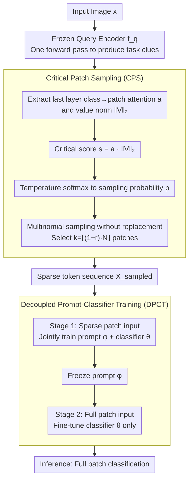

# Critical Patch-Aware Sparse Prompting with Decoupled Training for Continual Learning on the Edge

**Conference**: CVPR 2026  
**arXiv**: [2604.07399](https://arxiv.org/abs/2604.07399)  
**Code**: [https://github.com/laymond1/cps-prompt](https://github.com/laymond1/cps-prompt)  
**Area**: Model Compression / Continual Learning  
**Keywords**: Continual Learning, Edge Devices, Prompt-based CL, Token Reduction, Training Efficiency

## TL;DR
The CPS-Prompt framework is proposed, which achieves approximately 1.6× improvement in training-time memory and computational efficiency for Prompt-based continual learning on edge devices through two modules: task-aware Critical Patch Sampling (CPS) and Decoupled Prompt-Classifier Training (DPCT), while only incurring an approximately 2% drop in accuracy.

## Background & Motivation

**Background**: Continual Learning (CL) on edge devices (home robots, drones, smartphones) requires continuous adaptation to new tasks within limited memory and computing power. Prompt-based Continual Learning (PCL) enables parameter-efficient learning by freezing the ViT backbone and using lightweight learnable prompts, yet existing work focuses primarily on accuracy and inference efficiency.

**Limitations of Prior Work**: PCL methods such as C-Prompt, while accurate, incur massive training memory overhead (4.3× compared to this method), making them unsuitable for deployment on memory-constrained edge devices. OS-Prompt simplifies the two-stage pipeline, but peak memory during backpropagation remains high.

**Key Challenge**: Existing token reduction methods (e.g., ToMe, PatchDropout) discard task-critical patches when combined with PCL, leading to severe accuracy degradation because they are "task-agnostic."

**Goal**: How to achieve significant training-time memory and computational savings in the two-stage PCL architecture while maintaining competitive accuracy?

**Key Insight**: Leveraging the attention and value signals from the last layer of the frozen query encoder to estimate patch importance for task-aware sparsification, and then utilizing decoupled training to eliminate the representation misalignment between sparse training and full-patch inference.

**Core Idea**: Task-aware patch sampling + decoupled prompt/classifier training = training efficiency + accuracy maintenance.

## Method

### Overall Architecture
The core problem CPS-Prompt addresses is enabling Prompt-based continual learning to run on edge devices with restricted memory and compute, rather than just optimizing accuracy in data centers. It follows the standard two-stage PCL architecture: first, a frozen query encoder $f_q$ performs a forward pass to extract "task clues" from the image, which are then injected into a prompt-injected backbone $f_p$ for classification. The two modifications in CPS-Prompt are situated at critical points in this pipeline: inserting a Critical Patch Sampling (CPS) module between the two stages to select truly critical patches using pre-calculated attention signals from the first forward pass, thereby cutting the tokens entering the second-stage backbone by more than half; and using a Decoupled Prompt-Classifier Training (DPCT) strategy to split prompt and classifier training into two phases, specifically compensating for the representation misalignment caused by "training on sparse patches but inferring on full patches." The former saves memory and compute, while the latter recovers the lost accuracy.

### Key Designs

**1. Critical Patch Sampling: Selecting critical patches training-free using existing attention signals from the frozen backbone**

Applying general token reduction (ToMe, PatchDropout) directly to PCL is problematic—they are "task-agnostic" and may delete patches critical for class discrimination, leading to a sharp drop in accuracy. The key insight of CPS is that PCL already requires a forward pass through the query encoder; the attention within that layer already implicitly identifies "which patches are important," and wasting this signal would be inefficient. Specifically, the class token's attention weight $A^L_{\text{cls},j}$ towards each patch token is extracted from the last layer of the query encoder, along with the L2 norm of the patch's value vector $\|V^L_j\|_2$. Their product yields the critical score $s_j = A^L_{\text{cls},j} \cdot \|V^L_j\|_2$—attention reflects the patch's contribution to high-level representation, while the value norm reflects its feature saliency. Scores are converted into sampling probabilities via temperature-scaled softmax:

$$p_j = \frac{\exp(s_j/\tau)}{\sum_i \exp(s_i/\tau)}$$

Then, $k = \lfloor(1-r) \cdot N\rfloor$ patches (where $r$ is the reduction rate) are selected via multinomial sampling without replacement, re-sampled for each mini-batch. Using temperature-based multinomial sampling instead of deterministic Top-k is a choice validated by ablation: fixed Top-k feeds the same "high-score" patches every round, locking the model into a small subset of regions; stochastic sampling allows for variety, providing a form of exploration similar to data augmentation, which aids generalization to arriving tasks. Smaller $\tau$ makes the distribution sharper (closer to deterministic), while larger $\tau$ encourages random exploration ($\tau=0.1$ was optimal in experiments). The entire process is training-free and integrates seamlessly into PCL pipelines.

**2. Decoupled Prompt and Classifier Training: Splitting prompt and classifier training into two stages to eliminate misalignment**

While CPS saves memory, it introduces a risk: during training, the prompt only sees sparse patches, whereas it encounters full patches during inference. This distribution mismatch drags down accuracy. DPCT addresses this by splitting the total $E$ epochs into two segments: for the first $\lfloor \lambda \cdot E \rfloor$ epochs, sparse patch inputs are used to jointly optimize the prompt $\phi$ and classifier $\theta$ with the objective:

$$\mathcal{L}_p = \mathcal{L}(f_p(\mathbf{X}_{\text{sampled}}; \theta, \phi), y)$$

In the remaining epochs, the prompt is frozen, and the classifier is fine-tuned individually using full patch inputs:

$$\mathcal{L}_{\text{cls}} = \mathcal{L}(f_p(\mathbf{X}_{\text{full}}; \theta, \phi), y), \quad (\phi \text{ is frozen})$$

The first segment learns efficient prompts under sparse inputs, and the second allows the classifier to realign representations on the true full-patch distribution, effectively compensating for the misalignment introduced by CPS. Furthermore, once the prompt is frozen, gradients no longer backpropagate through it, making the second stage even more computationally efficient.

### Loss & Training
- Standard cross-entropy loss is used.
- Adam optimizer is employed for both the prompt and classifier stages.
- Learning rate follows a cosine decay starting at 0.001.
- Optimal hyperparameters: patch reduction rate $r=0.4$, temperature $\tau=0.1$.

## Key Experimental Results

### Main Results

| Dataset | Metric | CPS-Prompt | C-Prompt (SOTA) | CODA-Prompt | Description of Differences |
|--------|------|-----------|-----------------|-------------|---------|
| CIFAR-100 | ACC↑ | 66.89 | **68.34** | 67.06 | Only 1.45% lower |
| ImageNet-R | ACC↑ | 49.96 | **53.32** | 50.24 | 3.36% lower |
| CUB-200 | ACC↑ | 52.85 | 52.64 | **53.96** | Comparable to CODA |

Efficiency Comparison (Measured on Jetson Orin Nano):

| Method | Peak Memory Ratio | Training Time Ratio | Energy Ratio |
|------|------------|------------|---------|
| CPS-Prompt | **1×** | **1×** | **1×** |
| CODA-Prompt | ~1.6× | ~1.5× | ~1.6× |
| C-Prompt | ~4.3× | ~3.1× | ~3.3× |

### Ablation Study

| Configuration | ACC↑(ImageNet-R) | Memory | Training Time | Note |
|------|-----------------|------|---------|------|
| CODA-Prompt Baseline | 50.24 | 440MB | 1788s | Baseline |
| + PD (Random Patch Drop) | 45.32 | 253MB | 1388s | Significant accuracy drop |
| + CPS (Task-aware) | 47.16 | 253MB | 1389s | 1.8% better than PD |
| + PD + DPCT | 47.96 | 253MB | 1126s | DPCT recovers accuracy |
| + CPS + DPCT (Full) | **49.28** | **253MB** | **1126s** | Optimal configuration |

### Key Findings
- CPS and DPCT provide complementary benefits: CPS improves patch quality, while DPCT eliminates representation misalignment.
- Even with memory reduction exceeding 60%, CPS-Prompt maintains over 90% of the baseline accuracy.
- Random sampling significantly outperforms deterministic Top-k at low phase ratios.
- A temperature of $\tau=0.1$ (sharper distribution) performed best across all datasets.

## Highlights & Insights
- **Authentic Edge Deployment Perspective**: Comprehensive measurements (memory, time, energy) were conducted on Jetson Orin Nano, rather than just reporting theoretical FLOPs.
- **Task-Aware Token Reduction**: Cleverly utilizes existing query forward pass signals from the PCL architecture with zero extra training overhead.
- **Simplicity of Decoupled Training**: Using separate stages for sparse/full patch training of the prompt/classifier is simple yet effective.

## Limitations & Future Work
- Validated only on ViT-Tiny/16; performance on larger models (ViT-Base/Large) remains unknown.
- Uses a fixed patch reduction ratio $r=0.4$; dynamic adaptive strategies were not explored.
- Only considers the class-incremental setting; task-incremental or domain-incremental settings were not covered.
- Lack of comparison with more recent VLM-based CL methods.

## Related Work & Insights
- Comparison with ToMe and PatchDropout shows that task-agnostic token reduction performs poorly in PCL.
- The concept of DPCT is analogous to addressing "training-inference inconsistency" in knowledge distillation.
- Inspires the generalization of the CPS idea to other ViT downstream tasks requiring token reduction.

## Rating
- Novelty: ⭐⭐⭐⭐ The combination of task-aware patch sampling and decoupled training is novel, though technical contributions of individual modules are moderate.
- Experimental Thoroughness: ⭐⭐⭐⭐⭐ Three datasets + real edge hardware + complete ablation + efficiency analysis.
- Writing Quality: ⭐⭐⭐⭐ Clear structure with complete algorithm flowcharts and pseudocode.
- Value: ⭐⭐⭐⭐ High practical significance for edge continual learning, though the overall scope is somewhat specialized.

<!-- RELATED:START -->

## Related Papers

- [\[NeurIPS 2025\] REP: Resource-Efficient Prompting for Rehearsal-Free Continual Learning](../../NeurIPS2025/model_compression/rep_resource-efficient_prompting_for_rehearsal-free_continual_learning.md)
- [\[CVPR 2026\] Cross-Architecture Adaptation: Cloud-Edge Continual Test-Time Adaptation with Dynamic Sampling and Heterogeneous Distillation](cross-architecture_adaptation_cloud-edge_continual_test-time_adaptation_with_dyn.md)
- [\[CVPR 2026\] MEMO: Human-like Crisp Edge Detection Using Masked Edge Prediction](memo_human-like_crisp_edge_detection_using_masked_edge_prediction.md)
- [\[CVPR 2026\] Back to Source: Open-Set Continual Test-Time Adaptation via Domain Compensation](back_to_source_open-set_continual_test-time_adaptation_via_domain_compensation.md)
- [\[ICLR 2026\] Quantized Gradient Projection for Memory-Efficient Continual Learning](../../ICLR2026/model_compression/quantized_gradient_projection_for_memory-efficient_continual_learning.md)

<!-- RELATED:END -->
