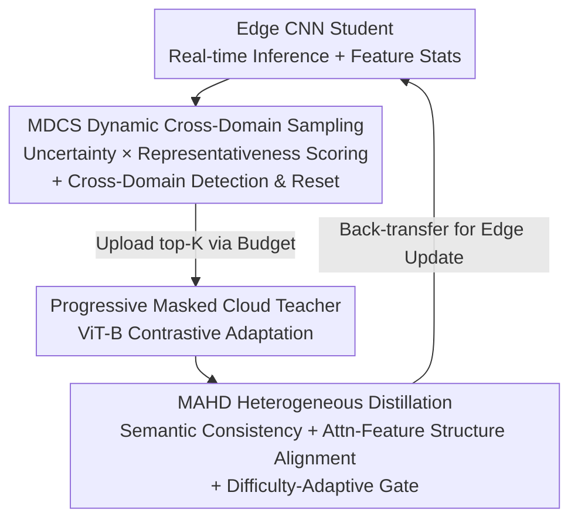

# Cross-Architecture Adaptation: Cloud-Edge Continual Test-Time Adaptation with Dynamic Sampling and Heterogeneous Distillation

**Conference**: CVPR 2026  
**Paper**: [CVF Open Access](https://openaccess.thecvf.com/content/CVPR2026/html/Xu_Cross-Architecture_Adaptation_Cloud-Edge_Continual_Test-Time_Adaptation_with_Dynamic_Sampling_and_CVPR_2026_paper.html)  
**Code**: None  
**Area**: Model Compression / Cloud-Edge Synergy / Continual Test-Time Adaptation  
**Keywords**: Continual Test-Time Adaptation, Cloud-Edge Synergy, Heterogeneous Knowledge Distillation, Cross-Domain Detection, Dynamic Sampling

## TL;DR
Addressing the constraints of existing cloud-edge Continual Test-Time Adaptation (CTTA) which default to isomorphic CNNs, CAA enables the cloud to run a large ViT teacher while the edge runs a lightweight CNN student. Through a mechanism of "selective sample uploading via communication budget + cross-architecture heterogeneous distillation," it achieves heterogeneous synergistic adaptation, setting a new SOTA on ImageNet-C severity-5 with 41.2% mean accuracy while uploading the minimum number of samples.

## Background & Motivation
**Background**: CTTA allows models to continuously adapt during the deployment phase using only streaming unlabeled test samples to handle distribution shifts such as day/night cycles or weather changes. In real-world deployment, the mainstream approach is "Cloud-Edge Synergy": edge devices perform real-time inference and monitor distribution shifts, uploading filtered data to the cloud, where a powerful model updates the edge model via knowledge distillation.

**Limitations of Prior Work**: Nearly all existing cloud-edge CTTA methods assume the cloud and edge are **isomorphic** (both are CNNs and share the same architecture). However, in practice, edge devices are constrained by compute/memory and typically run CNNs (mature hardware optimization, easy deployment), while the cloud is better suited for Transformers which offer better scalability and performance on large data. Forcing isomorphism either weakens the cloud to a tiny CNN or makes the ViT too heavy for the edge.

**Key Challenge**: Heterogeneous cloud-edge synergy (Cloud-ViT / Edge-CNN) is the pragmatic solution, but it complicates the problem—the **inductive biases and internal representation structures** of Transformer teachers and CNN students differ vastly. Directly forcing students to imitate intermediate features of the teacher leads to cross-layer semantic misalignment. Existing heterogeneous distillation methods (e.g., HeteroAKD) only perform static logit alignment, which fails under the continuously shifting distributions of CTTA.

**Goal**: The authors decompose heterogeneous cloud-edge CTTA into three entangled sub-problems: ① Architectural heterogeneity making high-fidelity distillation extremely difficult; ② Strict communication bandwidth budgets preventing the student from uploading all data; ③ Continual domain drift causing historical statistics to interfere with current inference and accumulate bias, potentially leading to negative transfer or collapse of the cloud teacher's own adaptation.

**Key Insight**: Rather than blind imitation of teacher features, it is better to (a) selectively upload a few "most informative and class-balanced" samples at the edge and reset historical states upon detecting domain shifts; (b) upgrade cloud distillation from simple logit alignment to "semantic + structural" multi-layer alignment, using a sample-difficulty-dependent gate to reconcile these objectives.

**Core Idea**: The CAA framework consists of "Dynamic Cross-Domain Sampling (managing communication & drift) + Multi-layer Adaptive Heterogeneous Distillation (transferring knowledge across architectures)" to inject high-fidelity knowledge from a large cloud ViT teacher into a lightweight edge CNN student.

## Method

### Overall Architecture
CAA is deployed as a pair of heterogeneous cloud-edge models: the edge features a lightweight CNN student $g(\cdot)$ (e.g., ResNet-18) for real-time inference, monitoring drift, and selective uploading; the cloud features a large Transformer teacher $f(\cdot)$ (e.g., ViT-B) that uses its high capacity to adapt to new data and provide guidance. The loop: edge student performs inference → feeds features and statistics to the **MDCS** module to select the top-K most informative samples for asynchronous upload → cloud ViT teacher performs contrastive adaptation via **progressive masking** on the uploaded samples, producing reliable predictions and intermediate representations → the **MAHD** module distills teacher knowledge back to the edge student across architectures → the updated student continues inference.

### Key Designs

**1. Progressive Masked Cloud Teacher: Preventing collapse on continuous OOD streams**

While the cloud teacher is powerful, it must also perform unsupervised adaptation in CTTA. Continuous OOD/biased samples can lead to catastrophic collapse, ruining the guidance for the student. CAA adds a contrastive self-supervised objective: two versions of the same image $x_i, x_j$ are generated with different masking ratios $m_i < m_j$. Prediction uncertainty is measured via Shannon entropy $S(\cdot)$, enforcing that the "less-masked view" is more certain and consistent with the other view:

$$L_{ViT} = \sum_{i<j}^{M_N} \max\big(0,\, S(f_t(x_i)) - \mathrm{sg}(S(f_t(x_j)))\big) + \theta \sum_{i<j}^{M_N} H\big(f_t(x_j), \mathrm{sg}(f_t(x_i))\big)$$

where $\mathrm{sg}(\cdot)$ is the stop-gradient operator, $H(\cdot,\cdot)$ is the cross-entropy between predictions, and $\theta$ balances the "entropy ranking term" and "mask consistency term." This ensures the teacher remains stable on unlabeled streams.

**2. MDCS Multi-criteria Dynamic Cross-Domain Sampling: Selecting high-value samples under fixed bandwidth and resetting states upon domain shift**

Strict communication budgets prevent full uploading; continuous drift also means old domain statistics can interfere with new ones. MDCS unifies "sample selection" and "drift detection."

Sampling uses a hybrid "Uncertainty × Representativeness" score: $\text{Score}(x) = \alpha\cdot\text{Norm}(U(x)) + (1-\alpha)\cdot\text{Norm}(R(x))$, with min-max normalization to prevent outliers from dominating. Uncertainty $U(x)$ uses symmetric KL divergence between two forward passes with TTAug: $U(x)=\tfrac12\big(\mathrm{KL}(g_t(\hat x)\|g_t(\bar x))+\mathrm{KL}(g_t(\bar x)\|g_t(\hat x))\big)$. Representativeness $R(x)=\min_{c_m\in C}\|\text{AvgPool}(g_t^{(l^*)}(x))-c_m\|_2$ follows core-set principles, using distances to the nearest cluster centers $C$. A priority buffer of capacity $K_B$ handles asynchronous uploads.

Cross-domain detection uses a dual-path "AND" trigger: statistical change $I^{stat}_t$ monitors loss deviations ($z_t$, $r_t$, and CUSUM $A^{\pm}_t$); cluster drift $I^{cluster}_t$ monitors the ratio of outliers $\gamma_t$ relative to adaptive thresholds based on sliding window standard deviations $\sigma_{dt}$. When both fire, the domain is deemed shifted, and the priority buffer $B$, old statistics, and cluster centers $C$ are **reset**.

**3. MAHD Multi-layer Adaptive Heterogeneous Distillation: Transferring semantics and structure while dynamically balancing difficulty**

Since CNNs and ViTs have different inductive biases, MAHD bypasses direct feature value alignment.

Semantic alignment is performed on a set of layers $l\in L=\{1,2,4\}$ via weighted cross-entropy: $L^{(l)}_{clst}(x)=H\big((\text{Softmax}(f_t(x))+\hat y)^{\epsilon}-\hat y,\ P^{(l)}_{clst}(g^{(l)}_t(x))\big)$, where $\hat y$ is the teacher's one-hot pseudo-label. Structural alignment occurs at the student's 3rd layer (balancing resolution and abstraction) by aligning similarity structure matrices $S_{qk}$ and $S_{vv}$ rather than raw attention outputs:

$$L^{(l)}_{attn_t}(x)=\big\|S_{qk}(f^{attn}_t)-S_{qk}(h^{(l)}_t)\big\|_F^2+\lambda_{vv}\big\|S_{vv}(f^{attn}_t)-S_{vv}(h^{(l)}_t)\big\|_F^2$$

MAHD introduces a **difficulty-adaptive gate** $\rho$ based on classification loss: $\rho^*=\Phi(L_{clst})$. When loss is high (early or OOD samples), $\rho$ is lowered to prioritize class consistency; as it stabilizes, $\rho$ increases to enforce structural constraints. The final objective is:

$$L_t(x)=L_{clst}(x)+\rho\big(L_{attn_t}(x)+\lambda L_{feat_t}(x)\big),\quad x\in S_t$$

### Loss & Training
- Cloud Teacher: Contrastive progressive mask loss $L_{ViT}$ for unsupervised adaptation.
- Edge Student: MAHD total loss $L_t$ calculated only on the uploaded subset $S_t$.
- Optimization: SGD (momentum 0.9); edge learning rate 0.03, decaying to 0.00025 once CE stabilizes to prevent overfitting. MDCS uses $\alpha{=}0.5$ and a buffer of 32 samples.

## Key Experimental Results

### Main Results
ImageNet-C, severity level 5, 15 corruption types arriving sequentially (lifelong protocol). Cloud ViT-B + Edge ResNet-18.

| Method | Mean Accuracy (%) | Notes |
|------|------|------|
| ResNet-18 (edge only) | 14.7 | Baseline |
| Tent | 35.1 | Entropy Minimization TTA |
| ETA | 36.8 | Reliability & Diversity weighting |
| CEMA | 38.1 | Previous cloud-edge SOTA |
| CoLA | 38.6 | Dual ResNet-18 |
| **CAA (Ours)** | **41.2** | +2.6% absolute over CoLA |

Communication Overhead (Samples uploaded as % of test stream):

| Method | Level 4 | Level 5 |
|------|---------|---------|
| CEMA | 426.3K (56.8%) | 369.0K (49.2%) |
| EATA | 389.6K (51.9%) | 344.2K (45.9%) |
| **Ours** | **375.5K (50.1%)** | **335.1K (44.7%)** |

### Ablation Study
| Config | Mean Accuracy (%) | Description |
|------|---------|------|
| Full (CAA) | 41.2 | Full model |
| w/o MAHD | 36.2 | Standard CE via soft labels only |
| w/o Reset | 40.3 | Without cross-domain detection/reset |

### Key Findings
- **MAHD is the most significant component**: Removing it drops accuracy by 5.0%, proving that logit alignment is insufficient for cross-architecture scenarios.
- **Cross-domain detection/reset is vital at transition points**: While the overall drop is 0.9%, the impact is localized but severe at sharp transitions (e.g., Noise to Blur).
- **Superiority in difficult scenarios**: CAA leads across most corruption types, especially noise and weather, showing robustness under severe drift.

## Highlights & Insights
- **Bridges the gap of the isomorphism assumption**: Explicitly designing Cloud-ViT / Edge-CNN synergy is more practical for real deployment.
- **Reuse of clustering results**: MDCS uses the same mini-batch k-means centers for both representational scoring and drift detection, which is computationally friendly for edge devices.
- **Similarity structure alignment**: Aligning $QK^\top$ and $VV^\top$ matrices bypasses the tokenization inconsistency between CNNs and ViTs.
- **Difficulty-adaptive gate**: Dynamically balancing semantic consistency vs. structural structural alignment avoids the brittleness of static weights in CTTA.

## Limitations & Future Work
- **Reliance on Supplementary Material**: The precise piecewise function for $\Phi$ and numerous hyperparameters (thresholds for $z, r, \gamma^*$, etc.) are not in the main text, making reproduction difficult.
- **Hyperparameter Overhead**: The complexity of multi-threshold detection logic might require retuning for different datasets.
- **Scope of Validation**: Mainly tested on classification. The performance on object detection or end-to-end latency in real-world weak network environments remains to be observed.

## Related Work & Insights
- **vs CEMA / CoLA**: Unlike these isomorphic methods, CAA uses heterogeneous synergy to gain higher accuracy (41.2% vs 38.6%) with lower communication overhead.
- **vs HeteroAKD**: CAA's MAHD improves upon static distillation by adding structural similarity and dynamic gating specifically for domain drift.

## Rating
- Novelty: ⭐⭐⭐⭐ Moving cloud-edge CTTA to heterogeneous architectures is a pragmatic and innovative step.
- Experimental Thoroughness: ⭐⭐⭐ Results on ImageNet-C are solid, but significant details are relegated to the supplement.
- Writing Quality: ⭐⭐⭐⭐ Clear problem decomposition and well-defined modules.
- Value: ⭐⭐⭐⭐ Practical reference for deploying Edge AI with "bandwidth efficiency + high accuracy."

<!-- RELATED:START -->

## Related Papers

- [\[CVPR 2026\] FOZO: Forward-Only Zeroth-Order Prompt Optimization for Test-Time Adaptation](fozo_forward-only_zeroth-order_prompt_optimization_for_test-time_adaptation.md)
- [\[CVPR 2026\] Test-time Sparsity for Extreme Fast Action Diffusion](test-time_sparsity_for_extreme_fast_action_diffusion.md)
- [\[CVPR 2026\] Critical Patch-Aware Sparse Prompting with Decoupled Training for Continual Learning on the Edge](critical_patch-aware_sparse_prompting_with_decoupled_training_for_continual_lear.md)
- [\[ICML 2026\] Energy-Structured Low-Rank Adaptation for Continual Learning](../../ICML2026/model_compression/energy-structured_low-rank_adaptation_for_continual_learning.md)
- [\[CVPR 2026\] TALON: Test-time Adaptive Learning for On-the-Fly Category Discovery](talon_test-time_adaptive_learning_for_on-the-fly_category_discovery.md)

<!-- RELATED:END -->
