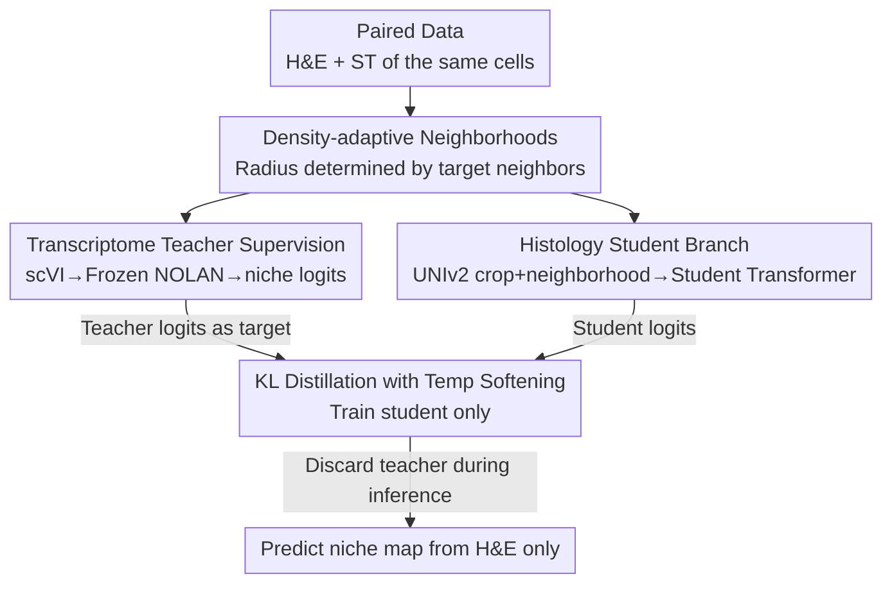

# Cross-Modal Knowledge Distillation from Spatial Transcriptomics to Histology

**Conference**: CVPR 2026  
**arXiv**: [2604.09076](https://arxiv.org/abs/2604.09076)  
**Code**: https://cross-modal-distillation.github.io/ (Project Homepage)  
**Area**: Cross-modal Distillation / Computational Pathology / Medical Imaging  
**Keywords**: Cross-modal Knowledge Distillation, Spatial Transcriptomics, H&E Histology, Tissue Niche, Self-supervised Learning

## TL;DR
A frozen spatial transcriptomics (ST) teacher (NOLAN) supervises an H&E histology student on paired data, distilling molecularly defined "tissue niche" structures into an image-only student network. This allows the prediction of niche segmentations highly consistent with transcriptomics during inference using only H&E slides.

## Background & Motivation
**Background**: Many critical phenomena in tissues (immune infiltration, stromal remodeling, tumor progression) are not properties of single cells but emerge from the spatial organization of diverse cell types. Segmenting tissue into "spatially coherent regions with distinct local cell compositions"—namely niches—is a core objective of pathological analysis. Recent spatial transcriptomics (ST) technologies can simultaneously measure gene expression and spatial coordinates, giving rise to methods such as BANKSY, SpaGCN, MENDER, and NOLAN, which discover biologically meaningful niches in molecular feature space.

**Limitations of Prior Work**: ST sequencing is expensive and scarce, often available only for subsets of samples or tissue regions, making it difficult to scale. Conversely, H&E histology slides are extremely cheap and abundant (archives often contain millions), but they reflect only morphology (cell appearance) and do not directly measure gene expression. Consequently, relying solely on H&E morphological features—even when extracted by pathology foundation models like UNIv2—may fail to recover molecularly defined tissue structures, especially in regions with subtle morphological differences where niche identity is determined by context rather than form.

**Key Challenge**: An information gap exists between abundant but "molecularly weak" H&E and scarce but "molecularly rich" ST. Neither running unsupervised clustering (Leiden) on H&E features nor directly applying unsupervised ST frameworks (NOLAN) to H&E achieves the granularity of ST-derived niches.

**Goal**: To train a model requiring only H&E input that can predict biologically meaningful niche segmentations highly consistent with ST teachers during inference, without relying on any transcriptomic measurements.

**Key Insight**: When paired ST and H&E data are available for the same set of cells, ST provides a richer perspective of "cell states + neighborhood composition" than histology. The authors treat this as a cross-modal distillation problem: using the reference niche structure defined by the ST side as a teacher to force the histology-side student to learn signals from morphology and spatial context that reflect transcriptomic niches. Compared to gene-wise expression prediction, niche structure is a more feasible target as it abstracts molecular noise into a compact summary of tissue organization.

**Core Idea**: Use a "frozen transcriptomics teacher to generate soft niche assignment logits and an histology student with distillation loss for alignment" to transfer molecular-level niche structures into an image-only model, discarding the transcriptomic branch during inference.

## Method

### Overall Architecture
The training phase employs a dual-branch "teacher-student" structure where both branches use **spatial neighborhoods of cells** as basic units and share the same neighborhood construction rules. Teacher branch (ST side): For each cell, gene expressions are encoded via a frozen scVI to obtain molecular latent vectors; spatial neighborhoods are constructed and fed into a frozen pre-trained NOLAN teacher to output $K$-dimensional niche assignment logits as supervision signals. Student branch (H&E side): For each cell, H&E crops centered on the cell are extracted; a frozen UNIv2 extracts `[CLS]` tokens as cell embeddings; spatial neighborhoods are constructed with relative position encodings as used in NOLAN and fed into a trainable student Transformer to output $K$-dimensional logits. During training, only the student Transformer is optimized while all upstream encoders (scVI / NOLAN / UNIv2) are frozen. Student logits are aligned with teacher logits via distillation loss. The inference phase retains only the student branch: UNIv2 features are computed, neighborhoods constructed, and logits predicted from H&E alone. Discrete niche labels are obtained via argmax to form tissue-level niche maps.

### Key Designs

**1. Density-Adaptive Spatial Neighborhoods: Making "Local Context" Comparable Across Tissues**

Niches are defined by local spatial context, hence the basic unit is the cell neighborhood. The challenge lies in the vast differences in tissue density across datasets and sequencing platforms. If a fixed physical radius $r$ is used, a neighborhood in dense tissue might contain dozens of cells while sparse tissue might contain only a few, leading to inconsistent context. The authors choose a specific $r$ for each dataset by estimating it such that the expected number of neighbors matches a fixed target. Consequently, the radius is larger in sparse tissues and smaller in dense tissues, ensuring comparable amounts of spatial context across datasets. The teacher and student use the same neighborhood rules, and $r$ estimated during training is reused during testing.

**2. Cross-Modal Distillation: Using ST Soft Assignments as Supervision Signals Rather Than Hard Labels**

This is the core of the paper, addressing the lack of reliable niche annotations in H&E and the misalignment of morphological clustering with molecular structures. Instead of predicting gene expression, niche soft assignment distributions are used as distillation targets. Both teacher and student output $K$-dimensional logits (student denoted as $a_i^{HIST}$), which are converted to softened distributions via temperature-scaled softmax: $p_i^{ST}=\mathrm{softmax}(a_i^{ST}/\tau)$ and $p_i^{HIST}=\mathrm{softmax}(a_i^{HIST}/\tau)$. The standard distillation loss is then minimized:

$$\mathcal{L}_{distill}=\tau^2\frac{1}{N}\sum_{i=1}^{N}\mathrm{KL}\!\left(p_i^{ST}\,\Vert\,p_i^{HIST}\right)$$

where $\mathrm{KL}(\cdot\Vert\cdot)$ is the KL divergence and $\tau$ is the distillation temperature. Matching softened logits rather than argmax hard labels allows the student to learn relative niche similarities and structures encoded by the teacher (e.g., a cell being "somewhat like niche A and more like niche B") rather than being biased by potentially ambiguous discrete labels. This aligns with the biological reality that tissue boundaries are often transitional.

**3. ST as a "High-Information Reference" Rather Than "Arbitrary Partition": Frozen Upstream, Train Student Only**

Instead of unsupervised learning on H&E, the authors use ST-derived niche structures as a high-information reference proven to identify biologically meaningful boundaries superior to BANKSY/CellCharter/MENDER. During training, scVI, NOLAN, and UNIv2 are frozen. The only trainable component is the student Transformer. The goal is not to replicate an arbitrary teacher partition but to transfer biologically grounded molecular information into a purely histological model and quantify cross-modal consistency. This design leverages representation capabilities of foundation models while minimizing learnable parameters.

## Key Experimental Results

Datasets: 16 public Xenium datasets covering 12 tissue types (Human Colon/Colorectal/Liver/Lymph Node/Breast/Ovary/Brain/Cervix/Kidney/Pancreas/Lung Cancer, Mouse Colon, Whole Mouse) with 8,070,255 cells. Within-slide spatial holdout was used: slides were divided into 4 horizontal strips; the second strip from the top was used for testing (avoiding edge effects), and others for training, with a buffer zone of half a crop width (112 pixels) to prevent leakage. Niche counts $K\in\{10,20\}$ were evaluated.

### Main Results: Consistency with Transcriptome Teacher Niche Assignments (ARI / NMI, Mean±SD)

| Method | ARI (K=10) | NMI (K=10) | ARI (K=20) | NMI (K=20) |
|------|-----------|-----------|-----------|-----------|
| Histology NOLAN | 0.283 ± 0.12 | 0.383 ± 0.10 | 0.234 ± 0.08 | 0.403 ± 0.09 |
| Histology Leiden | 0.191 ± 0.12 | 0.288 ± 0.13 | 0.176 ± 0.08 | 0.327 ± 0.11 |
| **Ours (Distilled Student)** | **0.615 ± 0.11** | **0.603 ± 0.10** | **0.500 ± 0.10** | **0.579 ± 0.08** |

The distilled student significantly outperforms unsupervised baselines using the same H&E features. At K=10, ARI more than doubled (0.283 to 0.615), indicating that cross-modal supervision transfers teacher niche organization more faithfully than direct clustering in histological feature space.

### Biological Identity Consistency: Cell Type Composition JSD per Niche (Lower is better)

| Dataset | Ours | Histology NOLAN | Histology Leiden |
|--------|------|-----------------|------------------|
| Human Ovary (K=10) | **0.0052** | 0.0557 | 0.0750 |
| Human Pancreas (K=10) | **0.0042** | 0.0626 | 0.1572 |
| Human Breast (K=10) | **0.0024** | 0.0323 | 0.0781 |
| Human Ovary (K=20) | **0.0101** | 0.0958 | 0.0851 |
| Human Pancreas (K=20) | **0.0069** | 0.0622 | 0.1237 |
| Human Breast (K=20) | **0.0090** | 0.0244 | 0.0545 |

The Jensen–Shannon Divergence (JSD) of cell type compositions was calculated relative to the teacher. The student achieved the lowest JSD across all annotated datasets and $K$ values, demonstrating that the student niche compositions closely mirror the teacher's biological mixtures.

### Pathological Annotation Probes (Human Ovarian Cancer, Tumor 1-3 subsets, SVM prediction from niche, Macro-F1)

| Method | K=10 | K=20 |
|------|------|------|
| Histology NOLAN | 0.297 | 0.361 |
| **Ours** | **0.543** | **0.401** |
| Teacher (NOLAN ST) | 0.489 | 0.388 |

### Key Findings
- The student **outperformed the teacher** on pathological probes (K=10: 0.543 vs. teacher 0.489). This suggests the distilled histological model not only aligns with the teacher but also captures structures more aligned with manual pathological partitions—morphology provides independent value for clinical differentiation.
- Qualitatively, the student recovers structures like B-cell follicles, epithelial bands, stromal compartments, and invasive carcinoma nests with a granularity unattainable by unsupervised baselines.
- Performance gains are stable across $K\in\{10,20\}$, indicating the advantage is not accidental for a specific niche count.

## Highlights & Insights
- **Selecting a smarter cross-modal target**: Instead of difficult gene-wise regression, distilling niche structure—a compact representation of tissue organization—is more feasible and biologically meaningful. This strategy is applicable to other "expensive modality supervising cheap modality" scenarios.
- **Soft logit distillation counters inherent label ambiguity**: Since tissue boundaries are continuous, matching temperature-softened distributions allows learning relative similarities, making it more robust than hard labels.
- **Engineering importance of density-adaptive neighborhoods**: Using "fixed expected neighbors" instead of "fixed radius" handles cross-platform density variation, allowing a single model to generalize across 12 tissue types.
- **Student exceeding Teacher**: Typically, distillation is bounded by the teacher's performance. Here, histological morphology provides discriminative signals absent in molecular data alone, suggesting complementarity rather than simple inclusion.

## Limitations & Future Work
- **Strict dependence on paired data**: Training requires paired ST and H&E. Although only H&E is needed at inference, the training constraint limits the scope of tissues/diseases covered.
- **Circular evaluation risk**: ARI/NMI/JSD measure consistency with the NOLAN teacher. If the teacher is biased, the student inherits it. Pathological probes serve as external anchors but were limited to one dataset.
- **Manual $K$ specification**: The gap between student and teacher widens at K=20 compared to K=10, suggesting fine-grained niches are harder to distill. Adaptive determination of niche counts remains an open problem.

## Related Work & Insights
- **vs. NOLAN (ST Teacher)**: NOLAN performs unsupervised niche discovery in gene space. This work "lowers" its capability to the cheaper H&E modality, focusing on deployment accessibility.
- **vs. Histology-NOLAN/Leiden**: Applying unsupervised frameworks directly to H&E features yields lower granularity (ARI 0.283 vs 0.615), proving that molecular-side guidance is essential.
- **vs. CLIP-style alignment**: While CLIP pursues global joint embeddings, this work focuses on "neighborhood-level niche structures" as an intermediate granularity that is more feasible and context-aware for pathology.

## Rating
- Novelty: ⭐⭐⭐⭐ Target selection (niche structure vs. gene/global) is insightful and novel.
- Experimental Thoroughness: ⭐⭐⭐⭐ Strong across 16 datasets/12 tissues and multiple evaluation metrics, though cross-slide generalization is less covered.
- Writing Quality: ⭐⭐⭐⭐ Logic from motivation to evaluation is clear.
- Value: ⭐⭐⭐⭐ High potential for scaling molecular-grade niche mapping to ubiquitous H&E slides.

<!-- RELATED:START -->

## Related Papers

- [\[ICML 2025\] A Cross Modal Knowledge Distillation & Data Augmentation Recipe for Improving Transcriptomics Representations through Morphological Features](../../ICML2025/model_compression/a_cross_modal_knowledge_distillation_data_augmentation_recipe_for_improving_tran.md)
- [\[AAAI 2026\] Distilling Cross-Modal Knowledge via Feature Disentanglement](../../AAAI2026/model_compression/distilling_cross-modal_knowledge_via_feature_disentanglement.md)
- [\[AAAI 2026\] Asymmetric Cross-Modal Knowledge Distillation: Bridging Modalities with Weak Semantic Consistency](../../AAAI2026/model_compression/asymmetric_cross-modal_knowledge_distillation_bridging_modalities_with_weak_sema.md)
- [\[CVPR 2026\] Streamlined Knowledge Distillation](streamlined_knowledge_distillation.md)
- [\[CVPR 2026\] SelecTKD: Selective Token-Weighted Knowledge Distillation for LLMs](selectkd_selective_token-weighted_knowledge_distillation_for_llms.md)

<!-- RELATED:END -->
