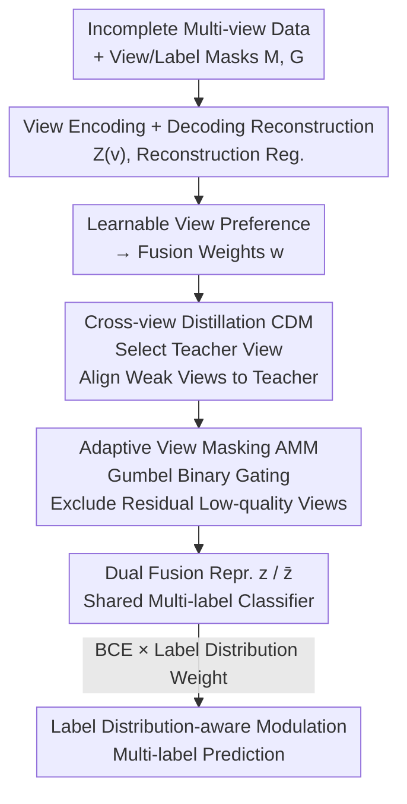

# Cross-View Distillation and Adaptive Masking for Incomplete Multi-View Multi-Label Classification

**Conference**: CVPR 2026  
**Paper**: [CVF Open Access](https://openaccess.thecvf.com/content/CVPR2026/html/Liu_Cross-View_Distillation_and_Adaptive_Masking_for_Incomplete_Multi-View_Multi-Label_Classification_CVPR_2026_paper.html)  
**Code**: Not public  
**Area**: Multi-View Learning / Multi-Label Classification  
**Keywords**: Incomplete Multi-View, Multi-Label Classification, View Imbalance, Cross-View Distillation, Adaptive Masking  

## TL;DR
To address multi-label classification with "dual missing of views and labels," this work utilizes a strong view as a teacher to distill knowledge into remaining weak views. Furthermore, a learnable binary gate is employed to mask views that remain unreliable after distillation. This approach consistently outperforms nine SOTA methods across six datasets.

## Background & Motivation
**Background**: Incomplete Multi-view Multi-label learning (iM2L) aims to fuse complementary information from multiple views for multi-label prediction under the dual incompleteness of "missing views (sensor failure)" and "missing labels (expensive annotation)." Mainstream approaches include consistency representation learning, representation decoupling to extract complementary information, and imputation of missing views.

**Limitations of Prior Work**: Natural heterogeneity exists between different views—data distributions, feature dimensions, and noise levels differ, leading to significant variations in learning difficulty and convergence speed. Hard-fusing all views with a unified, static joint training objective causes strong views to overfit and dominate optimization while weak views are suppressed, resulting in suboptimal overall performance. The authors conducted view combination experiments on the complete Pascal07 dataset and found that performance varies significantly across combinations. A strategy of "fixed selection of strong views for fusion" leads to sharp performance drops when a critical view is missing in real-world scenarios.

**Key Challenge**: Recent methods to alleviate view imbalance (gradient modulation, alternating optimization, single-view teacher constraints) are built on the assumption that **weak views are merely "under-optimized."** The authors argue this assumption is flawed: some views have an **intrinsic "representation ceiling"** due to limited information capacity or high noise, and cannot reach high performance regardless of self-optimization. Forcing the model to learn from such "ceiling views" hampers the optimization of other views. Additionally, most methods assume complete data during training, making them vulnerable to random missingness and rarely considering active information interaction between views.

**Goal / Key Insight**: Since weak views cannot be improved through self-optimization, the focus shifts from "self-optimization" to **letting strong views transfer knowledge to weak views**. For views that cannot be salvaged even through distillation, they are **explicitly excluded** before fusion to prevent them from contaminating the fused representation.

**Core Idea**: A two-stage mechanism consisting of "cross-view distillation (aligning weak views to strong views) + adaptive masking (masking residual low-quality views before fusion)" achieves balanced multi-view optimization. This is coupled with label-distribution-aware gradient modulation to handle the long-tail nature of multi-label classification.

## Method

### Overall Architecture
The input to CDAM is incomplete multi-view data $\{X^{(v)}\}_{v=1}^m$ with a view mask matrix $M$ and a label mask matrix $G$ ($M_{i,v}=1$ indicates the $v$-th view of the $i$-th sample is observed, $G_{i,j}=1$ indicates the $j$-th label is known). The output is multi-label predictions.

The pipeline is as follows: Each view is projected into a shared latent space via its respective encoder $E^{(v)}$ to obtain $Z^{(v)}$, with a decoder providing reconstruction regularization to prevent representation collapse. A learnable view preference vector calculates the view fusion weights $w_i^{(v)}$ for each sample. The **Cross-view Distillation Module (CDM)** selects a teacher view for each sample (the observed view with the highest weight) and aligns the representations of remaining student views with the teacher. The **Adaptive Masking Module (AMM)** follows, performing an explicit quality assessment on views after distillation and using a binary gate to exclude them from fusion, resulting in a filtered fused representation $\bar z_i$. Finally, the distilled fused representation $z_i$ and the filtered fused representation $\bar z_i$ share a multi-label classifier. The classification loss is modulated by label-distribution-aware weights to handle long-tail labels.

### Key Designs

**1. Cross-View Distillation CDM: Strong View as Teacher, Actively Injecting Knowledge**

To address the "intrinsic representation ceiling" of weak views, CDM actively utilizes informational complementarity between views rather than passively adjusting learning rates. It first calculates fusion weights for each sample using a globally learnable view preference vector $q \in \mathbb{R}^m$:

$$w_i^{(v)} = \frac{\exp(l_i^{(v)})}{\sum_{k=1}^m \exp(l_i^{(k)})},\qquad l_i^{(v)} = \begin{cases} q^{(v)}, & M_{i,v}=1\\ -\infty, & M_{i,v}=0 \end{cases}$$

Setting the logits of missing views to $-\infty$ ensures their weights are 0 after softmax, making it compatible with missing views. The teacher view for each sample is the **observed view with the highest fusion weight**: $v_i^* = \arg\max_v\{w_i^{(v)}\mid M_{i,v}=1\}$, with the corresponding representation denoted as $z_i^*$. The student set $S_i$ consists of the other observed views for that sample. The distillation loss aggregates alignment errors for all valid teacher-student pairs:

$$L_{dis} = \frac{\sum_{i=1}^n \sum_{v\in S_i} \lVert z_i^{(v)} - sg[z_i^*]\rVert_2^2}{\sum_{i=1}^n |S_i|}$$

The key lies in the **stop-gradient** $sg[\cdot]$: the teacher is fixed as a stable target, and knowledge flows **unidirectionally** from the teacher to the student, preventing bidirectional alignment from collapsing into a trivial solution. Samples with $|S_i|=0$ (only one observed view) are skipped. This way, weak views are "carried" by strong views rather than being forced into difficult self-optimization.

**2. Adaptive View Masking AMM: Differentiable Binary Gating to Filter Unreliable Views**

Distillation is not a cure-all; for views containing extreme noise or minimal information, quality may remain poor even after alignment. Static view-level weighting ignores sample-level differences, allowing low-quality views to pollute the fused representation. AMM performs an **instance-level binary decision** for each view of each sample: either include it in fusion or mask it entirely. An MLP scoring network $f_{scorer}$ generates scores $e_i^{(v)} = f_{scorer}(z_i^{(v)})$ as evidence for selecting the view.

The challenge is that binary selection is non-differentiable. AMM uses **Gumbel-Softmax reparameterization**: evidence is expanded to 2D $t_i^{(v)} = [e_i^{(v)}, -e_i^{(v)}]$, Gumbel(0,1) noise $g_i^{(v)}$ is added, and continuous relaxation is performed with temperature $\tau$: $\tilde s_i^{(v)} = \mathrm{softmax}((t_i^{(v)}+g_i^{(v)})/\tau)$. The **Straight-Through Estimator** is used in the forward pass for hard one-hot discrete selection, while gradients flow through the continuous $\tilde s_i^{(v)}$ in the backward pass. The first dimension of the one-hot result is the selection mask $s_i^{(v)}$. During inference, it uses deterministic mode $s_i^{(v)} = \mathbb{I}(\sigma(e_i^{(v)})>0.5)$. The final filtered mask is the element-wise product of the learned selection mask and the prior view mask $\bar M_{i,v} = M_{i,v} \cdot s_i^{(v)}$.

To prevent the gate from degenerating into a "select-all" solution, a targeted masking penalty is added—**only penalizing selection masks assigned to views known to be missing**:

$$L_{mask} = \frac{\sum_{i=1}^n \sum_{v=1}^m s_i^{(v)}\cdot \mathbb{I}(M_{i,v}=0)}{\sum_{i=1}^n \sum_{v=1}^m \mathbb{I}(M_{i,v}=0)}$$

Furthermore, AMM applies a constraint that "filtering must not degrade performance": the distilled representation $z_i$ and filtered representation $\bar z_i$ are fed into a **shared classifier** $f_{cls}$ to obtain two paths of predictions, calculating BCE losses $L_{cls}$ and $\bar L_{cls}$. An improvement loss only penalizes when filtering degrades performance:

$$L_{imp} = \bar L_{cls} + \max(0,\ \bar L_{cls} - sg[L_{cls}]) + L_{mask}$$

This hinge term ensures that view exclusion only maintains or improves performance.

**3. Label Distribution-aware Modulation: Suppressing Head Gradients for Tail Learning**

Multi-label data often follows a long-tail distribution where high-frequency labels dominate and low-frequency gradients are drowned out. The authors multiply the BCE loss for each label by a balanced weight $h_j = (1/f_j)^\gamma$ derived from smoothed inverse frequency ($f_j$ is the frequency of label $j$, and $\gamma$ is a smoothing factor):

$$L_{cls} = \frac{1}{\sum_{i,j} G_{i,j}} \sum_{i=1}^n \sum_{j=1}^c G_{i,j}\cdot h_j\cdot L_{BCE}(p_{i,j}, Y_{i,j})$$

$G_{i,j}$ ensures loss is only calculated for known labels, and $h_j$ gives tail labels more weight.

### Loss & Training
The total objective is a weighted sum of reconstruction, distillation, and improvement losses:

$$L_{all} = \alpha\cdot L_{rec} + \beta\cdot L_{dis} + L_{imp}$$

where $L_{rec}$ is the multi-view reconstruction loss calculated only on observed views (to prevent representation collapse). Within each epoch, the sequence is: Encoding/Reconstruction → Selecting teacher/Calculating distillation → Generating binary masks → Dual-path fusion prediction → Calculating improvement loss → Updating with total loss.

## Key Experimental Results

### Main Results
Evaluation across six multi-view multi-label benchmarks (Corel5k, Pascal07, Espgame, Iaprtc12, Mirflickr, ODIR) with 50% view missing and 50% label missing, comparing against nine SOTA methods. Table below extracts AP and AUC (higher is better):

| Dataset | Metric | Prev. SOTA | CDAM | Gain |
|--------|------|------|----------|------|
| Corel5k | AP | 0.418 (SIP) | **0.428** | +0.010 |
| Pascal07 | AP | 0.560 (VCMN) | **0.588** | +0.028 |
| Pascal07 | AUC | 0.857 (VCMN) | **0.873** | +0.016 |
| Iaprtc12 | AP | 0.340 (MSLPP) | **0.352** | +0.012 |
| Mirflickr | AP | 0.615 (MSLPP) | **0.631** | +0.016 |
| ODIR | AP | 0.683 (VCMN) | **0.701** | +0.018 |
| ODIR | AUC | 0.895 (VCMN) | **0.906** | +0.011 |

CDAM consistently achieves SOTA on all six datasets. Analysis: DICNet captures view interactions but ignores inherent quality differences, leading to performance drops under imbalances. SIP pursues consistent representations via Information Bottleneck, but the shared representation quality is dragged down by low-quality views—exactly what CDAM solves via distillation and masking.

### Ablation Study
On Corel5k / Pascal07 (50% views + 50% labels missing):

| Configuration | Corel5k AP / AUC | Pascal07 AP / AUC | Description |
|------|------|------|------|
| Backbone only | 0.3730 / 0.8748 | 0.5363 / 0.8362 | Baseline |
| + $L_{rec}$ | 0.3941 / 0.9061 | 0.5651 / 0.8564 | Reconstruction as foundation |
| + $L_{rec} + L_{dis}$ | 0.4230 / 0.9154 | 0.5849 / 0.8707 | Distillation adds significant gains |
| + $L_{rec} + L_{imp}$ | 0.4188 / 0.9155 | 0.5750 / 0.8655 | Masking is effective individually |
| Full CDAM | **0.4281 / 0.9178** | **0.5876 / 0.8733** | Modules are complementary |

### Key Findings
- **Reconstruction loss is fundamental**: Without $L_{rec}$, distillation and masking are less effective.
- **Distillation and masking are complementary**: Adding $L_{dis}$ or $L_{imp}$ individually improves performance, but the combination is optimal.
- **Sensitivity to view missing**: Models are more sensitive to missing views than missing labels, as losing a key view removes an entire information source.
- **Hyperparameter Robustness**: Grid search for $\alpha, \beta$ shows peaks in relatively flat regions, indicating robustness.

## Highlights & Insights
- **"Representation ceiling" insight is critical**: It refutes the assumption that weak views are merely under-optimized, shifting the focus to knowledge transfer and selective exclusion.
- **Stop-gradient ensures stability**: Fixing the teacher as a target prevents representations from collapsing into trivial solutions during alignment.
- **Hinge term in improvement loss**: $\max(0, \bar L_{cls} - sg[L_{cls}])$ ensures view exclusion only occurs when it doesn't hurt performance, making AMm both active and safe.
- **Targeted masking penalty**: Penalizing only the "missing views" in the selection mask prevents the gate from degenerating into a "select-all" state without blindly encouraging sparsity.

## Limitations & Future Work
- Code is not public, increasing replication costs. Benchmarks are relatively traditional (GIST/HSV/SIFT features); performance on modern large-scale multimodal features remains to be validated.
- Teacher selection depends on learned global preferences; if a sample misses its truly strongest view, distillation quality may decrease.
- AMM performs instance-level entire-view filtering but lacks fine-grained channel or region-level masking.

## Related Work & Insights
- **vs. Gradient Modulation / Alternating Optimization**: These methods passively adjust learning rates assuming weak views can catch up. CDAM actively utilizes cross-view interaction and acknowledges that some views should be discarded.
- **vs. Single-view Teacher Guidance**: CDAM does not require pre-training separate single-view teachers; it selects the strongest view dynamically per sample.
- **vs. SIP (Information Bottleneck)**: AMM protects the fused representation from being contaminated by low-quality views, unlike SIP which treats all views similarly in the consistency constraint.

## Rating
- Novelty: ⭐⭐⭐⭐ The combination of the "representation ceiling" insight, active cross-view distillation, and differentiable binary masking is novel for iM2L.
- Experimental Thoroughness: ⭐⭐⭐⭐ Six datasets, nine baselines, multiple missing rates, and comprehensive ablation studies.
- Writing Quality: ⭐⭐⭐⭐ Motivation is logically sound, and module responsibilities are clear.
- Value: ⭐⭐⭐⭐ Provides a reusable "distillation + masking" paradigm for handling multi-view imbalance.

<!-- RELATED:START -->

## Related Papers

- [\[CVPR 2026\] EXOTIC: External Vision-driven Incomplete Multi-view Classification](exotic_external_vision-driven_incomplete_multi-view_classification.md)
- [\[CVPR 2026\] DF²-VB: Dual-level Fuzzy Fusion with View-specific Boosting for Multi-view Multi-label Classification](df2-vb_dual-level_fuzzy_fusion_with_view-specific_boosting_for_multi-view_multi-.md)
- [\[CVPR 2026\] Imbalanced View Contribution Evaluation and Refinement for Deep Incomplete Multi-View Clustering](imbalanced_view_contribution_evaluation_and_refinement_for_deep_incomplete_multi.md)
- [\[CVPR 2026\] Prototype-based Causal Intervention for Multi-Label Image Classification](prototype-based_causal_intervention_for_multi-label_image_classification.md)
- [\[CVPR 2026\] Revisiting F-measure Optimization in Multi-Label Classification: A Sampling-based Approach](revisiting_f-measure_optimization_in_multi-label_classification_a_sampling-based.md)

<!-- RELATED:END -->
