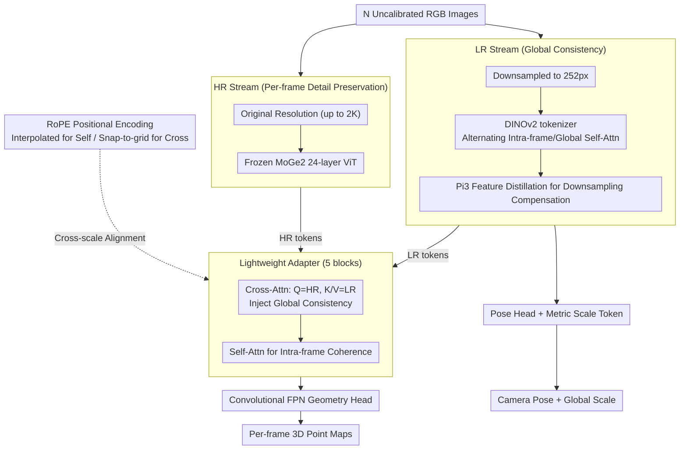

# DAGE: Dual-Stream Architecture for Efficient and Fine-Grained Geometry Estimation

**Conference**: CVPR 2026  
**arXiv**: [2603.03744](https://arxiv.org/abs/2603.03744)  
**Code**: [https://github.com/dage-site](https://github.com/dage-site)  
**Area**: Model Compression  
**Keywords**: Multi-view Geometry Estimation, Dual-Stream Transformer, Depth Estimation, Knowledge Distillation, High-Resolution Inference

## TL;DR

The DAGE dual-stream Transformer architecture is proposed to decouple global consistency modeling (low-resolution stream) from fine-grained detail preservation (high-resolution stream). By fusing these via a lightweight Cross-Attention Adapter, high-quality depth/point map estimation and pose prediction are achieved on 2K resolution and 1000-frame sequences. The method is $2\times$ to $28\times$ faster than Pi3 and achieves a new SOTA in video geometry estimation.

## Background & Motivation

Estimating 3D geometry and camera poses from multi-view images is a fundamental computer vision problem. Three simultaneous challenges exist: (1) global cross-view consistency, (2) high-resolution fine-grained detail preservation, and (3) computational efficiency scalable to long sequences.

- **Feed-forward multi-view methods** (VGGT, Pi3) use global attention for cross-view consistency, but $O(N^2)$ complexity limits resolution and frame counts, leading to blurred details.
- **Single-view methods** (DepthPro, MoGe2) handle high resolution but lack multi-view consistency.
- **Video diffusion models** (GeoCrafter) are computationally expensive and typically cannot estimate poses.

**Key Challenge**: The quadratic complexity of global attention relative to resolution vs. the demand for high-resolution detail preservation. **Key Insight**: Decouple resolution and sequence length.

## Method

### Overall Architecture

Given $N$ uncalibrated RGB images, DAGE concurrently outputs 3D point maps for each frame, camera poses, and a global metric scale. The core idea is that cross-view consistency (determining pose and global structure) and fine-grained details (determining sharp depth edges) have vastly different resolution requirements. The former is sufficient at low resolution, while the latter requires the original image. DAGE splits these requirements into two parallel streams: a **Low-Resolution (LR) Stream** processing all frames at 252px with global attention for consistent pose and coarse structure, and a **High-Resolution (HR) Stream** independently encoding frames at original resolution (up to 2K) to preserve details. A **lightweight Adapter** injects global information from LR into HR, aligning fine-grained details to a unified global geometry. This confines the $O(N^2)$ cost of global attention to low resolution, while high-resolution costs scale linearly with frame count.

### Key Designs

**1. LR Stream: Enabling Global Attention through Low Resolution**

Feed-forward multi-view methods (VGGT, Pi3) rely on global attention for cross-view consistency, but global attention is quadratic relative to token count. DAGE observes that pose and global structure do not rely on high-frequency details. Thus, the LR stream downsamples frames to 252px and utilizes DINOv2 tokenization with alternating Frame/Global Attention. Feature distillation using Pi3 as a teacher compensates for information lost during downsampling, embedding high-resolution representations into the LR stream.

**2. HR Stream: Frozen Pre-trained Encoder for Per-frame Detail**

Detail preservation requires the original resolution, but cross-view attention at high resolution is computationally prohibitive. The HR stream omits cross-view interaction, encoding each frame **independently** at original resolution (up to 2K), ensuring linear cost scaling. It freezes a pre-trained MoGe2 24-layer ViT encoder to prevent overfitting on small geometry datasets and to inherit zero-shot generalization capabilities.

**3. Lightweight Adapter: Bridging Resolution Gaps via Cross-Attention**

The HR stream lacks global context. Since token counts differ significantly between streams, simple addition or concatenation is impossible. The Adapter utilizes Cross-Attention where HR tokens act as Query and LR tokens act as Key/Value. Each high-resolution position "queries" the LR global features for alignment, supporting arbitrary token ratios. After Cross-Attention, Self-Attention restores intra-frame spatial coherence. 

**4. RoPE Positional Encoding: Ensuring Stability Beyond Training Resolution**

Standard RoPE degrades when inference resolution exceeds training resolution. Since DAGE performs inference at 2K, it uses **Interpolated RoPE** for HR Self-Attention to keep relative positions within seen frequency ranges. For Cross-Attention, it employs **snap-to-grid**: HR tokens are spatially mapped to the nearest LR grid cell to compute relative encodings, aligning different resolutions within a unified coordinate system.

### Loss & Training

- Point map $\ell_1$ loss (global alignment, without confidence weighting)
- Camera pose loss (Rotation geodesic distance + translation $\ell_1$)
- Gradient loss (Multi-scale Scharr/Laplace filtering on inverse depth gradients)
- Normal loss and distillation loss
- HR ViT frozen, LR stream initialized from Pi3, trained on 18 datasets

## Key Experimental Results

### Main Results: Video Point Map Estimation (Avg. Rank across 8 datasets)

| Method | Multi-view | High-res | Pose | Avg. Rank |
|--------|------------|----------|------|-----------|
| VGGT | Yes | No | Yes | 3.4 |
| Pi3 | Yes | No | Yes | 3.3 |
| GeoCrafter | Yes | Partial | No | 3.9 |
| **Ours** | **Yes** | **Yes** | **Yes** | **1.6** |

### Ablation Study

| Configuration | Change | Description |
|---------------|--------|-------------|
| Adapter in Middle Layers | Consistency Drop | Requires complete global processing |
| Concat vs. Cross-Attn | Quality Drop | Fixed scale ratios are insufficient |
| No Gradient Loss | Sharpness Drop | Gradient supervision is critical for details |
| MoGe Multi-scale Alignment | Consistency Drop | Per-patch alignment breaks cross-view consistency |

### Efficiency (A100, 100-frame video)

| Method | 540p FPS | 2K FPS | 540p VRAM |
|--------|----------|--------|-----------|
| Pi3 | 32.7 | OOM | 37.3 GB |
| VGGT | 13.5 | OOM | 71.3 GB |
| **Ours** | **65.4** | **5.6** | **12.4 GB** |

### Key Findings

- An average rank of 1.6 significantly outperforms Pi3 (3.3) and VGGT (3.4).
- Advantages in high-resolution scenarios: UrbanSyn Rel error is 47% lower than Pi3.
- Speed at 540p is $2\times$ that of Pi3; at 2K, DAGE maintains 5.6 FPS while others OOM.
- Pose accuracy at 252px matches the performance of Pi3/VGGT at 518px.

## Highlights & Insights

- **"Decoupling resolution and sequence length" is the core insight**: Global consistency does not require high resolution, and detail preservation does not require cross-view attention.
- **Frozen HR ViT + lightweight adapter**: An efficient transfer learning paradigm.
- **Snap-to-grid RoPE**: An elegant solution for cross-scale attention.
- **Gradient loss instead of multi-scale alignment**: Maintaining a single global alignment is more critical in multi-view contexts.

## Limitations & Future Work

- Fixed 252px LR stream may be insufficient for certain scenes.
- Dependence on MoGe2 and Pi3 pre-trained weights.
- Dynamic scenes (moving objects) have not been tested.
- 5-layer Adapter poses VRAM pressure on extremely long sequences.

## Related Work & Insights

- Alternating attention in Pi3/VGGT serves as the LR stream foundation; Ours contributes resolution restriction.
- The abandonment of MoGe2's coarse-to-fine loss (which destroys multi-view consistency) reflects a conflict in design principles.
- Knowledge distillation shifts from "model compression" to "resolution compensation."

## Rating

- Novelty: ⭐⭐⭐⭐ Dual-stream decoupling and snap-to-grid RoPE are insightful contributions.
- Experimental Thoroughness: ⭐⭐⭐⭐⭐ 8 datasets + 4 tasks + detailed ablations + efficiency metrics.
- Writing Quality: ⭐⭐⭐⭐ Clear motivation and systematic architecture description.
- Value: ⭐⭐⭐⭐⭐ Resolves practical bottlenecks in high-resolution multi-view geometry.

<!-- RELATED:START -->

## Related Papers

- [\[CVPR 2026\] DiT-Distill: Open-Set Fine-Grained Retrieval via Generative Curriculum Knowledge](dit-distill_open-set_fine-grained_retrieval_via_generative_curriculum_knowledge.md)
- [\[ACL 2026\] Efficient Learned Data Compression via Dual-Stream Feature Decoupling](../../ACL2026/model_compression/efficient_learned_data_compression_via_dual-stream_feature_decoupling.md)
- [\[CVPR 2026\] Dual-branch Distilled Transformer for Efficient Asymmetric UAV Tracking](dual-branch_distilled_transformer_for_efficient_asymmetric_uav_tracking.md)
- [\[CVPR 2026\] Memory-Efficient Transfer Learning with Fading Side Networks via Masked Dual Path Distillation](memory_efficient_transfer_learning_with_fading_side_networks.md)
- [\[ACL 2026\] When Reviews Disagree: Fine-Grained Contradiction Analysis in Scientific Peer Reviews](../../ACL2026/model_compression/when_reviews_disagree_fine-grained_contradiction_analysis_in_scientific_peer_rev.md)

<!-- RELATED:END -->
