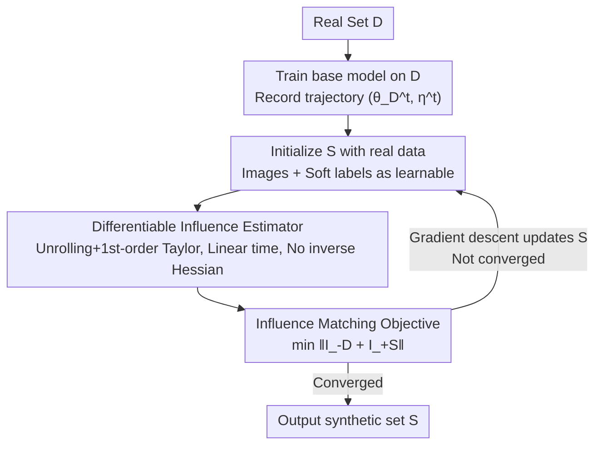

# Dataset Distillation by Influence Matching

**Conference**: CVPR 2026  
**Paper**: [CVF Open Access](https://openaccess.thecvf.com/content/CVPR2026/html/Tan_Dataset_Distillation_by_Influence_Matching_CVPR_2026_paper.html)  
**Code**: https://github.com/hrtan/infmatch (To be released)  
**Area**: Model Compression / Dataset Distillation  
**Keywords**: Dataset Distillation, Influence Function, Outcome Alignment, Differentiable Influence Estimation, Soft Labels

## TL;DR
Instead of forcing synthetic data to mimic the training process of real data (gradients/trajectories), this work directly aligns the "training outcome." By utilizing a linear-time, inverse-Hessian-free differentiable influence estimator, the authors reformulate dataset distillation as "influence of the synthetic set on parameters $\approx$ influence of the real set on parameters." This approach consistently outperforms process-matching SOTA on CIFAR, Tiny-ImageNet, and Flickr30K (e.g., reaching 31.5% on Tiny-ImageNet IPC=10, a 4.7% gain over NCFM).

## Background & Motivation

**Background**: The goal of dataset distillation is to synthesize a minimal dataset $S$ such that a model trained on $S$ approximates the performance of a model trained on the full dataset $D$. This is inherently a bi-level optimization problem (outer loop optimizes data, inner loop trains the network), which is extremely difficult to solve directly. Consequently, mainstream methods instead match "proxy" quantities: **Feature Matching** (DM/CAFE, aligning feature distributions) and **Process Matching** (GM aligning step-wise gradients, MTT/DATM aligning training trajectories), with the latter typically offering stronger performance and receiving more research attention.

**Limitations of Prior Work**: These proxy objectives match **intermediate signals during training** (gradients, parameter trajectories) rather than the **final training outcome**. The issue is that synthetic data can achieve high alignment scores for proxy targets—matching gradients or trajectories closely—yet still lag behind in downstream accuracy and generalization. Proxy alignment does not guarantee outcome alignment.

**Key Challenge**: There exists an **optimization gap** between "computational feasibility" (achieved via process alignment) and "fidelity to the true objective" (aligning final results). To bridge this gap, a method is required to quantify how "individual samples or subsets influence the final model."

**Why not use influence functions directly?**: Influence estimation (influence functions) could theoretically measure the impact of samples on the final model, but classical estimators (Koh et al.) suffer from two fatal issues: (i) they assume the loss is **convex** with respect to parameters, which does not hold for deep networks; (ii) they require computing the **product of the inverse Hessian and gradients**, which is computationally expensive and unscalable.

**Core Idea**: By employing a **fully differentiable, linear-time estimator** that requires **no inverse Hessian** and **no convexity assumptions**, the distillation objective is rewritten as: "Influence of adding synthetic set $S \approx$ offsetting the influence of removing real set $D$." This performs direct **outcome matching** instead of heuristic process imitation.

## Method

### Overall Architecture

Inf-Match (Influence Matching) shifts distillation from "process alignment" to "outcome alignment." First, a base model is trained for $T$ steps on the real set $D$, recording a trajectory of checkpoints for parameters and learning rates $\{(\theta_D^t, \eta^t)\}$. Then, the synthetic set $S$ is initialized with real images according to the IPC (Images Per Class), with both images and labels set as learnable variables. During training, for each minibatch, a differentiable influence estimator calculates the "influence of adding $S$" and the "influence of removing $D$." The objective is to minimize the residue between them (i.e., making the influence of $S$ offset the influence of $D$), using gradient descent to update synthetic images and soft labels. **Crucially**, the model parameters resulting from training on synthetic data are not obtained via actual retraining but are "estimated" by the influence estimator, thus eliminating the need for nested inner-loop retraining in the outer optimization.

### Key Designs

**1. Outcome-centric definition of data influence: Mapping "training differences" to parameter displacement**

The limitation of process matching is that aligning intermediate signals does not guarantee final results. The authors define "influence" through an outcome-centric lens: the **removal influence** of a subset $Z \subset D$ is defined as the difference in final parameters $I_{-Z} = \theta^*_{D-Z} - \theta^*_D$; the **addition influence** of an external set $Z$ is $I_{+Z} = \theta^*_{D+Z} - \theta^*_D$. This measures the exact displacement in the final model state caused by the "presence or absence of $Z$." This definition anchors what distillation should align to a clear vector—parameter displacement—laying the foundation for formulating distillation as parameter residue minimization.

**2. Differentiable Influence Estimator: Unrolling optimization dynamics + First-order Taylor**

Computing influence by the definition requires leave-one-out (LOO) retraining, which is infeasible, while classical influence functions rely on convexity and inverse Hessians. The authors' approach is to **unroll** the optimization dynamics along the actual SGD training trajectory of $D$ and apply a first-order Taylor approximation to each update step, yielding (Theorem 1):

$$I_{-Z} \approx -\sum_t \frac{\eta^t}{\sum_{k \ge t} \eta^k |D|} \left( H_D^t G_Z^t + H_Z^t G_D^t \right), \qquad I_{+Z} \approx +\sum_t \frac{\eta^t}{\sum_{k \ge t} \eta^k |D|} \left( H_D^t G_Z^t + H_Z^t G_D^t \right)$$

where $H^t = \nabla^2_\theta L$ is the Hessian and $G^t = \nabla_\theta L$ is the gradient, evaluated at trajectory checkpoints $\theta_D^t$. Although the Hessian-gradient product $HG$ appears, **explicit construction of the Hessian is not required**—it is approximated via finite differences: $HG \approx \lim_{\epsilon \to 0} (\nabla_\theta L(\theta + \epsilon G) - \nabla_\theta L(\theta)) / \epsilon$. This has a complexity of $O(p)$ (where $p$ is the number of parameters). The authors also provide an error bound (Theorem 2) $|\tilde{I} - I| \le 2T^3 \ell (T+1) \eta_{\max} g + \frac{|Z|}{|D|} T^2 g$, which grows **polynomially** with the number of training steps $T$, ensuring reliability even for long training trajectories.

**3. Influence Matching Objective: Offsetting influences**

With the differentiable estimator, distillation is rewritten as a direct outcome alignment objective:

$$S^* = \arg\min_S \left\| I_{-D} + I_{+S} \right\|$$

The intuition is that removing the entire real set $D$ pushes the parameters away, and adding the synthetic set $S$ should push them back exactly. When the influences cancel each other out, the residue is minimized. Due to the additivity of influence (Remark 1), $\|I_{-D} + I_{+S}\|$ is equivalent to the displacement between the "parameters after removing $D$ and adding $S$" and the original "parameters $\theta^*_D$ trained on $D$." Substituting the estimators leads to a **fully differentiable** objective $J(S)$, allowing direct gradient calculation for synthetic images and labels.

### Loss & Training

The training objective is the outcome residue norm $J(S)$ (typically $L_2$). Algorithm 1 proceeds by sampling minibatches $B_S, B_D$, selecting $m$ checkpoints from the trajectory, calculating the loss, and updating synthetic images and soft labels via gradient descent. Three key training techniques are used:

- **Real data initialization**: Initializing $S$ using real images from $D$ provides a strong starting point for optimization (contributing significantly to accuracy gains, e.g., 52.2 $\to$ 53.7).
- **Learnable soft labels**: Initial soft labels are provided by the final model $\theta_D^T$ and are treated as learnable variables. Soft labels allow inter-class information sharing, offering better representation efficiency than one-hot labels.
- **Progressive timestep sampling**: Since calculating $J(S)$ over all $T$ steps is expensive, the authors approximate it by sampling $m$ checkpoints. They use a scheduler similar to DATM: sampling early checkpoints in the beginning of training (to learn basic patterns) and later checkpoints toward the end (to encode fine-grained structures).

Implementation details: Defaults to ConvNet (4 conv-blocks for Tiny-ImageNet), SGD-M (momentum 0.9), batch size 50, synthetic image learning rate 50.0, soft label learning rate 7.0, using 8×A100 GPUs.

## Key Experimental Results

### Main Results (Image Classification, Test Accuracy %)

| Dataset | IPC | Inf-Match | NCFM | Gain |
| :--- | :--- | :--- | :--- | :--- |
| CIFAR-10 | 1 | 49.9 | — | New High |
| CIFAR-10 | 10 | 72.5 | ~71.8 | +0.7 |
| CIFAR-10 | 50 | 78.1 | ~77.4 | +0.7 |
| CIFAR-100 | 10 | 49.3 | — | Leading |
| CIFAR-100 | 50 | 57.4 | 54.7 | +2.7 |
| Tiny-ImageNet | 10 | 31.5 | 26.8 | +4.7 |
| Tiny-ImageNet | 50 | 33.8 | 29.6 | +4.2 |

The improvement scale increases with dataset difficulty, suggesting that outcome alignment is more advantageous for complex tasks. On the vision-language dataset Flickr30K, Inf-Match also leads: reaching 7.4% I2T Recall@1 with 200 samples (1.3% higher than DATM) and 16.4% T2I Recall@1 with 1000 samples.

### Ablation Study (CIFAR-100, IPC=50)

| Configuration | Real-init | Learnable Labels | Sampling Schedule | Accuracy |
| :--- | :--- | :--- | :--- | :--- |
| Baseline (All off) | ✗ | ✗ | ✗ | 52.2 |
| + Real-init | ✓ | ✗ | ✗ | 53.7 |
| + Sampling Schedule | ✓ | ✗ | ✓ | 55.0 |
| + Learnable Labels | ✓ | ✓ | ✗ | 54.6 |
| Full Model | ✓ | ✓ | ✓ | **57.4** |
| DATM (Comparison) | — | — | — | 55.0 |
| NCFM (Comparison) | — | — | — | 54.7 |

Notably, the **core influence matching objective with real initialization (53.7) is already a strong baseline**. Adding the three techniques reaches 57.4, surpassing DATM and NCFM, demonstrating that the core methodology itself is highly competitive.

### Key Findings
- **Influence matching is the primary driver**: Ablations show that the core objective alone nears process-matching SOTA; additional tricks are complementary.
- **Slower convergence, higher ceiling**: Visualizations indicate Inf-Match converges slower than MTT but achieves significantly higher final accuracy.
- **Fidelity does not correlate with performance**: Synthetic images transition from "realistic" to "noisy" during training. High-performing synthetic images are often noisy, indicating distilled information is not purely visual.
- **Balanced feature distribution**: On the CIFAR-100 "Wolf" class, DM synthetic samples cluster in high-density areas, while Inf-Match covers both high-density regions and the distributional edges.
- **Cross-architecture generalization**: On CIFAR-100 IPC=50, Ours outperforms DATM across ConvNet, ResNet-18, VGG, and AlexNet.

## Highlights & Insights
- **Correctly redefining "what to align"**: While distillation has focused on "how to match the process," this paper points out that process alignment $\neq$ outcome alignment and provides an optimizable objective for the latter.
- **Reusable inverse-Hessian-free estimator**: The use of "unrolling + Taylor + finite differences" to achieve $O(p)$ influence estimation without convexity assumptions can be transferred to tasks like data selection and coreset construction.
- **Leveraging influence additivity**: Using the norm of $I_{-D} + I_{+S}$ cleanly captures the "result alignment" as a differentiable norm.

## Limitations & Future Work
- **Dependency on real trajectories**: The estimator requires pre-training on $D$ to store checkpoints, and the quality of the trajectory affects estimation accuracy.
- **Worst-case error bounds**: The theoretical bound grows polynomially with $T$, meaning reliability for extremely long trajectories still has a gap between theory and practice.
- **Slower convergence**: Directly optimizing the original problem is more difficult, leading to slower convergence and potentially higher training costs for large-scale/high-IPC settings.
- **Boundaries of first-order approximation**: The first-order Taylor approximation might fail under extreme non-linearity or very high learning rates.

## Related Work & Insights
- **vs. Process Matching (GM/MTT/DATM)**: These methods match intermediate signals, which can lead to an optimization gap where proxy scores are high but results lag. Ours eliminates this gap by aligning final parameters.
- **vs. Feature Matching (DM/CAFE)**: DM samples tend to cluster in high-density areas; Inf-Match ensures a more balanced representation across the distribution.
- **vs. Classical Influence Functions**: Unlike Koh et al., this estimator works for non-convex deep networks and scales linearly without needing Hessian inversion.

## Rating
- Novelty: ⭐⭐⭐⭐⭐ Redefining distillation as outcome alignment and providing a differentiable influence estimator is a significant conceptual shift.
- Experimental Thoroughness: ⭐⭐⭐⭐ Covers various benchmarks and cross-architecture tests, though ImageNet-1K verification is missing.
- Writing Quality: ⭐⭐⭐⭐ Clear motivation and logical flow; some formula notation clarity could be improved.
- Value: ⭐⭐⭐⭐⭐ Provides a transferable influence estimator and a new paradigm for the distillation community.

<!-- RELATED:START -->

## Related Papers

- [\[CVPR 2026\] Beyond Soft Label: Dataset Distillation via Orthogonal Gradient Matching](beyond_soft_label_dataset_distillation_via_orthogonal_gradient_matching.md)
- [\[CVPR 2026\] DMGD: Train-Free Dataset Distillation with Semantic-Distribution Matching in Diffusion Models](dmgd_train-free_dataset_distillation_with_semantic-distribution_matching_in_diff.md)
- [\[CVPR 2026\] Mitigating The Distribution Shift of Diffusion-based Dataset Distillation](mitigating_the_distribution_shift_of_diffusion-based_dataset_distillation.md)
- [\[CVPR 2026\] Phased DMD: Few-step Distribution Matching Distillation via Score Matching within Subintervals](phased_dmd_few-step_distribution_matching_distillation_via_score_matching_within.md)
- [\[CVPR 2026\] IMS3: Breaking Distributional Aggregation in Diffusion-Based Dataset Distillation](ims3_breaking_distributional_aggregation_in_diffusion-based_dataset_distillation.md)

<!-- RELATED:END -->
