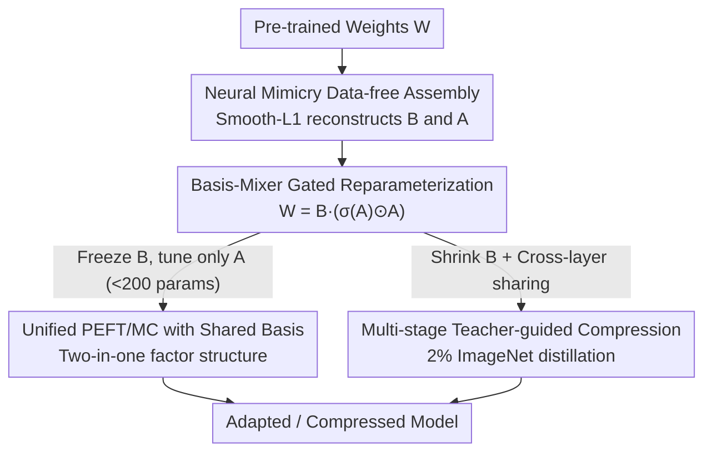

# Decompose, Mix, Adapt: A Unified Framework for Parameter-Efficient Neural Network Recombination and Compression

**Conference**: CVPR 2026  
**Paper**: [CVF Open Access](https://openaccess.thecvf.com/content/CVPR2026/html/Tasnim_Decompose_Mix_Adapt_A_Unified_Framework_for_Parameter-Efficient_Neural_Network_CVPR_2026_paper.html)  
**Code**: Not public (repository link not provided in the paper)  
**Area**: Model Compression / Parameter-Efficient Fine-Tuning  
**Keywords**: Parameter-Efficient Fine-Tuning, Model Compression, Weight Recombination, Basis Sharing, Factorization  

## TL;DR
CRISP factorizes pre-trained weights into a "frozen basis $B$ shared across layers + a learnable mixer $A$ private to each layer." Shrinking and sharing $B$ achieves Model Compression (MC), while freezing $B$ and tuning only $A$ achieves Parameter-Efficient Fine-Tuning (PEFT). This unified factor structure bridges two tasks previously handled separately. On VTAB-1K PEFT, it outperforms SOTA by 1.5% with fewer parameters; ViT compression exceeds SOTA by 1.5%, and the combined PEFT+MC setting outperforms existing baselines by over 1%.

## Background & Motivation
**Background**: Deploying large models on edge devices (robots, phones) typically requires two tasks: Parameter-Efficient Fine-Tuning (PEFT, e.g., LoRA/DoRA) to adapt to new tasks with minimal parameters, and Model Compression (MC, e.g., pruning/low-rank decomposition) to reduce model size. Both fall under "Parameter Recombination" (PR): defining a transformation $W_i = T(\theta_i)$ for each layer, using a small set of trainable parameters $\theta_i$ to generate or adjust weights $W_i \in \mathbb{R}^{d_{out}\times d_{in}}$.

**Limitations of Prior Work**: PEFT and MC are almost always studied in isolation, and simply chaining them leads to conflicts. The paper presents a stark example: compressing ViT-S/16 by 50% parameters followed by DoRA PEFT on VTAB-1K results in the millions of DoRA parameters making the compressed model **19% larger**, negating much of the MC benefit. The root cause is that PEFT methods are inherently **additive** (e.g., LoRA's $T(B,A)=BA+W_p$ must retain the original weights $W_p$), and these adapter proportions are amplified in compressed models.

**Key Challenge**: PEFT aims to "add capacity" while MC aims to "reduce volume," making their goals naturally opposing. Existing methods that support both (e.g., RECAST) restrict the mixing coefficients $a^r$ to a **vector**, which lacks expressivity—gains are only observed when task parameters are extremely few (<200), and performance saturates quickly as the parameter budget increases.

**Goal**: Design a parameterization where compression and adaptation coexist within the **same set of factor structures**—avoiding additional adapters for adaptation and allowing flexible movement between "model saving" and "capacity adding" by adjusting factor sizes.

**Key Insight**: Express weights as $W \approx B \times A$ (basis × mixer). **Sharing and shrinking B is compression; freezing B and only tuning a small A is fine-tuning.** By upgrading RECAST’s vector mixing coefficients to a **matrix** and adding a SiLU-style gating, the model gains expressivity and natural regularization without new hyperparameters.

## Method

### Overall Architecture
CRISP (Coefficient-gated weight Recombination by Interpolated Shared basis Projections) centers on rewriting each layer weight $W_i$ as "a cross-layer shared frozen basis $B'^r_i$" multiplied by "a private, learnable mixer matrix $A'^{rs}_i$." The pipeline consists of two steps: first, a **data-free assembly** (Neural Mimicry) to reconstruct existing pre-trained models into the CRISP factor form. Then, based on requirements: for compression, shrink and share the basis across layers (using teacher-guided multi-stage compression if needed); for adaptation, freeze the basis and fine-tune only the mixer (often <200 parameters). Since compression and fine-tuning operate on the **same set of factors**, they can be stacked without interference.

### Key Designs

**1. Basis-Mixer Gated Reparameterization: Upgrading vector coefficients to matrices with SiLU gating**

This is the technical novelty of the paper, addressing the expressivity bottleneck of RECAST. CRISP introduces a hyperparameter $s$ to control the number of columns in the mixer matrix, $A'^{rs}_i \in \mathbb{R}^{r\times s}$. Since $A$ is no longer a vector, the basis is adjusted to $B'^r_i \in \mathbb{R}^{u\times r}$, where $u = \tfrac{d_{in}\cdot d_{out}}{s}$, ensuring the multiplication result matches the original $d_{out}\times d_{in}$ weight shape. The final transformation is:

$$T_{\text{CRISP}}(B'^r_i, A'^{rs}_i) = B'^r_i\,\big(\sigma(A'^{rs}_i)\odot A'^{rs}_i\big)$$

where $\sigma$ is the sigmoid function and $\odot$ is element-wise multiplication. While $\sigma(A)\odot A$ resembles the SiLU activation, the authors emphasize it is **not a non-linear layer but a soft constraint on weights**, as $A$ contains layer-wise tunable parameters. Applying non-linearity directly to output weights ($T=\phi(W)$) would drop accuracy by rigidly constraining weight shapes. This SiLU-style smooth gating **only constrains the mixer matrix**, naturally inhibiting overfitting without introducing new regularization hyperparameters (like weight decay coefficients).

**2. Unified PEFT/MC with Shared Basis: Shrunk B for Compression, Tuned A for Adaptation**

This design resolves the contradiction between PEFT (adding parameters) and MC (subtracting parameters). The key is the division of labor: the basis $B'^r_i$ is **shared between consecutive layers of the same module** (e.g., QKV attention or projection groups), while the mixer $A'^{rs}_i$ is **learned independently per layer**. Compression utilizes two levers: shrinking the basis rank $r$ and increasing the number of layers sharing the same $B$. Fine-tuning freezes $B$ and updates $A$, which can be as small as 200 parameters. Unlike LoRA, CRISP **does not depend on the original weights $W_p$** (whereas $T_{\text{LoRA}}=BA+W_p$ must retain $W_p$), so fine-tuning does not cause model expansion.

**3. Neural Mimicry Data-free Assembly: Converting models to CRISP format in minutes**

Standard models do not naturally possess $B$ and $A$ matrices, necessitating a "retrofit." CRISP adopts Neural Mimicry, using a pure reconstruction objective to fit original weights:

$$L_{\text{mimicry}} = \sum_{i=1}^{N} \ell_{\text{smL1}}\big(T_{\text{CRISP}}(B'^r_i, A'^{rs}_i) - W_{p_i}\big)$$

where $\ell_{\text{smL1}}$ is the smooth-L1 loss. Its advantage is being **entirely data-free**—it numerically re-expresses weights into factor form. The computational cost is minimal: under a minute for ViT and 30 minutes for Llama on a single GPU.

**4. Multi-stage Teacher-guided Compression: Distilling aggressive students from full teachers**

When the goal is **aggressive compression** (very small $r, s$), learning $A$ and $B$ directly is difficult. The authors use a multi-stage approach: first, assemble a **full-parameter teacher** $M_{\text{teacher}}$ using Eq.(5). Then, initialize a student $M_{\text{student}}$ using the **top $r$ eigenvectors** of the teacher's $A$ and $B$ matrices. The student is then trained via distillation using **KL divergence + MSE** on predictions and **per-layer feature matching MSE**. This stage uses only **2% of ImageNet**, making it far more data-efficient than competitors (e.g., DGMR, RDHP) that require full datasets.

### Loss & Training
- **Assembly Phase**: Smooth-L1 reconstruction loss $L_{\text{mimicry}}$ (Eq.5), data-free, 1000 epochs for ViT (lr=0.01, Step scheduler).
- **Compression Phase**: Teacher-to-student distillation (KL + Prediction MSE + Layer-wise Feature MSE) using 2% ImageNet.
- **Fine-tuning Phase**: Freeze $B$, update only $A$, AdamW for 100 epochs with early stopping.

## Key Experimental Results

### Main Results
**PEFT (VTAB-1K, ViT-S/16, 19 tasks)**: CRISP achieves the highest overall accuracy using **28% fewer** trainable parameters ($5\times10^{-3}\%$ vs $7\times10^{-3}\%$) compared to all baselines, with significant leads in Structured tasks requiring geometric/relational reasoning.

| Method | Natural Mean | Specialized Mean | Structured Mean | Overall |
|------|------|------|------|------|
| LoRA | 69.9 | 78.5 | 32.1 | 55.8 |
| RECAST | 68.5 | 79.0 | 32.0 | 55.3 |
| RoAD | 71.4 | 79.4 | 34.4 | 57.5 |
| SSF (Prev. SOTA) | 73.7 | 80.1 | 32.7 | 57.8 |
| **CRISP (Ours)** | 73.0 | **80.4** | **36.4** | **59.2** |

**MC (ViT-B/16 50% Compression, 86M→44M) and PEFT+MC Combination (Mean across 6 fine-grained datasets)**:

| Setting | Method | Mean Accuracy |
|------|------|------|
| Compression Only | DGMR (Full ImageNet) | 81.9 |
| Compression Only | **CRISP (Only 2% ImageNet)** | **83.3** |
| Compression+PEFT | DGMR + SSF (Best Combo) | 87.9 |
| Compression+PEFT | RECAST + RECAST (Same Framework) | 83.7 |
| Compression+PEFT | **CRISP (Unified Framework)** | **88.8** |

### Ablation Study
Ablation of regularization strategies on the mixer matrix $A$ (ViT-S/16, Mean across CUB/CIFAR-100/Aircraft):

| Regularization Policy | Mean Accuracy | Note |
|------|------|------|
| No Regularization | 81.8 | Baseline |
| L2-Norm | 82.0 | Requires hyperparam |
| Orthogonal | 82.3 | Requires hyperparam |
| Spectral Norm | 82.1 | Requires hyperparam |
| ReLU | 61.5 | Collapse: Over-sparsification |
| GELU | 81.6 | Hyperparam-free |
| **SiLU (Ours Eq.4)** | **82.2** | Hyperparam-free, matches explicit reg |

### Key Findings
- **Gating is Critical**: ReLU crashes accuracy from 81.8 to 61.5 due to excessive zeros, whereas smooth SiLU gating matches or exceeds L2/Orthogonal normalization without extra hyperparameters.
- **Compression Quality Limits Adaptation**: In PEFT+MC settings, a better-compressed backbone leads to higher downstream adaptation accuracy, justifying the unified framework.
- **Data Efficiency**: Surpasses competitors using full datasets for compression while using only 2% ImageNet; zero data for assembly.

## Highlights & Insights
- **Single Hyperparameter $s$**: Controlling the relative size of "frozen basis" vs "tunable mixer" allows researchers to slide continuously between PEFT and MC on the same dial.
- **SiLU as Soft Constraint**: Using $\sigma(A)\odot A$ on the mixer matrix rather than the output weights provides "free" regularization, avoiding accuracy drops associated with hard architectural constraints.
- **Assembly + Multi-stage Distillation**: The "faithful reproduction then gradual compression" flow provides a low-cost blueprint for other compression tasks.

## Limitations & Future Work
- The assembly phase for ViT takes 1000 epochs; though single iterations are cheap, the total wall time is notable.
- Eq.(4) implies $s$ must divide $d_{in}d_{out}$, which may limit the freedom of configuring $s$ in certain layers.
- Evaluations on LLMs are currently limited to LLaMA3.2-1B; performance on larger models and higher compression ratios remains to be seen in broader contexts.

## Related Work & Insights
- **vs RECAST**: RECAST is a special case of CRISP with a vector coefficient constraint. CRISP's matrix upgrade with SiLU gating ensures performance doesn't saturate as parameter budgets increase.
- **vs LoRA / DoRA**: LoRA-style $T=BA+W_p$ is additive; CRISP is subtractive/recombinative, avoiding model expansion in compressed settings.
- **vs Basis Sharing**: While similar in MC, Basis Sharing's mixers are too large for effective PEFT and fail on ViT architectures; CRISP generalizes across ViT/LLM.

## Rating
- Novelty: ⭐⭐⭐⭐
- Experimental Thoroughness: ⭐⭐⭐⭐
- Writing Quality: ⭐⭐⭐⭐
- Value: ⭐⭐⭐⭐

<!-- RELATED:START -->

## Related Papers

- [\[CVPR 2026\] Real-Time Neural Video Compression with Unified Intra and Inter Coding](real-time_neural_video_compression_with_unified_intra_and_inter_coding.md)
- [\[CVPR 2026\] Towards Unified Human Perception and Machine Understanding: Token Flow Guided Compression Framework](towards_unified_human_perception_and_machine_understanding_token_flow_guided_com.md)
- [\[CVPR 2026\] A Unified Framework for Knowledge Transfer in Bidirectional Model Scaling](a_unified_framework_for_knowledge_transfer_in_bidirectional_model_scaling.md)
- [\[CVPR 2026\] OneSparse: A Unified Framework for Sparse Activation Layers in Vision Models](onesparse_a_unified_framework_for_sparse_activation_layers_in_vision_models.md)
- [\[CVPR 2026\] Frequency Switching Mechanism for Parameter-Efficient Multi-Task Learning](frequency_switching_mechanism_for_parameter-ecient_multi-task_learning.md)

<!-- RELATED:END -->
