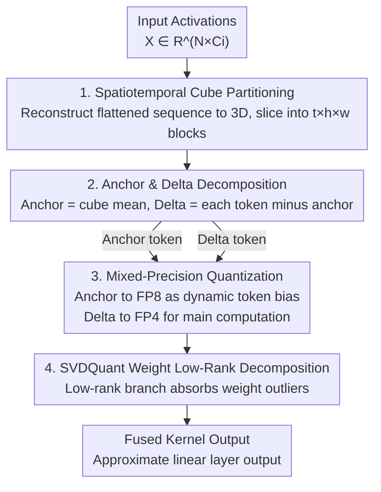

# DeltaQuant: 4-bit Video Diffusion Models with Spatiotemporal Delta Smoothing

**Conference**: CVPR 2026  
**Paper**: [CVF Open Access](https://openaccess.thecvf.com/content/CVPR2026/html/Li_DeltaQuant_4-bit_Video_Diffusion_Models_with_Spatiotemporal_Delta_Smoothing_CVPR_2026_paper.html)  
**Code**: To be confirmed (custom CUDA kernel implemented based on Nunchaku/SVDQuant engine)  
**Area**: Model Compression / Video Diffusion Quantization  
**Keywords**: W4A4 Quantization, Video Diffusion, Spatiotemporal Redundancy, Delta Token, Mixed Precision

## TL;DR
DeltaQuant exploits the spatiotemporal activation similarity of neighboring video tokens by partitioning activations into 3D spatiotemporal cubes. Each cube retains a single high-precision (FP8) mean "anchor token" and quantizes the relative "delta tokens" of each token to 4-bit. This achieves W4A4 quantization on the video diffusion model Wan2.2 with almost no loss in visual quality, reducing VRAM by 2.3× and model size by 2.9×. Combined with efficient attention and few-step distillation, it achieves a 111.8× end-to-end acceleration.

## Background & Motivation
**Background**: Video diffusion models, represented by Wan2.2 (a 27B parameter dual-Transformer) and LTX-Video, deliver stunning visual quality but suffer from massive computational and VRAM overhead—requiring over 75 minutes to generate a 5-second 720p video on an RTX 5090, making them virtually impractical on consumer GPUs. Academic research primarily focuses on acceleration via **efficient attention** (sparse attention, low-bit attention, linear attention).

**Limitations of Prior Work**: Once attention is optimized, the bottleneck **shifts to linear layers**. The data in Figure 3 of the paper is critical: self-attention originally accounts for 81% of Wan2.2's total computation, but after squeezing attention by ~8.6× using sparse/low-bit attention, linear layers instead become the dominant bottleneck at 65%. Furthermore, attention optimization **does not reduce VRAM**—large models still require CPU offloading to fit into GPUs, incurring extra overhead. To simultaneously resolve the linear layer computational bottleneck and VRAM footprint, the only viable tool is **4-bit weight and activation quantization (W4A4)**.

**Key Challenge**: SVDQuant, a state-of-the-art quantization method for image diffusion, uses SVD to decompose weights into a "high-precision low-rank branch (to absorb outliers) + a 4-bit residual", while relying on **offline-calibrated static per-channel smoothing** for activations. However, activations in video diffusion are **highly dynamic**: outlier channels and magnitudes fluctuate drastically across denoising timesteps (Figure 4). A smoothing factor calibrated for step 0 will instead amplify outliers at step 20, leading to severe visual collapse. Although on-the-fly SVD could theoretically absorb dynamic outliers, the online SVD cost during inference is prohibitively high.

**Goal**: Develop a **low-cost alternative that dynamically mitigates activation outliers**, enabling 4-bit weight-activation quantization (W4A4) for video diffusion models.

**Key Insight**: The authors observe that video data naturally exhibits **spatiotemporal activation similarity**: temporally consecutive frames differ only slightly, and spatially adjacent tokens possess highly similar features. This shares the same principle as video codecs like H.264, which achieve high compression ratios by "encoding inter-frame/intra-frame differences instead of raw pixels". The paper reveals that this redundancy **extends into the activations of diffusion models** (Figure 5).

**Core Idea**: Instead of directly quantizing raw activations, quantize the **differences between spatiotemporally adjacent tokens**. Actives are partitioned into local 3D cubes, and each cube uses a mean "anchor token" as a common baseline (retained in high precision to absorb outliers), while only the "delta tokens"—which have small magnitudes and few outliers—are compressed to 4-bit. This differential coding-like perspective substantially reduces quantization difficulty.

## Method

### Overall Architecture
DeltaQuant is a W4A4 post-training quantization scheme targeting the linear layers of video diffusion Transformers. The input is the activation tensor of a linear layer $X \in \mathbb{R}^{N \times C_i}$ (where $N = T \times H \times W$ is the token count, and $C_i$ is the input channel dimension), and the output is the approximate quantized linear layer output. The overall pipeline is: first reconstruct the flattened 1D sequence of activations **back into a 3D spatiotemporal structure and partition it into non-overlapping small cubes**; calculate the **mean anchor token** and obtain the **delta tokens** for each cube; then perform **mixed-precision quantization**—where anchor tokens are kept in FP8 and delta tokens are quantized to FP4, with both separately multiplied by the quantized weights and summed; on the weight side, SVDQuant's low-rank decomposition is integrated to further reduce error; finally, a fused CUDA kernel translates these algorithmic designs into real-world speedups.

### Key Designs

**1. Spatiotemporal Activation Similarity: Bringing Video Differential Coding to Quantization**

This serves as the foundation of the paper, tackling the limitation that static smoothing fails when activation outliers change dynamically across timesteps. The paper validates activation redundancy across two dimensions (Figure 5): For **temporal correlation**, Wan2.2 activations exhibit a clear periodic distribution across consecutive frames (tokens at the same spatial location have similar distributions over time); computing the temporal mean $\bar{X}$ and examining the residual $\tilde{X} = X - \bar{X}$ reveals a massive reduction in both magnitude and outliers. For **spatial correlation**, tokens within a $2\times 2$ spatial neighborhood in a single frame behave similarly; computing the spatial mean anchor yields compact residuals with fewer outliers. Crucially, while outliers are 'dynamic' (changing across timesteps), **the similarity between neighboring tokens is 'structural'**—regardless of how outliers spike, adjacent tokens spike together, allowing subtraction to stably cancel out outliers. This translates a challenging dynamic problem into a local differential problem easily solved online without offline calibration.

**2. Spatiotemporal Cube Partitioning: Reconstructing Structure to Find Adjacent Tokens**

Video diffusion models typically flatten the spatiotemporal structure into a 1D sequence of length $N$, which disrupts spatial and temporal contiguous relations, making it impossible to index which tokens should be grouped. DeltaQuant first reshapes $X$ from $\mathbb{R}^{N \times C_i}$ back to $\mathbb{R}^{T \times H \times W \times C_i}$, then slices it into $K = N/(thw)$ **non-overlapping spatiotemporal cubes**. Each cube has a size of $t \times h \times w \times C_i$, and the $k$-th cube is denoted as $X^{(k)} \in \mathbb{R}^{thw \times C_i}$. There is a reason cubes must be "locally small": ablation shows that larger cubes lead to weaker spatiotemporal similarities among grouped tokens, failing to extract meaningful shared structures—in the extreme case of using a global anchor for all tokens (analogous to the global average in Sage Attention), PSNR collapses severely. Therefore, DeltaQuant leverages the **local correlation within compact cubes** rather than global aggregation.

**3. Anchor and Delta Decomposition: High-Precision Mean + Low-Magnitude Residuals**

For each cube $X^{(k)}$, the mean of all tokens is taken as the shared anchor token $\bar{X}^{(k)} \in \mathbb{R}^{1 \times C_i}$, and the relative delta tokens are calculated:

$$\bar{X}^{(k)} = \frac{1}{thw}\sum_{n=1}^{thw} X^{(k)}_n, \qquad \tilde{X}^{(k)} = X^{(k)} - \bar{X}^{(k)}$$

Here, $\bar{X}^{(k)}$ is broadcast and subtracted from $X^{(k)}$. The anchor token effectively absorbs the large magnitudes and outliers of the entire cube, leaving delta tokens that have small scales, low variances, and few outliers—precisely the ideal format for quantization. This step resembles "I-frame (anchor) + residual" encoding in video compression, but is executed on activation tensors and computed online per-cube.

**4. Mixed-Precision Quantization: Anchor quantized to FP8 as dynamic token bias, Delta quantized to FP4 for main compute**

Delta tokens, being easily quantizable, are compressed to 4-bit, whereas the anchor tokens retaining the major outliers demand higher precision and are therefore quantized to FP8. The linear layer output is separated and computed as follows:

$$X^{(k)}W = (\bar{X}^{(k)} + \tilde{X}^{(k)})W \approx \underbrace{Q_8(\bar{X}^{(k)})Q_4(W)}_{\text{FP8 tensorcore}} + \underbrace{Q_4(\tilde{X}^{(k)})Q_4(W)}_{\text{FP4 tensorcore}}$$

The term $Q_8(\bar{X}^{(k)})Q_4(W)$ is calculated on FP8 Tensor Cores and serves as a **dynamic token bias**, which is broadcast to all $thw$ tokens within the cube; the remaining term is calculated on FP4 Tensor Cores. Since a single anchor is shared within each cube, this auxiliary cost is marginal (only +3.2% when cube size is 64) but significantly enhances precision. On the weight side, SVDQuant can be integrated: $W$ is decomposed into low-rank factors $L_1 L_2$ and residual $R = W - L_1 L_2$, approximating the layer-wise output as:

$$X^{(k)}W \approx \underbrace{X^{(k)}L_1 L_2}_{\text{low-rank}} + \underbrace{Q_8(\bar{X}^{(k)})Q_4(R)}_{\text{single token}} + \underbrace{Q_4(\tilde{X}^{(k)})Q_4(R)}_{\text{low-bit}}$$

The activation-side delta decomposition and the weight-side low-rank decomposition are highly complementary: the former targets dynamic activation outliers while the latter handles static weight outliers. Quantization is formulated as $Q(X) = \text{round}(X/s_X)\cdot s_X$, where $s_X = \max(|X|)/q_{\max}$ ($q_{\max}=6$ for 4-bit floating point).

### Loss & Training
DeltaQuant is a post-training quantization (PTQ) scheme that requires no weight retraining, only lightweight calibration. Implementation-wise, custom CUDA kernels are written based on SVDQuant's Nunchaku engine: anchor token generation is fused into the activation quantization kernel, a custom W4A8 GEMM is implemented for anchor tokens, and partial sum accumulation is integrated into the W4A4 GEMM for delta tokens. Regarding hyperparameters, a **timestep-aware cube size allocation** is adopted—the first 25–30% of denoising steps (high noise, most critical for quality) use a small tile size of 16 ($t{=}4,h{=}1,w{=}4$), while the remaining steps use a tile size of 64 ($t{=}4,h{=}2,w{=}8$). SVDQuant low-rank ranks are set to 128 for Wan2.2 and 64 for LTX-Video. Except for the cross-attention K/V projection layers (which only act on text tokens with negligible overhead and are quantized to 6-bit), all other linear layers are quantized to NVFP4. Anchor tokens undergo per-group FP8 quantization with a group size of 64.

## Key Experimental Results

### Main Results
Evaluating on Wan2.2 I2V/T2V (27B) and LTX-Video T2V (13B), quality metrics include Vision Reward and VBench S.C./A.Q./I.Q., while similarity metrics include LPIPS/PSNR/SSIM. The table below presents selected key comparisons on Wan2.2-I2V and LTX-Video (↓ represents lower is better, ↑ represents higher is better):

| Model | Precision/Method | LPIPS↓ | PSNR↑ | SSIM↑ | Vision Reward↑ |
|------|-----------|--------|-------|-------|----------------|
| Wan2.2-I2V | BF16 Original | – | – | – | 0.145 |
| Wan2.2-I2V | W4A4 RTN | 0.182 | 20.7 | 0.660 | 0.132 |
| Wan2.2-I2V | W4A4 SVDQuant | 0.165 | 21.9 | 0.686 | 0.146 |
| Wan2.2-I2V | W4A16 GGUF 4 | 0.137 | 23.2 | 0.755 | 0.141 |
| Wan2.2-I2V | **W4A4 Ours** | **0.128** | **23.2** | 0.742 | 0.143 |
| LTX-Video | BF16 Original | – | – | – | 0.139 |
| LTX-Video | W4A4 SVDQuant | 0.193 | 20.1 | 0.714 | 0.130 |
| LTX-Video | W4A16 GGUF 4 | 0.169 | 20.9 | 0.735 | 0.141 |
| LTX-Video | **W4A4 Ours** | **0.159** | **21.6** | **0.751** | 0.135 |

Takeaway: Under equivalent calibration budgets, DeltaQuant's W4A4 **consistently outperforms other W4A4/W4A6 baselines** (SVDQuant, SmoothQuant, S2Q-VDiT, Q-VDiT) in similarity and quality metrics, and **matches or even partially exceeds** the quality of VRAM-heavy W4A16 (GGUF 4) and BF16—while utilizing actual 4-bit activations for faster computation.

Efficiency metrics under Wan2.2, combining Radial & Sage Attention on RTX 5090:

| Metric | BF16 | GGUF 4 (W4A16) | DeltaQuant (W4A4) |
|------|------|----------------|--------------------|
| Model Size | 1.0× | ~3.5×↓ | **2.9×↓** |
| DiT Inference VRAM | 61.3 GiB | 26.6 GiB | **26.8 GiB (2.3×↓)** |
| 720p Per-Step Latency Speedup | 1.0× | 2.7× | **4.6×** |
| 480p Per-Step Latency Speedup | 1.0× | 3.7× | **7.2×** |

End-to-end acceleration combining multiple acceleration technologies (Wan2.2-I2V, Vision Reward↑):

| Configuration | Vision Reward↑ | Latency (s) | Speedup |
|------|----------------|---------|------|
| Original | 0.145 | 4818 | 1.0× |
| +LightX2V | 0.144 | 196.8 | 24.5× |
| +Radial&Sage | 0.145 | 131.0 | 36.8× |
| **+DeltaQuant** | **0.148** | **43.1** | **111.8×** |

DeltaQuant is **fully compatible** with efficient attention (Radial Attention), quantized attention (Sage Attention2++), and few-step LoRA (LightX2V), stacking a further 3.0× on top of 36.8× to achieve a 111.8× end-to-end speedup with even improved visual quality.

### Ablation Study

| Configuration | Key Metrics | Description |
|------|---------|------|
| Cube size 16/32/64/Global | PSNR 23.2 → 22.8 → 22.3 → 21.6 | Larger cubes yield lower similarity, global anchor causes catastrophic PSNR drop; proves reliance is on local correlation. |
| Anchor token precision 16/8/4 bit | PSNR 22.8 / 23.2 / 21.9 | FP8 unexpectedly yields higher PSNR than BF16, while achieving 4× FP8 Tensor Core throughput; NVFP4 anchor drops PSNR by 1.3. |
| Uniform cube 32 vs Timestep-aware | PSNR +0.5 | Allocating smaller cubes to high-noise steps yields better quality. |
| Rank: DeltaQuant vs SVDQuant | LPIPS–latency curve strictly lower | DeltaQuant consistently outperforms purely scaling SVDQuant rank across varying computational budgets. |

### Key Findings
- **Cube size is a key hyperparameter and smaller is better (within reasonable limits)**: As cube size increases from 16 to 64, and then to global, PSNR monotonically decreases—proving that DeltaQuant's gains originate entirely from **local spatiotemporal correlation within compact cubes**, whereas global averaging loses the shared structural properties.
- **Quantizing anchor tokens to FP8 rather than BF16/FP4 is the sweet spot**: FP8-quantized anchor tokens actually yield a higher PSNR (23.2) than BF16 (22.8) while enjoying 4× FP8 Tensor Core throughput; compressing the anchor to NVFP4 drops PSNR by 1.3, indicating that anchors must maintain sufficient precision to retain outliers.
- **Timestep-aware cube allocation is effective**: Using smaller cubes in the early denoising stage (high noise, most critical to quality) and larger cubes in later stages achieves a PSNR 0.5 higher at an amortized cube size of 33 compared to a uniform cube size of 32. This demonstrates that prioritizing the "quality budget" on high-noise steps is more efficient.
- **Delta decomposition outperforms scaling up ranks**: Scaling the SVDQuant rank too high leads to convergence failure under a given calibration time and drops accuracy; DeltaQuant focuses its efforts on the activation side, showing strict dominance across the efficiency-accuracy frontier.

## Highlights & Insights
- **Porting the 'inter-frame differential coding' from video processing to quantization**: Since H.264 codes inter-frame differences instead of raw pixels, DeltaQuant encodes inter-token differences instead of raw activations. This translocates an established engineering intuition into a brand new scenario, backed by a sound mechanistic explanation ("outliers are dynamic but neighboring tokens spike together").
- **Replacing 'online SVD' with 'online local differencing'**: While on-the-fly SVD is theoretically correct for dynamic outliers, it is too expensive. DeltaQuant approximates dynamic outlier absorption via a simple mean pooling inside the cube, adding only +3.2% overhead. This is a brilliant shift from an expensive operation to a much cheaper one.
- **Engineering perspective of anchor tokens as 'dynamic token biases'**: $Q_8(\bar X)Q_4(W)$ is broadcast to the entire cube, acting essentially as an input-dependent bias term. It leverages FP8 Tensor Cores and is computed only once, transferring algorithmic gains directly to hardware acceleration; custom kernels ensure that the 111.8× speedup is practical, not just theoretical.
- **Transferability**: The strategy of "local differences within a block, quantizing only residuals, and retaining high-precision anchors" can theoretically generalize to any tensor quantization scenario with spatiotemporal or local redundancy (e.g., other network layers in video/point clouds).

## Limitations & Future Work
- **Reliance on the spatiotemporal redundancy assumption**: The method's benefits completely depend on the assumption that "adjacent tokens are highly similar". For content with weak spatiotemporal correlation, rapid motion, or high-frequency textures, the delta tokens might not be small, potentially diminishing gains—the paper does not systematically evaluate such challenging scenarios. ⚠️ Subject to the original text.
- **Manual hyperparameter tuning**: Parameters such as cube size, timestep splitting ratios (25–30% / 70%), and per-layer precision configurations (6-bit for K/V projection, low-rank ranks of 128/64) are all manually set, requiring potential recalibration when migrating across different models.
- **Tight engineering coupling**: The framework heavily relies on the Nunchaku/SVDQuant engine, custom CUDA kernels, and NVFP4/FP8 Tensor Cores (NVIDIA 5090). Acceleration metrics are sensitive to hardware; porting to other architectures will require rewriting kernels.
- **Social impact**: The authors acknowledge that making video diffusion accessible on consumer-grade hardware may facilitate the generation of misleading or harmful synthetic content.
- **Future improvements**: Making cube sizes and timestep allocations **adaptively learned** relative to content dynamics/noise levels rather than static rules could potentially enhance robustness on difficult scenarios.

## Related Work & Insights
- **vs SVDQuant**: SVDQuant target W4A4 image diffusion, relying on a low-rank SVD branch to absorb **weight** outliers, but employs **offline static smoothing** for activations, which fails under the dynamic activations across video timesteps. DeltaQuant retains the low-rank weight decomposition but replaces the activation step with an **online spatiotemporal delta decomposition** to dynamically absorb outliers. The two are highly complementary—representing a key patch for migrating quantization from images to videos.
- **vs SmoothQuant**: SmoothQuant uses mathematically equivalent per-channel transformations to share quantization difficulty between weights and activations. However, its static calibration falls short against dynamic video outliers. DeltaQuant computes per-cube decompositions online, making it naturally dynamic.
- **vs GGUF 4 (W4A16 weight-only)**: GGUF 4 compresses the model by 3.5× but **only quantizes weights without accelerating execution** (activations remain 16-bit), which fails to accelerate compute-bound diffusion models. DeltaQuant matches its visual quality while unlocking an extra 1.9× (720p) / 3.6× (480p) speedup via true 4-bit activations.
- **vs S2Q-VDiT / Q-VDiT**: These methods improve video diffusion quantization via search-calibration data, token-aware estimation, and temporal distillation. However, they are inferior to DeltaQuant in similarity/quality benchmarks (e.g., S2Q-VDiT on Wan2.2-I2V gets LPIPS 0.366, PSNR 15.6, showing clear degradation).

## Rating
- Novelty: ⭐⭐⭐⭐⭐ Original migration of video spatiotemporal differential coding ideas to activation quantization. Clear mechanism and sharp execution.
- Experimental Thoroughness: ⭐⭐⭐⭐⭐ Three models × multiple baselines × thorough ablation (cube size, anchor precision, rank, timestep allocation) + real hardware latency & VRAM data. Rock-solid validation.
- Writing Quality: ⭐⭐⭐⭐ Logical motivation flow (shifting bottleneck from attention to linear layers, failure of static smoothing) with high information-density charts.
- Value: ⭐⭐⭐⭐⭐ Enables a 27B video diffusion model to output 720p in 43 seconds on a single GPU (RTX 5090), with 111.8× end-to-end speedup. Tremendous real-world deployment value.

<!-- RELATED:START -->

## Related Papers

- [\[CVPR 2026\] BinaryAttention: One-Bit QK-Attention for Vision and Diffusion Transformers](binaryattention_one-bit_qk-attention_for_vision_and_diffusion_transformers.md)
- [\[CVPR 2026\] Sampling-Aware Quantization for Diffusion Models](sampling-aware_quantization_for_diffusion_models.md)
- [\[CVPR 2026\] InstantViR: Real-Time Video Inverse Problem Solver with Distilled Diffusion Prior](instantvir_real-time_video_inverse_problem_solver_with_distilled_diffusion_prior.md)
- [\[ICLR 2026\] Quant-dLLM: Post-Training Extreme Low-Bit Quantization for Diffusion Large Language Models](../../ICLR2026/model_compression/quant-dllm_post-training_extreme_low-bit_quantization_for_diffusion_large_langua.md)
- [\[ICLR 2026\] DTP: Delta-Guided Two Stage Pruning for Mamba-based Multimodal Large Language Models](../../ICLR2026/model_compression/dtp_delta-guided_two_stage_pruning_for_mamba-based_multimodal_large_language_mod.md)

<!-- RELATED:END -->
