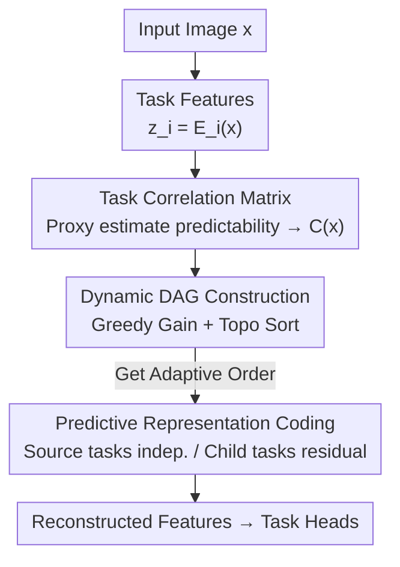

# Discovering Adaptive Task Dependencies for Efficient Multi-Task Representation Compression

**Conference**: CVPR 2026  
**Paper**: [CVF Open Access](https://openaccess.thecvf.com/content/CVPR2026/html/Huang_Discovering_Adaptive_Task_Dependencies_for_Efficient_Multi_Task_Representation_Compression_CVPR_2026_paper.html)  
**Code**: None  
**Area**: Model Compression  
**Keywords**: Multi-task representation compression, Task dependency DAG, Conditional entropy coding, Rate-distortion optimization, Coding for machines  

## TL;DR
ATDC makes the compression order of multiple task features **image-adaptive**: it uses a lightweight proxy head to estimate task predictability and form a correlation matrix, then greedily constructs a Directed Acyclic Graph (DAG) for sequencing. Each task feature is residually encoded conditional on its "parent" tasks, achieving higher multi-task accuracy at lower bitrates on Taskonomy.

## Background & Motivation
**Background**: Traditional codecs (JPEG/VVC, learned ELIC/MLIC++) serve human perception, optimizing pixel fidelity. However, images are increasingly consumed by machines for downstream tasks like segmentation and depth estimation. These tasks do not require pixel-perfect reconstruction but rather the retention of task-relevant semantic information. This led to "coding for machines," specifically representation compression of intermediate features.

**Limitations of Prior Work**: In multi-task compression, features across tasks (e.g., depth/normals, segmentation/texture) are highly correlated with overlapping structural/textural information. Independent encoding leads to bitrate waste due to redundant information. Existing joint compression methods (SSSIC with predefined hierarchies, OmniICM with shared representations, TAMC with gradient similarity clustering) introduce inter-task dependencies, but these structures are **static**—fixed after training and applied identically to all input images.

**Key Challenge**: The predictability between tasks **varies with image content**. For instance, rich depth information might predict surface normals well in one image, while the reverse might hold in another. A globally fixed dependency structure inevitably allocates redundant bits and results in sub-optimal rate-distortion performance across diverse scenes.

**Goal**: To adaptively infer task dependency structures (which tasks are encoded first and what conditions they depend on) on a per-image basis rather than using a hard-coded sequence.

**Key Insight**: From an information-theoretic perspective, if task $t_j$ strongly predicts task $t_i$, the conditional entropy of $Z_i$ given $Z_j$ is lower than its marginal entropy ($H(Z_i\mid Z_j) < H(Z_i)$). Thus, $t_j$ should be encoded first, followed by the conditional residual encoding of $t_i$. Since true conditional entropy is neither directly calculable nor differentiable, a trainable proxy is required.

**Core Idea**: Approximating "inter-task conditional predictability" using a lightweight proxy head to calculate per-image correlation matrices, followed by greedy DAG construction for adaptive sequencing and predictive residual coding to eliminate inter-task redundancy.

## Method

### Overall Architecture
ATDC follows a three-stage pipeline: "estimate relationships, determine sequence, and perform predictive encoding." Given an image, task-specific encoders $E_i$ extract representations $z_i = E_i(x)$. These are fed into a **Task Correlation Estimator** to obtain pairwise predictability scores, forming a correlation matrix $C(x)$. The **Dynamic DAG Construction** module then converts this matrix into a DAG via greedy conditional gain and topological sorting. Finally, **Predictive Representation Coding** executes task-by-task encoding according to this order: "source tasks" (no parents) are encoded independently, while others are residually encoded conditional on their reconstructed parent features. Decoded features are then passed to task heads for analysis.

Formalization: Unlike fixed-order methods optimizing $\min \mathbb{E}_{x}\big[\sum_i R_i(z_i\mid \hat z_{<i}) + \lambda_i L^{(i)}_{\text{task}}(\hat z_i, y_i)\big]$, ATDC utilizes an adaptive precursor set $\pi(<i)$:

$$\min_{\{\theta_i,\phi_i\},\psi}\ \mathbb{E}_{x\sim D}\Big[\sum_{i=1}^{N} R_i\big(z_i\mid \hat z_{\pi(<i)};\theta_i,\phi_i\big) + \lambda_i L^{(i)}_{\text{task}}(\hat z_i, y_i)\Big]$$

The key difference lies in $\pi(<i)$, which is inferred from image content by a learnable relationship estimator $g(x;\psi)$.

### Key Designs

**1. Task Correlation Matrix: Differentiable Predictability via Proxy Heads**

To determine the order based on predictability, one must know the remaining uncertainty of task $t_i$ given $t_j$, i.e., the conditional entropy $H(Z_i\mid Z_j)$. Since the true distribution $p(Z_i\mid Z_j)$ is unknown, ATDC introduces a lightweight proxy head $q_\phi(Z_i\mid Z_j)$ assuming Gaussian task representations. The training objective is conditional cross-entropy, which serves as an upper bound to the true conditional entropy:

$$\mathbb{E}_p[-\log q_\phi(Z_i\mid Z_j)] = H_p(Z_i\mid Z_j) + \mathrm{KL}\big(p(Z_i\mid Z_j)\,\|\,q_\phi(Z_i\mid Z_j)\big) \ge H_p(Z_i\mid Z_j)$$

As $q_\phi$ approaches $p$, minimizing the proxy loss approximates the reachable conditional bitrate. Specifically, candidate parent features are channel-normalized, concatenated, processed through a 3-layer $3\times3$ conv-BN-ReLU block, and finally used to predict Gaussian parameters $(\mu_i, \sigma_i^2)$ for the target feature. The proxy head is trained via conditional Gaussian negative log-likelihood:

$$L_{\text{proxy}} = \frac{1}{2}\,\mathbb{E}\Big[\log\sigma_i^2 + \frac{\|z'_i - \mu_i\|^2}{\sigma_i^2}\Big]$$

Predictability scores $s_{i,j}(x) = -L^{j\to i}_{\text{proxy}}(x)$ are exponentiated to form the elements $C_{i,j}(x) = \exp(s_{i,j}(x))$. This matrix is **asymmetric**, allowing "depth predicts normal" and "normal predicts depth" to have distinct scores.

**2. Dynamic DAG Construction: Greedy Conditional Gain**

To ensure sparsity and acyclicity, ATDC uses a greedy algorithm. For a candidate parent $t_p$ and child $t_c$, given the current parent set $S = \mathrm{Pa}(t_c)$, the incremental predictability gain is:

$$g_{p\to c} = C_{c,\,S\cup\{t_p\}} - C_{c,\,S}$$

Edges are retained only if $g_{p\to c} > \tau$. The algorithm limits the in-degree to $K_{\max}$ to maintain interpretability. This process ensures the resulting graph is content-adaptive and allows for dynamic task reordering during encoding.

**3. Predictive Representation Coding: Residual Encoding**

Following the DAG's topological order, encoding proceeds in two ways. **Source tasks** use a standard factorized autoencoder with uniform quantization and a factorized density model $R_i = -\sum \log p_{\theta_i}(\hat z_i)$. **Child tasks** reuse the proxy structure as a predictor, taking reconstructed parent features $\hat z_{\mathrm{Pa}(t_i)}$ and task identity embeddings $e_i$ to produce Gaussian parameters $(\mu_i,\sigma_i^2)$. Only the residual $r_i = z_i - \mu_i$ is encoded using a hyperprior-based Gaussian entropy model. Final reconstruction is $\hat z_i = \mu_i + \hat r_i$. Each task is optimized via:

$$L_i = R_i + \lambda_i\, L^{(i)}_{\text{task}}(\hat z_i, y_i)$$

This stage translates the inferred dependencies into bit savings by encoding only the non-reducible residuals.

### Loss & Training
The proxy head is pre-trained for 20 epochs (lr $1\times10^{-4}$). The compression module follows a two-stage approach: a 5-epoch warm-up with L1 reconstruction loss to stabilize the predictor, followed by 20 epochs optimizing the full rate-distortion objective. Hyperparameters are $K_{\max}=2$ and $\tau=0.2$.

## Key Experimental Results

Tests were conducted on Taskonomy (Tiny split) across six tasks: Segmentation, Keypoints 2D, Edges, Surface Normal, Depth, and Image Compression. The backbone was Xception, compared against traditional codecs (WebP, VTM), learned codecs (ELIC, MLIC++), and SOTA multi-task compression (TAMC).

### Main Results

| Dimension | ATDC Performance | Comparison |
|-----------|------------------|------------|
| Rate-Performance (5 tasks) | Leading at all bitrates | Superior to traditional / learned codecs |
| vs TAMC (Edges & Normals) | Significantly higher accuracy | Dynamic dependencies preserve geometric structure better |
| Extreme Low Bitrates | Consistent task performance | Traditional codecs face severe degradation |
| Scalable Multi-tasking | Faster utility growth per bit | Surpasses TAMC's total budget utility |
| Pixel Reconstruction | Comparable to TAMC | Does not sacrifice perceptual quality |

### Ablation Study

| Configuration / Analysis | Key Results | Description |
|--------------------------|-------------|-------------|
| Order: Adaptive (Ours) | Lowest loss across bitrates | Adaptive DAG order is optimal |
| Order: Fixed | Second best | Fixed to the most frequent test-set topology |
| Order: Random | Worst | Dependency consistency is destroyed |
| Scalability (N=5 vs N=6) | s:0.1841/0.1840, n:0.2110/0.2112 | New tasks added with minimal fine-tuning reach full system performance |
| Encoding Latency | Fixed 41.3 ms → ATDC 44.8 ms (+8.9%) | DAG inference accounts for ~6% of runtime |

### Key Findings
- **Adaptive ordering is crucial**: The failure of the random sequence proves that ordering by predictability is essential for performance.
- **DAGs are interpretable and stable**: The top-10 DAG patterns cover >20% of samples. Aggregated patterns show consistent hierarchies like $n\to s\to d,k,t,a$ (Normals as root in 44.1% of cases).
- **Zero-cost scalability**: Adding new tasks only requires fine-tuning the proxy head for pairs involving the new task while freezing the existing system.
- **Low overhead**: Per-image DAG construction adds only ~9% encoding latency, which is justified by the R-D gains.

## Highlights & Insights
- **Learning "Compression Order" as a dynamic variable** is the core innovation. Moving from static shared representations to content-adaptive DAGs eliminates redundancy effectively.
- **Dual-purpose proxy head**: The design efficiently uses the same structure for both correlation estimation and actual residual prediction.
- **Information-theoretic foundation**: Using the conditional cross-entropy upper bound aligns the proxy loss directly with the optimization of the compression bitrate.
- **Asymmetric modeling**: Capturing directed dependencies (A predicts B better than B predicts A) provides a level of detail that symmetric clustering methods (like TAMC) cannot achieve.

## Limitations & Future Work
- **Codec Independence**: The authors note that while the adaptive dependency model is effective, the underlying codec is a standard learned architecture; upgrading the codec itself could further improve performance.
- **Quantitative Metrics**: The main text relies heavily on R-D curves; comprehensive BD-rate tables are primarily in the supplementary material.
- **Complexity at Scale**: Whether the $O(T^2)$ DAG construction remains efficient or if the hierarchy collapses for much larger task sets ($N \gg 6$) remains to be explored.
- **Generalization**: Experiments are limited to the Taskonomy indoor domain. Performance on high-level tasks like detection or tracking in more diverse environments needs verification.

## Related Work & Insights
- **vs TAMC**: TAMC uses fixed hierarchies and gradient similarity. ATDC's adaptive DAG outperforms TAMC by modeling content-specific asymmetric dependencies, especially at higher bitrates.
- **vs MTL**: While Multi-Task Learning aims for shared representations to improve generalization, ATDC uses task correlations specifically for bit-allocation and inter-task redundancy elimination.

## Rating
- Novelty: ⭐⭐⭐⭐⭐ (Adaptive DAG based on information theory is highly innovative)
- Experimental Thoroughness: ⭐⭐⭐⭐ (Solid Taskonomy results, though missing unified BD-rate metrics in main text)
- Writing Quality: ⭐⭐⭐⭐ (Logical flow and well-detailed algorithms)
- Value: ⭐⭐⭐⭐ (Provides a scalable, interpretable adaptive framework for multi-task coding)

<!-- RELATED:START -->

## Related Papers

- [\[CVPR 2026\] Frequency Switching Mechanism for Parameter-Efficient Multi-Task Learning](frequency_switching_mechanism_for_parameter-ecient_multi-task_learning.md)
- [\[CVPR 2026\] FAAR: Efficient Frequency-Aware Multi-Task Fine-Tuning via Automatic Rank Selection](faar_efficient_frequency-aware_multi-task_fine-tuning_via_automatic_rank_selecti.md)
- [\[CVPR 2026\] TaskIT: Memory-Efficient Fine-Tuning of Multi-LoRA LLMs via Cross-Task Importance Transfer](taskit_memory-efficient_fine-tuning_of_multi-lora_llms_via_cross-task_importance.md)
- [\[CVPR 2025\] TADFormer: Task-Adaptive Dynamic Transformer for Efficient Multi-Task Learning](../../CVPR2025/model_compression/tadformer_task-adaptive_dynamic_transformer_for_efficient_multi-task_learning.md)
- [\[CVPR 2026\] Understanding and Enforcing Weight Disentanglement in Task Arithmetic](understanding_and_enforcing_weight_disentanglement_in_task_arithmetic.md)

<!-- RELATED:END -->
