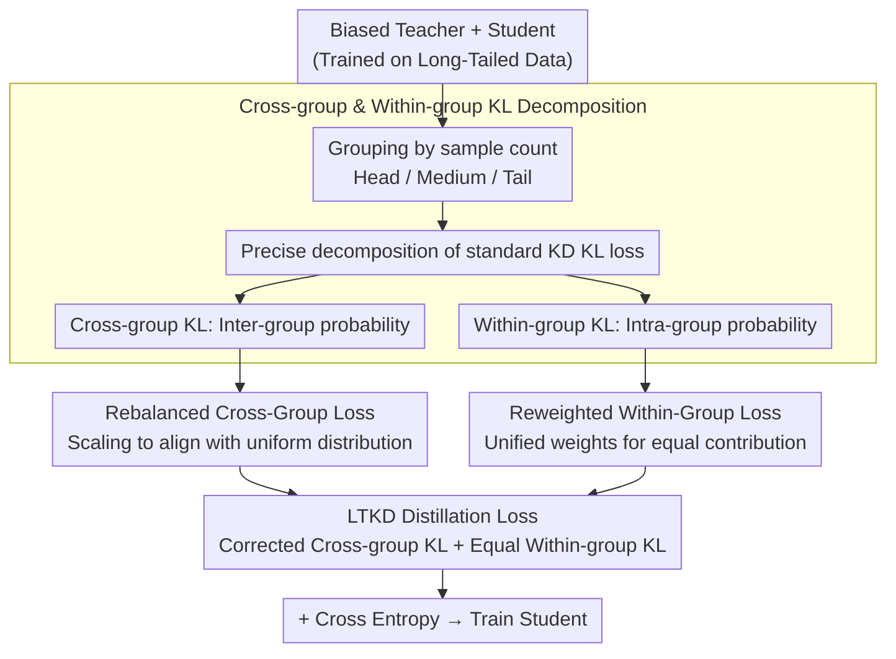

# Distilling Balanced Knowledge from a Biased Teacher

**Conference**: CVPR 2026  
**arXiv**: [2506.18496](https://arxiv.org/abs/2506.18496)  
**Code**: None  
**Area**: Model Compression  
**Keywords**: Knowledge Distillation, Long-tail Distribution, Model Compression, KL Divergence Decomposition, Class Imbalance

## TL;DR

To address the issue of teacher models skewing toward head classes in knowledge distillation under long-tail distributions, this paper decomposes the traditional KL divergence loss into cross-group and within-group components. By rebalancing the cross-group loss to calibrate group-level predictions and reweighting the within-group loss to ensure equal contributions, the proposed method outperforms existing techniques on CIFAR-100-LT/TinyImageNet-LT/ImageNet-LT, even exceeding the teacher model's own performance.

## Background & Motivation

Knowledge Distillation (KD) is a standard technique for transferring knowledge from large teacher models to lightweight student models. Traditional KD methods **implicitly assume that training data is class-balanced**.

However, real-world data often follows a **long-tail distribution**: head classes are data-rich, while tail classes are data-scarce. Teacher models trained on such distributions exhibit severe head-class bias. Directly applying standard KD forces students to mimic biased teachers, which is not only ineffective but harmful: students inherit the bias and perform worse on tail classes.

**Core Problem**: Can balanced knowledge be distilled from a biased teacher?

**Key Insight**: By mathematically decomposing the KL divergence loss into cross-group and within-group components, it is observed that both are differently affected by teacher bias—the cross-group term leads to overestimating head probabilities, while the within-group weighting mechanism allows the head group to dominate the gradient.

**Core Idea**: Instead of modifying the teacher model, **correct the impact of teacher bias within the distillation objective function**.

## Method

### Overall Architecture

This paper addresses the problem where a teacher trained on long-tailed data biases toward head classes, causing the student to inherit this bias via standard KD. LTKD decomposes the distillation objective without altering the teacher. It first ranks classes into three groups based on sample count—Head, Medium, and Tail (approx. 33%/34%/33%). It then decomposes the standard KL divergence loss into "cross-group" and "within-group" parts: the former manages probability allocation between the three groups, while the latter manages allocation within each group. After identifying how bias affects each part, the method rebalances the cross-group term and reweights the within-group term, combining the corrected cross-group KL and the equally-weighted within-group KL into a new distillation loss.

### Key Designs

**1. Cross-group and Within-group KL Decomposition: Separating bias propagation paths**

Standard KD loss is the KL divergence between the overall probability distributions of the teacher and student, where bias is entangled. Using a mathematical identity, it is decomposed: defining cross-group probability for group $\mathcal{G}$ as $p_\mathcal{G} = \sum_{i \in \mathcal{G}} p_i$ and the within-group conditional probability as $\tilde{p}_{\mathcal{G}_i} = p_i / p_\mathcal{G}$, any class probability is $p_i = p_\mathcal{G} \cdot \tilde{p}_{\mathcal{G}_i}$. Substituting this into the KL divergence decomposes the total loss into the "Cross-group KL" plus the "sum of each group's within-group KL weighted by the teacher's cross-group probability $p_\mathcal{G}^{T}$." This exact decomposition separates two bias effects: first, the cross-group term overestimates the head group's overall probability; second, the weighting coefficient $p_\mathcal{G}^{T}$ causes the head group to dominate gradients.

**2. Rebalanced Cross-Group Loss: Pulling the skewed group distribution back to uniform**

The cross-group term suffers from the teacher overestimating head group probabilities. Empirical evidence shows that a biased teacher fed with balanced data yields nearly uniform average group probabilities, but long-tailed data skews this significantly. Since this skew is a systematic shift caused by data distribution, the method calculates scaling factors per batch to align the teacher's group probabilities with a uniform distribution, then applies this scaling to sample probabilities and re-normalizes them. This ensures the student learns a "group-equivalent" goal rather than the teacher's head-heavy version.

**3. Reweighted Within-Group Loss: Ensuring equal contributions from all groups**

The within-group term's issue lies in the weighting coefficient: each group's KL is multiplied by the teacher's cross-group probability $p_\mathcal{G}^{T}$, which is naturally higher for the head group. Consequently, tail group supervision is diminished. The correction is straightforward: replace the unequal weights with a uniform constant, allowing within-group KLs from all three groups to be summed with equal weight. This ensures the fine-grained distinctions within tail classes (the useful "dark knowledge") are not drowned out by the head group.

### Loss & Training

- Total loss: Cross Entropy + temperature-scaled LTKD loss, the latter using hyperparameters $\alpha$ and $\beta$ to balance cross-group and within-group terms.
- Class grouping: Sorted by sample count; top 33% labeled Head, next 34% Medium, bottom 33% Tail.
- Imbalance factors: {10, 20, 100} for CIFAR-100-LT and TinyImageNet-LT; {5, 10, 20} for ImageNet-LT.
- Test set remains balanced to avoid evaluation bias.

## Key Experimental Results

### Main Results: CIFAR-100-LT (gamma=100, extreme imbalance)

| Teacher to Student | Method | Tail Accuracy (%) | Overall Accuracy (%) |
|-------------------|------|-----------------|---------------------|
| ResNet32x4 to ResNet8x4 | DKD | 13.25 | 46.11 |
| | ReviewKD | 15.09 | 45.91 |
| | **Ours** | **27.21** | **51.08** |
| | Gain | **+12.12** | **+4.97** |
| ResNet50 to MobileNetV2 | DKD | 12.45 | 39.21 |
| | **Ours** | **21.04** | **42.45** |
| | Gain | **+8.59** | **+3.24** |

### Ablation Study

| Configuration | Tail (%) | All (%) | Description |
|------|----------|---------|------|
| Standard KD | 13.38 | 42.48 | Inherits teacher bias |
| Cross-group rebalancing only | ~20 | ~48 | Effective group calibration |
| Within-group reweighting only | ~18 | ~47 | Effective gradient balancing |
| **LTKD** (Combination) | 27.21 | 51.08 | Significant synergy |

### Key Findings

- **Ours exceeds the teacher's own performance in nearly all settings**: At gamma=100, the teacher's Tail accuracy is only 15.28%, while the student reaches 27.21%.
- Effective across heterogeneous architecture pairs (e.g., WRN-40-2 to ShuffleNetV1, ResNet50 to MobileNetV2).
- Advantage grows with imbalance: Tail Gain is +12.12% at gamma=100 and +6.58% at gamma=10.
- DKD's target/non-target decomposition offers limited improvement in long-tailed scenarios.

## Highlights & Insights

- **Mathematically-driven design**: Problems are revealed via exact mathematical identities before targeted corrections are designed.
- **Counter-intuitive "Student > Teacher" result**: Teacher's dark knowledge contains useful information previously masked by bias.
- **Minimalist yet effective**: Modifies only the loss function without changing architecture, adding modules, or requiring data augmentation.

## Limitations & Future Work

- Fixed grouping (33% each); adaptive grouping might be superior.
- Validated primarily on CNNs; ViT or larger models remain untested.
- Rebalancing factors based on batch statistics may be unstable with small batch sizes.
- Not compared in combination with other de-biasing strategies like logit adjustment.

## Related Work & Insights

- DKD's target/non-target decomposition served as inspiration, though the decomposition dimension differs.
- While logit adjustment calibrates during inference, LTKD calibrates the teacher distribution during training; they may be complementary.
- The grouping and reweighting approach can be generalized to any scenario where the teacher has systematic bias.

## Rating

- Novelty: ⭐⭐⭐⭐ The KL decomposition perspective is novel, and correction strategies are mathematically grounded.
- Experimental Thoroughness: ⭐⭐⭐⭐ 3 datasets x 3 imbalance levels x 4 architecture pairs.
- Writing Quality: ⭐⭐⭐⭐⭐ Complete logical chain with clear mathematical derivations.
- Value: ⭐⭐⭐⭐ Addresses a practical pain point in KD for real-world imbalanced scenarios with a simple, deployable method.

<!-- RELATED:START -->

## Related Papers

- [\[CVPR 2026\] Masking Teacher and Reinforcing Student for Distilling Vision-Language Models](masking_teacher_and_reinforcing_student_for_distilling_vision-language_models.md)
- [\[CVPR 2026\] Teacher-Guided Routing for Sparse Vision Mixture-of-Experts](teacher-guided_routing_for_sparse_vision_mixture-of-experts.md)
- [\[ICLR 2026\] In Good GRACES: Principled Teacher Selection for Knowledge Distillation](../../ICLR2026/model_compression/in_good_graces_principled_teacher_selection_for_knowledge_distillation.md)
- [\[AAAI 2026\] Distilling Cross-Modal Knowledge via Feature Disentanglement](../../AAAI2026/model_compression/distilling_cross-modal_knowledge_via_feature_disentanglement.md)
- [\[ICLR 2026\] Exploring Knowledge Purification in Multi-Teacher Knowledge Distillation for LLMs](../../ICLR2026/model_compression/exploring_knowledge_purification_in_multi-teacher_knowledge_distillation_for_llm.md)

<!-- RELATED:END -->
