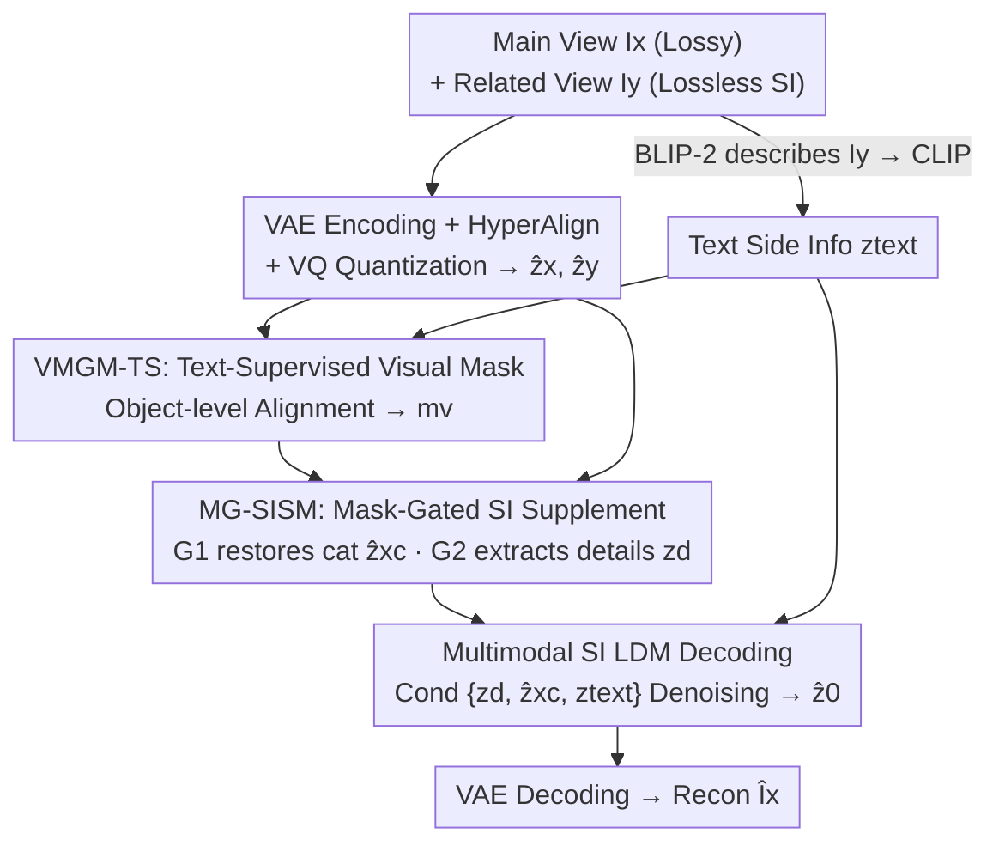

# Distributed Image Compression with Multimodal Side Information at Extremely Low Bitrates

**Conference**: CVPR 2026  
**Paper**: [CVF Open Access](https://openaccess.thecvf.com/content/CVPR2026/html/Xu_Distributed_Image_Compression_with_Multimodal_Side_Information_at_Extremely_Low_CVPR_2026_paper.html)  
**Code**: None (Not publicly available)  
**Area**: Model Compression / Image Compression / Diffusion Models  
**Keywords**: Distributed Image Compression, Side Information, Latent Diffusion Model, Multimodal Alignment, Extremely Low Bitrate  

## TL;DR
To address the issues of blurred reconstruction and loss of detail in multi-view distributed image compression at extremely low bitrates (<0.1 bpp), this paper proposes MDIC. It is the first to feed side information into a pre-trained text-to-image diffusion model in a "text + visual" multimodal format, using a text-supervised visual mask to gate the restoration of category information and object-level details lost during quantization, achieving SOTA perceptual quality on KITTI Stereo and Cityscapes.

## Background & Motivation
**Background**: Distributed Image Compression (DIC) transmits one view losslessly as "side information" (SI) to assist the decoder-side reconstruction of another view that is lossily compressed. It does not require communication between encoders and theoretically approaches the efficiency of joint encoding (Slepian-Wolf / Wyner-Ziv), making it particularly suitable for bandwidth-constrained scenarios like multi-camera surveillance and 3D scene reconstruction, where target bitrates are typically compressed to <0.1 bpp.

**Limitations of Prior Work**: Existing DIC methods are predominantly built on VAE frameworks, using global cross-attention for interaction between SI and compressed features. However, at extremely low bitrates, the transmitted main image features are severely degraded and carry much less information than the SI. The attention mechanism can only focus on signals related to the "limited residual content," failing to recover object-level details lost during compression. Worse, these methods optimize for pixel-level fidelity (PSNR/MS-SSIM) and tend to fill missing details with "averaged correlation clues," resulting in over-smoothing and local blurring.

**Key Challenge**: At extremely low bitrates, the quantity of information in the main image is $\ll$ that of the SI, creating a high degree of asymmetry. Furthermore, separating "useful object-level details" from "interfering multi-view differences/redundancy" within the SI is inherently difficult. Since the importance of fine-grained information varies across regions and objects, attention mechanisms struggle to strike a balance. Goals focused purely on pixel fidelity also cause models to abandon distributional consistency, which is the root cause of blurring.

**Key Insight**: Diffusion-based compressors (Perco/DiffEIC/RDEIC) have demonstrated that pre-trained text-to-image diffusion models can recover rich global semantics and maintain distributional consistency even from limited information. The authors recognize that diffusion models are naturally suited to decoupling "global semantics" and "fine-grained details" in SI: the text modality handles global distribution, while the visual modality manages local details.

**Core Idea**: For the first time, SI in DIC is injected into a pre-trained LDM decoder in multimodal form (textual descriptions and visual features extracted from related views). A "visual mask trained via text supervision" serves as an information gate to supply category information and object details lost during quantization.

## Method

### Overall Architecture
MDIC is an asymmetric pipeline featuring "encoder-side compression + decoder-side multimodal diffusion reconstruction." **Encoder Side**: The main view $I_x$ undergoes lossy compression, while the related view $I_y$ is transmitted losslessly (visible only at the decoder). Both views are first encoded into latent space as $z_{Lx}, z_{Ly}$ using a frozen pre-trained VAE, refined into $z_x, z_y$ via a HyperAlign module with convolutions and linear attention, and then quantized into $\hat z_x, \hat z_y$ by a VQ-VAE. VQ quantization both compresses information and clusters features into a structured latent space. A Transformer autoregressive entropy model estimates the bitrate $\text{bpp}_x$ of $\hat z_x$. Simultaneously, BLIP-2 generates text descriptions for $I_y$, which are encoded by a CLIP text encoder to obtain the text SI $z_{text}$. Arithmetic coding packages $\hat z_x, \hat z_y, z_y, z_{text}$ into the bitstream.

**Decoder Side** performs three tasks: ① VMGM-TS generates a visual mask $m_v$ under text supervision; ② MG-SISM gatedly processes visual SI—restoring category features $\hat z_{xc}$ through one path and extracting fine-grained details $z_d$ through another; ③ A diffusion denoiser (LDM) is guided by multimodal conditions $Z_{cond}=\{z_d, \hat z_{xc}, z_{text}\}$ to obtain the latent variable $\hat z_0$, which is then restored to $\hat I_x$ via the VAE decoder. Text SI guides global semantics while visual SI focuses on local details, working together to achieve semantically consistent reconstruction.

### Key Designs

**1. Multimodal Side Information LDM Decoding: Dividing SI for Global and Local Control**

This design targets the pain point where cross-attention fails to recover details at extremely low bitrates, and pixel-only optimization leads to blurring. Instead of a single visual cross-attention layer, MDIC splits SI into two modalities for the pre-trained LDM: text generated by BLIP-2 from $I_y$ and encoded by CLIP as $z_{text}$, responsible for transferring shared **global distribution/semantics** across views; and visual SI responsible for **local details**. Denoising is performed under multimodal conditions $Z_{cond}=\{z_d, \hat z_{xc}, z_{text}\}$, with the forward diffusion and reverse denoising defined as:

$$z_t=\sqrt{\hat\alpha_t}\,z_{Lx}+\sqrt{1-\hat\alpha_t}\,\varepsilon,\qquad p_\theta(z_{t-1}\mid z_t)=\mathcal N\!\big(z_{t-1};\,\mu_\theta(z_t,Z_{cond},t),\,\beta_t I\big)$$

Here, $z_0$ is initialized from the main image latent representation $z_{Lx}$ (rather than pure noise, leveraging residual info to speed up convergence). The denoising network $\mu_\theta$ is implemented via a U-Net. This works because diffusion models, via large-scale pre-training, can generate distributionally consistent content even with minimal info, avoiding the VAE's "average-everything" blur.

**2. VMGM-TS: Supervising a "Detail-Selective" Visual Mask via Object-Level Text Prediction**

This solves the core problem of separating useful details from interference in SI. Rather than learning a mask directly, the authors tie mask generation to an **object-level multimodal alignment auxiliary task**. They build a vocabulary from the $N$ most frequent object nouns ($N=14$ in experiments). During training, object words in image descriptions are replaced with mask tokens to form object-masked text. The model must then predict these masked words using masked visual features—requiring the mask to "correctly identify object regions."

The mask itself is generated from the difference and similarity between main and side quantized features: $F_{diff}=|\hat z_x-\hat z_y|$ and $F_{prod}=\hat z_x\odot\hat z_y$. These are concatenated and passed through three convolutional layers to get logits, followed by differentiable binary sampling via Gumbel-Sigmoid:

$$m=\sigma\!\Big(\tfrac{\text{logits}+g}{\tau}\Big),\qquad m_v=\mathbb I(m>\theta)+\mathrm{sg}\big(m-\mathbb I(m>\theta)\big)$$

where $g$ is Gumbel noise, $\tau$ controls smoothness, $\theta$ is the hard sampling threshold (0.2 at inference), and $\mathrm{sg}$ is the stop-gradient. This allows hard binary masks in the forward pass while maintaining gradient flow. Supervision is provided via cross-entropy between predicted and ground-truth words: $L_{mask}=\frac1n\sum_i \mathrm{CE}(P_i,T_i)$.

**3. MG-SISM: Mask-Gated Supplementation of Categories and Details**

VQ quantization discards category info and object-level details. MG-SISM uses mask $m_v$ to open two gates:

$$\hat z_{xc}=G_1(\hat z_x,\ \hat z_y\odot m_v),\qquad z_d=z_y+G_2(z_y)\odot F_m(m_v)$$

Gate $G_1$ applies the mask to the **quantized** side info $\hat z_y$, focusing on category-related regions, and interacts with the main image's quantized latent via a visual Transformer to produce semantically enhanced **category features** $\hat z_{xc}$. Gate $G_2$ acts on the **lossless unquantized** side info $z_y$, ensuring **fine-grained details** $z_d$ in key object regions receive maximum attention while suppressing redundancy and multi-view discrepancies. These outputs, with $z_{text}$, form the diffusion conditions.

### Loss & Training
The total loss consists of three parts: $L=L_{VQ}+\lambda_{mask}\cdot L_{mask}+L_{RD}$. $L_{VQ}$ is the standard VQ-VAE commitment + embedding loss. $L_{mask}$ is the object-level cross-entropy supervision ($\lambda_{mask}=0.1$). The rate-distortion loss $L_{RD}=\mathbb E_{I_x}[\lambda\cdot\mathbb E[-\log_2 p(\hat z_x)]+L_{diff}]$ balances bitrate and quality, where $L_{diff}$ is the diffusion noise prediction objective: $L_{diff}=\mathbb E\big[\lVert\varepsilon-\varepsilon_\theta(z_t,t,Z_{cond})\rVert_2^2\big]$. Training uses 4×L40 GPUs, batch size 8, AdamW, with 10,000 warmup steps to $8\times10^{-5}$. Inference uses 10 diffusion steps, with $\lambda\in\{0.1,10\}$.

## Key Experimental Results

### Main Results
Datasets used are KITTI Stereo (1576 training / 790 testing pairs) and Cityscapes (2975 / 1525 pairs), resized to 128×256. Comparisons includes DIC (NDIC/LDMIC/ATN), joint coding SIC (SASIC/ECSIC/CAMSIC/BiSIC), and diffusion LIC (Perco/DiffEIC/RDEIC). Perceptual metrics: LPIPS/FID/DISTS/KID/NIQE. Distortion metrics: PSNR/MS-SSIM/mIoU. Findings: MDIC achieves **SOTA on all perceptual metrics** across both datasets, significantly outperforming existing DIC and even joint-coded SIC. While PSNR is lower than distortion-pure methods, its mIoU is comparable to the best distortion methods, indicating superior object-level detail preservation.

Representative sample data (Fig.8):

| Method | Bpp ↓ | PSNR ↑ | LPIPS ↓ |
|------|-------|--------|---------|
| ATN (DIC) | 0.0316 | 23.99 | 0.4287 |
| BiSIC (Joint SIC) | 0.0288 | 23.61 | 0.4373 |
| RDEIC (Diff LIC) | 0.0212 | 12.61 | 0.5660 |
| **MDIC (Ours)** | **0.0107** | 22.56 | **0.2524** |

MDIC achieves significantly lower LPIPS (better perception) with a lower bpp, while PSNR remains competitive with DIC methods.

### Ablation Study

**Two types of visual SI ($\hat z_{xc}$ category features / $z_d$ fine-grained details)**, BD-Quality relative to full MDIC:

| Configuration | LPIPS | DISTS | PSNR | MS-SSIM | Note |
|------|-------|-------|------|---------|------|
| w/o ($z_d+\hat z_{xc}$) | −0.3550 | −0.1826 | −8.6358 | −6.5115 | Both removed; major failure |
| w/o $z_d$ | −0.1179 | −0.0489 | −2.8161 | −3.1127 | Missing details; color/contour inconsistent |
| **MDIC (Full)** | 0 | 0 | 0 | 0 | Full model |

**Two Gates $G_1/G_2$ of MG-SISM**:

| Configuration | LPIPS | DISTS | PSNR | MS-SSIM | Note |
|------|-------|-------|------|---------|------|
| w/o ($G_1+G_2$) | −0.0437 | −0.0050 | −0.5979 | −0.4491 | No gating; redundancy interferes |
| w/o $G_2$ | −0.0106 | −0.0045 | −0.2864 | −0.2595 | Only detail gate $G_2$ removed |
| **MDIC (Full)** | 0 | 0 | 0 | 0 | Full model |

### Key Findings
- **Category features $\hat z_{xc}$ are critical**: Removing both $z_d+\hat z_{xc}$ causes PSNR to drop by 8.64 and MS-SSIM by 6.51. Category compensation is more vital than detail compensation because without it, the diffusion model generates content from a very limited subset of categories.
- **Detail gate $z_d$ favors fidelity**: Removing $z_d$ primarily affects pixel fidelity (color/contour consistency) rather than perceptual consistency.
- **Gating provides incremental gain**: The impact of $G_1/G_2$ is smaller (0.04 scale) compared to SI itself (0.35 scale), serving as a refinement that ensures more accurate object boundaries.

## Highlights & Insights
- **Mapping Global/Local SI to Text/Visual Modalities**: This is the most clever step—not just adding text, but using text for global consistency and masked visual for local detail, resolving the core SI separation conflict in DIC.
- **"Object-level Cloze Test" for Semantic Masks**: Tying mask learning to a "masked word prediction" task provides a semantic anchor without requiring pixel-level labels.
- **Quantization as both Compression and Clustering**: Leveraging VQ-VAE for both bitrate reduction and structuring the latent space for category recovery is a highly effective design pattern.
- **Initialization from Main Image Latent**: $z_0\leftarrow z_{Lx}$ with only 10 denoising steps balances speed and fidelity at extremely low bitrates.

## Limitations & Future Work
- **External Model Dependency**: Reliance on BLIP-2, CLIP, and pre-trained LDM results in high inference cost and memory usage. Complexity analysis is relegated to the supplement.
- **Lower PSNR**: The authors acknowledge PSNR is lower than purely distortion-based methods. This sacrifice is inherent to diffusion generation and may limit use in measurement-critical scenarios.
- **Text SI Quality**: Everything depends on the BLIP-2 generated caption. If a caption misses key objects, the text guidance will be skewed.
- **Vocabulary Constraint**: The vocabulary only includes 14 high-freq nouns; performance on long-tail objects or open-vocabulary scenarios remains to be validated.

## Related Work & Insights
- **vs LDMIC / BiSIC (Attention-based DIC/SIC)**: These methods rely on cross-attention and optimize for pixel fidelity. At low bitrates, they lead to blurring. MDIC utilizes multimodal conditions + diffusion, avoiding pixel averaging for sharper perception.
- **vs Perco / DiffEIC / RDEIC (Diffusion-based LIC)**: These have strong generative power but lack specialized side information modeling. MDIC's VMGM-TS + MG-SISM explicitly aligns SI details, solving the "high quality but inconsistent details" problem.

## Rating
- Novelty: ⭐⭐⭐⭐⭐ First to introduce multimodal SI to DIC with a novel text/visual division and supervised masking.
- Experimental Thoroughness: ⭐⭐⭐⭐ Comprehensive multi-metric comparison and clear ablation, though performance curves are used over tables for main results.
- Writing Quality: ⭐⭐⭐⭐ Logical flow from motivation to ablation; some details require referring to the supplement.
- Value: ⭐⭐⭐⭐ Provides a new SOTA for perceptual quality in extremely low bitrate DIC, though deployment cost remains a potential barrier.

<!-- RELATED:START -->

## Related Papers

- [\[CVPR 2026\] Parallax to Align Them All: An OmniParallax Attention Mechanism for Distributed Multi-View Image Compression](parallax_to_align_them_all_an_omniparallax_attention_mechanism_for_distributed_m.md)
- [\[CVPR 2026\] Ultra-Low Bitrate Perceptual Image Compression with Shallow Encoder](ultra-low_bitrate_perceptual_image_compression_with_shallow_encoder.md)
- [\[AAAI 2026\] HCF: Hierarchical Cascade Framework for Distributed Multi-Stage Image Compression](../../AAAI2026/model_compression/hcf_hierarchical_cascade_framework_for_distributed_multi-stage_image_compression.md)
- [\[CVPR 2026\] What Matters in Practical Learned Image Compression](what_matters_in_practical_learned_image_compression.md)
- [\[CVPR 2026\] Block-based Learned Image Compression without Blocking Artifacts](block-based_learned_image_compression_without_blocking_artifacts.md)

<!-- RELATED:END -->
