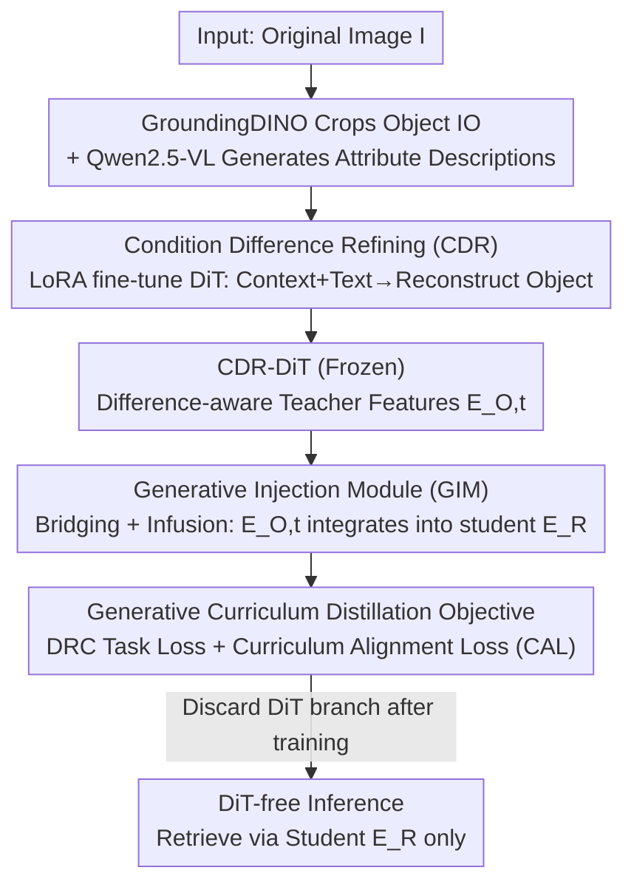

# DiT-Distill: Open-Set Fine-Grained Retrieval via Generative Curriculum Knowledge

**Conference**: CVPR 2026  
**Paper**: [CVF Open Access](https://openaccess.thecvf.com/content/CVPR2026/html/Jiang_DiT-Distill_Open-Set_Fine-Grained_Retrieval_via_Generative_Curriculum_Knowledge_CVPR_2026_paper.html)  
**Code**: None  
**Area**: Model Compression  
**Keywords**: Knowledge Distillation, Open-Set Fine-Grained Retrieval, Diffusion Transformer, Curriculum Distillation, Attribute-Centric Representation  

## TL;DR
This work refines and distills the "coarse-to-fine generative curriculum knowledge" encoded during the denoising process of a pre-trained text-to-image Diffusion Transformer (DiT) into a lightweight ViT retrieval backbone. This enables the small model to completely discard the DiT during inference while significantly improving R@1 in Open-Set Fine-Grained Retrieval (OSFR) (+9.8% on CUB, +18.6% on Stanford Cars).

## Background & Motivation
**Background**: Open-Set Fine-Grained Retrieval (OSFR) requires models to retrieve sub-categories that were **unseen** during training (e.g., new bird species or car models). Mainstream approaches fall into two categories: metric learning (pulling same classes together and pushing different ones apart) and localization enhancement (forcing the encoder to capture discriminative local parts).

**Limitations of Prior Work**: Both categories are trained under a **closed-set** assumption with pre-defined training classes. Consequently, the learned representations are deeply coupled with "class semantics"—the model remembers "this is Bird Species #37" rather than transferable attributes like "white head, gray wings, yellow beak." Generalization collapses when encountering sub-categories absent from the training set.

**Key Challenge**: Discriminative backbones naturally tend to bind features to pre-defined class boundaries, whereas OSFR requires **label-agnostic representations characterizing intrinsic visual attributes**. These two objectives are in direct conflict.

**Key Insight**: The authors observe that text-to-image DiTs (e.g., FLUX), trained on web-scale image-text pairs, can synthesize similar instances across various categories based on text prompts **without being constrained by specific labels**. This suggests DiTs store an internal attribute-centric knowledge base. Furthermore, the DiT denoising process is **coarse-to-fine**: early timesteps capture global structures, while later timesteps refine local details. This "coarse-to-fine curriculum" precisely corresponds to the human process of fine-grained recognition—"outline first, details later." The authors name this **Generative Curriculum Knowledge (GCK)**.

**Two Obstacles**: (Q1) Original DiTs model **overall appearance** (including background) and do not emphasize subtle differences between similar objects; how can they be forced to focus on fine-grained variance? (Q2) DiTs possess up to 12 billion parameters, making direct deployment impractical; how can this curriculum knowledge be transferred into an efficient discriminative model for **DiT-free inference**?

**Core Idea**: A "Refine then Distill" two-stage framework—first using Condition Difference Refining (CDR) to "sharpen" the DiT's generative knowledge, then using Generative Curriculum Distillation (GCD) to infuse this hierarchical knowledge into a lightweight backbone, eventually discarding the DiT.

## Method

### Overall Architecture
DiT-Distill follows a teacher-student architecture: the **Teacher** is a text-to-image DiT (FLUX), and the **Student** is a lightweight ViT-B/16 retrieval backbone. The process consists of two sequential stages. **Stage I (CDR)**: Fine-tune the DiT with LoRA to perform the task of "reconstructing an object-centric view given the full context image and attribute descriptions," forcing it to shift attention from background to object differences, resulting in a "difference-aware" CDR-DiT. **Stage II (GCD)**: Freeze the CDR-DiT as a fixed knowledge source, bridge hierarchical features from multiple denoising timesteps into the student backbone via a Generative Injection Module (GIM), and use a curriculum alignment loss to "internalize" this knowledge into the student's own embedding $E_R$. After training, the entire DiT branch is discarded, and only the student backbone $E_R = E_R(I)$ is used for inference.

### Key Designs

**1. Condition Difference Refining (CDR): Forcing DiT from "Global View" to "Object Variance"**

This step addresses Q1—original DiTs model overall appearance with background noise and are insensitive to fine-grained differences. The authors first use multimodal foundation models to create training data: the open-vocabulary detector GroundingDINO crops the object-centric view $I_O$ using super-class names (e.g., "bird"), and Qwen2.5-VL-7B generates attribute-centric text $T_{text}$ with instructions like "describe features of [cls] in the image, **do not output the class name**" (e.g., "pointed black beak, white belly, black tail feathers"). This produces triplets of "context image → object image + attribute description."

LoRA is then used to fine-tune the DiT to reconstruct the noisy object latent $X_{O,t} = t\,\mathcal{E}(I_O) + (1-t)\epsilon$ conditioned on **both the full context latent $X_I$ and attribute text $T_{text}$**. The objective is a standard reconstruction loss $L_{CDR} = \mathbb{E}_{t,X_O,\epsilon}\big[\|(X_O-\epsilon) - E_{O,t}\|^2\big]$. This task is cleverly designed: the model must recover the object from noise while being fed the full context including background, forcing it to learn to **implicitly "subtract" context features** and retain only text-guided object attribute features. The resulting CDR-DiT representation $E_{O,t}$ becomes a high-quality "teacher knowledge" source sensitive to differences.

**2. Generative Injection Module (GIM): Bridging Generative and Discriminative Feature Spaces**

To distill, a path must exist for information to flow from teacher (DiT) to student (ViT)—but their feature spaces are incompatible. GIM solves this in two phases. **Bridging Phase**: Introducing $k$ learnable query embeddings $E_Q \in \mathbb{R}^{k\times C}$, an $n$-layer cross-attention bridging encoder $E_b$ "interrogates" the frozen CDR-DiT features, $\hat{E}_{Q,t} = E_b(E_Q, E_{O,t})$, to extract generative attribute cues for a specific timestep $t$. **Infusion Phase**: The extracted cues $\hat{E}_{Q,t}$ and the student backbone's retrieval embedding $E_R$ are fed into an infusion encoder $E_f$, using self-attention to fuse into an augmented representation $E_{D,t}, \hat{E}'_{Q,t} = E_f(E_R, \hat{E}_{Q,t})$. The resulting $E_{D,t}$ understands both student discriminative and teacher generative knowledge. Ablations show $k=32, n=3$ is optimal ($n=0$ drops performance to 85.1%).

**3. Generative Curriculum Distillation Objective: Infusing Hierarchical Knowledge via Coarse-to-Fine Timesteps**

The authors select a set of curriculum timesteps $P=\{10,16,22,28\}$ (where $p=1$ is noisiest and $p=T$ is clearest). The total objective is $L = L_{TASK} + \alpha L_{ALIGN}$.

**Task Term $L_{TASK}$**: To prevent overfitting to closed-set labels, a proxy-based retrieval loss—Difference Representation Constraint (DRC)—is used, forcing stage-specific augmented embeddings $E_{D,t_p}$ to cluster toward learnable class proxies $P_m$:

$$L_{DRC} = -\log\frac{\exp(d(E_{D,t_p}, P_m)/\tau)}{\sum_{m'\in M}\exp(d(E_{D,t_p}, P_{m'})/\tau)}$$

where $d(\cdot,\cdot)$ is cosine similarity and $\tau$ is temperature. $L_{TASK} = \mathbb{E}_{p\in P}[L_{DRC}(E_{D,t_p}, P_m)]$.

**Alignment Term $L_{ALIGN}$ (Curriculum Alignment Loss, CAL)**: This is crucial for "internalizing" knowledge. it forces the student’s own representation $E_R$ (used during testing) to approximate the fused augmented representation $E_{D,t_p}$:

$$L_{ALIGN} = L_{CAL} = \mathbb{E}_{p\in P}\big[\|E_R - E_{D,t_p}\|_F^2\big]$$

The gradient flows back to both the student backbone and GIM, forcing the student to absorb the DiT's hierarchical fine-grained reasoning capabilities into $E_R$. Consequently, the DiT can be entirely discarded after training.

### Loss & Training
Sequential two-stage training. **Stage I**: LoRA (rank=16) fine-tuning of FLUX, Adam, LR $1\times10^{-4}$, batch=1, 30,000 steps using $L_{CDR}$. **Stage II**: Freeze CDR-DiT, train student + GIM with $L = L_{TASK} + \alpha L_{ALIGN}$, Adam + cosine annealing, initial LR $1\times10^{-3}$, batch=32. CUB/Cars/Dogs for 30 epochs, NABirds for 15 epochs on a single A800. Backbone is ImageNet-21K pre-trained ViT-B/16 (224×224). ⚠️ Implementation uses $P=\{10,16,22,28\}$, while ablations default to t2–t4 ($\{16,22,28\}$); refer to the original text for discrepancies.

## Key Experimental Results

### Main Results
Open-set retrieval comparison (Recall@K, %) on four fine-grained datasets. The critical comparison is against the same ViT-B/16 baseline:

| Dataset | Metric | ViT-B/16 baseline | Prev. SOTA (DVA/Hyp-ViT) | Ours | Gain |
|--------|------|------|------|------|------|
| CUB-200-2011 | R@1 | 77.4 | 84.9 (DVA) | **87.2** | +9.8 (vs baseline) |
| Stanford Cars | R@1 | 72.8 | 91.1 (FRPT) | **91.4** | +18.6 (vs baseline) |
| Stanford Dogs | R@1 | 82.9 | 87.8 (Hyp-ViT) | **89.4** | +6.5 (vs baseline) |
| NABirds | R@1 | 72.0 | 79.2 (Hyp-ViT) | **83.7** | +11.7 (vs baseline) |

Using the same lightweight backbone without architectural changes, distillation achieves new SOTAs, with the +18.6% leap on Cars proving the effectiveness of the GCK mechanism.

### Ablation Study
Component-wise breakdown (CUB, R@1 + Latency):

| Config | $L_{CDR}$ | GIM | $L_{CAL}$ | R@1 | Latency |
|------|------|------|------|------|------|
| ① ViT Student (baseline) | | | | 77.4% | 2.6ms |
| ② Teacher Auxiliary (Orig. DiT) | | ✓ | | 85.3% | 33.5ms |
| ③ Teacher Auxiliary (Refined DiT) | ✓ | ✓ | | 86.5% | 33.5ms |
| ④ DiT-Distill (Full) | ✓ | ✓ | ✓ | **87.2%** | **2.6ms** |

GIM Hyperparameters and Curriculum Stages (CUB, R@1):

| Dimension | Values → R@1 | Best |
|------|-----------|------|
| Query Count $k$ | 4→86.5 / 16→86.9 / 32→**87.2** / 64→87.0 | k=32 |
| Bridge Layers $n$ | 0→85.1 / 1→86.3 / 3→**87.2** / 6→86.7 | n=3 |
| Curriculum Stages | t4→86.7 / t3-t4→87.0 / t2-t4→**87.2** / t1-t4→87.2 | t2–t4 |

### Key Findings
- **$L_{CAL}$ is the key to combined speed and accuracy**: Config ②→③ adds only 1.2% with 33.5ms latency; adding $L_{CAL}$ (④) returns latency to 2.6ms (13x speedup) while actually increasing R@1 to 87.2%.
- **"Coarse-to-fine" curriculum hypothesis validated**: Distilling only the clearest stage (t4) yields the worst performance (86.7%). Adding earlier, coarser timesteps improves results, indicating early-stage coarse knowledge is vital for robust representations.
- **Robust to Bbox Noise**: Training with Ground Truth boxes (Oracle) yields 87.4% vs. 87.2% with automated (noisy) detectors, proving the pipeline's readiness for "in-the-wild" deployment.

## Highlights & Insights
- **Reinterpreting Diffusion Time as a Curriculum**: Global structure at early timesteps and details at late timesteps are explicitly used as distillation targets. This is a powerful perspective-shift transferable to any task distilling knowledge from diffusion models.
- **Clever CDR "Background Subtraction"**: Instead of direct supervision of "where the object is," the model is forced to reconstruct the object while seeing the full context, implicitly learning to ignore the background.
- **DiT-free Inference as Deployment Key**: The teacher exists only during training. Deployment uses a 2.6ms pure ViT, bypassing the impracticality of deploying multi-billion parameter diffusion models.

## Limitations & Future Work
- **Heavy Reliance on Foundation Models**: CDR requires GroundingDINO and Qwen2.5-VL for data generation; the impact of description quality remains under-ablated.
- **High Training Cost**: Stage I requires LoRA fine-tuning a 12B FLUX for 30k steps, necessitating A800-class compute.
- **Task Specificity**: Validated only for OSFR retrieval. The GCK framework could theoretically apply to classification or detection, but this remains unverified.

## Related Work & Insights
- **vs. FRPT / DVA**: These adapt frozen models to capture "class-specific" differences; DiT-Distill learns **label-agnostic** attribute-centric knowledge, leading to larger gains on diverse datasets like Cars/NABirds.
- **vs. DIFT / VPD**: These use diffusion models directly as backbones during inference, making them slow and often weaker in high-level semantic tasks; DiT-Distill **discards** the DiT post-distillation.
- **vs. Standard KD**: Traditional KD aligns logits/features within the same paradigm. Here, the "teacher" is generative and the "knowledge" is the hierarchical denoising curriculum, bridged by GIM and CAL.

## Rating
- Novelty: ⭐⭐⭐⭐⭐ First to distill text-to-image DiT "generative curriculum knowledge" into discriminative retrieval.
- Experimental Thoroughness: ⭐⭐⭐⭐ Comprehensive across four datasets and multiple ablations, though lacks cross-task validation.
- Writing Quality: ⭐⭐⭐⭐ Clear motivation and two-stage mapping; minor discrepancies in curriculum timestep values.
- Value: ⭐⭐⭐⭐⭐ DiT-free inference at 2.6ms with SOTA accuracy makes it highly practical.

<!-- RELATED:START -->

## Related Papers

- [\[CVPR 2026\] DAGE: Dual-Stream Architecture for Efficient and Fine-Grained Geometry Estimation](dage_dual-stream_architecture_for_efficient_and_fine-grained_geometry_estimation.md)
- [\[CVPR 2026\] How to Choose Your Teacher for Fine Grained Image Recognition](how_to_choose_your_teacher_for_fine_grained_image_recognition.md)
- [\[CVPR 2026\] HierAmp: Coarse-to-Fine Autoregressive Amplification for Generative Dataset Distillation](hieramp_coarse-to-fine_autoregressive_amplification_for_generative_dataset_disti.md)
- [\[ACL 2026\] When Reviews Disagree: Fine-Grained Contradiction Analysis in Scientific Peer Reviews](../../ACL2026/model_compression/when_reviews_disagree_fine-grained_contradiction_analysis_in_scientific_peer_rev.md)
- [\[CVPR 2026\] Distilling Balanced Knowledge from a Biased Teacher](distilling_balanced_knowledge_from_a_biased_teacher.md)

<!-- RELATED:END -->
