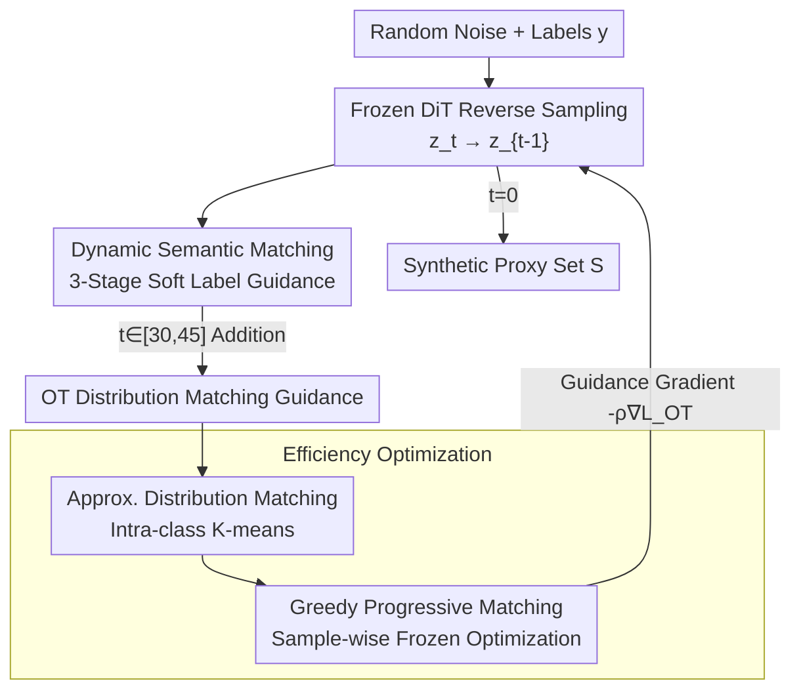

# DMGD: Train-Free Dataset Distillation with Semantic-Distribution Matching in Diffusion Models

**Conference**: CVPR 2026  
**Paper**: [CVF Open Access](https://openaccess.thecvf.com/content/CVPR2026/html/Wang_DMGD_Train-Free_Dataset_Distillation_with_Semantic_Distribution_Matching_in_Diffusion_Models_CVPR_2026_paper.html)  
**Code**: None (Not yet released)  
**Area**: Model Compression / Dataset Distillation  
**Keywords**: Dataset Distillation, Diffusion Models, Train-Free Guidance, Optimal Transport, Dynamic Soft Labels

## TL;DR
DMGD decouples "diffusion-based dataset distillation" into two independent objectives: semantic matching and distribution matching. It injects train-free guidance exclusively during the **sampling stage**. By utilizing dynamic soft labels to enhance diversity and Optimal Transport (OT) loss to align distribution structures, it outperforms fine-tuning-based SOTA methods on ImageNet-Woof/Nette/1K by an average of 2.1%/5.4%/2.4%.

## Background & Motivation

**Background**: Dataset distillation aims to compress a massive dataset $T$ into a tiny synthetic proxy set $S$ ($N_T \gg N_S$), such that models trained only on $S$ achieve performance close to those trained on the full set $T$. Recently, diffusion models have become mainstream generators—either by sampling from pre-trained models or fine-tuning diffusion models (e.g., Minimax) on the target dataset.

**Limitations of Prior Work**: Diffusion-based methods suffer from two common flaws. First, **most require additional fine-tuning**: Minimax requires fine-tuning on the target set, and IGD requires training classifier trajectories, undermining the goal of saving computation. Second, **guidance mechanisms are coarse**: Methods like D4M and MGD3 rely on "mode points" found via clustering to control generation. However, cluster centers may overemphasize ineffective patterns (adjacent centers or outliers), disrupting structural alignment and ignoring inter-sample relationships, which leads to insufficient diversity.

**Key Challenge**: Prioritizing semantic alignment via hard-label conditional optimization pushes diffusion outputs into **high-density regions of the conditional distribution**, sacrificing diversity. Conversely, aligning distribution structures necessitates expensive Optimal Transport calculations. Balancing semantic alignment with diversity, and alignment accuracy with computational overhead, creates persistent tension.

**Goal**: Design sampling-period guidance objectives without **any additional training**, enabling the diffusion model to maintain both semantic alignment and the complete structure of the target distribution.

**Key Insight**: The authors prove Theorem 1—given semantic alignment, the **Optimal Transport distance between the proxy and target sets upper-bounds their risk difference**: $|R_T(\theta_T^*) - R_T(\theta_S^*)| \le 2L \cdot W(P_T, P_S)$. This inequality naturally decouples the distillation objective: first ensure semantic alignment (no class mixing), then minimize the OT distance (distribution alignment).

**Core Idea**: Decouple dataset distillation into "Semantic Matching + Distribution Matching" as independent train-free guidance objectives injected during sampling. Semantic matching uses dynamic soft labels for diversity, while distribution matching uses OT loss for structural alignment, supported by two approximation strategies to keep OT computation efficient.

## Method

### Overall Architecture

DMGD (Dual Matching Guided Diffusion) takes random noise and class labels as input to generate a synthetic proxy set. It keeps diffusion weights frozen and overlays guidance gradients on each reverse sampling step $z_t \to z_{t-1}$ of a pre-trained DiT. A single guided sampling step is formulated as $z_{t-1} = D_\theta(z_t, t, y) - \rho_t \nabla_{z_t} E(z_t, c)$, where $D_\theta$ is the frozen denoising DiT and $E$ is the differentiable guidance energy. DMGD integrates two guidance paths: **Semantic Matching** runs throughout to ensure correct and diverse semantics, while **Distribution Matching** intervenes only during the $t \in [30, 45]$ window to pull the synthetic set toward the target distribution structure.

### Key Designs

**1. Dynamic Semantic Matching: Balancing Alignment and Diversity via Time-Varying Soft Labels**

Guidance based solely on sample dimensions can be overwhelmed by redundant info. Borrowing from Classifier-Free Guidance (CFG), semantic alignment can be achieved without an external classifier. Per Lemma 1: $\nabla_{z_t} \log p(y|z_t) \approx \omega\big(\epsilon_\theta(z_t, t, \varnothing) - \epsilon_\theta(z_t, t, y)\big)$. However, hard-label CFG traps outputs in high-density regions. Thus, the authors switch to **dynamic guidance across three stages**: Random Exploration ($t \ge 45$), Dynamic Soft Label Guidance ($t \in [25, 45]$), and Semantic Refinement ($t \le 25$).

The core is a soft label vector constructed via a **label diffusion process**:

$$\tilde f_Y(y) = \sqrt{\sigma_t}\, f_Y(y) + (1 - \sqrt{\sigma_t})\big(\beta_s f_Y(y^\star) + \beta_n n\big)$$

Where $y^\star$ is a **randomly selected label from another class** (pushing samples toward boundaries to generate informative "hard" samples), $n$ is anisotropic Gaussian noise (helping exploration), and $\sigma_t$ is the schedule. Proposition 1 provides theoretical support: perturbing the label by $\delta_t$ is equivalent to injecting a controllable displacement $\Lambda_t(\delta_t)$ into the sampling dynamics, expanding coverage.

**2. OT Distribution Matching Guidance: Aligning Structural Relationships**

Traditional distribution matching (e.g., mean matching) aligns only feature means, ignoring structural relationships. DMGD optimizes the Optimal Transport distance $\arg\min_S \min_{\gamma} \sum_{i,j} \gamma_{ij} C_{ij}$ using Euclidean cost $C_{ij}$ in the latent space. It uses the **Sinkhorn algorithm** to solve entropy-regularized OT, yielding the guidance loss $L_{OT}(P_S^t, P_T) = W_\varepsilon(P_S^t, P_T) = \langle \gamma^*, C\rangle$. The train-free guidance gradient $z_{t-1}^i = D_\theta(z_t^i) - \rho_t \nabla_{z_t^i}\sum_j \gamma_{ij}^* C_{ij}$ pushes each synthetic sample toward "uncovered regions" of the target distribution.

**3. Distribution Approximation: Scalable OT via Intra-class K-means**

Calculating OT on massive target sets is computationally prohibitive. Corollary 1 states that if an approximate distribution $\tilde P_T$ satisfies $W(\tilde P_T, P_T) \le \epsilon$, the risk difference is bounded. The authors solve this **optimal quantization** problem using **intra-class K-means**: clustering a class subset and using cluster centers $k_i$ as support points and cluster size ratios as mass coefficients $m_i$:

$$\tilde P_T = \sum_{i=1}^{K} m_i \delta_{k_i}, \quad m_i = \frac{c_i}{\sum_{j} c_j}$$

Proposition 2 proves this is **strictly superior to mean matching** ($K=1$ case). Clustering captures fine-grained modes, taking only 0.03s per class.

**4. Greedy Progressive Matching: Overcoming Memory Constraints**

At high IPC (Images Per Class), joint optimization of all samples hits a memory wall. Ours uses a **Greedy Progressive** framework: when optimizing the $i$-th sample $z^i$, **all $j < i$ samples are frozen**. The objective becomes aligning the partially optimized distribution $P_{S_t[i]}$. This ensures only one sample is optimized at a time while forcing the current sample to fill gaps left by previous ones, preventing collapse to the mean.

### Loss & Training

DMGD **trains nothing**. All "losses" are guidance energies injected via $-\rho_t \nabla_{z_t}(\cdot)$ into the frozen DiT. Key hyperparams: CFG scale $1+\omega=4$, soft label coefficients $\beta_n=0.06$, $\beta_s=0.01$; $K=10$ support points, guidance $\rho=0.05$ to $0.5$, applying only for $t \in [30, 45]$. Sinkhorn uses $\varepsilon=0.1$ and 5 iterations. Experiments were conducted on an RTX 4090.

## Key Experimental Results

### Main Results

ImageNet subsets (hard-label protocol, ResNet10-AP Top-1 acc). DMGD acts as plug-and-play guidance for DiT or Minimax:

| Dataset | IPC | DiT Baseline | MGD3 (Prev. SOTA) | DiT + Ours | Minimax + Ours |
| :--- | :--- | :--- | :--- | :--- | :--- |
| ImageNet-Woof | 10 | 34.7 | 40.4 | 40.8 | **42.4** |
| ImageNet-Woof | 50 | 49.3 | 56.5 | 60.1 | **60.8** |
| ImageNet-Nette | 10 | 59.1 | 66.4 | 68.4 | **68.7** |
| ImageNet-Nette | 50 | 73.3 | 79.5 | 80.6 | **80.7** |

Gain over baseline reaches +10.8% (Woof IPC-50). On ImageNet-1K (soft-label), it reaches 46.3% at IPC-10 on ResNet-18 (+4.3% over RDED).

### Ablation Study

Component ablation (ResNet10-AP Top-1; SM=Semantic Matching, DM=OT Distribution Matching):

| SM | DM | Woof IPC-10 | Woof IPC-50 | Nette IPC-10 | Nette IPC-50 |
| :--- | :--- | :--- | :--- | :--- | :--- |
| - | - | 34.7 | 49.3 | 59.1 | 73.3 |
| ✓ | - | 38.9 | 59.3 | 67.1 | 79.7 |
| - | ✓ | 41.6 | 56.8 | 66.8 | 76.7 |
| ✓ | ✓ | 40.8 | **60.1** | 68.4 | **80.6** |

### Key Findings

- **Guidance Roles Shift with IPC**: At high IPC, Semantic Matching (SM) drives diversity and larger gains. At low IPC, Distribution Matching (DM) is more critical because aligning key distribution structures is more valuable than expansion when sample counts are limited.
- **Zero Additional Training Overhead**: Distribution approximation takes 0.03s per class. Generating Woof IPC-50 takes 0.26h; whereas Minimax requires nearly 0.7h for fine-tuning alone.
- **Sensitivity**: $K=10$ provides the best performance/efficiency trade-off.

## Highlights & Insights

- **Theoretic Decoupling**: Theorem 1 provides a rigorous justification for the "Semantic + Distribution" decoupling based on the OT upper bound of risk difference.
- **Diffusion as Zero-Shot Classifier**: Utilizing CFG gradients to bypass external classifier training is a portable trick for any conditional diffusion task.
- **Soft Labels as Displacement**: Proposition 1 transforms "label perturbation" into a steerable displacement operator $\Lambda_t(\delta_t)$, turning diversity into a designable vector.
- **Greedy Efficiency**: The progressive freezing framework elegantly avoids the memory wall of multi-sample diffusion optimization.

## Limitations & Future Work

- **Threshold Sensitivity**: The logic relies on empirical time windows (e.g., $t \in [30, 45]$) which may require tuning for different backends or samplers.
- **Guidance Interference**: At extremely low IPC, SM and DM can slightly conflict (e.g., Woof IPC-10 full vs. DM-only).
- **Code Availability**: Official code has not been released, and many proofs reside in the appendix.

## Related Work & Insights

- **vs. Minimax**: Minimax fine-tunes the diffusion model; DMGD is train-free. They are orthogonal and can be combined for further gains.
- **vs. MGD3 / D4M**: These use isolated mode points; DMGD aligns the entire distribution structure using OT and mass coefficients, leading to better coverage.
- **vs. Mean Matching**: Mean matching is a degenerate case ($K=1$) of DMGD's K-means approximation. Proposition 2 proves the latter is strictly more accurate.

## Rating
- Novelty: ⭐⭐⭐⭐⭐ (Strong theoretical decoupling and train-free execution).
- Experimental Thoroughness: ⭐⭐⭐⭐ (Extensive evaluations, but code is pending).
- Writing Quality: ⭐⭐⭐⭐ (Clear motivation and derivation).
- Value: ⭐⭐⭐⭐⭐ (Highly practical for resource-constrained distillation).

<!-- RELATED:START -->

## Related Papers

- [\[CVPR 2026\] Mitigating The Distribution Shift of Diffusion-based Dataset Distillation](mitigating_the_distribution_shift_of_diffusion-based_dataset_distillation.md)
- [\[CVPR 2026\] Dataset Distillation by Influence Matching](dataset_distillation_by_influence_matching.md)
- [\[CVPR 2026\] IMS3: Breaking Distributional Aggregation in Diffusion-Based Dataset Distillation](ims3_breaking_distributional_aggregation_in_diffusion-based_dataset_distillation.md)
- [\[CVPR 2026\] Beyond Soft Label: Dataset Distillation via Orthogonal Gradient Matching](beyond_soft_label_dataset_distillation_via_orthogonal_gradient_matching.md)
- [\[CVPR 2026\] Balanced Dataset Distillation via Modeling Multiple Visual Pattern Distribution](balanced_dataset_distillation_via_modeling_multiple_visual_pattern_distribution.md)

<!-- RELATED:END -->
