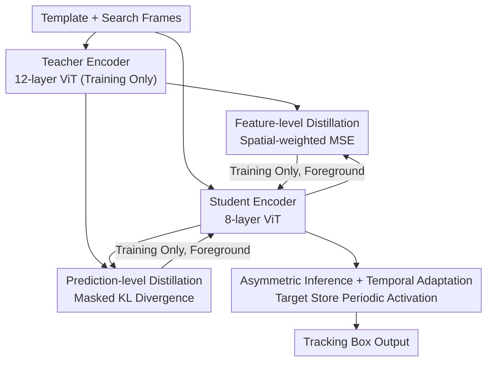

# Dual-branch Distilled Transformer for Efficient Asymmetric UAV Tracking

**Conference**: CVPR 2026  
**Paper**: [CVF Open Access](https://openaccess.thecvf.com/content/CVPR2026/html/Yang_Dual-branch_Distilled_Transformer_for_Efficient_Asymmetric_UAV_Tracking_CVPR_2026_paper.html)  
**Code**: Undisclosed  
**Area**: Model Compression / Knowledge Distillation / Visual Tracking  
**Keywords**: UAV Tracking, Knowledge Distillation, Lightweight Transformer, Asymmetric Inference, Real-time Tracking  

## TL;DR
EATrack utilizes a full-scale 12-layer ViT teacher to distill target representation and localization capabilities into an 8-layer lightweight student through "feature-level + prediction-level" dual-branch distillation focused solely on target regions. Combined with asymmetric inference and temporal adaptation, it achieves a 1.2% higher average success rate than previous SOTA methods on five UAV benchmarks while running at 241.9 FPS.

## Background & Motivation
**Background**: Unmanned Aerial Vehicle (UAV) tracking requires real-time performance under constraints of extremely limited onboard compute and scenes filled with fast motion, frequent occlusions, viewpoint changes, and small targets. Leading lightweight approaches simplify ViT backbones—Aba-ViTrack discards background tokens, AVTrack conditionally activates modules based on input complexity, and SGLATrack prunes redundant blocks via inter-layer similarity.

**Limitations of Prior Work**: While these "structural simplifications" reduce FLOPs, they weaken feature propagation across layers, leading to degraded target representations and significantly lower localization precision in complex dynamic scenes. In Fig. 1, the authors quantify this: the layer-wise feature cosine similarity between a non-distilled student and the teacher drops sharply in layers where supervision is pruned (e.g., from 90%+ to 49% in certain layers), causing targets to drift.

**Key Challenge**: A trade-off exists between lightweighting (reducing layers) and discriminative power (strong representation + precise localization)—simply compressing the structure inherently damages representations.

**Goal**: Enable a structurally pruned ViT student to recover target representation and localization capabilities near those of a full-scale teacher **without increasing any inference overhead**.

**Key Insight**: Since simplification degrades "representation quality," knowledge distillation can be used during training to "replenish" the teacher's strong representations. A critical observation is that UAV scenes have cluttered backgrounds; global distillation (e.g., ORTrack’s Adaptive Feature Distillation, AFKD) transfers background noise to the capacity-limited student, distracting its attention. Therefore, supervision must **focus exclusively on target regions**.

**Core Idea**: A "target-aware dual-branch distillation" is proposed—spatial-weighted feature distillation for representation replenishment and masked prediction distillation for localization refinement. Both branches are complementary, apply supervision only to foreground regions, are active only during training, and incur zero cost during inference.

## Method

### Overall Architecture
EATrack decouples training and inference into two structures, reflecting the "asymmetric" nature mentioned in its name: **During training**, a 12-layer full-scale ViT teacher and an 8-layer lightweight student perform forward passes in parallel. The teacher transfers knowledge to the student through two distillation branches (feature-level and prediction-level) and is discarded after training. **During inference**, only the student operates independently. The template and search branches are split into Stage 1 (independent encoding) and Stage 2 (joint modeling), integrated with an ultra-low-cost temporal adaptation module (Target Store + periodic activation). The distillation branches vanish completely during inference, ensuring "representation replenishment" adds no computational cost.

The teacher and student share the same patch embedding and tokenization, differing only in layer counts ($L=12$ vs $L'=8$). This layer-wise correspondence allows for direct alignment of their feature spaces, which is a prerequisite for distillation.

### Key Designs

**1. Feature-level Distillation: Replenishing Foreground Representations via Spatial-weighted MSE**

To address the student's inability to distinguish targets in cluttered backgrounds, the authors eschew full-image feature alignment. Instead, they calculate a spatial weight mask $M_i$ based on ground-truth boxes for each training sample—activating target regions and suppressing background. This mask is applied to both teacher and student features, forcing the distillation loss to focus on foreground tokens:

$$L_{feat} = \frac{1}{KB}\sum_{k=1}^{K}\sum_{i=1}^{B}\left\| M_i \cdot x_i^k - M_i \cdot y_i^k \right\|_2^2$$

where $x_i$ and $y_i$ represent student and teacher features, $K$ is the number of distilled layers, and $B$ is the batch size. This concentrates the student's limited capacity on "truly important target areas" without dilution by background noise—distinguishing it from ORTrack’s global AFKD, which adjusts distillation intensity by sample difficulty but ignores spatial priors. Notably, due to the asymmetric structure, feature-level distillation is applied only in Stage 2 (joint modeling) to ensure structural compatibility and alignment effectiveness.

**2. Prediction-level Distillation: Aligning Confidence Distributions via Masked KL Divergence**

While feature-level distillation restores "representation fidelity," precise tracking requires "localization capability." A prediction-level branch is added: student and teacher confidence maps are converted into probability distributions via temperature-scaled softmax. Using a binary mask $m_{i,j}\in\{0,1\}$ derived from ground-truth boxes, KL divergence is calculated **strictly within target regions**:

$$L_{pred} = \frac{1}{B}\sum_{i=1}^{B}\frac{\sum_j m_{i,j}\cdot \mathrm{KL}(p_{s,i,j}\,\|\,p_{t,i,j})}{\sum_j m_{i,j}}$$

where $p_{s,i,j}$ and $p_{t,i,j}$ are the predicted probabilities at position $j$. This compels the student to replicate the teacher's localization behavior (confidence distribution and boundary consistency) in "critical regions" rather than blindly mimicking the teacher’s full-map output.

**3. Asymmetric Inference + Temporal Adaptation: Target Store with Periodic Activation**

Distillation ensures "strong static representations," but UAV targets change drastically over time. During inference, Stage 1 (feature extraction) and Stage 2 (joint modeling) are decoupled. To save computation, **Stage 1 template encoding runs only during initialization and periodic updates**. Temporal adaptation is handled by a Target Store: when prediction confidence exceeds a threshold, the target feature is stored. At fixed intervals, representative embeddings are sampled from the Store and fused with the original template via "periodic activation" to refresh the model's target understanding. This mechanism allows the pruned Transformer to track dynamics with negligible overhead.

### Loss & Training
The total loss combines standard tracking objectives with two distillation terms: focal loss for classification, L1 + GIoU for box regression, and the distillation losses:

$$L = L_{cls} + \lambda_1 L_1 + \lambda_2 L_{GIoU} + \lambda_3 L_{feat} + \lambda_4 L_{pred}$$

Coefficients are set to $\lambda_1=5, \lambda_2=2, \lambda_3=1, \lambda_4=1$. Training uses a combination of GOT-10k, LaSOT, COCO, and TrackingNet with "two templates + one search frame" triplets. The setup involves 4×A800 GPUs, total batch size 128, AdamW optimizer, and 300 epochs (learning rate decays tenfold after 240). The teacher utilizes a distilled DeiT-tiny from OSTrack, trained once offline.

## Key Experimental Results

### Main Results
On five UAV benchmarks, EATrack-DeiT ranks first in both precision and success (selected comparisons):

| Method | Conference | UAV123 Succ. | UAV123@10fps Succ. | VisDrone Succ. | Avg. Prec. | Avg. Succ. |
|------|------|------|------|------|------|------|
| AVTrack-DeiT | ICML 24 | 66.8 | 65.8 | 65.3 | 84.1 | 64.4 |
| ORTrack-D-DeiT | CVPR 25 | 66.1 | 63.7 | 63.9 | 83.7 | 63.7 |
| SGLATrack-DeiT | CVPR 25 | 66.9 | 65.5 | 61.3 | 82.8 | 63.7 |
| EATrack-ViT | Ours | 66.9 | 66.7 | 65.0 | 85.1 | 64.9 |
| **EATrack-DeiT** | Ours | **68.1** | **67.4** | **65.6** | **85.5** | **65.6** |

Average success rate is ~1.2% higher than Prev. SOTA. Speed/Complexity comparison (A100 hardware):

| Method | UAV123 Succ. | GPU FPS | CPU FPS | TX2 FPS | Params(M) | FLOPs(G) |
|------|------|------|------|------|------|------|
| ORTrack | 66.4 | 211.8 | 80.3 | 26.7 | 7.97 | 2.39 |
| SGLATrack | 66.9 | 222.8 | 87.6 | 29.2 | 5.81 | 1.68 |
| **EATrack** | **68.1** | **241.9** | **97.4** | **33.6** | 6.20 | 1.87 |

EATrack leads in precision while maintaining the highest speed, achieving 33.6 FPS on Jetson TX2 without TensorRT.

### Ablation Study

Distillation Branches (UAV123):

| Config | Feature-lvl | Pred-lvl | Prec. | Succ. |
|------|------|------|------|------|
| #1 No Distillation | ✗ | ✗ | 86.9 | 66.1 |
| #2 | ✓ | ✗ | 87.6 (+0.7) | 67.0 (+0.9) |
| #3 Complete | ✓ | ✓ | 89.0 (+1.4) | 68.1 (+1.1) |

Temporal Cues (Succ. by Dataset):

| Config | DTB70 | UAVDT | VisDrone | UAV123 |
|------|------|------|------|------|
| W/o Temporal | 63.3 | 56.6 | 59.8 | 68.1 |
| W/ Temporal | 66.5 (+3.2) | 60.2 (+3.6) | 65.6 (+5.8) | 68.1 (+0.0) |

### Key Findings
- **Prediction-level distillation is the critical Gain**: Adding feature-level distillation yields +0.7/+0.9, but adding prediction-level distillation boosts performance to +1.4/+1.1. This suggests "localization replenishment" is more impactful than "representation replenishment."
- **Temporal cues solve dynamic scenes**: Gains of +5.8% on VisDrone (occlusion) and +3.2% on DTB70 (fast motion) show the module is "harmless gain"—it works when needed and maintains performance elsewhere.
- **Student can outperform Teacher**: The teacher's average Succ. (63.0) is lower than some EATrack student results, likely because the teacher lacks temporal adaptation. This proves the "Distillation + Temporal" combination allows students to exceed static teachers in dynamic scenes.

## Highlights & Insights
- **"Distilling only foreground" is the Core Insight**: Multiplying spatial masks into features and predictions forces supervision onto target regions. This directly addresses the pain point of cluttered backgrounds and limited student capacity.
- **Asymmetric design (training cost, inference gain) is elegant**: Dual-branch distillation applies only during training. The teacher and distillation logic disappear during inference, meaning Gain and Speed are not mutually exclusive—this is the cleanest decoupling for real-time tasks.
- **Target Store periodic activation is a cost-effective temporal solution**: By filtering reliable features and merging them at intervals while keeping Stage 1 template encoding idle, temporal robustness is achieved with near-zero overhead.

## Limitations & Future Work
- **Dependency on a pre-trained full-scale teacher**: The method is "Teacher → Student" distillation; student performance is capped by the teacher's quality. Feature-level distillation is also restricted to Stage 2 due to structural asymmetry.
- **Ground-truth dependent masking**: Spatial masks depend on GT boxes during training. Supervision quality is thus bound to annotation precision.
- **Fixed hyperparameters for temporal module**: Thresholds and intervals are manually set; adaptive parameter tuning could further improve performance in dynamic scenarios.
- **Code availability**: Code is not yet open-source as of this note; reproduction requires following the paper's specific mask constructions and temperature coefficients. ⚠️

## Related Work & Insights
- **vs ORTrack (CVPR 25)**: ORTrack uses global AFKD to adjust intensity based on sample difficulty but ignores spatial priors. This work locks supervision into foreground regions and adds prediction distillation, outperforming ORTrack on UAV123 (68.1 vs 66.4 Succ.).
- **vs Structural Pruning (SGLATrack / AVTrack)**: These methods speed up by dropping tokens/layers, which weakens representations. EATrack accepts the "cut structure" but uses KD to replenish representations during training, resulting in better accuracy and higher speed (241.9 FPS).
- **vs Classic KD**: Traditional KD often uses full-map alignment for classification. This work specializes KD for tracking by focusing on the "target region" prior.

## Rating
- Novelty: ⭐⭐⭐⭐ Target-aware masked distillation is a focused innovation for UAV tracking, though individual components have precedents.
- Experimental Thoroughness: ⭐⭐⭐⭐⭐ Solid results across five benchmarks, multiple hardware platforms, and four sets of ablation studies.
- Writing Quality: ⭐⭐⭐⭐ Motivation is clear; formulas align well with ablations.
- Value: ⭐⭐⭐⭐ High practical value; the 33.6 FPS on TX2 demonstrates real-world deployment potential.

<!-- RELATED:START -->

## Related Papers

- [\[CVPR 2026\] DAGE: Dual-Stream Architecture for Efficient and Fine-Grained Geometry Estimation](dage_dual-stream_architecture_for_efficient_and_fine-grained_geometry_estimation.md)
- [\[CVPR 2026\] Memory-Efficient Transfer Learning with Fading Side Networks via Masked Dual Path Distillation](memory_efficient_transfer_learning_with_fading_side_networks.md)
- [\[CVPR 2026\] Adaptive Depth Lightweight RGB-T Tracking with Holistic Token Routing](adaptive_depth_lightweight_rgb-t_tracking_with_holistic_token_routing.md)
- [\[CVPR 2026\] LoPrune: Efficient Data Pruning for LoRA-Based Fine-Tuning of Vision Transformer](loprune_efficient_data_pruning_for_lora-based_fine-tuning_of_vision_transformer.md)
- [\[CVPR 2026\] ThinkingViT: Matryoshka Thinking Vision Transformer for Elastic Inference](thinkingvit_matryoshka_thinking_vision_transformer_for_elastic_inference.md)

<!-- RELATED:END -->
