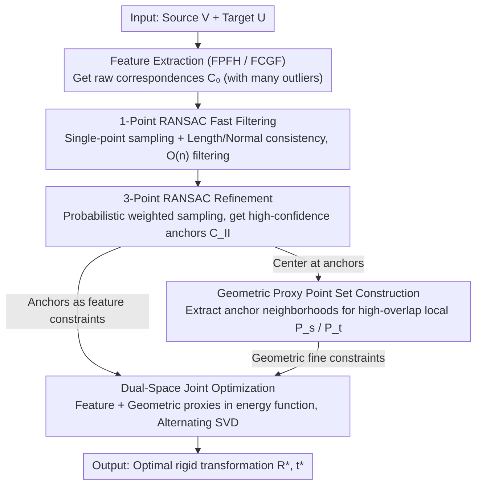

# DualReg: Dual-Space Filtering and Reinforcement for Rigid Registration

**Conference**: CVPR 2026  
**arXiv**: [2508.17034](https://arxiv.org/abs/2508.17034)  
**Code**: [https://ustc3dv.github.io/DualReg/](https://ustc3dv.github.io/DualReg/) (Project page available)  
**Area**: Model Compression  
**Keywords**: Rigid registration, dual-space optimization, RANSAC, point cloud correspondence, geometric proxy

## TL;DR

DualReg proposes a dual-space registration paradigm that first uses lightweight 1-point RANSAC + 3-point RANSAC to progressively filter feature-space correspondences, and then constructs geometric proxy point sets based on filtered anchors for joint dual-space optimization. It achieves SOTA accuracy on 3DMatch while being 32x faster than MAC.

## Background & Motivation

Rigid registration aims to estimate the rigid transformation (rotation + translation) from a source point cloud to a target point cloud, widely applied in SLAM, robotics, 3D reconstruction, and AR/VR. Since point clouds usually have partial overlap and contain noise and outliers, robust and precise registration remains a challenge.

**Limitations of Prior Work**:
- **Feature Space Correspondence** (FPFH, FCGF, etc.): Global matching based on descriptor similarity can handle large transformation disparities, but the correspondence precision is limited, failing to achieve fine alignment.
- **Local Geometric Space Correspondence** (ICP and its variants): Local alignment based on nearest neighbor search in Euclidean space achieves high precision but relies heavily on initial transformation, easily falling into local optima under large disparities.

**Key Challenge**: The intuitive combination—coarse transformation via feature matching followed by ICP refinement—is suboptimal in low-overlap scenarios because neighborhood-based search in ICP introduces a large number of incorrect nearest points.

**Limitations of Prior Work**: Outlier removal methods like MAC significantly improve accuracy via maximal clique search but at a huge computational cost. TCF introduces 1-point RANSAC for acceleration but suffers from accuracy degradation. A solution that is both fast and accurate is required.

**Core Idea**: Instead of a sequential coarse-to-fine mode, the authors construct a **dual-space joint optimization framework**—incorporating filtered feature correspondences and dynamically established local geometric correspondences **simultaneously into the same objective function**, allowing both types of information to be complementary and synergistic.

## Method

### Overall Architecture

The **Key Challenge** DualReg addresses is that feature correspondences are robust to large transformations but lack precision, while geometric correspondences are precise but sensitive to initialization. Sequential "coarse-to-fine" pipelines fail in low-overlap scenarios. Its **Mechanism** is to integrate both types of correspondences into a single energy function for joint optimization. The pipeline consists of two stages: first, raw correspondences $\mathcal{C}_0$ from feature extraction (FPFH/FCGF) undergo two-level RANSAC filtering—1-point RANSAC quickly discards most outliers, and 3-point RANSAC refines them into high-confidence anchors $\mathcal{C}_{II}$. Then, local neighborhoods centered at these anchors are extracted as "geometric proxy point sets." Finally, feature correspondences and geometric proxies are optimized iteratively in a dual-space energy function to output the optimal rigid transformation $(R^*, t^*)$.

### Key Designs

**1. Lightweight 1-Point RANSAC Fast Filtering: Reducing outlier removal complexity from $\mathcal{O}(n^3)$ to $\mathcal{O}(n)$**

**Design Motivation**: MAC-style maximal clique search is accurate but extremely slow. DualReg's first pass uses a **single correspondence** as a sampling unit, reducing complexity to $\mathcal{O}(n)$. For each sampled correspondence $\mathbf{c}_j$, it defines a consistency set $\mathcal{I}(\mathbf{c}_j)$ of geometrically compatible correspondences:

$$\mathcal{I}(\mathbf{c}_j) = \{\mathbf{c}_i \in \mathcal{C}_0 \mid D_L(\mathbf{c}_i, \mathbf{c}_j) < \tau \;\text{and}\; D_N(\mathbf{c}_i, \mathbf{c}_j) < \nu \}$$

where $D_L$ is length consistency and $D_N$ is normal consistency. The process maintains a cumulative confidence score for each correspondence, and the set with the highest score is selected. To handle cases where source and target points are symmetric relative to a plane (satisfying consistency but representing a reflection), SVD is used to detect and filter out reflection transformations. Compared to TCF, this method strengthens consistency definitions and sub-set selection.

**2. Probabilistic Weighted 3-Point RANSAC Refinement: Eliminating residuals with stricter transformation consistency**

1-point RANSAC may pass "locally compatible but globally inconsistent" outliers. The second stage uses 3-point RANSAC to apply stricter consistency checks via the unique rigid transformation determined by three points. It utilizes a dynamic Bayesian network to update inlier probabilities and performs weighted sampling, focusing the budget on likely inliers and significantly reducing invalid iterations.

**3. Geometric Proxy Point Set Construction: Circumventing ICP failure via high-overlap local "proxies"**

ICP fails in low-overlap scenarios due to incorrect nearest point retrieval across the entire point cloud. DualReg restricts geometric matching to the vicinity of anchors. For each anchor $\mathbf{c}_j = (\mathbf{v}_j, \mathbf{u}_j) \in \mathcal{C}_{II}$, points within radius $\beta$ in the source cloud form a proxy set:

$$\mathcal{P}^s_{\mathbf{c}_j} = \{\mathbf{v}_i \in \mathcal{V} \mid \|\mathbf{v}_i - \mathbf{v}_j\|_2 < \beta\}$$

Since anchors are reliable, these local regions exhibit **significantly higher overlap**, effectively transforming the "global low-overlap" problem into multiple "local high-overlap" sub-problems.

**4. Dual-Space Joint Optimization: Enabling simultaneous global constraints and local precision**

Instead of sequential use, reliable feature correspondences $\mathcal{C}_{II}$ and high-overlap geometric proxies $\mathcal{P}^s$ are combined into a joint energy:

$$E(\mathbf{R}, \mathbf{t}) = \frac{\lambda}{|\mathcal{C}_{II}|} \sum_{\mathbf{c}_j \in \mathcal{C}_{II}} w_j \|\mathbf{R}\mathbf{v}_j + \mathbf{t} - \mathbf{u}_j\|^2 + \frac{1}{|\mathcal{P}^s|} \sum_{\tilde{\mathbf{v}_i} \in \mathcal{P}^s} \tilde{w}_i \|\mathbf{R}\tilde{\mathbf{v}}_i + \mathbf{t} - \tilde{\mathbf{u}}_{\rho_i}\|^2$$

The first term provides global constraints via feature alignment, while the second term handles fine-grained alignment via geometric proxies. Robust weights $w_j, \tilde{w}_i$ are calculated using the Gaussian function $\exp(-\|e\|^2 / 2\sigma^2)$. Simultaneous optimization prevents the error accumulation typical of coarse-to-fine serial pipelines.

### Loss & Training

This is a non-learning method using an alternating optimization solver:
1. Fix transformation, update geometric correspondences $\{\rho_i\}$ via nearest neighbor search.
2. Fix correspondences and transformation, calculate robust weights via the Gaussian function.
3. Fix correspondences and weights, solve for the optimal rigid transformation via closed-form SVD.
- Convergence: $\|\mathbf{T}^{(k)} - \mathbf{T}^{(k-1)}\|_F < 0.001$ or maximum 200 iterations.

## Key Experimental Results

### Main Results

| Dataset | Metric | DualReg (FPFH) | MAC (FPFH) | MAC++ (FPFH) | Gain |
|--------|------|----------------|------------|--------------|------|
| 3DMatch | RR ↑ | 84.41% | 83.92% | 83.73% | +0.5% |
| 3DMatch | RMSE ↓ | 4.55cm | 4.94cm | 4.78cm | Best Precision |
| 3DMatch | RE ↓ | 1.75° | 2.11° | 2.11° | -17% |
| 3DMatch | Time ↓ | 0.14s | 2.10s | 4.28s | **15-30x Speedup** |
| 3DLoMatch | RMSE ↓ | 7.98cm | 9.18cm | 9.54cm | -13% |
| KITTI | RR ↑ | 98.20% | 97.48% | 98.02% | SOTA |
| KITTI | RMSE ↓ | 12.26cm | 15.57cm | 25.25cm | -21% |

### Ablation Study

| Configuration | 3DLoMatch RR/RMSE/Time | KITTI RR/RMSE/Time | Notes |
|------|------------------------|---------------------|------|
| Full Method | 41.7/7.98/0.11 | 98.2/12.26/0.12 | Optimal balance |
| w/o Fast Filtering | 29.1/7.31/0.68 | 84.0/12.81/0.78 | RR drops significantly, time increases 6x |
| w/o Refinement | 41.3/8.76/0.11 | 97.7/13.51/0.12 | Accuracy drops but speed maintained |
| w/o Dual-Space | 32.1/12.04/0.07 | 98.2/28.22/0.12 | RMSE spikes, severe accuracy degradation |
| w/o Anchors | 41.6/7.99/0.13 | 98.0/19.16/0.13 | Precision drops without feature constraints |
| w/o Geo-Proxy | 37.0/9.51/0.11 | 98.2/16.36/0.13 | Lacks geometric refinement |

### Key Findings

- **Dual-space synergy is crucial for precision**: Removing dual-space optimization caused KITTI RMSE to degrade from 12.26cm to 28.22cm, proving that filtered feature correspondences alone cannot achieve high precision.
- **Optimal speed-accuracy tradeoff**: DualReg completes 3DMatch registration in 0.14s on CPU, 15x faster than MAC and 30x faster than MAC++, with superior accuracy.
- **Robustness in low-overlap scenarios**: Achieves 7.98cm RMSE on 3DLoMatch (10%-30% overlap), outperforming all baseline methods.

## Highlights & Insights

1. **Precise Problem Modeling**: Recognizes the complementarity of feature and geometric spaces, formalizing it into a unified optimization objective rather than a simple coarse-to-fine pipeline.
2. **Clever 1-point RANSAC Improvements**: The introduction of normal consistency, cumulative scoring, and symmetry detection ensures high-quality filtering while maintaining extreme speed.
3. **Geometric Proxy Design**: The anchor neighborhood extraction serves as a bridge between matching and alignment, elegantly solving ICP's issues in low-overlap scenes.
4. **Pure CPU Implementation Competitive with GPU-based Approaches**: The C++ implementation of DualReg rivals learning methods that require GPUs in both speed and accuracy.

## Limitations & Future Work

- Dependent on the quality of initial feature descriptors—poor descriptors may result in insufficient inliers after filtering.
- Geometric proxy radius $\beta$ requires adjustment based on point cloud density.
- Currently supports rigid registration only; expansion to non-rigid scenes requires further consideration.
- Lacks a comparison involving joint use with the latest Transformer-based end-to-end registration methods (e.g., GeoTransformer).

## Related Work & Insights

- **MAC** [54]: Uses maximal clique search for accuracy but is computationally expensive; DualReg significantly reduces cost while maintaining precision.
- **TCF** [38]: First introduced 1-point RANSAC but suffered quality loss; DualReg compensates for this with improved consistency and dual-space optimization.
- **FRICP** [51]: Robust ICP using Welsch functions but still limited by initialization; DualReg's geometric proxy provides better initial conditions.
- **Insight**: The dual-space joint optimization concept can be extended to other global-local synergy tasks, such as scene flow estimation and non-rigid registration.

## Rating

- Novelty: ⭐⭐⭐⭐
- Experimental Thoroughness: ⭐⭐⭐⭐⭐
- Writing Quality: ⭐⭐⭐⭐
- Value: ⭐⭐⭐⭐

<!-- RELATED:START -->

## Related Papers

- [\[ACL 2026\] CBRS: Cognitive Blood Request System with Bilingual Dataset and Dual-Layer Filtering](../../ACL2026/model_compression/cbrs_cognitive_blood_request_system_with_bilingual_dataset_and_dual-layer_filter.md)
- [\[ICLR 2026\] Null-Space Filtering for Data-Free Continual Model Merging: Preserving Stability, Promoting Plasticity](../../ICLR2026/model_compression/null-space_filtering_for_data-free_continual_model_merging_preserving_stability_.md)
- [\[CVPR 2026\] Dual-branch Distilled Transformer for Efficient Asymmetric UAV Tracking](dual-branch_distilled_transformer_for_efficient_asymmetric_uav_tracking.md)
- [\[CVPR 2026\] DAGE: Dual-Stream Architecture for Efficient and Fine-Grained Geometry Estimation](dage_dual-stream_architecture_for_efficient_and_fine-grained_geometry_estimation.md)
- [\[CVPR 2026\] Memory-Efficient Transfer Learning with Fading Side Networks via Masked Dual Path Distillation](memory_efficient_transfer_learning_with_fading_side_networks.md)

<!-- RELATED:END -->
