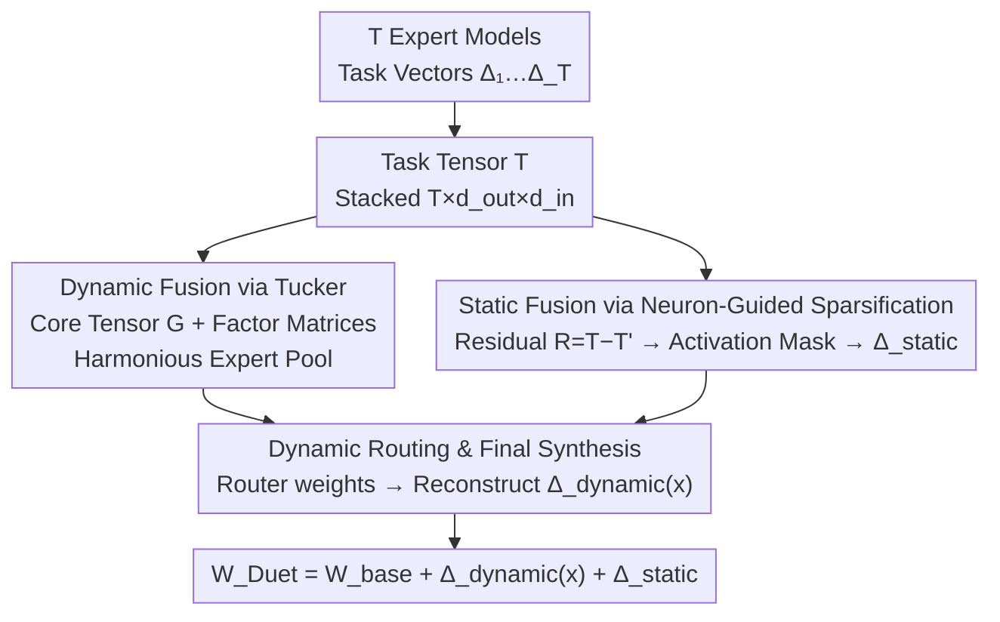

# DuetMerging: Synergizing Dynamic and Static Strategies for Mitigating Task Interference in Model Merging

**Conference**: CVPR 2026  
**Paper**: [CVF Open Access](https://openaccess.thecvf.com/content/CVPR2026/html/Li_DuetMerging_Synergizing_Dynamic_and_Static_Strategies_for_Mitigating_Task_Interference_CVPR_2026_paper.html)  
**Code**: None  
**Area**: Model Compression / Model Merging  
**Keywords**: Model Merging, Task Interference, Tucker Decomposition, Neuron Sparsification, MoE Routing

## TL;DR
DuetMerging stacks task vectors from multiple expert models into a 3D tensor and applies Tucker decomposition to derive a "shared core tensor"-driven dynamic expert pool for suppressing task conflicts. It further employs neuron activation-guided sparsification to "surgically" salvage task-specific knowledge from decomposition residuals as a static correction. This "dynamic-static duet" achieves SOTA performance on 8 image classification tasks (99.2% normalized accuracy on ViT-B/32).

## Background & Motivation
**Background**: Model merging aims to combine multiple fine-tuned expert models into a single multi-task model without accessing original training data or retraining. Mainstream approaches revolve around "task vectors" $\tau_t = \Theta_t - \Theta_0$ (fine-tuned weights minus pre-trained weights). Early methods like Task Arithmetic directly sum these vectors, while TIES-Merging and DARE introduce pruning and sign conflict resolution. Recent structural methods (TSV-M, Iso-CTS, WUDI) use SVD or subspace projection to decouple shared and task-specific information. Dynamic methods (WEMoE, Twin-Merging) leverage MoE principles, using a lightweight router to dynamically combine experts during inference.

**Limitations of Prior Work**: The core challenge remains **task interference**, where conflicting parameter updates between tasks lead to performance significantly lower than individual experts. Existing methods have two main pitfalls: (1) Static structural methods collapse into a fixed-parameter model, lacking input-adaptive capabilities for different task data; (2) Dynamic MoE-based methods, while adaptive, share a design flaw: **experts are constructed in isolation** (either treating a single task vector as an expert or applying SVD to task matrices independently).

**Key Challenge**: Constructing experts in isolation means using the same algebraic tools to handle both "shared cross-task capabilities" and "conflicting task parameters" without explicitly distinguishing between commonalities and differences. Consequently, the potential for positive knowledge transfer is wasted, and negative interference remains implicitly encoded within isolated modules.

**Goal**: To retain the input adaptability of dynamic routing while explicitly modeling high-order shared structures during the expert pool construction phase, without losing task-specific information inevitably discarded by low-rank approximation.

**Key Insight**: The authors elevate the perspective from "2D task matrices + SVD" to "3D task tensors + Tucker decomposition." By stacking all task matrices along a task dimension, they extract a **shared core tensor** using tensor decomposition. This allows all experts to be reconstructed from a common foundation, structurally enhancing synergy and suppressing conflicts at the source. Furthermore, they observe that FFN layers in pre-trained models exhibit **sparse activation and functional specialization** (Jaccard overlap of high-activation neuron sets for different tasks is < 20%), suggesting that neuron activation can signal the refinement of decomposition residuals.

**Core Idea**: The dynamic side uses Tucker decomposition to create a "harmonious expert pool," while the static side uses neuron activation masks to salvage task-specific knowledge from residuals. This "duet" alleviates task interference from both dynamic and static perspectives simultaneously.

## Method

### Overall Architecture
DuetMerging applies this fine-grained processing specifically to the **FFN layers** of transformers (modules like multi-head attention are merged using standard Task Arithmetic, as FFNs are where localized knowledge is stored). For each linear layer in the FFN, the final merged weight consists of three components:

$$W_{\text{Duet}}(x) = W_{\text{base}} + \Delta_{\text{dynamic}}(x) + \Delta_{\text{static}}$$

Where $W_{\text{base}}$ is the pre-trained base weight; $\Delta_{\text{dynamic}}(x)$ is the task matrix dynamically generated by a router based on input $x$ at inference time; and $\Delta_{\text{static}}$ is a pre-computed fixed static correction matrix used to compensate for information loss in low-rank decomposition. The pipeline consists of two stages: **Offline Construction** (stacking $T$ task matrices into a tensor → Tucker decomposition for shared core + factor matrices; calculating residuals → neuron mask sparsification → pooling for static correction) and **Online Inference** (routing for task weights → reconstructing the adaptive dynamic matrix via the core tensor → summation of the three terms).

### Key Designs

**1. Dynamic Fusion via Tucker Decomposition: Suppressing conflict at the source**

To address the flaw of "isolated expert construction," the authors stack task matrices $\{\Delta_1,\dots,\Delta_T\}$ (where $\Delta_t \in \mathbb{R}^{d_{out}\times d_{in}}$) along a new task dimension to form a third-order tensor $\mathcal{T} \in \mathbb{R}^{T\times d_{out}\times d_{in}}$. This preserves all task information before any lossy summation (like $\Delta_{TA}=\sum_t \Delta_t$). Tucker decomposition is then applied:

$$\mathcal{T}' = \mathcal{G} \times_1 U_{\text{task}} \times_2 U_{\text{out}} \times_3 U_{\text{in}}$$

The core tensor $\mathcal{G}\in\mathbb{R}^{r_t\times r_o\times r_i}$ models latent interactions between task, output, and input modes, while the orthogonal factor matrices $U_{\text{task}}, U_{\text{out}}, U_{\text{in}}$ serve as shared bases. Every task update is forced to reconstruct from this **common low-rank foundation**. Unlike SVD which decomposes tasks individually, Tucker extracts a latent subspace shared across all tasks, structurally enhancing synergy.

**2. Static Fusion via Neuron-Guided Sparsification: Surgical recovery of specific knowledge**

To mitigate the information loss inherent in low-rank Tucker decomposition, the authors target the residual tensor $\mathcal{R} = \mathcal{T} - \mathcal{T}'$. Instead of discarding residuals, they treat them as a repository of task-specific knowledge. Based on observations of **sparse activation** in ViT FFNs (only ~10% neurons activate for a domain) and **functional specialization** (low Jaccard similarity <20% between tasks), they generate a binary mask $M_t$ for each task $t$ based on the top-k% mean activation of neurons. This mask keeps only the weights connected to "critical neurons for that task":

$$R'_t = R_t \odot M_t$$

This step cleanses functional-irrelevant or conflicting parameters while preserving key task-specific information. These are averaged into a single static correction matrix $\Delta_{\text{static}} = \text{Avg}(\text{Scale}(R'_t))$.

**3. Dynamic Routing and Final Synthesis: Input-adaptive reconstruction**

A lightweight router $R(\cdot)$ processes input representations to output task weights $w(x)\in\mathbb{R}^T$. The router is trained on a small amount of unlabeled data using multi-task entropy loss. The input-adaptive task representation is calculated as $u_{\text{task}}(x) = U_{\text{task}}^\top w(x)$, and the dynamic matrix is reconstructed using the core tensor:

$$\Delta_{\text{dynamic}}(x) = \sum_{j,k,l}\big(\mathcal{G}_{jkl}\cdot u_{\text{task}}(x)_j\big)\cdot (U_{\text{out}})_k \cdot (U_{\text{in}})_l^\top$$

The final weights are $W_{\text{Duet}}(x) = W_{\text{base}} + \Delta_{\text{dynamic}}(x) + \Delta_{\text{static}}$.

### Loss & Training
The method is largely training-free. Tucker decomposition and neuron masking are algebraic operations on existing weights. Only the lightweight router is optimized on small-scale unlabeled data using multi-task entropy loss. Key hyperparameters include the top-k% mask threshold and Tucker ranks $(r_t, r_o, r_i)$, which control the parameter budget.

## Key Experimental Results

### Main Results
Evaluated on 8 image classification datasets using ViT-B/32 and ViT-L/14. Metrics include average Accuracy (Acc.) and average Normalized Accuracy (N. Acc.).

| Model / Method | ViT-B/32 Acc. | ViT-B/32 N.Acc. | ViT-L/14 Acc. | ViT-L/14 N.Acc. |
|------|------|------|------|------|
| Individual (Upper Bound) | 90.5 | 100 | 94.1 | 100 |
| Task Arithmetic | 69.0 | 75.6 | 84.4 | 89.4 |
| TIES-Merging | 72.8 | 80.3 | 84.5 | 89.6 |
| Iso-Merging | 83.1 | 91.7 | 92.7 | 98.5 |
| WUDI-merging | 85.2 | 93.9 | 92.6 | 98.3 |
| SMILE | 89.3 | 98.6 | 93.6 | 99.5 |
| WEMoE (Strong Baseline) | 89.4 | 98.7 | 93.6 | 99.5 |
| **DuetMerging (Ours)** | **89.8** | **99.2** | **93.8** | **99.7** |

On ViT-B/32, DuetMerging's 99.2% N. Acc. outperforms WEMoE and even the fully supervised Multi-Task model (98.3%). It almost closes the gap with individual experts on ViT-L/14.

### Ablation Study
(Table 3) Removing core components under fixed parameter budgets:

| Configuration | ViT-B/32 | ViT-L/14 | Description |
|------|---------|---------|------|
| Static + Dynamic (Full) | 89.8 | 93.8 | Complete model |
| Dynamic Only (No Static) | 89.2 (−0.6) | 93.3 (−0.5) | Confirms loss in Tucker; static correction recovers it |
| None (Isolated SVD) | 87.7 (−2.1) | 92.1 (−1.7) | Major drop when replacing Tucker with independent SVD |

Plug-and-play capability of Neuron Sparsification (Table 4):

| Method | Acc. | + Neuron Sparsification | Gain |
|------|------|------|---|
| Task Arithmetic | 69.0 | 75.5 | +6.5 |
| TIES-Merging | 72.8 | 75.1 | +2.3 |

### Key Findings
- **Dynamic Tucker is the primary contributor**: Replacing it with isolated SVD causes a 2.1% drop, validating the hypothesis that modeling high-order shared structures is superior to independent processing.
- **Static correction is a valuable refinement**: The 0.5-0.6% gain shows neuron-guided sparsification recovers crucial task-specific information from residuals.
- **Neuron sparsification is plug-and-play**: Adding it to Task Arithmetic yields a +6.5% gain, proving it is a universal "surgical conflict-removal" module.
- **Parametric efficiency**: DuetMerging maintains high accuracy even at low parameter budgets compared to WEMoE.

## Highlights & Insights
- **Elevating SVD to Tucker**: Moving from 2D to 3D allows the explicit factorization of a latent subspace shared by all tasks, solving the "isolated construction" issue of previous MoE-merging methods.
- **Residuals as Knowledge**: Instead of treating residuals as noise, the authors demonstrate they house high-frequency task-specific data, accessible via neuron activation signals.
- **Complementarity**: The dynamic side manages "sharing and adaptation" while the static side "recovers lost specifics," a design applicable to any lossy model compression/distillation scenario.

## Limitations & Future Work
- **Domain Scope**: Experiments focus on 8 classification tasks with ViT; performance on heterogenous tasks (LLMs, detection) remains to be verified.
- **Data Dependency**: Neuron activation profiling requires unlabeled in-domain data, which might limit its use in purely data-free scenarios.
- **Hyperparameter Sensitivity**: Selection of Tucker ranks and mask thresholds requires manual tuning; an automated selection strategy was not reported.

## Related Work & Insights
- **vs Twin-Merging / TSV-M**: They apply SVD to individual task matrices. DuetMerging uses Tucker on a task tensor, modeling high-order interactions at the source.
- **vs WEMoE / SMILE**: While both use routers, WEMoE uses full task vectors (high overhead). DuetMerging reconstructs experts from a shared core, proving more "harmonious" and parameter-efficient.
- **vs TIES / DARE**: Instead of heuristic magnitude-based pruning, DuetMerging uses neuron activation as a functional signal specifically to filter decomposition residuals.

## Rating
- Novelty: ⭐⭐⭐⭐⭐ (Elevation to Tucker decomposition and neuron-guided refinement)
- Experimental Thoroughness: ⭐⭐⭐⭐ (Solid across two scales and five sub-tests, though task types are limited)
- Writing Quality: ⭐⭐⭐⭐⭐ (Clear motivation and consistent dynamic-static narrative)
- Value: ⭐⭐⭐⭐ (SOTA performance and plug-and-play modules)

<!-- RELATED:START -->

## Related Papers

- [\[CVPR 2025\] Task Singular Vectors: Reducing Task Interference in Model Merging](../../CVPR2025/model_compression/task_singular_vectors_reducing_task_interference_in_model_merging.md)
- [\[ACL 2025\] Unraveling LoRA Interference: Orthogonal Subspaces for Robust Model Merging](../../ACL2025/model_compression/osrm_lora_merging_orthogonal.md)
- [\[CVPR 2026\] Bridging Domains through Subspace-Aware Model Merging](bridging_domains_through_subspace-aware_model_merging.md)
- [\[ICML 2026\] Decomposing the Basic Abilities of Large Language Models: Mitigating Cross-Task Interference in Multi-Task Instruct-Tuning](../../ICML2026/model_compression/decomposing_the_basic_abilities_of_large_language_models_mitigating_cross-task_i.md)
- [\[CVPR 2026\] Understanding and Enforcing Weight Disentanglement in Task Arithmetic](understanding_and_enforcing_weight_disentanglement_in_task_arithmetic.md)

<!-- RELATED:END -->
