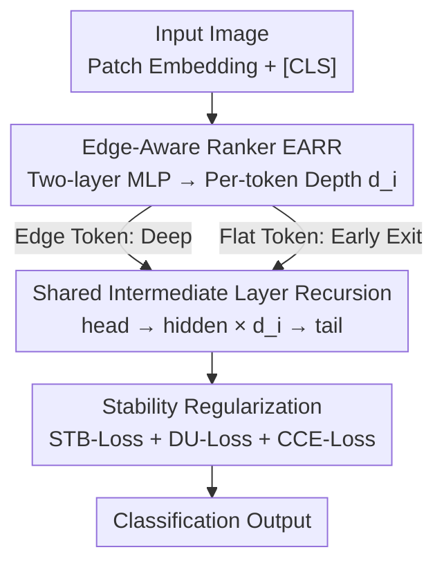

# Edge-RecViT: Efficient Vision Transformer via Semantic-Refined Dynamic Recursion

**Conference**: CVPR 2026  
**Paper**: [CVF Open Access](https://openaccess.thecvf.com/content/CVPR2026/html/Li_Edge-RecViT_Efficient_Vision_Transformer_via_Semantic-Refined_Dynamic_Recursion_CVPR_2026_paper.html)  
**Code**: https://github.com/RicardoLee510520/Edge-RecViT  
**Area**: Model Compression  
**Keywords**: Efficient ViT, Dynamic Depth, Parameter Sharing, Recursive Transformer, Token Adaptation  

## TL;DR
Edge-RecViT utilizes a token-level "edge-aware ranker" to score each patch, routing structurally rich edge tokens into deeper recursive computation while enabling early exiting for smooth foreground interior tokens. Concurrently, it collapses the hidden layers of ViT into a **fully shared recursive block** (head + shared intermediate layer $\times 10$ + tail). Consequently, it achieves comparable or slightly superior accuracy on ImageNet-1K compared to DeiT-Base, while utilizing only ~27% of its parameters (86M $\rightarrow$ 23.2M) and ~69% of its FLOPs (35.2G $\rightarrow$ 24.39G).

## Background & Motivation
**Background**: Although ViTs exhibit powerful performance, their deployment is computationally expensive. The mainstream efficiency-enhancing approach is token-adaptive methods, which insert lightweight filtering or prediction modules between layers to decide whether each token should proceed further, thereby focusing compute on "important" regions. For instance, DynamicViT prunes redundant tokens layer-by-layer using a prediction module; A-ViT reuses parameters of each layer and adds a halting module; ATS performs adaptive sampling within self-attention; and EViT selects critical tokens between MHSA and FFN.

**Limitations of Prior Work**: The authors observe a counter-intuitive phenomenon: these prior methods allocate the **deepest computations to foreground-center** tokens, which often correspond to flat, monolithic regions with sparse semantic information. Conversely, the **edge tokens**, which are rich in structural cues, are **exited early**. The root cause lies in the global dependency of Transformers: flat foreground regions form highly similar, compact clusters under self-attention, continually reinforcing each other, whereas edge tokens lack similar neighbors and receive no reinforcement. Consequently, once an early-exit mechanism is introduced, edge tokens are discarded first, wasting their rich structural and semantic information. Avoidable losses manifest in two ways: ① wasting FLOPs on low-information tokens, and ② weakening the semantic regions that actually determine object contours.

**Key Challenge**: Token-adaptive methods only reduce "per-token computation" without reducing the **parameter scale**. A large volume of deep-layer weights are rarely utilized because most tokens exit early, leaving the overall parameter volume unchanged and limiting deployment benefits. While parameter sharing could address such over-parameterization, it is highly challenging to apply in ViTs. This is because ViT layers are meant to perform hierarchical abstraction from local edges to global semantics; enforcing parameter sharing across all layers discards these hierarchical differences, leading to **representational collapse**.

**Goal**: ① Align the computation depth with "semantic complexity," mimicking human perception of identifying objects by their edges; ② successfully implement full parameter sharing in ViT without inducing representational collapse.

**Key Insight / Core Idea**: This work couples these two challenges: a **pre-positioned ranker** is utilized to assign distinct recursive depths to individual tokens. This "token-level path heterogeneity" effectively substitutes for the functional diversity typically provided by fixed multi-layer structures, thereby making a **fully shared recursive Transformer** viable in ViT. Simply put, "edge-aware dynamic depth" introduces differentiation into "full parameter sharing," achieving the best of both worlds.

## Method

### Overall Architecture
The input image first undergoes standard patch embedding to yield a token sequence $X \in \mathbb{R}^{(N+1)\times C}$ (including a [CLS] token). The sequence is first passed through the **EARR** (Edge-Aware Ranker): it predicts a depth distribution for each token, and takes the argmax to determine the depth $d_i \in \{1,\dots,L\}$ ($L=12$) representing how many times the token should be processed in the recursive block. The tokens then enter the **recursive Transformer block**, which contains only three sets of trainable parameters: a head layer, a repeatedly reused shared hidden layer, and a tail layer. All tokens first pass through the head to obtain initial representations, and then iteratively pass through the shared hidden layer up to 10 times based on their respective $d_i$—where edge tokens undergo more iterations and flat tokens undergo fewer. Tokens reaching the deepest level ($d_i=12$) enter the tail layer for high-level aggregation. The [CLS] token does not participate in ranking and is forced to traverse all $L$ layers to ensure stable image-level representations. The key to this design is not the independent operation of either "ranking" or "sharing," but rather their synergy: EARR assigns different recursive paths to each token, injecting heterogeneity into an otherwise homogeneous shared network, thereby preventing full parameter sharing from causing collapse.

### Key Designs

**1. Edge-Aware Ranker (EARR): Allocating Depth to Structurally Rich Edges Instead of Flat Foreground**

This directly addresses the pain point where "depth is misallocated to the semantically sparse foreground center." EARR is a lightweight two-layer MLP positioned **before** the Transformer: $H^{(1)} = \mathrm{GELU}(W_1 X')$, $Z = W_2 H^{(1)}$, where $W_1 \in \mathbb{R}^{2C\times C}$ and $W_2 \in \mathbb{R}^{L\times 2C}$ (both without bias, with a hidden dimension of $2C$), outputting logits over $L$ depths for each token. For token $i$, these are normalized via softmax to a probability distribution $p_i = \mathrm{softmax}(z_i)$, and the index of the maximum probability is taken as the computation depth $d_i = \arg\max_{l} p_{i,l}$; this maximum probability itself is treated as the **confidence** $c_i$, reflecting the model's certainty that the token has accumulated sufficient semantics at this depth. Since the ranking is pre-positioned and the confidence is differentiable, the entire path can be trained end-to-end. Its effectiveness stems from the following: edge tokens lack similar neighbors within self-attention and thus receive no reinforcement, meaning traditional early-exit mechanisms discard them first; in contrast, EARR explicitly allocates depth based on "semantic complexity," channeling computational power toward edges/contours that actually determine object shapes, well-aligned with the human visual intuition of identifying object boundaries by their edges.

**2. Fully Shared Recursive Transformer: Head-Shared Intermediate-Tail (Three Parameter Sets) for Multi-Layer Representation**

Addressing the issue of "token-adaptation failing to reduce parameter scale and wasting deep-layer weights." The recursive block only retains three sets of parameters $\theta_h, \theta_r, \theta_t$, and the forward pass for each token is:

$$
y_i^l = \begin{cases} f(x_i, \theta_h), & l=1,\\ f(y_i^{l-1}, \theta_r), & 1<l\le 11,\\ f(y_i^{10}, \theta_t), & l=L, \end{cases}
$$

Specifically, the forward pass starts with the head, repeatedly applies a single shared hidden layer, and concludes with the tail, with computations terminating at each token's respective $d_i$. This compresses the parameter volume to approximately $3/L$ of the baseline (retaining only 3 groups for 12 layers), reducing the Base-level model from 86M to 23.2M. The key reason this functions without collapsing is that Design 1 assigns different iteration counts to each token: full sharing collapses only when "all tokens undergo the identical transformation," whereas the token-level path heterogeneity generated by EARR restores the functional diversity originally provided by fixed multi-layer structures—recursion is no longer uniform; semantic adaptation handles differentiation, while parameter sharing handles efficiency. Ablation results verify this: sharing only the **intermediate layers** (with independent head/tail) yields the best performance (82.0%), which mitigates over-smoothing and token similarity drift in deep Transformers while restricting parameters, whereas "sharing all layers" causes a drop to 68.9%.

**3. Three Stability Regularization Terms: Preventing Extreme Depth Decisions**

The ranker needs to be learned end-to-end, but training without regularization is unstable. The authors stabilize it using three loss terms, yielding the total objective: $L_{total} = L_{CCE} + \lambda_{stb} L_{stb} + \lambda_{du} L_{du}$.
- **STB-Loss (Preventing Logit Instability)**: Penalizes the squared log-sum-exp of the depth logits, $L_{stb} = \frac{1}{N}\sum_i \big(\log\sum_l \exp(z_{i,l})\big)^2$, constraining the overall scale of logits. This prevents EARR from producing excessively large or spiky logits, leading to a smoother, better-calibrated depth distribution. Without it, EARR pushes almost all tokens to the 12th layer, rendering dynamic allocation ineffective (accuracy collapses to 69.2%).
- **DU-Loss (Preventing Ranker Collapse)**: Aligns the "expected depth proportion" with the "actual depth proportion" via a self-gated regularization, $L_{du} = L\sum_l E_l A_l$, where $E_l = \frac{1}{N}\sum_i p_{i,l}$ is the expected ratio of tokens reaching depth $l$, and $A_l = \frac{1}{N}\sum_i \mathbb{1}(d_i=l)$ is the actual ratio; this term approaching 1 indicates that the expected and actual distributions are aligned, with tokens exiting uniformly across depths. Without it, tokens crowd into very shallow layers (layers 2–3), causing collapse (accuracy dropping to 61.1%).
- **CCE-Loss (Confidence-Modulated End-to-End Gradient Bridge)**: Scales the classification output by the mean confidence $\bar c = \frac{1}{N}\sum_i c_i$, $Y_C = \bar c \cdot Y$, and then computes $L_{CCE} = \mathrm{CE}(Y_C, \hat y)$. Confident depth decisions retain logit magnitudes with lower loss, whereas uncertain decisions depress $\bar c$, resulting in weaker logits and higher loss. This directly links the depth decisions of EARR to classification accuracy and serves as the primary gradient pathway for the ranker.

### Loss & Training
All models are initialized from publicly available supervised ImageNet-1K checkpoints (DeiT, non-distilled) and fine-tuned at $224 \times 224$ with AdamW and cosine decay. Three scales are provided: Tiny, Small, and Base (with dimensions $D=192/384/768$ and $3/6/12$ heads, respectively), all employing a unified layout of head - shared intermediate layer ($\times 10$) - tail. Full fine-tuning is conducted on ImageNet-1K for 300 epochs using 8×A100-40GB GPUs with DDP, with a batch size of 256 per card. Notably, the authors **deliberately exclude all label-mixing augmentations** (such as MixUp/CutMix) as they interfere with the supervision signals for the token-level ranker. FLOPs are consistently computed using a standard script where 1 MAC = 2 FLOPs.

## Key Experimental Results

### Main Results
Across all three scales on ImageNet-1K, the proposed model achieves comparable or superior Top-1 accuracy with fewer parameters and FLOPs:

| Scale | Model | Params(M) | FLOPs(G) | Top-1(%) |
|------|------|-----------|----------|----------|
| Tiny | Edge-RecViT | 1.6 | 1.7 | 72.4 |
| Tiny | DeiT-Ti | 5.8 | 2.6 | 72.2 |
| Small | Edge-RecViT | 6.0 | 6.3 | 80.3 |
| Small | DeiT-S | 22.2 | 9.2 | 79.8 |
| Small | A-ViT–DeiT | 22.0 | 7.2 | 78.6 |
| Base | Edge-RecViT | 23.2 | 24.39 | 82.0 |
| Base | DeiT-B | 86.0 | 35.2 | 81.8 |
| Base | EViT–DeiT(90%) | 78.6 | 30.6 | 81.3 |

Compared with DeiT-B, the Base-level Edge-RecViT reduces parameters by ~73% (from 86M to 23.2M) and FLOPs by ~31% (from 35.2G to 24.39G), while achieving slightly higher accuracy (+0.2). It also outperforms ViT-Large (307M) despite utilizing 93% fewer parameters. On CIFAR-10/100, Edge-RecViT similarly outperforms DeiT (Base 99.16% / 90.78%) with ~1/4 of parameters and ~70% FLOPs. Training from scratch on CIFAR-10 for 150 epochs reaches 91.5% accuracy, demonstrating competitiveness on smaller datasets.

### Ablation Study

Ranker (Table 3):

| Configuration | Params(M) | FLOPs(G) | Top-1(%) |
|------|-----------|----------|----------|
| No Ranker (Fixed full depth) | 23 | 35.2 | 82.1 |
| With Ranker (Ours) | 23 | 24.4 | 82.0 |

Parameter sharing strategies (Table 4):

| Configuration | Params(M) | FLOPs(G) | Top-1(%) |
|------|-----------|----------|----------|
| Non-recursive (Fully independent) | 86 | 24.4 | 81.4 |
| Full-layer sharing | 7 | 24.3 | 68.9 |
| Intermediate-layer sharing only (Ours) | 23 | 24.4 | 82.0 |

Regularization ablation (Table 5):

| Configuration | FLOPs(G) | Top-1(%) | Phenomenon |
|------|----------|----------|------|
| Full Reg. | 24.39 | 82.0 | Normal dynamic allocation |
| w/o STB-Loss | 24.39 | 69.2 | Almost all tokens pushed to 12th layer |
| w/o DU-Loss | 9.5 | 61.1 | Tokens collapse into layers 2-3 |
| w/o All Reg. | 24.4 | 55.7 | Worst performance |

### Key Findings
- **The ranker saves computation with virtually no loss in accuracy**: Adding the ranker reduces FLOPs from 35.2G to 24.4G with only a minor Top-1 accuracy drop (82.1% $\rightarrow$ 82.0%), proving that computation is precisely allocated to where depth is truly needed (edges) rather than uniformly across the entire foreground.
- **Parameter sharing must target the right components**: Sharing only intermediate layers works best (82.0%). Fully independent models fail to reduce parameter scale (86M), while full-layer sharing collapses accuracy to 68.9%. Having independent head and tail structures is indispensable for processing different hierarchical representations, while intermediate recursion mitigates deep over-smoothing.
- **Both regularizations are essential and act in opposite directions**: STB-Loss prevents all tokens from reaching the maximum depth (removing it leads to 69.2%), while DU-Loss prevents all tokens from exiting prematurely (removing it leads to 61.1%). Together, they maintain a balanced depth distribution.

## Highlights & Insights
- Re-positioning the "ranker" from a "compute-saving add-on" to an "enabler for full parameter sharing." The core insight is that the root cause of representational collapse in fully shared networks is that all tokens undergo identical transformations. Injecting token-level heterogeneity via dynamic depth effectively substitutes for the traditional layer-wise differences. This causal link (heterogeneity $\leftrightarrow$ shareability) is elegant and stands as the most impressive aspect of the paper.
- Counter-intuitive, observation-driven design: while existing token-adaptive schemes misallocate depth to semantically sparse foreground centers, the authors explain this mismatch by noting that "self-attention reinforces uniform clusters while edge tokens are discarded early due to a lack of similar neighbors." They then correct this bias toward edges via the pre-positioned ranker, aligning the model with human visual intuition.
- The concept of using three parameter blocks (head / shared intermediate / tail) to sustain multi-layered representation is highly transferable to other backbone models requiring extremely tight parameter budgets. Additionally, the DU-Loss, which aligns "expected ratio with actual ratio," serves as a universally applicable balanced regularization term for any dynamic network incorporating discrete routing or early exits.

## Limitations & Future Work
- Recursion involves sequentially applying a single hidden layer up to 10 times. This **sequential iteration** is potentially unfavorable for real-world latency and throughput: while FLOPs are reduced, sequential recursion of deeper tokens may offset parallel training/inference benefits. The paper does not provide wall-clock latency measurements.
- The method heavily relies on initialization from supervised DeiT checkpoints and excludes label-mixing augmentations. Training from scratch was only verified on a small scale via CIFAR-10 (91.5%), leaving ImageNet training-from-scratch performance unknown, and transferability to dense prediction tasks such as object detection and segmentation remains unverified.
- Parameters such as the maximum depth $L=12$ and the iteration cap of 10 are hard-coded. There is a lack of sensitivity analyses on whether these hyperparameters require tuning across varying resolutions/datasets, and whether the ranker remains robust against edge noise.

## Related Work & Insights
- **vs. DynamicViT / A-ViT / ATS / EViT**: These are all token-adaptive/early-exit methods, but they only reduce per-token computation rather than parameters, and they misallocate depth to foreground centers. The proposed method utilizes a pre-positioned EARR to explicitly allocate depth according to semantic complexity (directing it toward edges) while layering full parameter sharing to simultaneously slash both parameter size and FLOPs.
- **vs. MiniViT / EA-ViT**: These methods share only a small fraction of parameters in ViTs (e.g., attention heads or partial MLP weights), yielding limited parameter reduction and minimal improvements in FLOPs. This work is the **first** to unify token-adaptive computing with (intermediate-layer) full parameter sharing in ViT.
- **vs. NLP Recursive Transformers (Universal Transformer / MoR)**: This paper imports mature recursive weight-tying techniques from NLP into ViT, and borrows the token-level recursive depth routing concept from MoR. However, it proposes a tailored ranker design for vision-specific "edge semantics," successfully resolving the collapse problem that occurs during full parameter sharing in visual scenarios.

## Rating
- Novelty: ⭐⭐⭐⭐⭐ The causal insight that "dynamic depth creates heterogeneity, rendering full parameter sharing feasible in ViT" is novel and self-consistent.
- Experimental Thoroughness: ⭐⭐⭐⭐ The investigation across three scales and three sets of ablations is comprehensive, but real-world latency, dense downstream tasks, and large-scale training from scratch are missing.
- Writing Quality: ⭐⭐⭐⭐ The counter-intuitive observation driving the motivation is clearly explained, and the formulas correspond one-to-one with the ablations.
- Value: ⭐⭐⭐⭐ Slashes parameters by 73% and FLOPs by 31% for the Base scale while maintaining comparable accuracy, showing high practical value for edge deployment.

<!-- RELATED:START -->

## Related Papers

- [\[CVPR 2026\] LoPrune: Efficient Data Pruning for LoRA-Based Fine-Tuning of Vision Transformer](loprune_efficient_data_pruning_for_lora-based_fine-tuning_of_vision_transformer.md)
- [\[CVPR 2026\] ThinkingViT: Matryoshka Thinking Vision Transformer for Elastic Inference](thinkingvit_matryoshka_thinking_vision_transformer_for_elastic_inference.md)
- [\[CVPR 2026\] Cross-Architecture Adaptation: Cloud-Edge Continual Test-Time Adaptation with Dynamic Sampling and Heterogeneous Distillation](cross-architecture_adaptation_cloud-edge_continual_test-time_adaptation_with_dyn.md)
- [\[CVPR 2026\] MEMO: Human-like Crisp Edge Detection Using Masked Edge Prediction](memo_human-like_crisp_edge_detection_using_masked_edge_prediction.md)
- [\[CVPR 2026\] Dual-branch Distilled Transformer for Efficient Asymmetric UAV Tracking](dual-branch_distilled_transformer_for_efficient_asymmetric_uav_tracking.md)

<!-- RELATED:END -->
