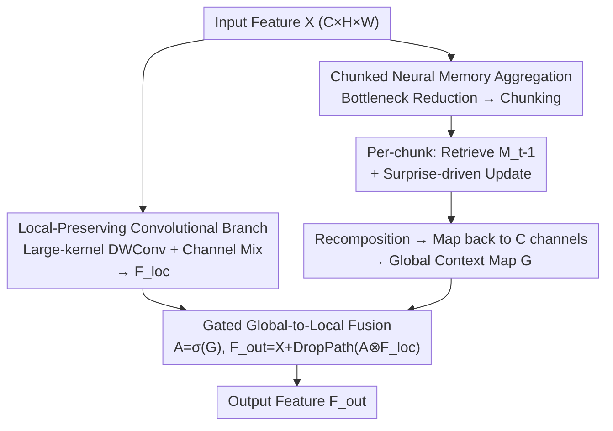

# Efficiency Follows Global-Local Decoupling

**Conference**: CVPR 2026  
**Paper**: [CVF Open Access](https://openaccess.thecvf.com/content/CVPR2026/html/Yang_Efficiency_Follows_Global-Local_Decoupling_CVPR_2026_paper.html)  
**Code**: https://github.com/NUST-Machine-Intelligence-Laboratory/ConvNeur  
**Area**: Model Compression / Efficient Vision Backbones  
**Keywords**: Global-Local Decoupling, Neural Memory, Chunked Aggregation, Gated Modulation, Efficient Backbone

## TL;DR
ConvNeur decouples the tasks of "global reasoning" and "preserving local details" into two independent branches: a convolutional branch dedicated to retaining local textural details, and a compressed "neural memory" branch that aggregates image-level context using a chunked approach with sub-quadratic complexity. A learned gating mechanism allows the global signal to **modulate** rather than overwrite local features. It achieves superior accuracy-efficiency tradeoffs on ImageNet/COCO/ADE20K with fewer FLOPs and parameters.

## Background & Motivation
**Background**: Modern vision backbones are simultaneously required to perform global reasoning across the entire image (recognition and detection rely on scene layout, co-occurrence, and long-range shape cues) while preserving pixel/patch-level edges, textures, and fine structures. Mainstream approaches include Transformer global self-attention (or its windowed/sparse variants), as well as recent linear/state-space backbones like Mamba and RWKV.

**Limitations of Prior Work**: The cost of full attention grows quadratically with resolution, making it prohibitively expensive for high-resolution or dense prediction scenarios. Windowing or sparsification reduces the cost but re-introduces locality, limiting the global view. Pure convolutions are efficient and retain translation-friendly inductive biases, but their global context is either limited or "arrives too late." Although hybrid designs like CoAtNet balance both, **global and local computations are crowded into the same feature space and resolution**, leaving the two roles coupled and forcing the model to pay for both simultaneously.

**Key Challenge**: The authors observe that the true root of cost inflation is not global modeling itself, but the **entanglement of global reasoning and local representation in a single pathway**. When the same feature flow is forced to capture the whole image, preserve details, and fit within a tight FLOP budget, the width, spatial resolution, and interaction range compete with each other, preventing any from reaching optimality.

**Key Insight**: Rather than continuing to approximate attention, it is better to **learn global and local features separately and let the global path modulate the local path instead of replacing it**. A global path responsible only for "guidance" can operate on compressed, chunked tokens to reduce complexity to sub-quadratic levels, while the local path retains the effective inductive priors of convolution. In short—**efficiency follows global-local decoupling**.

## Method

### Overall Architecture
Given an intermediate feature map $X \in \mathbb{R}^{C\times H\times W}$, ConvNeur sends it into **two parallel branches**: 1) A local-preserving convolutional branch that handles edges, textures, and small objects using CNN inductive biases without performing global reasoning. 2) A compressed global memory branch that first projects channels into a lower-dimensional memory space and flattens the spatial map into a sequence of fixed-length chunks. It performs a "retrieve-update-recompose" cycle per chunk to aggregate image-level context with sub-quadratic cost, eventually reconstructing the spatial layout and projecting back to the original channel dimension to obtain a global context map $G$. The two branches are not simply summed or concatenated; instead, $G$ is passed through a sigmoid to create a spatial gate $A$, which **modulates** the local features position-wise. Because the roles are structurally decoupled, the budget and compression rate of the global branch can be set independently of the local branch—a requirement for high-resolution vision.

### Key Designs

**1. Global-Local Decoupling: Two branches managing separate tasks without competing for resources**

This directly addresses the fundamental pain point of coupling global and local features in a single path. The local-preserving convolutional branch follows modern paradigms (ConvNeXt style), using a relatively large-kernel depthwise convolution for neighborhood aggregation followed by lightweight channel mixing and normalization ($F_{loc}$). Since global reasoning is handled by the other branch, it **does not need to expand its interaction range**, avoiding the "width-resolution-context" competition. The global branch is allowed to run independently on compressed, chunked tokens. Structural separation means the **global branch budget and compression can be set independently**, a key difference from hybrid models like CoAtNet where global and local paths compete for full-resolution budget.

**2. Chunked Neural Memory Aggregation: Image-level context at sub-quadratic cost**

The global branch borrows the neural memory and "surprise-driven update" concepts from Titans but integrates them into a **spatially decoupled** vision framework. The process consists of four steps: (i) **Bottleneck tokenization**: Pointwise convolutions project $X$ into a low-dimensional memory space $X_{mem}\in\mathbb{R}^{C_m\times H\times W}$ ($C_m<C$), making memory operations cheaper while retaining spatial layout for reconstruction. (ii) **Chunking**: $X_{mem}$ is flattened into $S\in\mathbb{R}^{(HW)\times C_m}$ and divided into chunks $\{S_t\}_{t=1}^T$ of length $L$, ensuring each memory step only processes a small subset of tokens. (iii) **Retrieval and Update**: Each chunk linearly projects $q_t=W_qS_t, k_t=W_kS_t, v_t=W_vS_t$. Chunk-level context $\hat y_t=M_{t-1}(q_t)$ is read from the current state $M_{t-1}$. A reconstruction objective is defined as:

$$\mathcal{L}_t = \lVert M_{t-1}(k_t) - v_t \rVert_2^2,$$

where a learnable "update generator" converts this loss into adaptive steps, momentum, and decay factors to derive the next state $M_t = U(M_{t-1}, \nabla_M \mathcal{L}_t)$. Chunks that are harder to reconstruct generate larger updates (the "surprise-driven" mechanism). (iv) **Recomposition**: The $\hat y_t$ from each chunk are concatenated back into a sequence of length $HW$, reshaped to spatial dimensions $O_{mem}$, and projected back to $C$ channels via pointwise convolution to form $G$. The total global branch cost is roughly $O(CC_mHW)+O(T\cdot \text{mem}(L,C_m))$. Since $C_m$ and $L$ are small and fixed, the **cost grows approximately linearly with the number of spatial positions**.

**3. Gated Global-to-Local Fusion: Global as guidance, not replacement**

After obtaining the global map $G$, a spatial gate $A=\sigma(G)$ is produced via sigmoid to modulate local features before residual connection:

$$F_{out} = X + \text{DropPath}(A \otimes F_{loc}).$$

The authors interpret this as "amortized conditioning": the global branch infers a context for the current image and converts it into a mask telling the local branch what to emphasize or suppress. Unlike SE/CBAM/Non-local modules that "aggregate once and broadcast," this gate comes from **memory updated online over spatial chunks**, reflecting the current state of the global branch. Multiplicative gating preserves the residual local pathway and selectively amplifies or suppresses features by position and channel. Ablations show that simple addition directly injects global activations into the residual flow, potentially erasing fine structures (shifting feature statistics), while concatenation requires extra dimension reduction with minimal gains—explaining why gating is consistently superior.

### Loss & Training
All variants share the same template: four stages with downsampling, local-preserving branches in every block, and global memory branches inserted at the start of each stage (per-stage). Scaling is achieved by widening stage channels and proportionally increasing memory dimensions, while keeping chunk size fixed (196 for classification) to ensure predictable memory costs. M1→M4 scale from 4.3M→18.1M parameters and 0.71G→3.06G FLOPs. For detection on COCO, the chunk size is increased to 4096 to aggregate more tokens per update due to higher input resolutions, and the inner loop step size is reduced from 1 to 1e-3 to suppress frequent memory writes under sparse supervision.

## Key Experimental Results

### Main Results (ImageNet-1K Classification)
Trained at 224×224 for 300 epochs using AdamW and DeiT-style augmentation. ConvNeur advances the accuracy-efficiency frontier across all budgets:

| Variant | Params(M) | FLOPs(G) | Top-1(%) | Comparison |
|------|---------|----------|----------|------|
| ConvNeur-M1 | 4.3 | 0.7 | **75.4** | PVT-T 75.1@1.9G (less than half the cost) |
| ConvNeur-M2 | 6.1 | 1.0 | **77.6** | SpectFormer-T 76.9@1.8G |
| ConvNeur-M3 | 10.6 | 1.8 | **80.0** | DeiT-S 79.9@4.6G, PVT-S 79.8@3.8G |
| ConvNeur-M4 | 18.1 | 3.1 | **81.5** | CrossViT-S 81.0@5.6G, PVT-M 81.2@6.7G |

Downstream improvements were also significant: On COCO (Cascade Mask R-CNN, 1×), M2 achieved 41.2 AP Box / 36.4 AP Mask (vs. ResNet-50's 38.0/34.4). On ADE20K (S-FPN), M2 reached 39.17 mIoU@106G (vs. ResNet-50's 36.59@183G). A consistent observation was **higher AP75 relative to AP50**, indicating improved localization quality rather than just recall.

### Ablation Study (ConvNeur-M3 @ ImageNet-1K)

| Dimension | Configuration | FLOPs(G) | Top-1(%) | Note |
|------|------|----------|----------|------|
| Global Memory | Local-only | 1.4 | 78.2 | Pure local baseline |
| | **Per-stage (Default)** | 1.8 | **80.0** | +1.8% gain for only +0.4G |
| | Per-layer | 2.3 | 80.4 | Marginal +0.4% for high cost |
| Global Branch Type | CBAM | 1.5 | 78.4 | Weighting only; no persistent context |
| | Non-local | 3.0 | 79.1 | Dense all-to-all; quadratic cost |
| | Self-Attention | 1.8 | 79.8 | Quadratic map expansion |
| | IR-RWKV | 2.0 | 77.6 | Forced sequence; breaks 2D isotropy |
| | Titans | 3.1 | 79.6 | High cost due to segmented attention |
| | **Ours (Neural Memory)** | 1.8 | **80.0** | Over 40% fewer FLOPs than Titans |
| Fusion Method | Addition | 1.8 | 79.6 | Blurs details in residual stream |
| | Concatenate | 1.9 | 79.5 | Extra reduction params |
| | **Gating (Default)** | 1.8 | **80.0** | Preserves local residual path |

### Key Findings
- **Decoupling provides 1.8% gain**: Adding the per-stage memory (only +0.4 GFLOPs) to the local-only baseline raised Top-1 from 78.2 to 80.0, proving a single feature flow cannot achieve this gain at a similar budget.
- **Per-stage is sufficient**: Global context changes slowly between adjacent blocks; large transitions happen at stage boundaries (downsampling). Thus, updating once per stage captures most of the benefits.
- **Neural memory is the best globalizer for matched-cost**: When compared under the same bottleneck framework against CBAM, Non-local, Self-Attention, RWKV, and Titans, neural memory provides the best tradeoff. Notably, it outperforms Titans while being >40% more efficient by removing segmented attention.
- **Mechanism Visualization**: Shallow gates perform background suppression and edge sharpening; deep gates become object-centric, amplifying evidence for current hypotheses while suppressing clutter.

## Highlights & Insights
- **Redefining Efficiency as a Decoupling Problem**: The key insight is that cost inflation stems from entanglement rather than global modeling. The solution is structural separation, allowing the global path to be independently compressed.
- **Spatializing Neural Memory**: Moving Titans' "chunked surprise-driven memory" from temporal sequences to a compressed spatial branch provides a clean template for memory-augmented 2D backbones.
- **Gated Modulation > Addition/Concatenation**: The principle of "global as guidance, not rewrite" via multiplicative gating is highly applicable to any design aiming to inject global cues without sacrificing local fidelity.

## Limitations & Future Work
- The global branch introduces extra hyperparameters (chunk size, memory dimension $C_m$, inner-loop step size), requiring manual adjustment for different tasks (e.g., 4096 / 1e-3 for detection).
- ⚠️ The paper lacks direct latency measurements on hardware. While FLOPs are low, the serial nature of retrieval-update within the chunked memory might affect throughput.
- Sequential chunk updates may limit parallelism in large-batch scenarios; parallel chunking or lighter update rules could be explored.
- Scaling stops at 18.1M (M4); whether decoupling remains optimal for significantly larger models (100M+) remains to be seen.

## Related Work & Insights
- **vs. ViT / Swin**: ViT is global but quadratic; Swin reduces cost but re-introduces locality. ConvNeur avoids global reasoning on full-width features, using a compressed path to modulate local features instead.
- **vs. Linear Backbones (Mamba/RWKV)**: While they make global modeling cheaper, they still mix global/local in the same stream and often impose a scan order that breaks 2D isotropy (IR-RWKV achieved only 77.6% in ablations).
- **vs. Titans**: Inherits the memory mechanism but removes segmented attention to achieve a >40% reduction in FLOPs for the global mechanism with slightly better performance.

## Rating
- Novelty: ⭐⭐⭐⭐ The "efficiency through decoupling" framing is strong; spatializing neural memory is a clean migration.
- Experimental Thoroughness: ⭐⭐⭐⭐ Broad coverage across tasks; extensive ablations of branch types/fusion, though missing hardware latency.
- Writing Quality: ⭐⭐⭐⭐⭐ Logical progression; "see the whole, keep the detail" theme is well-visualized.
- Value: ⭐⭐⭐⭐ A reusable efficient backbone template; the decoupling principle is highly transferable to dense prediction.

<!-- RELATED:START -->

## Related Papers

- [\[ICCV 2025\] SAMO: A Lightweight Sharpness-Aware Approach for Multi-Task Optimization with Joint Global-Local Perturbation](../../ICCV2025/model_compression/samo_a_lightweight_sharpness-aware_approach_for_multi-task_optimization_with_joi.md)
- [\[ACL 2026\] Efficient Learned Data Compression via Dual-Stream Feature Decoupling](../../ACL2026/model_compression/efficient_learned_data_compression_via_dual-stream_feature_decoupling.md)
- [\[ICML 2026\] Global Convergence of Adaptive Sensing for Principal Eigenvector Estimation](../../ICML2026/model_compression/global_convergence_of_adaptive_sensing_for_principal_eigenvector_estimation.md)
- [\[ICML 2026\] Don't Ignore the Tail: Decoupling top-K Probabilities for Efficient Language Model Distillation](../../ICML2026/model_compression/dont_ignore_the_tail_decoupling_top-k_probabilities_for_efficient_language_model.md)
- [\[ACL 2026\] FastKV: Decoupling of Context Reduction and KV Cache Compression for Prefill-Decoding Acceleration](../../ACL2026/model_compression/fastkv_decoupling_of_context_reduction_and_kv_cache_compression_for_prefill-deco.md)

<!-- RELATED:END -->
