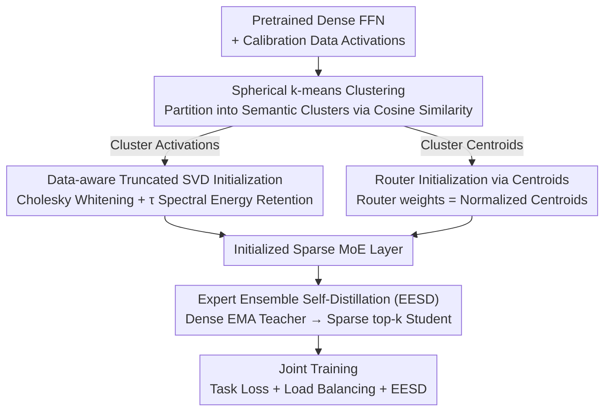

# Enhancing Mixture-of-Experts Specialization via Cluster-Aware Upcycling

**Conference**: CVPR 2026  
**arXiv**: [2604.13508](https://arxiv.org/abs/2604.13508)  
**Code**: None  
**Area**: Model Compression/Efficient Models  
**Keywords**: Mixture-of-Experts, sparse upcycling, expert specialization, cluster initialization, self-distillation

## TL;DR

This paper proposes Cluster-aware Upcycling, which initializes MoE expert and router parameters by extracting the semantic structure of dense models through spherical k-means clustering. This approach breaks expert symmetry and promotes early specialization. Combined with an Expert Ensemble Self-Distillation (EESD) loss, it consistently outperforms existing upcycling methods on CLIP ViT.

## Background & Motivation

Sparse Upcycling saves the high computational cost of training from scratch by copying pretrained dense model weights to initialize MoE. However, since all experts start with identical weights and the router is randomly initialized, it leads to expert symmetry and limited early specialization. Existing symmetry-breaking methods, such as noise injection (limited efficacy) and partial re-initialization (destructive to pretrained representations), are suboptimal. The **Key Insight** is that pretrained dense model representations already contain semantic information that can effectively guide the initialization of experts and routers.

## Method

### Overall Architecture

Sparse Upcycling typically clones dense weights to initialize the MoE, but the identical expert weights and random routers result in symmetric experts that struggle to differentiate early on. The core observation here is that pretrained dense models hide semantic structures within their representations, which can provide a "differentiated" starting point. The methodology consists of a three-step **Initialization**: first, using spherical k-means to partition the activation space into semantic clusters; second, using data-aware truncated SVD to initialize each expert into its corresponding cluster's subspace; and finally, using cluster centroids to initialize the router. During **Training**, an Expert Ensemble Self-Distillation (EESD) loss is added to stabilize the supervisory signal. The first three steps are one-time offline initializations, while EESD persists throughout training.

### Key Designs

**1. Spherical k-means for Activation Space: Aligning Expert Boundaries with Router Criteria**

The key to breaking symmetry is ensuring the division of labor aligns with house the router actually makes decisions. Since a router's logit is essentially $\mathbf{W}_r \mathbf{x}$ (a directional alignment measure), cosine similarity is chosen over Euclidean distance for clustering. Specifically, input activation vectors for each FFN block are collected from a calibration dataset, and spherical k-means is used to obtain $N_e$ clusters and their centroids. The number of clusters matches the number of experts, with each cluster representing the semantic region the expert is intended to handle.

**2. Data-aware Truncated SVD Initialization: Inheriting the Primary Subspace of Clusters**

Simply knowing which cluster an expert should manage is insufficient; its initial weights must bias towards that cluster's distribution. Formally, this method minimizes the reconstruction error of the dense FFN output on its specific cluster, with a cross-penalty term to prevent experts from collapsing into similar solutions ($-\gamma\sum_{j\neq i}\|\mathbf{W}\mathbf{X}_i-\mathbf{W}_j\mathbf{X}_i\|_F^2$, where $\gamma=\frac{1}{N_e-1}$). Instead of direct optimization, a **Data-aware Truncated SVD** is used for a closed-form solution: for each cluster's activations, a Cholesky whitening matrix $\mathbf{S}_i$ (satisfying $\mathbf{S}_i\mathbf{S}_i^\top=\mathbf{X}_i\mathbf{X}_i^\top$) is calculated. Truncated SVD is performed on $\mathbf{W}_i\mathbf{S}_i$ and multiplied back by $\mathbf{S}_i^{-1}$, with rank $r_i$ determined by a cumulative spectral energy threshold $\tau$. This retains the primary subspace of the cluster while discarding low-energy directions, ensuring experts start as low-rank approximations tailored to their data.

**3. Cluster Centroid Router Initialization: Aligning Early Decisions with Semantic Structure**

After experts are assigned to clusters, the router must know which tokens to send to whom from the start. Otherwise, a random router would disrupt the initial partition. Since spherical k-means uses cosine similarity—consistent with the directional alignment of routing logits $\mathbf{W}_r\mathbf{x}$—the $N_e$ $\ell_2$-normalized cluster centroids are directly used as the router weights $\mathbf{W}_r=[\boldsymbol{\mu}_1^\top;\dots;\boldsymbol{\mu}_{N_e}^\top]$. Thus, from the first step of training, routing decisions align with the data's semantic structure, ensuring experts receive semantically coherent tokens rather than random noise.

**4. Expert Ensemble Self-Distillation (EESD): Stable Supervision for Uncertain Tokens**

Early in training, routers are uncertain about some tokens; near-uniform routing probabilities imply weak alignment between inputs and experts, where hard supervision might lead to divergence. EESD creates an EMA version of the MoE as a teacher, providing stable predictions in **dense mode** (activating all experts weighted by soft routing $y_{\text{ens}}=\sum_i g_i^{\text{ema}}E_i^{\text{ema}}$). The sparse top-k student then aligns with this ensemble prediction. For tokens with high routing uncertainty, the full-capacity ensemble prediction is particularly reliable, supporting the student until specialization matures.

### Loss & Training

The training objective comprises three parts: task loss $\mathcal{L}_{task}$ (e.g., contrastive loss), load balancing loss $\mathcal{L}_{lb}$ (to prevent expert dead-locking), and EESD distillation loss. The first ensures downstream performance, the second maintains utilization equilibrium, and EESD stabilizes routing supervision on top of the initialization.

## Key Experimental Results

### Main Results

Evaluated on CLIP ViT-B/32 and ViT-B/16 across zero-shot retrieval and classification benchmarks:

| Benchmark | Sparse Upcycling | Drop-Upcycling | Cluster-aware (Ours) |
|------|------------------|----------------|---------------------|
| MSCOCO I→T R@1 | Baseline | Limited Gain | **Best** |
| ImageNet-1k Val | Baseline | Limited Gain | **Best** |
| VTAB Natural | Baseline | Limited Gain | **Best** |

### Ablation Study

- **Cluster Initialization vs. Random**: Significantly reduces inter-expert similarity.
- **EESD Loss**: Provides the greatest improvement for tokens with high routing uncertainty.
- **Data-aware SVD vs. Standard SVD**: The former better preserves cluster-specific information.

### Key Findings

- Inter-expert similarity is significantly reduced, indicating more diverse and decoupled representations.
- Routing behavior is more "confident," with more deterministic token assignments.
- Structural improvements translate directly into gains in zero-shot and few-shot generalization.

## Highlights & Insights

- The approach of using existing semantic structures instead of randomness or noise to break symmetry is elegant.
- The consistency design between spherical k-means and router cosine alignment is well-considered.
- Quantitative analysis confirms that structural improvements lead to performance gains, rather than relying solely on training tricks.

## Limitations & Future Work

- Validated only on CLIP ViT-B; the effects on larger models (ViT-L/H) remain to be explored.
- The number of clusters is strictly tied to the number of experts, limiting flexibility.
- The impact of calibration dataset choice and size on clustering quality has not been fully analyzed.

## Related Work & Insights

- The data-aware SVD initialization concept can be generalized to other model expansion scenarios.
- The EESD dense-teacher-to-sparse-student distillation paradigm is applicable to other MoE training tasks.
- Using cluster centroids to initialize routers proves to be a simple yet effective method.

## Rating

7/10 — The method is elegantly designed with deep analysis, though the experimental scale is relatively small (limited to ViT-B).

<!-- RELATED:START -->

## Related Papers

- [\[CVPR 2026\] Quant Experts: Token-aware Adaptive Error Reconstruction with Mixture of Experts for Large Vision-Language Models Quantization](quant_experts_token_aware_vlm_quantization.md)
- [\[ICLR 2026\] Coupling Experts and Routers in Mixture-of-Experts via an Auxiliary Loss](../../ICLR2026/model_compression/coupling_experts_and_routers_in_mixture-of-experts_via_an_auxiliary_loss.md)
- [\[CVPR 2026\] Teacher-Guided Routing for Sparse Vision Mixture-of-Experts](teacher-guided_routing_for_sparse_vision_mixture-of-experts.md)
- [\[ICLR 2026\] Unveiling Super Experts in Mixture-of-Experts Large Language Models](../../ICLR2026/model_compression/unveiling_super_experts_in_mixture-of-experts_large_language_models.md)
- [\[ICML 2026\] DAG-MoE: From Simple Mixture to Structural Aggregation in Mixture-of-Experts](../../ICML2026/model_compression/dag-moe_from_simple_mixture_to_structural_aggregation_in_mixture-of-experts.md)

<!-- RELATED:END -->
